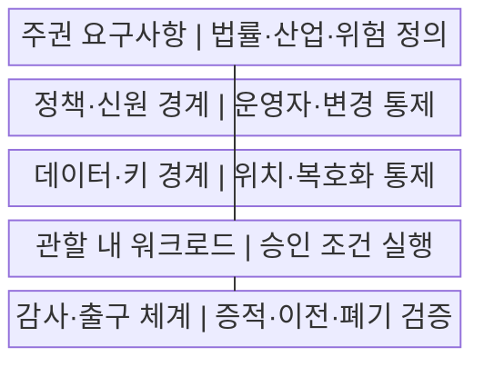
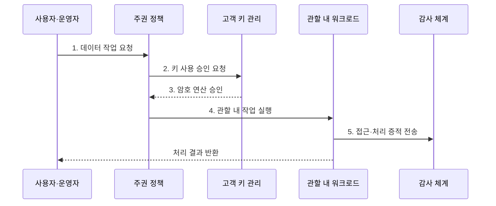

---
sidebar:
  order: 168
  label: "168. 소버린 클라우드 (Sovereign Cloud)"
  badge:
    text: "기출 · 70%"
    variant: note
title: "소버린 클라우드 (Sovereign Cloud)"
date: "2026-07-29T18:00:00+09:00"
tags:
  - "notes-software"
weight: 168
extra:
  question_no: "168"
  source_status: "기출"
  source_history: "138회"
  priority: 70
  priority_note: "데이터 주권과 운영 통제권 직접 출제"
---

## 미리 알고가기

- **소버린 클라우드(Sovereign Cloud)**: 특정 국가·지역의 법과 정책에 따라 데이터·운영·기술 통제권을 확보하는 클라우드
- **데이터 레지던시(Data Residency)**: 데이터의 저장·처리·백업 위치를 정해진 지역으로 제한하는 요구
- **법적 주권(Legal Sovereignty)**: 적용 법률·관할권·외국 기관의 접근 위험을 통제하는 능력
- **운영 주권(Operational Sovereignty)**: 지정 인력과 조직이 운영·지원·복구·특권 접근을 통제하는 능력
- **기술 주권(Technological Sovereignty)**: 배포·변경·감사·이전 능력을 확보하고 공급자 종속을 통제하는 능력
- **고객 관리 키(Customer-managed Key)**: 고객이 생성·권한·회전·폐기 정책을 관리하는 암호키
- **외부 키 관리(Hold Your Own Key, HYOK)**: 암호키를 사업자 밖에 보관하고 고객이 사용 승인까지 통제하는 방식
- **출구 전략(Exit Strategy)**: 데이터·이미지·설정·로그를 다른 환경으로 이전하고 잔여 사본을 폐기하는 계획
- **공급망 통제(Supply-chain Control)**: 하드웨어·소프트웨어·협력사의 출처·접근·변경 위험을 관리하는 활동

## Ⅰ. 개요

- 정의/개념: 국가·산업 요구 기반 **법적·운영·기술 통제 클라우드**
- 배경/필요성: 외국 관할·특권 접근·**공급자 종속 위험 완화**

### 쉽게 이해하기 (학습용)

- 자료를 국내에 두는 것에서 끝나지 않고 누가 운영하고 누가 암호키를 승인하며 다른 환경으로 옮길 수 있는지까지 통제하는 모델이다.

## Ⅱ. 특징

- **저장·처리·백업 위치** 기반 관할 통제
- **운영 인력·특권 접근·키** 기반 운영 통제
- **감사 증적·이식성·출구** 기반 기술 자율성

### 쉽게 이해하기 (학습용)

- 창고 위치만 국내여도 해외 관리자가 열쇠를 쥐고 자료를 옮길 수 있다면 주권 요구가 충족되지 않으므로 위치와 결정 권한을 함께 본다.

## Ⅲ. 구조 및 구성요소

| 구성요소 | 책임 |
|:---|:---|
| 주권 요구사항 | 법률·지역·**격리 수준 정의** |
| 정책·신원 경계 | 운영자 권한·**비상 접근 통제** |
| 데이터·키 경계 | 저장 위치·**키 사용 승인 통제** |
| 관할 내 워크로드 | 승인 지역·**운영 조건 실행** |
| 감사·출구 체계 | 접근 증적·**이전·폐기 검증** |

### 쉽게 이해하기 (학습용)

- 주권 요구가 출입 규칙을 정하면 신원 경계와 키 경계가 사람과 데이터의 문을 지키고 감사 체계가 모든 출입과 퇴거를 증명한다.

## Ⅳ. 흐름도

**동작 원리**

1. **데이터 작업 요청**: 신원·역할·접속 위치 확인
2. **키 사용 승인 요청**: 관할·대상·목적 조건 검증
3. **암호 연산 승인**: 허용 범위의 제한된 키 사용
4. **관할 내 작업 실행**: 승인 지역·격리 조건 적용
5. **접근·처리 증적 전송**: 데이터·특권 작업의 감사 기록

### 쉽게 이해하기 (학습용)

- 관할 운영자가 요청해도 고객 키 정책이 거부하면 복호화할 수 없고 허용된 작업만 국내 워크로드에서 실행되어 감사 기록으로 남는다.

## Ⅴ. 종류 및 비교

| 주권 범위 | 데이터 레지던시 | 소버린 클라우드 |
|:---|:---|:---|
| 적용 기준 | **저장·처리 지역 제한** | **법적·운영·기술 통제** |
| 핵심 특징 | 지역 설정·**계약 확인** | 인력·키·감사·**출구 통제** |
| 한계 | 외국 관할·**운영 접근 잔존** | 비용·기능·**운영 복잡성 증가** |

### 쉽게 이해하기 (학습용)

- 데이터 레지던시는 자료의 주소를 고정하고 소버린 클라우드는 주소뿐 아니라 관리자, 열쇠, 이동 수단의 결정 권한까지 제한한다.

## Ⅵ. 실무 고려사항 및 대책

| 고려사항 | 대책 | 효과 |
|:---|:---|:---|
| 모호한 **주권 요구 해석** | 법률·등급·위협별 **통제 명세** | 과잉·미달 통제 방지 |
| 백업·로그의 **역외 이전** | 전체 흐름·**하위 처리자 위치 점검** | 숨은 국외 이동 차단 |
| 해외 운영자의 **특권 우회** | 관할 인력·**다중 승인·세션 기록** | 관리 접근 통제 |
| 사업자의 **키·데이터 동시 접근** | 고객·외부 키와 **폐기 검증** | 복호화 결정권 확보 |
| 독점 형식의 **이전 실패** | 개방 형식·**정기 출구 훈련** | 공급자 종속 완화 |

### 쉽게 이해하기 (학습용)

- 본 데이터만 국내에 두지 말고 지원 로그와 백업의 처리 위치까지 추적하고 정기적으로 다른 환경에 복원해 출구 계획의 실행 가능성을 확인해야 한다.

## Ⅶ. 결론

- **데이터 등급·관할 위험**으로 위치·인력·키·출구 통제

### 쉽게 이해하기 (학습용)

- 민감도가 높을수록 지역 제한에서 관할 인력, 외부 키 승인, 이전·폐기 검증까지 통제 단계를 높이고 이를 증적으로 확인해야 한다.
