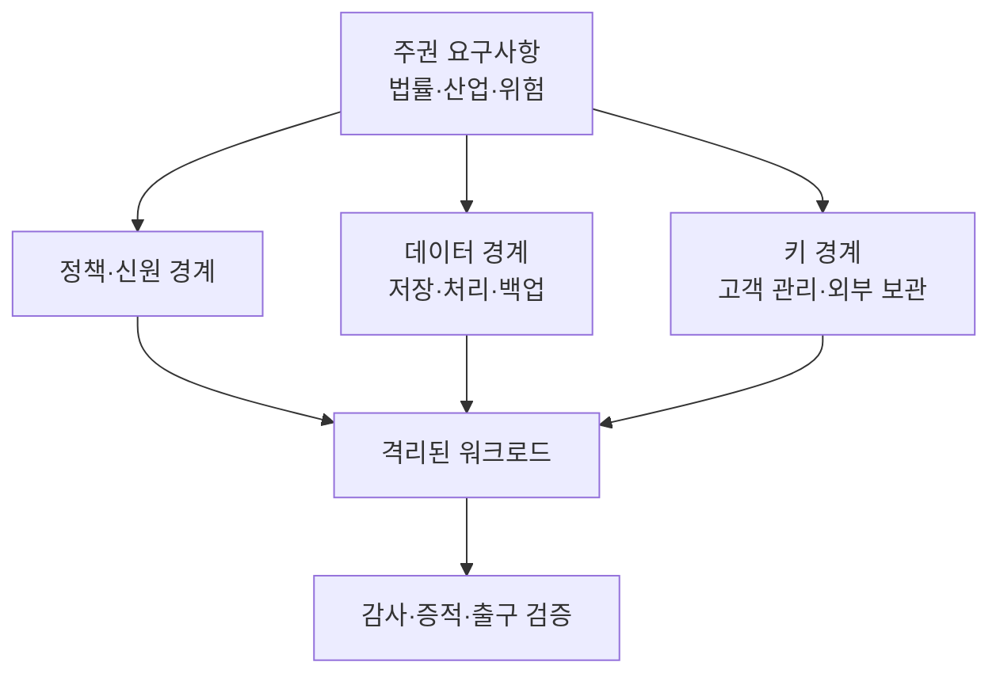
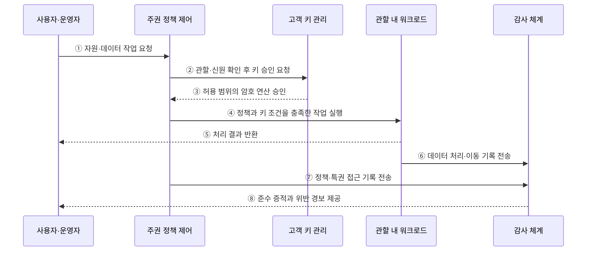

---
sidebar:
  order: 168
  label: "168. 소버린 클라우드 (Sovereign Cloud)"
  badge:
    text: "기출 · 70%"
    variant: note
title: "소버린 클라우드 (Sovereign Cloud)"
date: "2026-07-27T23:59:59+09:00"
tags:
  - "notes-software"
weight: 168
extra:
  question_no: "168"
  source_status: "기출"
  source_history: "138회"
  priority: 70
  priority_note: "데이터 주권과 운영 통제권이 최근 직접 출제됨"
---

## 미리 알고가기

- **소버린 클라우드(Sovereign Cloud)**: 특정 국가·지역의 법과 정책에 따라 데이터·운영·기술 통제권을 확보하는 클라우드
- **데이터 레지던시(Data Residency)**: 데이터의 저장·처리·백업 위치를 정해진 지역으로 제한하는 요구
- **법적 주권(Legal Sovereignty)**: 데이터와 서비스에 적용되는 법률·관할권·외국 기관의 접근 위험을 통제하는 능력
- **운영 주권(Operational Sovereignty)**: 지정된 인력과 조직이 운영·지원·장애 복구·특권 접근을 통제하는 능력
- **기술 주권(Technological Sovereignty)**: 시스템의 배포·변경·감사·이전 능력을 확보하고 특정 공급자 종속을 통제하는 능력
- **고객 관리 키(Customer-managed Key)**: 고객이 생성·권한·회전·폐기 정책을 관리하는 암호키
- **외부 키 관리(Hold Your Own Key, HYOK)**: 암호키를 클라우드 사업자 밖에서 보관하고 고객이 사용 승인까지 통제하는 방식
- **출구 전략(Exit Strategy)**: 데이터·이미지·설정·로그를 다른 환경으로 이전하고 기존 사본을 검증·폐기하는 계획
- **공급망 통제(Supply-chain Control)**: 하드웨어·소프트웨어·운영 협력사의 출처·접근·변경 위험을 관리하는 활동

## Ⅰ. 개요

- 소버린 클라우드는 데이터 위치뿐 아니라 **법적·운영·기술 통제권**을 요구 수준에 맞게 확보한다.
- 글로벌 클라우드의 외국 관할·특권 접근·공급자 종속 위험을 줄이는 것이 목적이다.
- 단일한 제품 유형이 아니라 국가·산업별 주권 요구를 통제로 구현하고 증명하는 운영 모델이다.

### 쉽게 이해하기 (학습용)
- 데이터의 위치뿐 아니라 누가 운영하고 열쇠를 쥐며 옮길 수 있는지까지 통제함

## Ⅱ. 특징

- **관할 제한**: 저장·처리·백업·복구 데이터의 허용 지역과 적용 법률을 제한한다.
- **운영 통제**: 운영 인력의 소재·국적·권한과 비상 접근 절차를 통제한다.
- **키 통제**: 고객이 암호키의 생성·사용 승인·회전·폐기를 관리한다.
- **감사 가능성**: 관리 작업·데이터 접근·정책 변경의 증적을 독립적으로 검증한다.
- **기술 자율성**: 개방 표준·이식성·출구 전략으로 공급자 종속을 관리한다.
- **격리 수준**: 논리·관리·물리 격리를 위험과 규제 수준에 맞게 선택한다.

### 쉽게 이해하기 (학습용)
- 위치·운영자·키·기술 이전의 통제권을 요구 수준에 맞춰 확보함

## Ⅲ. 아키텍처 및 구성요소

**도표안 A — 구조도**

**도표안 B — sequenceDiagram**

| 구성요소 | 역할 |
|:---|:---|
| 주권 요구사항 | 적용 법률·허용 지역·운영 주체·격리 수준 정의 |
| 정책·신원 경계 | 자원 위치·운영자 권한·비상 접근·변경 승인 통제 |
| 데이터 경계 | 저장·처리·백업·복제·복구 위치와 이동 통제 |
| 키 경계 | 키 생성·보관·사용 승인·회전·폐기 권한 통제 |
| 관할 내 워크로드 | 승인된 지역·플랫폼·운영 조건에서 서비스 실행 |
| 감사·증적 | 데이터·관리 접근과 정책 변경을 불변 기록으로 검증 |
| 출구 체계 | 데이터·설정 이전과 잔여 사본 폐기 검증 |

**동작 원리**

- ① 사용자나 운영자가 자원 생성·데이터 처리·관리 작업을 요청한다.
- ② 주권 정책 제어가 신원·역할·접속 위치·대상 지역을 확인하고 키 사용 승인을 요청한다.
- ③ 고객 키 관리가 정책을 충족한 작업에만 제한된 암호 연산을 승인한다.
- ④ 정책 제어는 관할·키·격리 조건을 충족한 워크로드에서 작업을 실행한다.
- ⑤ 워크로드는 승인된 범위에서 데이터를 처리하고 결과를 반환한다.
- ⑥ 워크로드는 데이터 접근·처리·복제·이동 기록을 감사 체계에 보낸다.
- ⑦ 정책 제어는 운영자 접근·권한 상승·정책 변경 기록을 감사 체계에 보낸다.
- ⑧ 감사 체계는 준수 증적과 위반 경보를 권한 있는 주체에게 제공한다.

### 쉽게 이해하기 (학습용)
- 요청자의 관할과 권한을 확인하고 고객 키로 승인한 작업만 실행·기록함

## Ⅳ. 종류 및 비교

| 구분 | 데이터 레지던시 | 소버린 클라우드 |
|:---|:---|:---|
| 핵심 범위 | 저장·처리 위치 | 법적·데이터·운영·기술 통제 |
| 운영자 통제 | 필수 범위가 아닐 수 있음 | 소재·권한·비상 접근까지 통제 |
| 암호키 | 사업자 또는 고객 관리 | 고객 승인·외부 보관 수준까지 검토 |
| 기술 이전 | 별도 요구 | 상호운용성·출구 전략 포함 |
| 증명 | 지역 설정·계약 확인 | 정책·접근·공급망·폐기 증적 검증 |
| 한계 | 외국 관할·운영 접근 위험 잔존 | 비용·서비스 제약·운영 복잡성 증가 |

| 배치 방식 | 특징 | 적용 |
|:---|:---|:---|
| 퍼블릭 클라우드 주권 영역 | 공유 기반 위에 지역·운영·키 통제 강화 | 민간 규제 업무·빠른 확장 |
| 전용·로컬 영역 | 전용 인프라와 관할 인력으로 격리 강화 | 공공·금융·민감 업무 |
| 국가·산업 공동 클라우드 | 공통 규제와 인증을 참여 기관이 공유 | 공공 부문·산업 생태계 |

### 쉽게 이해하기 (학습용)
- 레지던시는 저장 장소를, 소버린 클라우드는 운영과 기술의 결정권까지 다룸

## Ⅴ. 실무 고려사항 및 대책

| 고려사항 | 위험 | 대책 |
|:---|:---|:---|
| 요구 해석 | 모호한 주권 표현으로 과잉·미달 통제 | 법률·데이터 등급·위협별 통제 요구 명세 |
| 데이터 이동 | 백업·지원 로그·메타데이터의 역외 이전 | 전체 데이터 흐름과 하위 처리자 위치 점검 |
| 특권 접근 | 해외 운영자의 우회 접근 | 관할 인력·다중 승인·세션 기록·긴급 접근 통제 |
| 키 통제 | 사업자가 키와 데이터에 함께 접근 | 고객 관리 키·외부 키·폐기 검증 적용 |
| 공급망 | 하위 사업자·업데이트 경로로 통제 우회 | 공급망 목록·서명 검증·계약상 접근 제한 |
| 서비스 제약 | 주권 영역에서 기능·확장성 부족 | 업무 등급별 배치와 기능 대체 계획 |
| 출구 전략 | 독점 형식·전송 비용·잔여 사본 | 개방 형식·정기 이전 훈련·삭제 증명 |

### 쉽게 이해하기 (학습용)
- 사례: 공공 데이터는 관할 인력만 운영하고 고객 키 승인 없이는 복호화하지 못하게 함

## Ⅵ. 결론

- 소버린 클라우드의 핵심은 **위치 규제를 넘어 법적·운영·키·기술 통제권을 증명**하는 것이다.
- 주권 수준은 데이터 등급·관할 위험·업무 중요도에 맞춰 차등 적용해야 한다.
- 데이터 흐름·특권 접근·공급망·출구 전략을 지속 검증해야 선언이 아닌 실제 통제권을 확보할 수 있다.

### 쉽게 이해하기 (학습용)
- 어디에 저장했는지와 함께 누가 운영하고 열쇠와 이전 권한을 가졌는지 증명함
