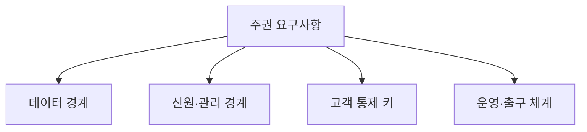
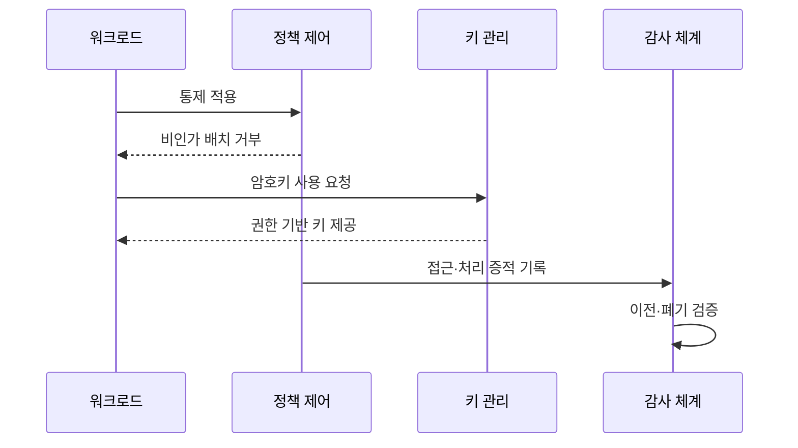

---
sidebar:
  order: 168
  label: "168. 소버린 클라우드 (Sovereign Cloud)"
  badge:
    text: "기출 · 70%"
    variant: note
title: "소버린 클라우드 (Sovereign Cloud)"
date: "2026-07-27T23:59:59+09:00"
tags:
  - "notes-software"
weight: 168
extra:
  question_no: "168"
  source_status: "기출"
  source_history: "138회"
  priority: 70
  priority_note: "데이터 주권과 운영 통제권이 최근 직접 출제됨"
---

## 미리 알고가기

- **소버린 클라우드(Sovereign Cloud)**: ‘주권을 가진’이라는 Sovereign을 붙인 명칭이며, 정한 관할 안에서 데이터·운영·기술 통제권을 확보하는 클라우드
- **데이터 레지던시**: 데이터가 저장·처리되는 물리적 위치를 제한함
- **법적·관할 주권**: 서비스와 데이터가 적용받는 법률·외국 기관 요구·권리 집행 범위를 다룸
- **운영 주권**: 정한 관할의 인력과 조직이 서비스 운영·지원·복구를 통제하는 능력임
- **기술 주권**: 개방성·상호운용성·감사 가능성과 특정 공급자 종속 범위를 다룸
- **암호키 통제**: 키 생성·보관·사용·폐기 권한과 운영자 접근 경계를 포함함
- **출구 전략**: 데이터·이미지·설정·로그를 다른 환경으로 이전하고 기존 사본을 폐기하는 계획임
- **롤백**: 이전 검증 실패 시 기존 정상 환경으로 되돌리는 복구임

## Ⅰ. 개요

- 정의/개념: 관할 내 **데이터·운영·기술 통제권** 확보
- 기존 한계: 글로벌 클라우드는 **외국 관할·운영·종속 위험**

### 쉽게 이해하기 (학습용)
- 물리적 위치를 넘어 운영과 암호키 통제권을 가짐

## Ⅱ. 특징

- **데이터 레지던시·법적 관할**로 저장·처리 제한
- **운영 인력·암호키·접근 권한**의 관할 내 통제
- **기술 개방성·감사·출구 전략**으로 종속 관리

### 쉽게 이해하기 (학습용)
- 운영 주체와 암호키 소유 및 기술 종속을 점검함

## Ⅲ. 아키텍처 및 구성요소

| 설계 요소 | 설명 |
|:---|:---|
| 주권 요구사항 | **적용 법률·허용 지역** 정의 |
| 데이터 경계 | **저장·처리·백업 이동** 제한 |
| 관리 경계 | 운영자 **위치·승인·비상 접근** 통제 |
| 고객 통제 키 | **키 생성·보관·사용·폐기** 통제 |
| 운영·출구 체계 | 관할 내 **사고 대응·이전** 검증 |

> 요약: 주권 요구사항이 각 경계별 통제로 구현됨

### 쉽게 이해하기 (학습용)
- 통제 수준을 정하고 경계별로 맞춘 뒤 검증함

## Ⅳ. 원리 및 절차 흐름도

| 절차 | 설명 |
|:---|:---|
| 통제 적용 | **관할·지역·운영자 정책** 설정 |
| 비인가 배치 거부 | 허용 지역 밖 **자원 생성 차단** |
| 암호키 사용 요청 | 고객 통제 키의 **사용 권한 확인** |
| 권한 기반 키 제공 | 승인된 주체에만 **암호 연산 허용** |
| 접근·처리 증적 기록 | 운영·데이터 접근을 **감사 기록화** |
| 이전·폐기 검증 | 출구 시 **자산 이전·사본 삭제** 확인 |

> 요약: 요구를 관할 및 키 통제로 구현하고 검증함

### 쉽게 이해하기 (학습용)
- 관할과 이동 경로를 정하고 종속성을 확인함

## Ⅴ. 종류 및 비교

| 클라우드 주권 범위 | 데이터 레지던시 | 소버린 클라우드 |
|:---|:---|:---|
| 적용 기준 | 데이터 **저장·처리 위치** 규제 | 관할·운영·키·**기술 통제** 요구 |
| 핵심 특징 | **물리적 위치 제한** 중심 | **법적·운영·기술 주권** 통합 |
| 한계 | 운영자·키 **통제 누락** | 비용 증가·**출구 검증 실패** |

> 요약: 단순 저장 위치를 넘어 관할과 키를 통제함

### 쉽게 이해하기 (학습용)
- 저장 위치를 넘어 법과 암호키 통제권을 다룸

## Ⅵ. 실무 사례

1. 공공 업무는 **관할 인력·고객 키**로 접근 통제

### 쉽게 이해하기 (학습용)
- 공공 업무는 관할 인력과 키 소유자를 확인함

## Ⅶ. 결론

- 국가·산업의 데이터 주권과 운영 통제를 확보하기 위해 **데이터 위치·운영자 관할·암호키 소유·공급망 통제**를 검토하고, 위치 규제는 레지던시, 전면 통제는 소버린 클라우드를 선택한다

### 쉽게 이해하기 (학습용)
- 저장 지역뿐 아니라 운영자와 키 소유자도 확인함
