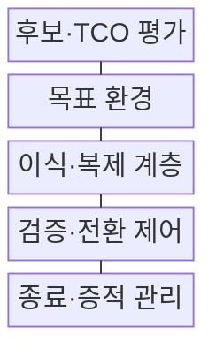
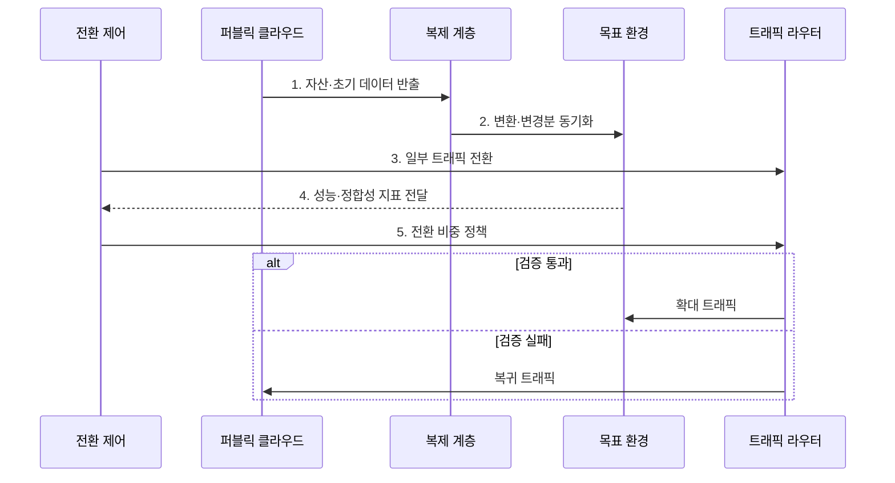

---
sidebar:
  order: 169
  label: "169. 클라우드 회귀 (Cloud Repatriation)"
  badge:
    text: "미출 · 50%"
    variant: note
title: "클라우드 회귀 (Cloud Repatriation)"
date: "2026-08-02T12:00:00+09:00"
tags:
  - "notes-software"
weight: 169
extra:
  question_no: "169"
  source_status: "미출"
  source_history: ""
  priority: 50
  priority_note: "비용·규제·종속성에 따른 재배치 판단"
---

## Ⅰ. 개요

핵심 용어

- **클라우드 회귀(Cloud Repatriation)**: 퍼블릭 클라우드의 워크로드를 온프레미스나 사설 클라우드 같은 자체 통제 환경으로 재배치하는 전략이다.

- 정의/개념: 퍼블릭 워크로드의 **자체 통제 환경 재배치 전략**
- 배경/필요성: 퍼블릭 단일 배치로는 **지속 부하 비용·규제·종속 통제 곤란**

#### 한줄 요약

- 계속 빌리는 비용보다 직접 운영하는 전체 비용이 낮고 통제 편익이 큰 설비만 골라 자체 환경으로 되가져오는 선택이다.

## Ⅱ. 특징

핵심 용어

- **TCO·데이터 중력**: 워크로드 이전 후보는 전체 수명주기 비용인 TCO와 데이터 이동 비용·지연을 유발하는 데이터 중력을 기준으로 선별한다.
- **총소유비용(Total Cost of Ownership, TCO)**: 장비·서비스 요금뿐 아니라 인력·전력·이전·중단·예비 용량을 포함한 전체 수명주기 비용이다.
- **데이터 중력(Data Gravity)**: 데이터 규모와 의존 서비스가 커질수록 이동 비용·지연이 증가해 워크로드가 데이터 위치에 묶이는 성질이다.
- **변경분 동기화·점진 전환**: 원 환경의 변경 데이터를 목표 환경에 계속 반영하면서 트래픽 비중을 단계적으로 옮기는 가역 절차이다.

- **TCO·데이터 중력** 기반 워크로드 선별 이전
- **관리형 서비스·독점 형식** 기반 의존성 해소
- **변경분 동기화·점진 전환** 기반 가역 실행

#### 한줄 요약

- 월 사용료만 비교하면 자체 인력과 장애 복구 비용을 놓치므로 이전 뒤 다시 맡게 될 운영 책임까지 TCO에 포함해야 한다.

## Ⅲ. 구조 및 구성요소

핵심 용어

- **이식·복제 계층**: 이식·복제 계층은 독점 형식을 변환하고 초기 데이터와 변경분을 목표 환경에 동기화한다.
- **후보·총소유비용(Total Cost of Ownership, TCO) 평가**: 비용·통제 편익과 독점 의존성을 비교해 회귀 대상을 선별하는 구성요소이다.
- **목표 환경**: 자체 운영에 필요한 용량·보안·관측·복구 체계를 준비한 실행 환경이다.
- **검증·전환 제어**: 성능·데이터 정합성에 따라 트래픽 전환 비중과 복귀를 결정하는 구성요소이다.
- **종료·증적 관리**: 원 환경의 잔여 자원·키·백업·데이터 사본의 폐기를 확인하는 구성요소이다.

| 구성요소 | 책임 |
|:---|:---|
| 후보·TCO 평가 | 비용·통제·**의존성 편익 판단** |
| 목표 환경 | 용량·보안·**복구 체계 준비** |
| 이식·복제 계층 | 형식 변환·**변경 데이터 동기화** |
| 검증·전환 제어 | 성능·정합성·**트래픽 비중 결정** |
| 종료·증적 관리 | 잔여 자원·**데이터 폐기 확인** |

#### 한줄 요약

- 이사 후보를 고르고 새 집을 준비한 뒤 짐과 변경분을 계속 맞추며 손님을 조금씩 옮기고 마지막에 이전 집의 열쇠와 사본을 정리한다.

## Ⅳ. 흐름도

핵심 용어

- **4. 성능·정합성 지표 전달**: 일부 트래픽의 오류·지연과 데이터 건수·해시를 전달해 목표 환경의 성능과 정합성을 판정한다.
- **1. 자산·초기 데이터 반출**: 애플리케이션·설정·기준 데이터를 목표 환경으로 복제하는 단계이다.
- **2. 변환·변경분 동기화**: 독점 형식을 대체하고 원 환경의 지속 변경을 목표 환경에 반영하는 단계이다.
- **3. 일부 트래픽 전환**: 제한된 사용자·요청만 목표 환경으로 보내 실제 동작을 검증하는 단계이다.
- **5. 전환 비중 정책**: 검증 통과 시 목표 환경 비중을 늘리고 실패 시 원 환경으로 복귀하는 규칙이다.

**동작 원리**

1. **자산·초기 데이터 반출**: 응용·설정·기준 데이터 복제
2. **변환·변경분 동기화**: 독점 의존 대체·정합성 유지
3. **일부 트래픽 전환**: 제한된 사용자로 목표 환경 검증
4. **성능·정합성 지표 전달**: 오류·자료 일치로 전환 상태 판정
5. **전환 비중 정책**: 통과 시 확대하고 실패 시 원 환경 복귀

#### 한줄 요약

- 원본 서비스를 계속 운영하면서 새 환경에 변경 데이터를 따라붙인 뒤 일부 사용자만 보내 성능과 자료가 맞을 때 전환 비중을 높인다.

## Ⅴ. 종류 및 비교

핵심 용어

- **클라우드 회귀**: 클라우드 회귀는 안정적이고 예측 가능한 지속 부하의 통제권과 운영 책임을 자체 환경으로 회수한다.
- **퍼블릭 유지(Public Cloud Retention)**: 변동·불확실한 부하에 퍼블릭 클라우드의 탄력성과 관리형 서비스를 계속 사용하는 전략이다.
- **클라우드 회귀(Cloud Repatriation)**: 안정적이고 예측 가능한 지속 부하의 통제권과 운영 책임을 자체 환경으로 회수하는 전략이다.

| 배치 전략 | 퍼블릭 유지 | 클라우드 회귀 |
|:---|:---|:---|
| 적용 기준 | 변동·불확실한 **단기 부하** | 안정·예측 가능한 **지속 부하** |
| 핵심 특징 | 탄력 확장·**관리 책임 이전** | 직접 통제·**운영 책임 회수** |
| 한계 | 비용 변동·**이그레스·종속** | 초기 투자·**용량·운영 부담** |

#### 한줄 요약

- 급격히 변하는 부하는 퍼블릭 탄력성을 사용하고 일정한 대규모 부하는 직접 운영의 순편익과 통제 요구를 다시 계산한다.

## Ⅵ. 실무 고려사항 및 대책

핵심 용어

- **TCO 과소산정**: TCO 과소산정을 막으려면 장비뿐 아니라 인력, 전력, 이전, 중단, 예비 용량 비용까지 포함해야 한다.
- **총소유비용(Total Cost of Ownership, TCO) 과소산정**: 장비 가격만 계산하고 인력·전력·이전·중단·예비 용량 비용을 빠뜨리는 오류이다.
- **건수·해시 검증**: 원 환경과 목표 환경 데이터의 레코드 수와 내용 지문을 비교해 누락·변조를 확인하는 검증이다.
- **출구 계획(Exit Plan)**: 원 환경의 자원·키·백업·데이터 사본을 안전하게 종료·폐기하는 절차이다.

| 문제 | 대책 | 효과 |
|:---|:---|:---|
| 장비 가격만 본 **TCO 과소산정** | 인력·전력·이전·**중단 비용 포함** | 절감액 **과대평가 방지** |
| 성장·장애의 **용량 부족** | 기준 부하·증가율·**장애 여유 산정** | 과잉·부족 **설비 완화** |
| 관리형 서비스의 **대체 기능 부족** | 기능 목록·**대체 시험·자동화** | **운영 책임 회수** 준비 |
| 대규모 데이터의 **전환 오류** | 변경분 복제·**건수·해시 검증** | **정합성 손실 방지** |
| 원 환경의 **잔여 비용·사본** | **출구 계획**으로 자원·키·백업 폐기 | 이중 비용·**정보 노출 제거** |

#### 한줄 요약

- 일정한 GPU 추론 부하도 장비 가격뿐 아니라 전력, 인력, 예비 용량, 이전 중단 비용을 포함한 뒤 순편익이 남을 때만 회귀해야 한다.

## Ⅶ. 결론

핵심 용어

- **부하 지속성·TCO·통제 편익**: 퍼블릭 유지와 부분 회귀는 부하 지속성, TCO, 규제와 통제 편익을 기준으로 결정한다.

- **부하 지속성·TCO·통제 편익**으로 유지·부분 회귀 결정

#### 한줄 요약

- 안정 부하의 전체 비용과 규제 편익이 이전·운영 위험보다 클 때만 부분 회귀하고 데이터 동기화·롤백·잔여 사본 폐기까지 출구 계획에 포함해야 한다.
