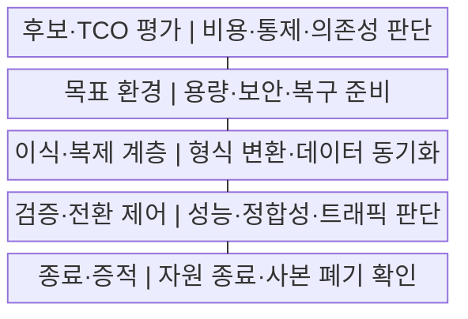
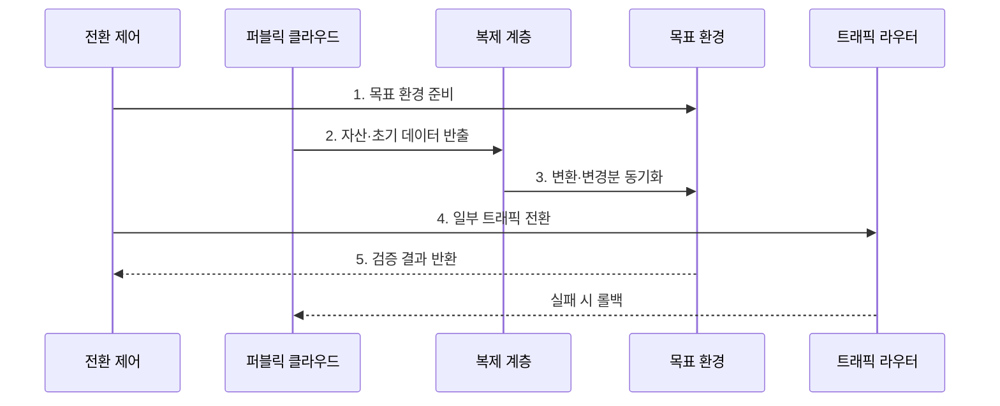

---
sidebar:
  order: 169
  label: "169. 클라우드 회귀 (Cloud Repatriation)"
  badge:
    text: "미출 · 50%"
    variant: note
title: "클라우드 회귀 (Cloud Repatriation)"
date: "2026-07-29T18:10:00+09:00"
tags:
  - "notes-software"
weight: 169
extra:
  question_no: "169"
  source_status: "미출"
  source_history: ""
  priority: 50
  priority_note: "비용·규제·종속성에 따른 재배치 판단"
---

## 미리 알고가기

- **클라우드 회귀(Cloud Repatriation)**: 퍼블릭 클라우드의 워크로드·데이터를 온프레미스나 사설 클라우드로 다시 이전하는 전략
- **총소유비용(Total Cost of Ownership, TCO)**: 구매·구축·운영·인력·이전·폐기를 포함한 전체 수명주기 비용
- **데이터 중력(Data Gravity)**: 데이터가 커질수록 전송 비용과 지연 때문에 응용·분석 기능이 데이터 가까이 모이는 현상
- **워크로드(Workload)**: 응용과 이를 실행하는 연산·저장·네트워크·데이터의 묶음
- **이그레스 비용(Egress Cost)**: 클라우드 외부로 데이터를 반출할 때 발생하는 네트워크 비용
- **관리형 서비스(Managed Service)**: 사업자가 패치·확장·복구를 대신 운영하는 서비스
- **출구 계획(Exit Plan)**: 데이터·이미지·설정·로그를 반출하고 서비스를 안전하게 종료하는 계획
- **점진 전환(Canary Cutover)**: 일부 트래픽부터 목표 환경으로 보내 결과를 확인하며 비중을 늘리는 전환
- **롤백(Rollback)**: 전환 실패 시 트래픽과 데이터를 이전 정상 환경으로 되돌리는 복구

## Ⅰ. 개요

- 정의/개념: 퍼블릭 워크로드의 **자체 통제 환경 재배치 전략**
- 배경/필요성: 지속 부하 비용·규제·**공급자 종속 개선**

### 쉽게 이해하기 (학습용)

- 계속 빌리는 비용보다 직접 운영하는 전체 비용이 낮고 통제 편익이 큰 설비만 골라 자체 환경으로 되가져오는 선택이다.

## Ⅱ. 특징

- **워크로드별 비용·통제 편익** 기반 선별 이전
- **관리형 서비스·독점 형식** 기반 의존성 해소
- **변경분 동기화·점진 전환** 기반 가역 실행

### 쉽게 이해하기 (학습용)

- 월 사용료만 비교하면 자체 인력과 장애 복구 비용을 놓치므로 이전 뒤 다시 맡게 될 운영 책임까지 TCO에 포함해야 한다.

## Ⅲ. 구조 및 구성요소

| 구성요소 | 책임 |
|:---|:---|
| 후보·TCO 평가 | 비용·통제·**의존성 편익 판단** |
| 목표 환경 | 용량·보안·**복구 체계 준비** |
| 이식·복제 계층 | 형식 변환·**변경 데이터 동기화** |
| 검증·전환 제어 | 성능·정합성·**트래픽 비중 결정** |
| 종료·증적 | 잔여 자원·**데이터 폐기 확인** |

### 쉽게 이해하기 (학습용)

- 이사 후보를 고르고 새 집을 준비한 뒤 짐과 변경분을 계속 맞추며 손님을 조금씩 옮기고 마지막에 이전 집의 열쇠와 사본을 정리한다.

## Ⅳ. 흐름도

**동작 원리**

1. **목표 환경 준비**: 예상 부하·보안·복구 능력 확보
2. **자산·초기 데이터 반출**: 응용·설정·기준 데이터 복제
3. **변환·변경분 동기화**: 독점 의존 대체·정합성 유지
4. **일부 트래픽 전환**: 점진 비중 확대·중단 조건 감시
5. **검증 결과 반환**: 성능·오류·정합성 기반 확대 판단

### 쉽게 이해하기 (학습용)

- 원본 서비스를 계속 운영하면서 새 환경에 변경 데이터를 따라붙인 뒤 일부 사용자만 보내 성능과 자료가 맞을 때 전환 비중을 높인다.

## Ⅴ. 종류 및 비교

| 배치 전략 | 퍼블릭 유지 | 클라우드 회귀 |
|:---|:---|:---|
| 적용 기준 | 변동·불확실한 **단기 부하** | 안정·예측 가능한 **지속 부하** |
| 핵심 특징 | 탄력 확장·**관리 책임 이전** | 직접 통제·**운영 책임 회수** |
| 한계 | 비용 변동·**이그레스·종속** | 초기 투자·**용량·운영 부담** |

### 쉽게 이해하기 (학습용)

- 급격히 변하는 부하는 퍼블릭 탄력성을 사용하고 일정한 대규모 부하는 직접 운영의 순편익과 통제 요구를 다시 계산한다.

## Ⅵ. 실무 고려사항 및 대책

| 고려사항 | 대책 | 효과 |
|:---|:---|:---|
| 장비 가격만 본 **TCO 과소산정** | 인력·전력·이전·**중단 비용 포함** | 절감액 **과대평가 방지** |
| 성장·장애의 **용량 부족** | 기준 부하·증가율·**장애 여유 산정** | 과잉·부족 설비 완화 |
| 관리형 서비스의 **대체 기능 부족** | 기능 목록·**대체 시험·자동화** | 운영 책임 회수 준비 |
| 대규모 데이터의 **전환 오류** | 변경분 복제·**건수·해시 검증** | 정합성 손실 방지 |
| 원 환경의 **잔여 비용·사본** | 자원·계정·키·**백업 폐기 증명** | 이중 비용·정보 노출 제거 |

### 쉽게 이해하기 (학습용)

- 일정한 GPU 추론 부하도 장비 가격뿐 아니라 전력, 인력, 예비 용량, 이전 중단 비용을 포함한 뒤 순편익이 남을 때만 회귀해야 한다.

## Ⅶ. 결론

- **부하 지속성·TCO·통제 편익**으로 유지·부분 회귀 결정

### 쉽게 이해하기 (학습용)

- 안정 부하의 전체 비용과 규제 편익이 이전·운영 위험보다 클 때만 부분 회귀하고 데이터 동기화·롤백·잔여 사본 폐기까지 출구 계획에 포함해야 한다.
