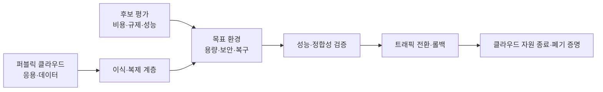
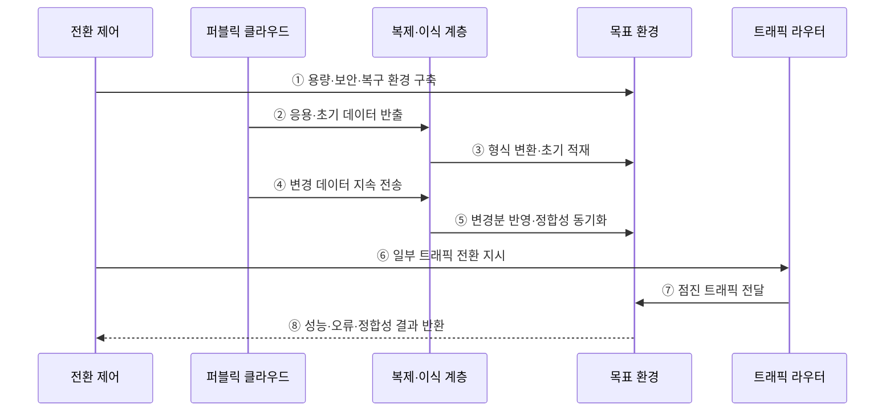

---
sidebar:
  order: 169
  label: "169. 클라우드 회귀 (Cloud Repatriation)"
  badge:
    text: "미출제 · 50%"
    variant: note
title: "클라우드 회귀 (Cloud Repatriation)"
date: "2026-07-25T00:40:00+09:00"
tags:
  - "notes-software"
weight: 169
extra:
  question_no: "169"
  source_status: "미출제"
  source_history: ""
  priority: 50
  priority_note: "비용·규제·종속성에 따른 재배치 가치가 있음"
---

## 미리 알고가기

- **클라우드 회귀(Cloud Repatriation)**: 퍼블릭 클라우드의 워크로드·데이터를 온프레미스나 사설 클라우드로 다시 이전하는 전략
- **총소유비용(Total Cost of Ownership, TCO·티시오)**: 구매·구축·운영·인력·이전·폐기 비용을 포함한 전체 수명주기 비용
- **데이터 중력(Data Gravity)**: 데이터가 커질수록 전송 비용과 지연 때문에 응용·분석 기능이 데이터 가까이 모이는 현상
- **워크로드(Workload)**: 응용과 이를 실행하는 연산·저장·네트워크·데이터의 묶음
- **이그레스 비용(Egress Cost)**: 클라우드 외부로 데이터를 반출할 때 발생하는 네트워크 비용
- **관리형 서비스(Managed Service)**: 데이터베이스·메시징처럼 클라우드 사업자가 패치·확장·복구를 대신 운영하는 서비스
- **출구 계획(Exit Plan)**: 데이터·이미지·설정·로그를 호환 형식으로 반출하고 서비스를 안전하게 종료하는 계획
- **점진 전환(Canary Cutover)**: 일부 트래픽부터 목표 환경으로 보내 성능과 오류를 확인하며 비중을 늘리는 전환
- **롤백(Rollback)**: 전환 실패 시 트래픽과 데이터를 이전 정상 환경으로 되돌리는 복구

## Ⅰ. 개요

- 클라우드 회귀는 퍼블릭 클라우드 자원을 **자체 통제가 가능한 환경으로 재배치**하는 전략이다.
- 안정적인 대규모 부하의 비용, 규제·지연 요구, 공급자 종속을 개선할 때 검토한다.
- 단순한 클라우드 철수가 아니라 워크로드별 경제성과 운영 가능성을 다시 판단하는 배치 최적화다.

### 쉽게 이해하기 (학습용)
- 계속 빌리는 것보다 직접 운영하는 편이 유리한 자원만 골라 되가져옴

## Ⅱ. 특징

- **선별 이전**: 모든 자원이 아니라 비용·통제·성능 편익이 큰 워크로드를 고른다.
- **전 비용 비교**: 클라우드 사용료와 자체 인프라의 설비·인력·전력·갱신·이전 비용을 비교한다.
- **의존성 해소**: 독점 API·관리형 서비스·데이터 형식의 대체 범위를 분석한다.
- **데이터 중심 전환**: 대용량 초기 복제와 변경분 동기화로 정합성과 중단 시간을 관리한다.
- **운영 책임 회수**: 용량·패치·보안·백업·장애 복구 책임이 조직으로 돌아온다.
- **가역적 전환**: 점진 트래픽 이동과 명확한 롤백 조건으로 위험을 낮춘다.

### 쉽게 이해하기 (학습용)
- 사용료 절감액에서 구축·인력·이전·장애 위험 비용까지 뺀 순편익을 봄

## Ⅲ. 아키텍처 및 구성요소

**도표안 A — 구조도**

**도표안 B — sequenceDiagram**

| 구성요소 | 역할 |
|:---|:---|
| 후보 평가 | 부하·비용·지연·규제·의존성·운영 역량 분석 |
| TCO 모델 | 클라우드 유지비와 자체 구축·운영·이전 비용 비교 |
| 목표 환경 | 용량·네트워크·보안·백업·재해 복구 설계 |
| 이식·복제 계층 | 개방 형식 변환·API 대체·초기 및 변경 데이터 복제 |
| 검증 체계 | 기능·성능·보안·데이터 정합성·복구 능력 확인 |
| 전환 제어 | 트래픽 비중·전환 시점·중단 조건·롤백 결정 |
| 종료·증적 | 잔여 데이터 반출·자원 종료·사본 폐기 확인 |

**동작 원리**

- ① 전환 제어가 예상 부하를 처리할 목표 환경과 보안·복구 체계를 구축한다.
- ② 퍼블릭 클라우드에서 응용 자산과 초기 데이터 사본을 복제 계층으로 반출한다.
- ③ 복제 계층은 독점 형식과 API 의존성을 변환해 목표 환경에 적재한다.
- ④ 원본 서비스를 운영하는 동안 발생한 변경 데이터를 계속 전송한다.
- ⑤ 목표 환경은 변경분을 반영하고 건수·해시·업무 규칙으로 정합성을 검증한다.
- ⑥ 전환 제어는 준비 기준을 충족하면 라우터에 일부 트래픽 이전을 지시한다.
- ⑦ 라우터는 목표 환경의 트래픽 비중을 단계적으로 높인다.
- ⑧ 목표 환경의 성능·오류·정합성 결과로 전환 확대·중단·롤백을 결정한다.

### 쉽게 이해하기 (학습용)
- 새 집을 준비하고 데이터를 계속 맞춘 뒤 손님을 조금씩 옮겨 이상 여부를 확인함

## Ⅳ. 종류 및 비교

| 구분 | 퍼블릭 클라우드 유지 | 클라우드 회귀 |
|:---|:---|:---|
| 비용 구조 | 사용량 기반 운영비 | 초기 투자와 용량 기반 비용 |
| 부하 적합성 | 변동·불확실·단기 부하 | 안정적·예측 가능한 지속 부하 |
| 확장성 | 신속한 탄력 확장 | 사전 용량 계획과 조달 필요 |
| 운영 책임 | 관리형 서비스로 일부 이전 | 인력·패치·복구 책임 회수 |
| 통제 수준 | 사업자 기능과 정책 범위 | 인프라·데이터·키 직접 통제 |
| 주요 위험 | 비용 변동·이그레스·종속 | 과잉 설비·운영 역량 부족·전환 장애 |

| 회귀 범위 | 설명 | 적용 |
|:---|:---|:---|
| 전체 회귀 | 서비스와 데이터를 자체 환경으로 이전 | 강한 규제·통제·지속 부하 |
| 부분 회귀 | 비용·통제 민감 계층만 이전 | 데이터 계층·GPU 추론 등 |
| 재설계 후 회귀 | 독점 서비스를 대체 기술로 변경 후 이전 | 관리형 서비스 의존이 큰 시스템 |

### 쉽게 이해하기 (학습용)
- 변동 부하는 빌려 쓰고 안정적인 대량 부하는 직접 운영의 경제성을 검토함

## Ⅴ. 실무 고려사항 및 대책

| 고려사항 | 위험 | 대책 |
|:---|:---|:---|
| TCO 범위 | 장비 가격만 비교해 절감액 과대평가 | 인력·전력·공간·갱신·이전·중단 비용 포함 |
| 용량 계획 | 성장·장애 여유 부족 또는 과잉 설비 | 기준 부하·증가율·장애 여유로 단계 증설 |
| 관리형 서비스 | 대체 기능 부족과 운영 부담 급증 | 기능 목록화·대체 시험·운영 자동화 |
| 데이터 반출 | 이그레스 비용·장시간 복제·정합성 오류 | 전용 회선·압축·변경분 복제·해시 검증 |
| 전환 중단 | 대규모 일괄 전환으로 장애 확대 | 카나리 전환·이중 운영·명확한 롤백 기준 |
| 운영 역량 | 패치·보안·복구 수준 저하 | 인력·도구·런북·재해 복구 훈련 선행 |
| 잔여 자산 | 클라우드 비용과 데이터 사본 지속 | 자원·계정·키·백업 종료와 폐기 증명 |

### 쉽게 이해하기 (학습용)
- 사례: 일정한 GPU 추론 부하는 장비·전력·인력·이전 비용을 모두 비교한 뒤 부분 회귀함

## Ⅵ. 결론

- 클라우드 회귀의 핵심은 **워크로드별 TCO·통제 편익이 이전·운영 위험보다 큰지 검증**하는 것이다.
- 관리형 서비스 의존성과 자체 운영 역량을 과소평가하면 비용 절감보다 안정성 손실이 커질 수 있다.
- 데이터 동기화·점진 전환·롤백·잔여 자산 폐기까지 포함한 출구 계획으로 실행해야 한다.

### 쉽게 이해하기 (학습용)
- 월 사용료만 보지 말고 되가져온 뒤 계속 운영할 전체 비용과 능력을 확인함
