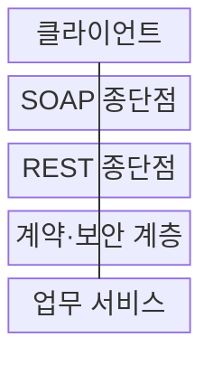
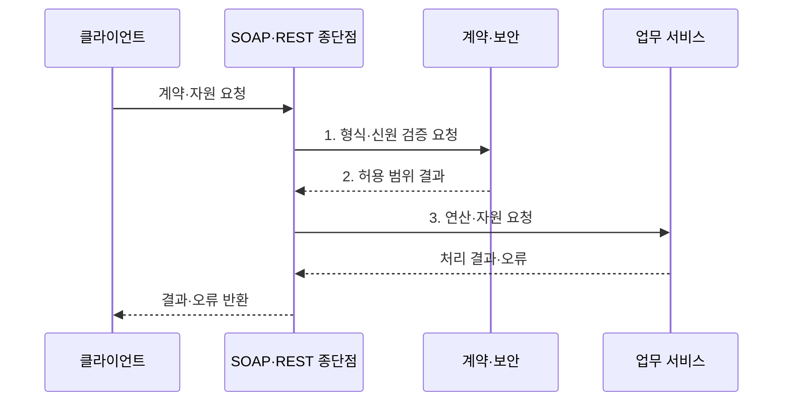

---
sidebar:
  order: 170
  label: "170. SOAP vs REST 비교 (SOAP vs REST)"
  badge:
    text: "기출 · 70%"
    variant: note
title: "SOAP vs REST 비교 (SOAP vs REST)"
date: "2026-08-02T12:00:00+09:00"
tags:
  - "notes-software"
weight: 170
extra:
  question_no: "170"
  source_status: "기출"
  source_history: "135회"
  priority: 70
  priority_note: "메시지 계약과 자원 설계 비교 출제"
---

## Ⅰ. 개요

핵심 용어

- **메시지 프로토콜**: SOAP은 XML 봉투와 처리 규칙을 사용하는 메시지 프로토콜이고 REST는 자원 중심의 아키텍처 스타일이다.

- 정의/개념: XML 계약 **메시지 프로토콜**과 자원 중심 **아키텍처 스타일의 비교 기준**
- 배경/필요성: 단일 방식으로는 **엄격한 계약·웹 자원 확장성 동시 충족 곤란**

### 쉽게 이해하기 (학습용)

- SOAP은 정해진 봉투와 계약으로 업무 연산을 호출하고 REST는 주소와 HTTP 의미로 자원 상태를 조회·변경한다.

## Ⅱ. 특징

핵심 용어

- **URI·균일 인터페이스**: REST는 URI로 자원을 식별하고 균일 인터페이스로 자원 표현을 일관되게 조작한다.

- **XML·WSDL·WS-*** 기반 SOAP 계약·확장
- **URI·균일 인터페이스** 기반 REST 자원 조작
- **Fault·HTTP 상태** 기반 오류 의미 분리

### 쉽게 이해하기 (학습용)

- SOAP은 기관 간 문서처럼 형식과 서명을 엄격히 맞추고 REST는 웹의 주소·메서드·캐시 규칙을 재사용해 인터페이스를 단순화한다.

## Ⅲ. 구조 및 구성요소

핵심 용어

- **계약·보안 계층**: 계약·보안 계층은 스키마, 서명, 인증 정책을 검사해 허용된 업무 요청만 전달한다.

| 구성요소 | 책임 |
|:---|:---|
| 클라이언트 | 계약 메시지·**자원 요청 생성** |
| SOAP 종단점 | XML 봉투·**WSDL 계약 검증** |
| REST 종단점 | URI·**HTTP 의미 처리** |
| 계약·보안 계층 | 스키마·서명·**인증 정책 적용** |
| 업무 서비스 | 연산 실행·**자원 상태 처리** |

### 쉽게 이해하기 (학습용)

- 클라이언트가 SOAP 문서 창구나 REST 자원 창구를 선택해도 계약·보안 검사를 거쳐 같은 업무 서비스에 도달한다.

## Ⅳ. 흐름도

핵심 용어

- **1. 형식·신원 검증 요청**: 종단점은 요청 스키마와 토큰·서명을 검사하도록 계약·보안 계층에 형식·신원 검증을 요청한다.

**동작 원리**

1. **형식·신원 검증 요청**: 스키마·토큰·서명 조건 검사
2. **허용 범위 결과**: 실행 가능한 연산·자원 범위 확정
3. **연산·자원 요청**: 계약된 업무 로직과 자원 상태 처리

### 쉽게 이해하기 (학습용)

- SOAP 요청은 봉투와 연산 계약을 먼저 검사하고 REST 요청은 주소·메서드·표현을 해석한 뒤 각 방식의 표준 오류 형태로 결과를 돌려준다.

## Ⅴ. 종류 및 비교

핵심 용어

- **SOAP**: SOAP은 엄격한 XML 계약과 WS-* 메시지 확장이 필요한 서비스 연계에 적합하다.

| 인터페이스 방식 | SOAP | REST |
|:---|:---|:---|
| 적용 기준 | 엄격한 계약·**메시지 확장** | 웹 자원·**단순 연계** |
| 핵심 특징 | XML·WSDL·**WS-* 명세** | URI·무상태·**균일 인터페이스** |
| 한계 | 검증·확장의 **처리 부담** | 설계 편차·**별도 계약 관리** |

### 쉽게 이해하기 (학습용)

- 메시지 서명과 신뢰성 명세가 중요한 기관 연계는 SOAP을, 공개 자원을 웹 방식으로 조회하는 인터페이스는 REST를 우선 검토한다.

## Ⅵ. 실무 고려사항 및 대책

핵심 용어

- **중복 업무 처리**: 재시도에 따른 중복 업무 처리를 막으려면 요청 식별자, 멱등 키, 보상 처리 정책을 적용해야 한다.

| 문제 | 대책 | 효과 |
|:---|:---|:---|
| 서비스별 **계약 해석 차이** | WSDL·별도 명세의 **우선 설계** | **상호운용 오류** 감소 |
| 메시지의 **위변조 위험** | WS-Security·TLS·**토큰 검증** | **신원·무결성** 확보 |
| 재시도의 **중복 업무 처리** | 요청 식별자·**멱등 키·보상 처리** | **중복 효과 방지** |
| XML·표현의 **처리 비용** | 크기·검증·**왕복 횟수 측정** | **지연·대역폭** 통제 |
| 버전 변경의 **호환성 파괴** | 스키마·필드의 **하위 호환 정책** | 기존 **소비자 보호** |

### 쉽게 이해하기 (학습용)

- 어느 방식을 사용해도 재시도되는 결제 요청에는 멱등 키를 두고 계약 변경은 기존 소비자가 이해하는 필드를 유지해야 한다.

## Ⅶ. 결론

핵심 용어

- **계약 엄격성·메시지 보안·자원 확장성**: SOAP과 REST는 계약 엄격성, 메시지 단위 보안 요구, 웹 자원 확장성을 기준으로 선택한다.

- **계약 엄격성·메시지 보안·자원 확장성**으로 SOAP·REST 결정

### 쉽게 이해하기 (학습용)

- XML과 JSON의 크기만 보지 말고 메시지 단위 표준 확장이 필요한지 웹 자원 규칙을 재사용할지를 기준으로 선택해야 한다.
