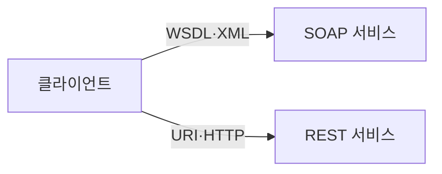
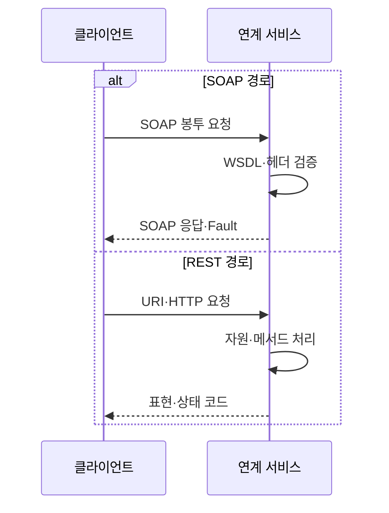

---
sidebar:
  order: 170
  label: "170. SOAP vs REST 비교 (SOAP vs REST)"
  badge:
    text: "기출 · 70%"
    variant: note
title: "SOAP vs REST 비교 (SOAP vs REST)"
date: "2026-07-27T23:59:59+09:00"
tags:
  - "notes-software"
weight: 170
extra:
  question_no: "170"
  source_status: "기출"
  source_history: "135회"
  priority: 70
  priority_note: "메시지 형식과 자원 설계 비교가 최근 출제됨"
---

## 미리 알고가기

- **단순 객체 접근 프로토콜 SOAP(솝, Simple Object Access Protocol)**: 영어 핵심어의 첫 글자를 쓴 표기로 엄격한 XML 메시지 계약을 정의하는 통신 규약임
- **표현 상태 전이 REST(레스트, Representational State Transfer)**: 영어 핵심어의 첫 글자를 쓴 표기로 자원 표현과 상태 전이 원칙으로 웹 인터페이스를 설계하는 구조임
- **웹 서비스 기술 언어 WSDL(더블유에스디엘, Web Services Description Language)**: 영어 네 낱말의 첫 글자를 쓴 표기로 SOAP 메시지·연산·접속점 계약을 기술함
- **웹 서비스 확장 명세(WS-*)**: ‘더블유에스 스타’로 읽고 Web Services의 첫 글자와 여러 하위 명세를 뜻하는 별표를 결합한 표기이며, SOAP의 보안·신뢰성·트랜잭션 기능을 확장
- **웹 서비스 보안(WS-Security)**: ‘더블유에스 시큐리티’로 읽고 Web Services와 Security를 결합한 표기이며, SOAP 메시지의 서명·암호화·보안 토큰을 규정
- **확장 가능 표시 언어 XML(엑스엠엘, Extensible Markup Language)·자바스크립트 객체 표기법 JSON(제이슨, JavaScript Object Notation)**: XML은 태그 기반 문서 형식이고 JSON은 키와 값 기반 데이터 형식으로 메시지 본문을 표현함
- **통합 자원 식별자 URI(유알아이, Uniform Resource Identifier)·하이퍼텍스트 전송 프로토콜 HTTP(에이치티티피, Hypertext Transfer Protocol)**: URI는 자원을 식별하고 HTTP는 요청·응답 통신을 수행해 REST의 자원 조작 경로를 정함
- **폴트(Fault)·상태 코드**: Fault는 ‘폴트’로 읽는 SOAP 표준 오류 형식이고 상태 코드는 HTTP 처리 결과 번호
- **캐시**: 이전 응답을 저장해 같은 요청의 처리 시간과 부하를 줄이는 방식임
- **비교**: 데이터 형식이 아닌 메시지 계약과 자원 상태 전이 차이임

## Ⅰ. 개요

- **정의/개념**: **SOAP 메시지 규약·REST 자원 스타일** 비교
- **기존 한계**: 단일 연계 방식은 **계약 엄격성·경량성 양립 곤란**

### 쉽게 이해하기 (학습용)
- SOAP은 규약 봉투, REST는 자원 주소임

## Ⅱ. 특징

- SOAP은 **WSDL·XML 봉투**로 엄격한 계약 제공
- SOAP은 **WS-* 헤더**로 보안·트랜잭션 확장
- REST는 **URI·HTTP·무상태·캐시** 제약 활용

### 쉽게 이해하기 (학습용)
- SOAP은 확장 규칙, REST는 HTTP 활용

## Ⅲ. 아키텍처 및 구성요소

| 설계 요소 | 설명 |
|:---|:---|
| SOAP 계약 | WSDL로 **연산·메시지·접속점** 정의 |
| SOAP 메시지 | XML **봉투·헤더·본문** 전달 |
| REST 자원 식별 | URI로 **조작 대상 자원** 식별 |
| REST 균일 인터페이스 | HTTP 메서드·**상태 코드** 적용 |
| REST 표현 | JSON·XML로 **자원 상태** 전달 |

> 요약: SOAP은 연산 계약을, REST는 자원 표현을 정의함

### 쉽게 이해하기 (학습용)
- SOAP은 메시지 봉투, REST는 자원 동작을 처리함

## Ⅳ. 원리 및 절차 흐름도

| 절차 | 설명 |
|:---|:---|
| SOAP 봉투 요청 | WSDL 계약의 **XML 메시지** 전송 |
| WSDL·헤더 검증 | 연산·스키마·**확장 헤더** 확인 |
| SOAP 응답·Fault | XML 본문 또는 **표준 오류** 반환 |
| URI·HTTP 요청 | 자원 URI와 **HTTP 메서드** 전송 |
| 자원·메서드 처리 | 무상태로 **자원 행위** 수행 |
| 표현·상태 코드 | 자원 표현과 **처리 결과** 반환 |

> 요약: 선택 방식에 따라 SOAP 검증과 REST 상태를 처리함

### 쉽게 이해하기 (학습용)
- 요구 조건으로 연계 구조를 선택해 동작 수행

## Ⅴ. 종류 및 비교

| 웹 연계 방식 | SOAP | REST |
|:---|:---|:---|
| 적용 기준 | 엄격한 계약·**WS-* 확장** | 경량·무상태·**웹 캐시** |
| 핵심 특징 | **WSDL·XML 연산 계약** | **URI·HTTP 자원 스타일** |
| 한계 | XML·확장 처리 **오버헤드** | 계약 편차·**자원 경계 오류** |

> 요약: SOAP은 계약 기반, REST는 자원 기반 구조임

### 쉽게 이해하기 (학습용)
- 무거운 계약은 SOAP, 가벼운 자원은 REST임

## Ⅵ. 실무 사례

1. 기관 연계는 **WSDL·WS-Security** 계약 적용
2. 조회 API는 **HTTP 캐시·상태 코드** 적용

### 쉽게 이해하기 (학습용)
- 기관 연계는 계약 검증이 필요한 SOAP을 적용함
- 조회 API는 캐시 가능한 REST를 적용함

## Ⅶ. 결론

- 엄격한 계약은 **SOAP**, 웹 자원 연계는 **REST**

### 쉽게 이해하기 (학습용)
- 계약 검증과 캐시 중 더 중요한 요구로 결정함
