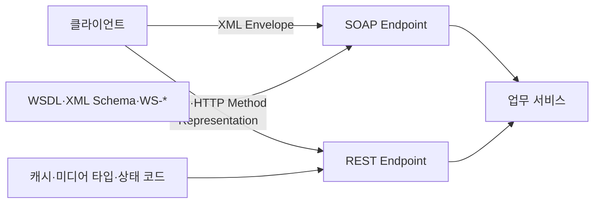
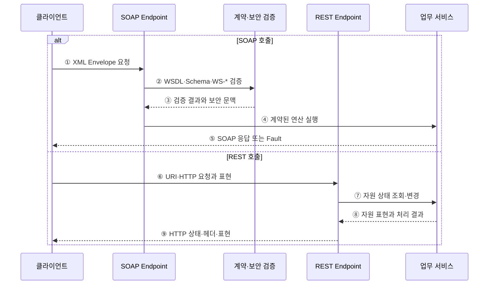

---
sidebar:
  order: 170
  label: "170. SOAP vs REST 비교 (SOAP vs REST)"
  badge:
    text: "기출 · 70%"
    variant: note
title: "SOAP vs REST 비교 (SOAP vs REST)"
date: "2026-07-27T23:59:59+09:00"
tags:
  - "notes-software"
weight: 170
extra:
  question_no: "170"
  source_status: "기출"
  source_history: "135회"
  priority: 70
  priority_note: "메시지 형식과 자원 설계 비교가 최근 출제됨"
---

## 미리 알고가기

- **단순 객체 접근 프로토콜(Simple Object Access Protocol, SOAP·솝)**: XML 봉투와 처리 규칙으로 구조화된 메시지를 교환하는 프로토콜
- **표현 상태 전이(Representational State Transfer, REST·레스트)**: 자원·표현·균일 인터페이스·무상태 통신을 사용하는 분산 시스템 아키텍처 스타일
- **웹 서비스 기술 언어(Web Services Description Language, WSDL·더블유에스디엘)**: SOAP 서비스의 연산·메시지·데이터 형식·접속점을 기술하는 XML 기반 계약
- **웹 서비스 확장 명세(WS-*)**: SOAP 메시지의 보안·신뢰성·트랜잭션 등을 확장하는 명세군
- **웹 서비스 보안(WS-Security)**: SOAP 메시지의 보안 토큰·서명·암호화를 규정하는 명세
- **확장 가능 마크업 언어(Extensible Markup Language, XML·엑스엠엘)**: 태그와 스키마로 구조화된 문서를 표현하는 형식
- **통합 자원 식별자(Uniform Resource Identifier, URI·유알아이)**: REST 인터페이스에서 자원을 식별하는 주소
- **균일 인터페이스(Uniform Interface)**: 자원 식별·표현을 통한 조작·자기 서술 메시지·하이퍼미디어로 인터페이스를 일관되게 만드는 REST 제약
- **무상태성(Statelessness)**: 서버가 이전 요청의 클라이언트 상태에 의존하지 않고 각 요청만으로 처리하는 REST 제약
- **폴트(Fault)·HTTP 상태 코드**: SOAP Fault는 SOAP 표준 오류 메시지이며, HTTP 상태 코드는 HTTP 요청의 처리 결과 번호

## Ⅰ. 개요

- SOAP은 **메시지 교환 프로토콜**, REST는 **자원 중심 아키텍처 스타일**이다.
- SOAP은 엄격한 계약과 메시지 확장을, REST는 웹의 균일 인터페이스와 확장성을 중시한다.
- 단순히 XML과 JSON을 비교하는 문제가 아니라 계약·상태·인터페이스·보안 요구를 비교해야 한다.

### 쉽게 이해하기 (학습용)
- SOAP은 정해진 봉투 규약으로 연산을 호출하고 REST는 주소로 자원 상태를 다룸

## Ⅱ. 특징

- **SOAP**: XML Envelope·Header·Body·Fault 구조로 메시지 처리 규칙을 정의한다.
- **SOAP**: WSDL과 XML Schema로 연산·자료형·접속점 계약을 엄격히 기술한다.
- **SOAP**: WS-* 명세로 메시지 단위 보안·신뢰성·트랜잭션을 확장할 수 있다.
- **REST**: URI로 자원을 식별하고 표현을 통해 자원 상태를 주고받는다.
- **REST**: 균일 인터페이스·무상태·캐시·계층화 제약으로 웹 확장성을 확보한다.
- REST 응답은 JSON에 한정되지 않으며, 표현 형식은 미디어 타입으로 구분한다.

### 쉽게 이해하기 (학습용)
- SOAP은 계약과 메시지 규칙이 강하고 REST는 웹의 공통 동작을 재사용함

## Ⅲ. 아키텍처 및 구성요소

**도표안 A — 구조도**

**도표안 B — sequenceDiagram**

| 구성요소 | SOAP | REST |
|:---|:---|:---|
| 인터페이스 중심 | 연산·메시지 | 자원·표현 |
| 계약 | WSDL·XML Schema | URI·메서드·미디어 타입·별도 API 명세 |
| 메시지 | XML Envelope·Header·Body | HTTP 요청·응답과 다양한 표현 형식 |
| 오류 | SOAP Fault | HTTP 상태 코드와 오류 표현 |
| 보안 | 전송 보안과 WS-Security | 전송 보안·HTTP 인증·응용 토큰 |
| 확장 | WS-* 메시지 헤더 | HTTP 헤더·링크·미디어 타입 |

**동작 원리**

- ① SOAP 클라이언트가 계약에 맞춘 XML Envelope를 Endpoint로 보낸다.
- ② SOAP Endpoint가 연산·자료형·WS-Security 헤더 검증을 요청한다.
- ③ 검증 계층이 계약 일치 여부와 인증·서명 결과를 반환한다.
- ④ SOAP Endpoint가 WSDL에 정의된 업무 연산을 실행한다.
- ⑤ 업무 서비스가 SOAP 본문 또는 Fault 형식으로 결과를 반환한다.
- ⑥ REST 클라이언트가 URI·HTTP 메서드·헤더·자원 표현으로 요청한다.
- ⑦ REST Endpoint가 균일 인터페이스 의미에 따라 자원을 조회하거나 변경한다.
- ⑧ 업무 서비스가 처리 결과와 자원 표현을 Endpoint에 반환한다.
- ⑨ REST Endpoint가 HTTP 상태 코드·캐시 헤더·미디어 타입과 표현을 반환한다.

### 쉽게 이해하기 (학습용)
- SOAP은 계약을 검증해 연산을 실행하고 REST는 HTTP 의미에 따라 자원을 조작함

## Ⅳ. 종류 및 비교

| 비교 항목 | SOAP | REST |
|:---|:---|:---|
| 본질 | 메시지 프로토콜 | 아키텍처 스타일 |
| 설계 중심 | 연산과 엄격한 메시지 계약 | 자원과 균일 인터페이스 |
| 대표 형식 | XML 고정 | JSON·XML 등 선택 |
| 전송 | HTTP·SMTP 등 사용 가능 | 일반적으로 HTTP 활용 |
| 상태 | 메시지·세션 설계에 따라 처리 | 요청 간 클라이언트 상태를 서버에 두지 않음 |
| 캐시 | 별도 설계 필요 | HTTP 캐시 의미 활용 |
| 표준 확장 | WS-Security·신뢰성·트랜잭션 | HTTP·TLS·OAuth 등 조합 |
| 장점 | 계약·확장 명세·도구 지원 | 단순성·상호운용성·웹 확장성 |
| 한계 | XML·검증·확장 처리 오버헤드 | 설계 편차·불완전한 자원 모델·별도 계약 관리 |

### 쉽게 이해하기 (학습용)
- 엄격한 메시지 계약은 SOAP, 웹 자원 중심의 단순 연계는 REST가 적합함

## Ⅴ. 실무 고려사항 및 대책

| 고려사항 | SOAP 적용·대책 | REST 적용·대책 |
|:---|:---|:---|
| 계약 엄격성 | WSDL·Schema 우선 설계 | OpenAPI 등으로 별도 계약 명세 |
| 메시지 보안 | WS-Security 서명·암호화 검토 | TLS·OAuth·서명 토큰 적용 |
| 신뢰성·트랜잭션 | 필요한 WS-* 명세와 상호운용성 시험 | 멱등성 키·재시도·보상 트랜잭션 설계 |
| 성능 | XML 크기·검증 비용 측정 | 표현 크기·왕복 횟수·캐시 정책 관리 |
| 변경 호환성 | WSDL·Schema 버전 정책 | URI·미디어 타입·필드 호환 정책 |
| 오류 처리 | Fault 코드·상세 노출 제한 | 상태 코드와 일관된 오류 표현 정의 |

### 쉽게 이해하기 (학습용)
- 사례: 기관 간 서명 메시지 계약은 SOAP, 공개 자원 조회 API는 REST를 선택함

## Ⅵ. 결론

- SOAP과 REST 선택의 핵심은 **엄격한 메시지 계약·표준 확장과 자원 중심 웹 확장성의 우선순위**다.
- SOAP을 무조건 무겁고 REST를 무조건 가볍다고 판단하지 말고 보안·계약·캐시·트랜잭션 요구를 비교해야 한다.
- 어느 방식을 택하든 명확한 계약·오류 의미·버전 호환성·보안 통제가 필요하다.

### 쉽게 이해하기 (학습용)
- 데이터 형식이 아니라 계약과 자원 설계 중 무엇이 중요한지로 선택함
