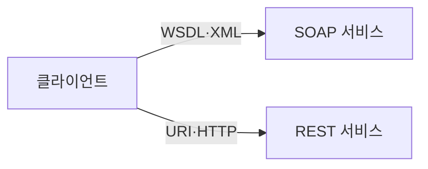

---
sidebar:
  order: 170
  label: "170. SOAP vs REST 비교 (SOAP vs REST)"
  badge:
    text: "기출 · 70%"
    variant: note
title: "SOAP vs REST 비교 (SOAP vs REST)"
date: "2026-07-25T00:40:00+09:00"
tags:
  - "notes-software"
weight: 170
extra:
  question_no: "170"
  source_status: "기출"
  source_history: "135회"
  priority: 70
  priority_note: "메시지 형식과 자원 설계 비교가 최근 출제됨"
---

## 미리 알고가기

- **단순 객체 접근 프로토콜 SOAP(소프, Simple Object Access Protocol)**: 영어 핵심어의 첫 글자를 쓴 표기로 엄격한 XML 메시지 계약을 정의하는 통신 규약임
- **표현 상태 전이 REST(레스트, Representational State Transfer)**: 영어 핵심어의 첫 글자를 쓴 표기로 자원 표현과 상태 전이 원칙으로 웹 인터페이스를 설계하는 구조임
- **웹 서비스 기술 언어 WSDL(더블유에스디엘, Web Services Description Language)**: 영어 네 낱말의 첫 글자를 쓴 표기로 SOAP 메시지·연산·접속점 계약을 기술함
- **확장 가능 표시 언어 XML(엑스엠엘, Extensible Markup Language)·자바스크립트 객체 표기법 JSON(제이슨, JavaScript Object Notation)**: XML은 태그 기반 문서 형식이고 JSON은 키와 값 기반 데이터 형식으로 메시지 본문을 표현함
- **통합 자원 식별자 URI(유알아이, Uniform Resource Identifier)·하이퍼텍스트 전송 프로토콜 HTTP(에이치티티피, Hypertext Transfer Protocol)**: URI는 자원을 식별하고 HTTP는 요청·응답 통신을 수행해 REST의 자원 조작 경로를 정함
- **Fault·상태 코드**: Fault는 SOAP 오류 형식이고 상태 코드는 HTTP 처리 결과임
- **캐시**: 이전 응답을 저장해 같은 요청의 처리 시간과 부하를 줄이는 방식임
- **비교**: 데이터 형식이 아닌 메시지 계약과 자원 상태 전이 차이임

## Ⅰ. 개요

- **정의/개념**: SOAP 통신 규약과 REST 자원 구조의 대비
- **배경/필요성**: 계약·확장 요구 차이로 연계 구조 선택 필요

### 쉽게 이해하기 (학습용)
- SOAP은 규약 봉투, REST는 자원 주소임

## Ⅱ. 특징

- SOAP은 WSDL로 엄격한 메시지를 정의한다.
- SOAP은 헤더로 보안·트랜잭션을 확장한다.
- REST는 URI로 자원을 식별하고 HTTP로 조작한다.
- REST는 무상태 요청과 캐시를 활용한다.

### 쉽게 이해하기 (학습용)
- SOAP은 확장 규칙, REST는 HTTP 활용

## Ⅲ. 아키텍처 및 구성요소

| 설계 요소 | 설명 |
|:---|:---|
| SOAP 계약 | WSDL로 메시지 교환 규격을 정의함 |
| SOAP 메시지 | XML 봉투로 헤더와 본문을 전달함 |
| REST 식별 | URI로 조작할 자원을 식별함 |
| REST 표현 | JSON으로 자원 상태를 전달함 |

> 요약: SOAP은 연산 계약을, REST는 자원 표현을 정의함

### 쉽게 이해하기 (학습용)
- SOAP은 메시지 봉투, REST는 자원 동작을 처리함

## Ⅳ. 원리 및 절차 흐름도

| 절차 | 설명 |
|:---|:---|
| SOAP선택 | WSDL 계약 방식 선택함 |
| 봉투검증 | XML 헤더 확장 규격 검증함 |
| Fault응답 | 검증 실패 시 오류 응답함 |
| REST선택 | URI 자원 방식 선택함 |
| 판정처리 | 무상태 요청과 캐시 정책 판정함 |
| 상태응답 | 처리 결과에 따른 코드 반환함 |

> 요약: 선택 방식에 따라 SOAP 검증과 REST 상태를 처리함

### 쉽게 이해하기 (학습용)
- 요구 조건으로 연계 구조를 선택해 동작 수행

## Ⅴ. 종류 및 비교

| 비교축 | SOAP | REST |
|:---|:---|:---|
| 핵심 특징 | 연산 및 WSDL 계약 기반 | 자원 식별 및 표현 전이 |
| 적용 기준 | 엄격한 계약 및 복잡 보안 | 무상태 캐시 및 경량 연계 |
| 주요 위험 | XML·확장 처리 오버헤드 | 계약 편차·과도한 자원 결합 |

> 요약: SOAP은 계약 기반, REST는 자원 기반 구조임

### 쉽게 이해하기 (학습용)
- 무거운 계약은 SOAP, 가벼운 자원은 REST임

## Ⅵ. 실무 사례

1. 기관 연계는 WSDL 계약의 오류율을 확인함
2. 조회 API는 응답 크기와 캐시 지연을 확인함

### 쉽게 이해하기 (학습용)
- 기관 연계는 계약 검증이 필요한 SOAP을 적용함
- 조회 API는 캐시 가능한 REST를 적용함

## Ⅶ. 결론

- 엄격한 계약은 SOAP, 자원 중심 연계는 REST를 선택함

### 쉽게 이해하기 (학습용)
- 계약 검증과 캐시 중 더 중요한 요구로 결정함
