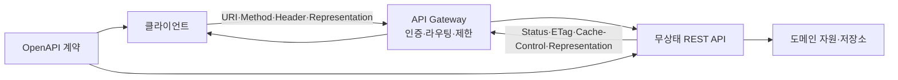
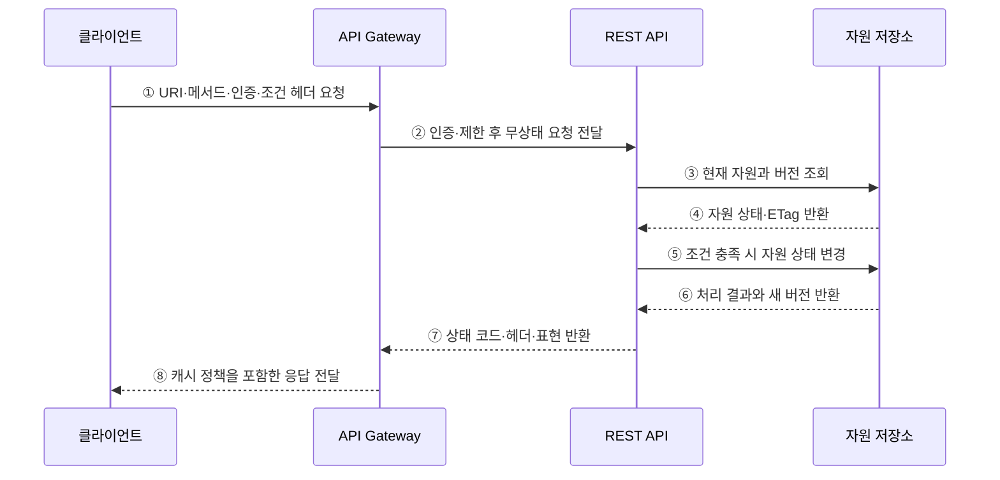

---
sidebar:
  order: 171
  label: "171. RESTful API 설계 원칙 (RESTful API Design)"
  badge:
    text: "기출 · 70%"
    variant: note
title: "RESTful API 설계 원칙 (RESTful API Design)"
date: "2026-07-27T23:59:59+09:00"
tags:
  - "notes-software"
weight: 171
extra:
  question_no: "171"
  source_status: "기출"
  source_history: "122회"
  priority: 70
  priority_note: "자원·메서드·무상태 원칙은 설계 기본축임"
---

## 미리 알고가기

- **표현 상태 전이(Representational State Transfer, REST·레스트)**: 자원·표현·균일 인터페이스·무상태성 등의 제약으로 분산 시스템을 설계하는 아키텍처 스타일
- **응용 프로그래밍 인터페이스(Application Programming Interface, API·에이피아이)**: 응용 간 기능과 데이터를 요청하는 계약 접점
- **통합 자원 식별자(Uniform Resource Identifier, URI·유알아이)**: 조작할 자원을 식별하는 주소
- **하이퍼텍스트 전송 프로토콜(Hypertext Transfer Protocol, HTTP·에이치티티피)**: 메서드·헤더·상태 코드로 웹 요청과 응답을 전달하는 프로토콜
- **표현(Representation)**: 특정 시점의 자원 상태를 JSON·XML 같은 형식으로 나타낸 데이터
- **무상태성(Statelessness)**: 각 요청이 처리에 필요한 클라이언트 문맥을 모두 포함하고 서버가 이전 요청 상태에 의존하지 않는 제약
- **안전성(Safety)**: 요청의 의도가 서버 자원 상태를 변경하지 않는 성질
- **멱등성(Idempotency)**: 같은 요청을 한 번 또는 여러 번 실행해도 서버의 최종 상태가 같은 성질
- **엔티티 태그(Entity Tag, ETag·이태그)**: 자원의 특정 표현 버전을 식별해 조건부 조회·변경에 사용하는 응답 헤더값
- **멱등성 키(Idempotency Key)**: 재전송된 생성 요청을 같은 작업으로 식별해 중복 처리를 막는 키
- **오픈API 명세(OpenAPI Specification, OAS·오픈에이피아이 명세)**: HTTP API의 경로·요청·응답·스키마를 기계 판독 형식으로 기술하는 명세

## Ⅰ. 개요

- RESTful API는 도메인 대상을 **자원으로 식별하고 HTTP의 공통 의미로 상태를 전이**한다.
- URI·메서드·상태 코드·표현 규칙을 일관되게 적용해 클라이언트의 예측 가능성과 상호운용성을 높인다.
- 임의의 동작명과 응답 규칙이 만드는 클라이언트 결합과 재사용 저하를 줄인다.

### 쉽게 이해하기 (학습용)
- 자원에는 주소를 붙이고 조회·생성·변경·삭제는 공통 HTTP 규칙으로 표현함

## Ⅱ. 특징

- **자원 식별**: URI는 동작보다 명사형 자원을 안정적으로 식별한다.
- **균일 인터페이스**: HTTP 메서드·상태 코드·헤더·미디어 타입의 표준 의미를 지킨다.
- **무상태성**: 인증·조건·페이징 등 처리 문맥을 각 요청에 포함한다.
- **캐시 가능성**: 명시적 캐시 헤더와 조건부 요청으로 부하와 지연을 줄인다.
- **계층화**: 클라이언트가 게이트웨이·프록시·원 서버의 내부 구성을 몰라도 같은 인터페이스를 사용한다.
- **자기 서술성**: 요청과 응답만으로 처리 방법과 표현의 의미를 해석할 수 있게 한다.

### 쉽게 이해하기 (학습용)
- 주소·행위·결과·표현의 뜻을 모든 API에서 같게 유지함

## Ⅲ. 아키텍처 및 구성요소

**도표안 A — 구조도**

**도표안 B — sequenceDiagram**

| 구성요소 | 역할 |
|:---|:---|
| 자원 모델 | 도메인 개체·컬렉션·관계와 수명주기 정의 |
| URI | 자원을 안정적이고 계층적인 주소로 식별 |
| HTTP 메서드 | 조회·생성·전체 변경·부분 변경·삭제 의미 표현 |
| 표현·미디어 타입 | 자원 상태의 형식과 스키마 전달 |
| 상태 코드·오류 | 성공·클라이언트 오류·서버 오류를 표준 의미로 전달 |
| 조건부 요청 | ETag와 조건 헤더로 캐시 재검증·동시 수정 충돌 방지 |
| OpenAPI 계약 | 경로·매개변수·요청·응답·보안 규칙 명세 |

**동작 원리**

- ① 클라이언트가 자원 URI·HTTP 메서드·인증 정보·조건 헤더를 한 요청에 담는다.
- ② Gateway가 인증·호출 제한·라우팅을 수행하고 무상태 요청을 API에 전달한다.
- ③ API가 자원 존재 여부와 현재 버전을 저장소에 조회한다.
- ④ 저장소가 자원 상태와 ETag 생성에 사용할 버전을 반환한다.
- ⑤ API는 메서드 의미와 조건 헤더가 충족될 때만 자원 상태를 변경한다.
- ⑥ 저장소가 처리 결과와 변경된 자원 버전을 반환한다.
- ⑦ API는 적절한 상태 코드·ETag·캐시 헤더·자원 표현을 반환한다.
- ⑧ Gateway는 응답 의미를 보존해 클라이언트와 중간 캐시가 올바르게 처리하도록 한다.

### 쉽게 이해하기 (학습용)
- 요청 하나만 보고 대상·행위·조건을 판단해 표준 결과로 돌려줌

## Ⅳ. 종류 및 비교

| 구분 | RPC식 API | RESTful API |
|:---|:---|:---|
| 설계 중심 | 원격 연산·명령 | 자원·표현·상태 전이 |
| 인터페이스 | 연산명과 매개변수 | URI와 균일한 HTTP 의미 |
| 결합 | 업무 동작에 직접 결합 | 공통 인터페이스로 결합 완화 |
| 캐시 | 연산별 별도 설계 | HTTP 캐시 의미 활용 |
| 적합 | 명령 중심 내부 호출·고성능 계약 | 웹 자원 연계·공개 API |
| 한계 | 메서드 난립·클라이언트 결합 | 부정확한 자원 경계·과다·과소 조회 |

| HTTP 메서드 | 주 용도 | 안전성 | 멱등성 |
|:---|:---|:---:|:---:|
| GET | 자원 조회 | O | O |
| POST | 하위 자원 생성·처리 요청 | X | 일반적으로 X |
| PUT | 지정 자원 전체 생성·대체 | X | O |
| PATCH | 자원 부분 변경 | X | 정의에 따라 다름 |
| DELETE | 자원 삭제 | X | O |

### 쉽게 이해하기 (학습용)
- RPC는 동작을 부르고 REST는 자원을 공통 동작으로 다룸

## Ⅴ. 실무 고려사항 및 대책

| 고려사항 | 위험 | 대책 |
|:---|:---|:---|
| 자원 경계 | 동사형 URI·거대 자원·채팅형 API | 도메인 개체와 수명주기로 URI 설계 |
| 메서드 의미 | GET으로 상태 변경·POST 남용 | 안전성·멱등성·캐시 의미 준수 |
| 중복 요청 | 재시도로 주문·결제 중복 생성 | 멱등성 키와 처리 결과 보존 |
| 동시 수정 | 마지막 쓰기가 이전 변경 덮어씀 | ETag와 `If-Match` 조건부 갱신 |
| 오류 일관성 | 상태 코드와 본문 의미 불일치 | 오류 코드·메시지·상세 스키마 표준화 |
| 대량 조회 | 과다 응답·느린 쿼리 | 필터·정렬·커서 페이징·필드 선택 |
| 변경 호환성 | 필드 삭제·의미 변경으로 클라이언트 장애 | 추가 중심 변경·폐기 공지·계약 테스트 |
| 보안 | 객체 식별자 변경으로 타인 자원 접근 | 자원 단위 권한 확인·입력 검증·호출 제한 |

### 쉽게 이해하기 (학습용)
- 사례: 주문 생성 재시도에는 같은 멱등성 키를 보내 중복 결제를 막음

## Ⅵ. 결론

- RESTful API의 핵심은 **자원을 명확히 식별하고 HTTP의 균일한 의미를 일관되게 적용**하는 것이다.
- 무상태성·캐시·조건부 요청·멱등성은 확장성과 재시도 안전성을 좌우한다.
- OpenAPI 계약과 호환성·오류·보안 정책을 함께 관리해야 예측 가능한 API가 된다.

### 쉽게 이해하기 (학습용)
- 주소·행위·조건·결과의 공통 규칙을 지켜야 클라이언트가 안전하게 재사용함
