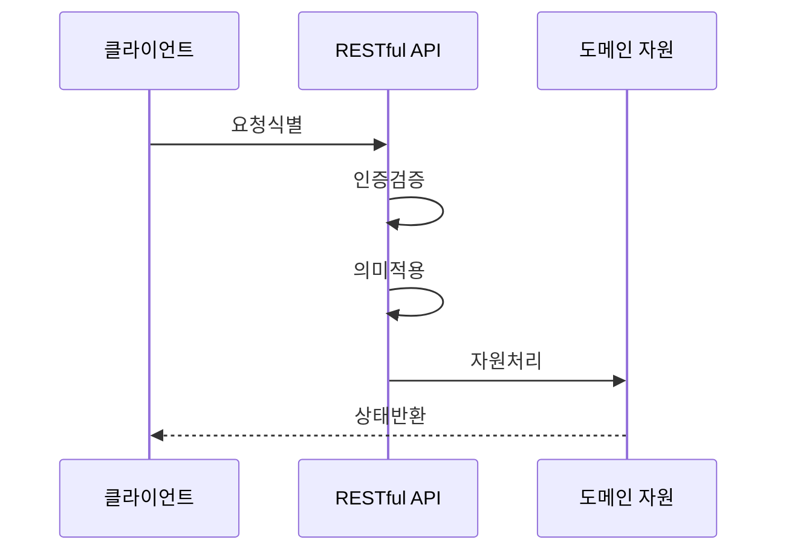

---
sidebar:
  order: 171
  label: "171. RESTful API 설계 원칙 (RESTful API Design)"
  badge:
    text: "기출 · 70%"
    variant: note
title: "RESTful API 설계 원칙 (RESTful API Design)"
date: "2026-07-25T00:40:00+09:00"
tags:
  - "notes-software"
weight: 171
extra:
  question_no: "171"
  source_status: "기출"
  source_history: "122회"
  priority: 70
  priority_note: "자원·메서드·무상태 원칙은 설계 기본축임"
---

## 미리 알고가기

- **표현 상태 전이(Representational State Transfer, REST)**: 웹 자원의 상태를 전송하는 아키텍처 스타일임
- **통합 자원 식별자(Uniform Resource Identifier, URI)**: 조작할 대상 자원의 고유 주소를 식별함
- **하이퍼텍스트 전송 프로토콜(HyperText Transfer Protocol, HTTP)**: 자원에 수행할 표준 행위와 결과를 전달함
- **무상태(Stateless)**: 각 요청이 처리에 필요한 모든 클라이언트 문맥을 포함함
- **엔티티 태그(Entity Tag, ETag)**: 자원의 특정 버전을 식별해 조건부 갱신을 제어함
- **오픈API 명세(OpenAPI Specification, OAS)**: API 계약을 기계 판독 형식으로 정의함
- **미디어 타입·상태 코드**: 미디어 타입은 표현 형식이고 상태 코드는 처리 결과 번호임
- **안전성·멱등성**: 안전성은 상태를 바꾸지 않고 멱등성은 반복 실행 결과가 같음을 뜻함
- **멱등성 키**: 같은 생성 요청의 중복 처리를 식별하는 고유값임
- **원격 프로시저 호출 RPC(알피씨, Remote Procedure Call)**: 영어 세 낱말의 첫 글자를 쓴 표기로 원격 시스템의 함수나 절차를 호출하며 REST의 자원 중심 설계와 비교하는 연계 방식임

## Ⅰ. 개요

- **정의/개념**: 자원을 식별하고 균일한 형태로 상태 전송
- **배경/필요성**: 서비스별 API 차이로 균일 인터페이스 필요

### 쉽게 이해하기 (학습용)
- 자원에 주소를 붙이고 공통 표준 규칙으로 조작함

## Ⅱ. 특징

- URI로 자원을 식별하고 메서드로 행위를 구분한다.
- 요청마다 문맥을 포함해 무상태를 유지한다.
- 표준 상태 코드로 성공과 오류를 반환한다.
- 표현 형식을 협상하고 ETag로 갱신을 제어한다.
- 링크로 클라이언트의 다음 상태를 안내한다.
- 선택 필드는 추가하되 파괴적 변경은 피한다.

### 쉽게 이해하기 (학습용)
- 주소와 동작 및 결과 코드를 일관된 규격으로 응답

## Ⅲ. 아키텍처 및 구성요소

| 설계 요소 | 설명 |
|:---|:---|
| 자원 식별 | URI로 도메인 고유 주소를 부여함 |
| 행위 메서드 | HTTP 메서드로 동작을 정의함 |
| 표현 협상 | 미디어 타입으로 형식을 합의함 |
| 상태 코드 | 규격화된 처리 결과를 반환함 |
| 무상태 문맥 | 처리 문맥을 요청에 포함함 |

> 요약: 자원 식별과 무상태 균일 인터페이스를 제공

### 쉽게 이해하기 (학습용)
- 주소와 동작 및 결과 표지를 단일한 규격으로 맞춤

## Ⅳ. 원리 및 절차 흐름도

| 절차 | 설명 |
|:---|:---|
| 요청식별 | URI와 메서드로 대상을 판별함 |
| 인증검증 | 호출 권한과 ETag 조건을 확인함 |
| 의미적용 | 안전성과 멱등성을 판단함 |
| 자원처리 | 트랜잭션 규칙에 따라 수행함 |
| 상태반환 | 상태 코드와 응답 표현을 전달함 |
> 요약: 요청 규격을 검증하고 상태 처리 후 결과를 전달함

### 쉽게 이해하기 (학습용)
- 주소와 동작을 확인 후 처리 결과를 표준으로 돌려줌

## Ⅴ. 종류 및 비교

| 비교축 | RPC식 API | RESTful API |
|:---|:---|:---|
| 핵심 특징 | URI에 연산명과 명령 노출 | URI로 자원 식별 후 메서드 행위 |
| 적용 기준 | 결합도가 높은 내부 시스템 | 캐싱 최적화 공개망 서비스 |
| 주요 위험 | 메서드 난립·클라이언트 결합 | 자원 경계 오류·과소·과다 조회 |

> 요약: 자원 식별과 균일 인터페이스로 느슨하게 결합함

### 쉽게 이해하기 (학습용)
- 명사를 주소로 쓰고 동사를 규칙으로 삼아 응답함

## Ⅵ. 실무 사례

1. 주문 생성은 멱등성 키로 중복 결제 방지
2. 상품 목록은 ETag 재검증으로 지연을 줄임

### 쉽게 이해하기 (학습용)
- 주문 생성은 같은 키의 재요청을 한 번만 처리함
- 상품 목록은 변경되지 않으면 캐시를 재사용함

## Ⅶ. 결론

- 자원 경계를 정하고 멱등성과 오류 응답을 검증함

### 쉽게 이해하기 (학습용)
- 주소·행위·결과가 일관돼야 재호출도 안전함
