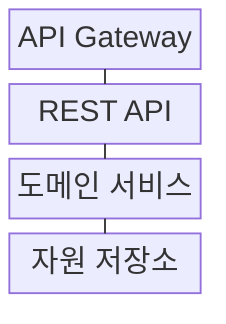
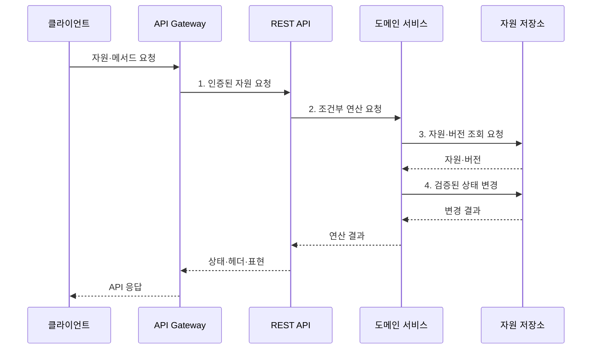

---
sidebar:
  order: 171
  label: "171. RESTful API 설계 원칙 (RESTful API Design)"
  badge:
    text: "기출 · 70%"
    variant: note
title: "RESTful API 설계 원칙 (RESTful API Design)"
date: "2026-07-31T10:42:28+09:00"
tags:
  - "notes-software"
weight: 171
extra:
  question_no: "171"
  source_status: "기출"
  source_history: "122회"
  priority: 70
  priority_note: "자원·메서드·무상태 설계 원칙 출제"
---

## 미리 알고가기

- **표현 상태 전이(Representational State Transfer, REST)**: 자원·표현·균일 인터페이스·무상태성 제약으로 분산 시스템을 설계하는 스타일
- **응용 프로그래밍 인터페이스(Application Programming Interface, API)**: 응용 간 기능과 데이터를 요청하는 계약 접점
- **통합 자원 식별자(Uniform Resource Identifier, URI)**: 조작할 자원을 식별하는 주소
- **하이퍼텍스트 전송 프로토콜(Hypertext Transfer Protocol, HTTP)**: 메서드·헤더·상태 코드로 웹 요청과 응답을 전달하는 프로토콜
- **표현(Representation)**: 특정 시점의 자원 상태를 JSON·XML 같은 형식으로 나타낸 데이터
- **무상태성(Statelessness)**: 각 요청이 처리 문맥을 모두 포함하고 서버가 이전 요청 상태에 의존하지 않는 제약
- **안전성(Safety)**: 요청 의도가 서버 자원 상태를 변경하지 않는 성질
- **멱등성(Idempotency)**: 같은 요청을 여러 번 실행해도 서버의 최종 상태가 같은 성질
- **엔티티 태그(Entity Tag, ETag)**: 자원의 표현 버전을 식별해 조건부 조회·변경에 사용하는 값
- **멱등성 키(Idempotency Key)**: 재전송된 생성 요청을 같은 작업으로 식별해 중복 처리를 막는 키
- **OpenAPI 명세**: HTTP API의 경로·요청·응답·스키마를 기계 판독 형식으로 기술하는 명세
- **응용 프로그래밍 인터페이스 게이트웨이(API Gateway)**: 인증·호출 제한·라우팅을 맡는 API 진입점
- **원격 프로시저 호출(Remote Procedure Call, RPC)**: 원격 서비스의 연산을 지역 함수처럼 호출하는 방식
- **커서 페이징(Cursor Pagination)**: 마지막으로 읽은 항목의 위치를 기준으로 다음 목록을 조회하는 방식

## Ⅰ. 개요

- 정의/개념: 자원 식별과 **HTTP 균일 인터페이스** 기반 API
- 배경/필요성: 동작명 중심 개별 규칙으로는 **클라이언트 결합·응답 편차 증가**

### 쉽게 이해하기 (학습용)

- 주문이라는 대상에 주소를 붙이고 조회·생성·변경·삭제를 공통 HTTP 의미로 표현하면 새 클라이언트도 같은 규칙으로 결과를 예측할 수 있다.

## Ⅱ. 특징

- **명사형 URI·표현** 기반 자원 모델
- **메서드·상태·헤더** 기반 균일 인터페이스
- **무상태·캐시·계층화** 기반 웹 확장

### 쉽게 이해하기 (학습용)

- `/createOrder`처럼 동작마다 새 규칙을 만들지 않고 `/orders` 자원과 POST를 조합해 주소와 행위의 뜻을 API 전체에서 유지한다.

## Ⅲ. 구조 및 구성요소

| 구성요소 | 책임 |
|:---|:---|
| API Gateway | 인증·호출 제한·**라우팅** |
| REST API | URI·메서드·표현·**조건부 요청 해석** |
| 도메인 서비스 | 자원 **조회·생성·변경·삭제** |
| 자원 저장소 | 자원 상태·**표현 버전 보관** |

### 쉽게 이해하기 (학습용)

- 자원 모델이 상품 목록을 정하고 HTTP 인터페이스가 공통 조작법을 제공하며 조건부 요청은 같은 상품을 동시에 고칠 때 덮어쓰기를 막는다.

## Ⅳ. 흐름도

**동작 원리**

1. **인증된 자원 요청**: 호출 제한 후 URI·메서드·조건 전달
2. **조건부 연산 요청**: 메서드 의미와 ETag 조건 해석
3. **자원·버전 조회 요청**: 존재 여부와 현재 표현 버전 확인
4. **검증된 상태 변경**: 버전 일치 시에만 자원 갱신

### 쉽게 이해하기 (학습용)

- 클라이언트가 알고 있던 ETag를 함께 보내면 서버는 현재 버전과 같을 때만 수정해 다른 사용자의 최신 변경을 덮지 않는다.

## Ⅴ. 종류 및 비교

| API 설계 방식 | RPC식 API | RESTful API |
|:---|:---|:---|
| 적용 기준 | 명령 중심·**내부 연산 호출** | 웹 자원·**공개 연계** |
| 핵심 특징 | 연산명·매개변수 **직접 계약** | URI·HTTP **균일 인터페이스** |
| 한계 | 메서드 난립·**강한 동작 결합** | 자원 경계·**과다 조회 문제** |

### 쉽게 이해하기 (학습용)

- RPC는 `approveOrder` 같은 업무 명령을 직접 부르고 REST는 주문 자원의 상태 표현을 공통 HTTP 규칙으로 바꾼다.

## Ⅵ. 실무 고려사항 및 대책

| 고려사항 | 대책 | 효과 |
|:---|:---|:---|
| 동사형 URI·**거대 자원** | 도메인 개체·**수명주기 기반 분할** | 명확한 **자원 경계** |
| POST 재시도의 **중복 생성** | 멱등성 키·**처리 결과 보존** | **중복 주문·결제 방지** |
| 동시 수정의 **최신값 덮어쓰기** | ETag·**조건부 갱신 적용** | **변경 충돌 탐지** |
| 대량 목록의 **응답 지연** | 필터·정렬·**커서 페이징** | **전송·조회 부하** 감소 |
| 필드 삭제의 **호환성 파괴** | 추가 중심 변경·**OpenAPI 계약 시험** | 기존 **소비자 보호** |

### 쉽게 이해하기 (학습용)

- 결제 생성 요청이 시간 초과로 다시 도착해도 같은 멱등성 키의 기존 결과를 반환하면 실제 결제는 한 번만 남는다.

## Ⅶ. 결론

- **자원 수명·재시도·캐시**로 URI·메서드·조건부 요청 결정

### 쉽게 이해하기 (학습용)

- 자원 주소와 HTTP 의미를 일관되게 적용하고 생성에는 멱등성 키, 수정에는 ETag를 사용해 재전송과 동시 변경을 안전하게 처리해야 한다.
