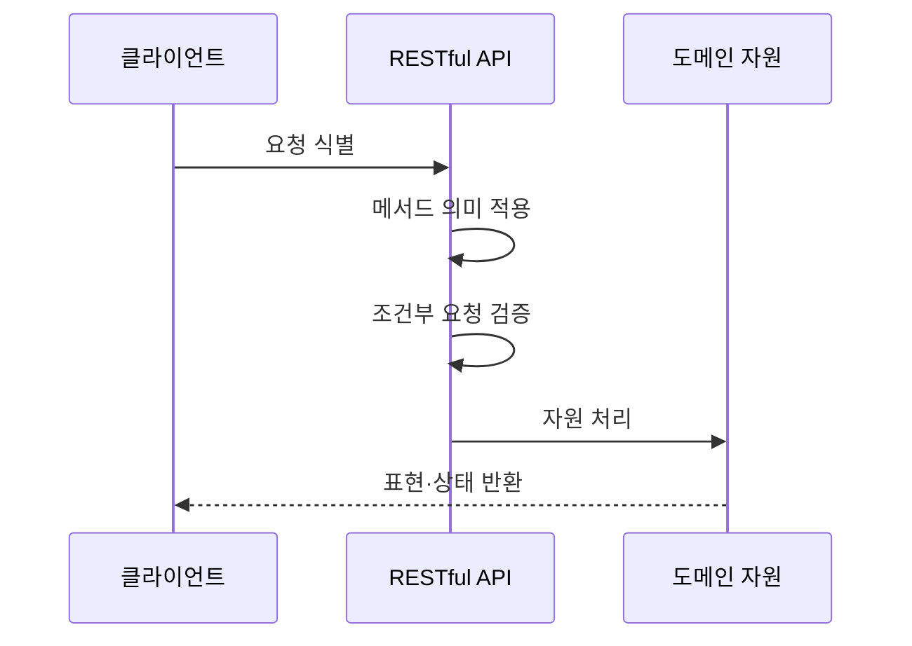

---
sidebar:
  order: 171
  label: "171. RESTful API 설계 원칙 (RESTful API Design)"
  badge:
    text: "기출 · 70%"
    variant: note
title: "RESTful API 설계 원칙 (RESTful API Design)"
date: "2026-07-27T23:59:59+09:00"
tags:
  - "notes-software"
weight: 171
extra:
  question_no: "171"
  source_status: "기출"
  source_history: "122회"
  priority: 70
  priority_note: "자원·메서드·무상태 원칙은 설계 기본축임"
---

## 미리 알고가기

- **표현 상태 전이(Representational State Transfer, REST)**: ‘레스트’로 읽고 영문 첫 글자를 딴 약어이며, 자원 표현과 상태 전이 제약으로 웹 인터페이스를 설계하는 아키텍처 스타일
- **통합 자원 식별자(Uniform Resource Identifier, URI)**: ‘유알아이’로 읽고 영문 첫 글자를 딴 약어이며, 조작할 자원을 식별하는 주소
- **하이퍼텍스트 전송 프로토콜(HyperText Transfer Protocol, HTTP)**: ‘에이치티티피’로 읽고 영문 첫 글자를 딴 약어이며, 자원 요청·응답을 전달하는 웹 통신 규약
- **무상태(Stateless)**: 각 요청이 처리에 필요한 모든 클라이언트 문맥을 포함함
- **엔티티 태그(Entity Tag, ETag)**: ‘이태그’로 읽고 Entity의 E와 Tag를 결합한 표기이며, 자원 버전을 식별해 조건부 조회·갱신을 제어
- **오픈API 명세(OpenAPI Specification, OAS)**: ‘오에이에스’로 읽고 영문 첫 글자를 딴 약어이며, API 계약을 기계 판독 형식으로 정의하는 명세
- **응용 프로그래밍 인터페이스(Application Programming Interface, API)**: ‘에이피아이’로 읽고 영문 첫 글자를 딴 약어이며, 응용 간 기능·데이터를 요청하는 계약 접점
- **미디어 타입·상태 코드**: 미디어 타입은 표현 형식이고 상태 코드는 처리 결과 번호임
- **안전성·멱등성**: 안전성은 상태를 바꾸지 않고 멱등성은 반복 실행 결과가 같음을 뜻함
- **멱등성 키**: 같은 생성 요청의 중복 처리를 식별하는 고유값임
- **원격 프로시저 호출 RPC(알피씨, Remote Procedure Call)**: 영어 세 낱말의 첫 글자를 쓴 표기로 원격 시스템의 함수나 절차를 호출하며 REST의 자원 중심 설계와 비교하는 연계 방식임

## Ⅰ. 개요

- **정의/개념**: 자원 중심 **무상태·균일 인터페이스** 설계
- **기존 한계**: 임의 API 규칙은 **클라이언트 결합·재사용 저하**

### 쉽게 이해하기 (학습용)
- 자원에 주소를 붙이고 공통 표준 규칙으로 조작함

## Ⅱ. 특징

- **URI 자원·HTTP 메서드**로 균일 인터페이스 구성
- 요청별 **완전한 문맥**으로 무상태 유지
- **표현·상태 코드·캐시·조건부 요청** 표준 활용

### 쉽게 이해하기 (학습용)
- 주소와 동작 및 결과 코드를 일관된 규격으로 응답

## Ⅲ. 아키텍처 및 구성요소

| 설계 요소 | 설명 |
|:---|:---|
| 자원 식별 | URI로 **도메인 자원 주소** 부여 |
| 행위 메서드 | HTTP 메서드로 **표준 의미** 적용 |
| 표현 협상 | 미디어 타입으로 **표현 형식** 합의 |
| 상태 코드 | 표준 **성공·오류 결과** 반환 |
| 무상태 문맥 | 처리에 필요한 **전체 문맥** 포함 |

> 요약: 자원 식별과 무상태 균일 인터페이스를 제공

### 쉽게 이해하기 (학습용)
- 주소와 동작 및 결과 표지를 단일한 규격으로 맞춤

## Ⅳ. 원리 및 절차 흐름도

| 절차 | 설명 |
|:---|:---|
| 요청 식별 | URI와 메서드로 **대상·행위** 판별 |
| 메서드 의미 적용 | **안전성·멱등성·캐시** 정책 적용 |
| 조건부 요청 검증 | ETag로 **조회·갱신 조건** 확인 |
| 자원 처리 | 도메인·트랜잭션 **규칙 수행** |
| 표현·상태 반환 | 미디어 타입과 **상태 코드** 전달 |
> 요약: 요청 규격을 검증하고 상태 처리 후 결과를 전달함

### 쉽게 이해하기 (학습용)
- 주소와 동작을 확인 후 처리 결과를 표준으로 돌려줌

## Ⅴ. 종류 및 비교

| API 설계 방식 | RPC식 API | RESTful API |
|:---|:---|:---|
| 적용 기준 | 명령 중심 **내부 기능 호출** | 웹 표준·캐시의 **자원 연계** |
| 핵심 특징 | **연산명·매개변수** 호출 | **URI 자원·HTTP 메서드** |
| 한계 | 메서드 난립·**클라이언트 결합** | 자원 경계 오류·**과다 조회** |

> 요약: 자원 식별과 균일 인터페이스로 느슨하게 결합함

### 쉽게 이해하기 (학습용)
- 명사를 주소로 쓰고 동사를 규칙으로 삼아 응답함

## Ⅵ. 실무 사례

1. 주문 생성은 **멱등성 키**로 중복 결제 방지
2. 상품 목록은 **ETag 재검증**으로 캐시 재사용

### 쉽게 이해하기 (학습용)
- 주문 생성은 같은 키의 재요청을 한 번만 처리함
- 상품 목록은 변경되지 않으면 캐시를 재사용함

## Ⅶ. 결론

- 자원 연계는 **REST**, 명령 중심 호출은 **RPC**

### 쉽게 이해하기 (학습용)
- 주소·행위·결과가 일관돼야 재호출도 안전함
