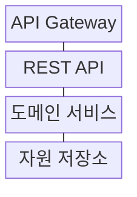
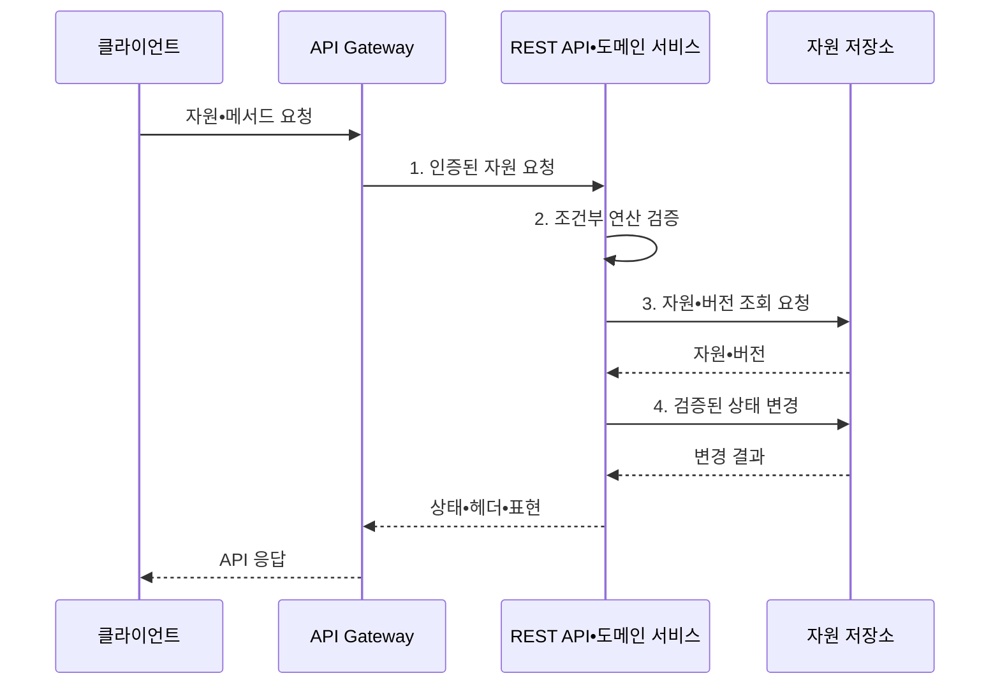

---
sidebar:
  order: 171
  label: "171. RESTful API 설계 원칙 (RESTful API Design)"
  badge:
    text: "기출 • 70%"
    variant: note
title: "RESTful API 설계 원칙 (RESTful API Design)"
date: "2026-08-03T08:48:47+09:00"
tags:
  - "notes-software"
weight: 171
extra:
  question_no: "171"
  source_status: "기출"
  source_history: "122회"
  priority: 70
  priority_note: "자원•메서드•무상태 설계 원칙 출제"
---

## Ⅰ. 개요

핵심 용어

- **HTTP 균일 인터페이스**: RESTful API는 자원을 URI로 식별하고 HTTP 메서드•상태•헤더의 일관된 의미로 조작한다.
- **표현 상태 전이(Representational State Transfer, REST) 응용 프로그래밍 인터페이스(Application Programming Interface, API)**: 자원을 통합 자원 식별자로 식별하고 하이퍼텍스트 전송 프로토콜의 균일 인터페이스로 조작하는 웹 API 설계 방식이다.

- 정의/개념: 자원을 통합 자원 식별자(Uniform Resource Identifier, URI)로 식별하고 하이퍼텍스트 전송 프로토콜(Hypertext Transfer Protocol, HTTP) 메서드•상태•표현을 균일하게 적용하는 **RESTful API** 설계 방식
- 배경/필요성: 동작명 중심 개별 규칙으로는 **클라이언트 결합•응답 편차 증가**

#### 한줄 요약

- 주문이라는 대상에 주소를 붙이고 조회•생성•변경•삭제를 공통 HTTP 의미로 표현하면 새 클라이언트도 같은 규칙으로 결과를 예측할 수 있다.

## Ⅱ. 특징

핵심 용어

- **명사형 URI•표현**: 명사형 URI는 자원을 식별하고 표현은 특정 시점의 자원 상태를 JSON이나 XML 같은 형식으로 전달한다.
- **통합 자원 식별자(Uniform Resource Identifier, URI)**: 웹에서 자원을 고유하게 식별하는 주소 형식이다.
- **자바스크립트 객체 표기법(JavaScript Object Notation, JSON)•확장 가능 마크업 언어(Extensible Markup Language, XML)**: 자원 상태 표현을 전달하는 대표적인 데이터 형식이다.
- **무상태•캐시•계층화**: 서버 세션 의존을 줄이고 응답 재사용과 중간 계층을 허용해 웹 확장성을 높이는 제약이다.

- **명사형 URI•표현** 기반 자원 모델
- **메서드•상태•헤더** 기반 균일 인터페이스
- **무상태•캐시•계층화** 기반 웹 확장

#### 한줄 요약

- `/createOrder`처럼 동작마다 새 규칙을 만들지 않고 `/orders` 자원과 POST를 조합해 주소와 행위의 뜻을 API 전체에서 유지한다.

## Ⅲ. 구조 및 구성요소

핵심 용어

- **REST API**: REST API는 URI, 메서드, 표현과 조건부 요청을 해석해 도메인 서비스의 자원 연산으로 연결한다.
- **응용 프로그래밍 인터페이스 게이트웨이(Application Programming Interface Gateway, API Gateway)**: 인증•호출 제한•라우팅을 통합 수행하는 진입 구성요소이다.
- **표현 상태 전이 응용 프로그래밍 인터페이스(Representational State Transfer Application Programming Interface, REST API)**: 자원 식별자•메서드•표현•조건부 요청을 도메인 연산으로 연결하는 구성요소이다.
- **도메인 서비스**: 업무 규칙에 따라 자원 조회•생성•변경•삭제를 수행하는 구성요소이다.
- **자원 저장소**: 자원 상태와 동시성 검증용 표현 버전을 보존하는 구성요소이다.

| 구성요소 | 책임 |
|:---|:---|
| API Gateway | 인증•호출 제한•**라우팅** |
| REST API | URI•메서드•표현•**조건부 요청 해석** |
| 도메인 서비스 | 자원 **조회•생성•변경•삭제** |
| 자원 저장소 | 자원 상태•**표현 버전 보관** |

#### 한줄 요약

- 자원 모델이 상품 목록을 정하고 HTTP 인터페이스가 공통 조작법을 제공하며 조건부 요청은 같은 상품을 동시에 고칠 때 덮어쓰기를 막는다.

## Ⅳ. 흐름도

핵심 용어

- **2. 조건부 연산 요청**: REST API는 HTTP 메서드 의미와 ETag 조건을 해석해 도메인 서비스에 조건부 연산을 요청한다.
- **엔터티 태그(Entity Tag, ETag)**: 자원 표현의 특정 버전을 식별해 조건부 요청과 캐시 검증에 사용하는 응답 헤더값이다.
- **1. 인증된 자원 요청**: 게이트웨이가 인증•호출 제한 후 자원 식별자•메서드•조건을 전달하는 단계이다.
- **3. 자원•버전 조회 요청**: 자원 존재 여부와 현재 표현 버전을 저장소에서 확인하는 단계이다.
- **4. 검증된 상태 변경**: 클라이언트 조건과 현재 버전이 일치할 때만 자원을 갱신하는 단계이다.

**동작 원리**

1. **인증된 자원 요청**: 호출 제한 후 URI•메서드•조건 전달
2. **조건부 연산 요청**: 메서드 의미와 ETag 조건 해석
3. **자원•버전 조회 요청**: 존재 여부와 현재 표현 버전 확인
4. **검증된 상태 변경**: 버전 일치 시에만 자원 갱신

#### 한줄 요약

- 클라이언트가 알고 있던 ETag를 함께 보내면 서버는 현재 버전과 같을 때만 수정해 다른 사용자의 최신 변경을 덮지 않는다.

## Ⅴ. 종류 및 비교

핵심 용어

- **RESTful API**: RESTful API는 URI와 HTTP 균일 인터페이스를 사용해 웹 자원을 공개하고 연계하는 데 적합하다.
- **원격 프로시저 호출(Remote Procedure Call, RPC)식 API**: 연산명과 매개변수를 직접 계약해 원격 업무 명령을 호출하는 방식이다.
- **RESTful API**: 통합 자원 식별자와 하이퍼텍스트 전송 프로토콜 균일 인터페이스로 웹 자원을 공개하는 방식이다.

| API 설계 방식 | RPC식 API | RESTful API |
|:---|:---|:---|
| 적용 기준 | 명령 중심•**내부 연산 호출** | 웹 자원•**공개 연계** |
| 핵심 특징 | 연산명•매개변수 **직접 계약** | URI•HTTP **균일 인터페이스** |
| 한계 | 메서드 난립•**강한 동작 결합** | 자원 경계•**과다 조회 문제** |

#### 한줄 요약

- RPC는 `approveOrder` 같은 업무 명령을 직접 부르고 REST는 주문 자원의 상태 표현을 공통 HTTP 규칙으로 바꾼다.

## Ⅵ. 실무 고려사항 및 대책

핵심 용어

- **최신값 덮어쓰기**: 최신값 덮어쓰기는 동시에 수정할 때 이전 표현을 기준으로 한 요청이 다른 사용자의 최신 변경을 지우는 문제다.
- **멱등성 키(Idempotency Key)**: 재시도된 생성 요청을 같은 업무 요청으로 식별해 중복 효과를 막는 고유값이다.
- **커서 페이징(Cursor Pagination)**: 마지막 조회 위치를 나타내는 커서를 기준으로 다음 목록 구간을 조회하는 방식이다.
- **오픈API(OpenAPI) 계약 시험**: API 명세와 실제 구현의 요청•응답 호환성을 자동 검증하는 시험이다.

| 문제 | 대책 | 효과 |
|:---|:---|:---|
| 동사형 URI•**거대 자원** | 도메인 개체•**수명주기 기반 분할** | 명확한 **자원 경계** |
| POST 재시도의 **중복 생성** | 멱등성 키•**처리 결과 보존** | **중복 주문•결제 방지** |
| 동시 수정의 **최신값 덮어쓰기** | ETag•**조건부 갱신 적용** | **변경 충돌 탐지** |
| 대량 목록의 **응답 지연** | 필터•정렬•**커서 페이징** | **전송•조회 부하** 감소 |
| 필드 삭제의 **호환성 파괴** | 추가 중심 변경•**OpenAPI 계약 시험** | 기존 **소비자 보호** |

#### 한줄 요약

- 결제 생성 요청이 시간 초과로 다시 도착해도 같은 멱등성 키의 기존 결과를 반환하면 실제 결제는 한 번만 남는다.

## Ⅶ. 결론

핵심 용어

- **자원 수명•재시도•캐시**: URI, 메서드, 조건부 요청은 자원의 수명주기, 요청 재시도, 캐시 요구를 기준으로 설계해야 한다.

- **자원 수명•재시도•캐시** 로 URI•메서드•조건부 요청 결정

#### 한줄 요약

- 자원 주소와 HTTP 의미를 일관되게 적용하고 생성에는 멱등성 키, 수정에는 ETag를 사용해 재전송과 동시 변경을 안전하게 처리해야 한다.
