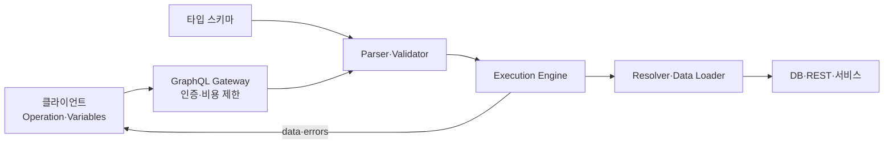
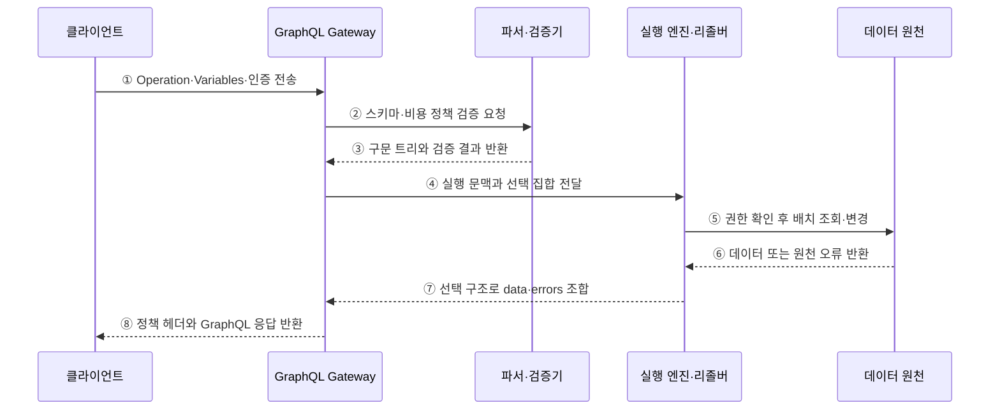

---
sidebar:
  order: 172
  label: "172. GraphQL (GraphQL)"
  badge:
    text: "미출제 · 50%"
    variant: note
title: "GraphQL (GraphQL)"
date: "2026-07-25T00:30:00+09:00"
tags:
  - "notes-software"
weight: 172
extra:
  question_no: "172"
  source_status: "미출제"
  source_history: ""
  priority: 50
  priority_note: "스키마·질의 비용·필드 권한이 독립 비교축임"
---

## 미리 알고가기

- **그래프큐엘(GraphQL)**: 타입 시스템으로 API 계약을 정의하고 클라이언트가 필요한 필드 구조를 요청하는 질의 언어와 실행 명세
- **타입 스키마(Type Schema)**: 객체·필드·인자·반환 타입·널 가능성과 진입점을 정의하는 API 계약
- **작업(Operation)**: GraphQL 요청 단위로 조회(Query)·변경(Mutation)·구독(Subscription)으로 구분
- **선택 집합(Selection Set)**: 응답에서 받을 필드와 하위 필드의 구조를 지정한 부분
- **리졸버(Resolver)**: 스키마의 필드값을 조회·계산·변경하는 실행 함수
- **파싱·검증(Parsing·Validation)**: 질의를 구문 트리로 바꾸고 스키마의 필드·타입·인자 규칙에 맞는지 검사하는 단계
- **내성(Introspection)**: 실행 중인 스키마의 타입과 필드 정보를 질의하는 기능
- **N+1 조회 문제**: 상위 객체 한 번을 조회한 뒤 각 결과마다 하위 데이터를 다시 조회해 호출 수가 급증하는 현상
- **데이터 로더(Data Loader)**: 같은 실행 주기의 조회 키를 모아 일괄 조회하고 결과를 재사용하는 구성
- **부분 오류(Partial Error)**: 일부 필드 실행이 실패해도 가능한 데이터와 필드별 오류를 함께 반환하는 처리
- **영속 질의(Persisted Query)**: 서버에 등록한 질의를 식별자로 호출해 임의 질의와 전송량을 줄이는 방식

## Ⅰ. 개요

- GraphQL은 스키마를 계약으로 삼아 클라이언트가 **필요한 응답 필드와 관계 구조를 직접 선택**한다.
- 화면마다 다른 데이터 요구에서 REST의 과다 응답과 반복 호출을 줄일 수 있다.
- 단일 Endpoint가 임의로 싼 API를 뜻하지 않으며, 질의 비용·권한·캐시를 별도로 통제해야 한다.

### 쉽게 이해하기 (학습용)
- 정해진 메뉴에서 필요한 항목과 하위 항목만 골라 한 번에 요청함

## Ⅱ. 특징

- **강한 타입 계약**: 스키마가 필드·인자·반환 타입·널 가능성을 명시한다.
- **선택형 응답**: 클라이언트가 선택 집합으로 필요한 데이터 모양을 지정한다.
- **계층 실행**: 리졸버가 필드 관계를 따라 여러 데이터 원천의 결과를 조합한다.
- **단일 오류 구조**: 데이터와 필드별 오류를 함께 반환해 부분 성공을 표현한다.
- **점진 진화**: 필드를 추가하고 폐기 표식과 사용량 관찰을 거쳐 제거한다.
- **도구 자동화**: 내성 정보로 문서·탐색기·코드 생성·계약 검증을 지원한다.

### 쉽게 이해하기 (학습용)
- 스키마가 주문 가능 항목을 정하고 클라이언트가 받을 모양을 고름

## Ⅲ. 아키텍처 및 구성요소

**도표안 A — 구조도**

**도표안 B — sequenceDiagram**

| 구성요소 | 역할 |
|:---|:---|
| 타입 스키마 | 타입·필드·인자·널 가능성·진입점 정의 |
| Operation·Variables | 실행 종류·선택 필드·입력값 지정 |
| Gateway | 인증·호출 제한·영속 질의·복잡도 정책 적용 |
| 파서·검증기 | 구문 트리 생성과 스키마 규칙 검사 |
| 실행 엔진 | 선택 집합 순회·리졸버 호출·널·오류 전파 |
| Resolver·Data Loader | 필드 권한 확인과 데이터 조회·배치·캐시 |
| 응답 | 요청한 구조의 `data`와 필드 경로별 `errors` 반환 |

**동작 원리**

- ① 클라이언트가 작업 문서·변수·인증 문맥을 GraphQL Gateway에 보낸다.
- ② Gateway가 파서·검증기에 스키마 일치와 깊이·복잡도 제한 검사를 요청한다.
- ③ 파서·검증기는 실행 가능한 구문 트리 또는 요청 오류를 반환한다.
- ④ 검증을 통과하면 Gateway가 사용자 문맥과 선택 집합을 실행 엔진에 전달한다.
- ⑤ 실행 엔진은 필드 권한을 확인하고 Data Loader로 중복 키를 묶어 데이터 원천을 호출한다.
- ⑥ 데이터 원천은 값이나 조회·변경 오류를 반환한다.
- ⑦ 실행 엔진은 선택 집합 형태로 값을 조합하고 널 규칙에 따라 오류를 전파한다.
- ⑧ Gateway는 `data`와 `errors`를 포함한 응답을 클라이언트에 반환한다.

### 쉽게 이해하기 (학습용)
- 요청 필드를 스키마와 비용 한도에 대조한 뒤 담당 리졸버의 결과를 같은 모양으로 조립함

## Ⅳ. 종류 및 비교

| 비교 항목 | GraphQL API | REST API |
|:---|:---|:---|
| 인터페이스 | 타입 스키마와 Operation | 자원 URI와 HTTP 메서드 |
| 응답 범위 | 클라이언트가 필드 선택 | 서버가 자원 표현 정의 |
| 연관 데이터 | 중첩 선택으로 한 요청에 조합 | 여러 자원 호출 또는 포함 규칙 |
| 버전 진화 | 필드 추가·폐기 중심 | 호환 변경·URI·미디어 타입 버전 |
| 캐시 | 질의·변수·사용자 문맥 기반 별도 설계 | HTTP 자원 캐시 활용 용이 |
| 오류 | 필드별 부분 오류 가능 | 요청 단위 상태 코드·오류 표현 |
| 주요 위험 | 복잡도 폭증·N+1·필드 권한 누락 | 과다·과소 응답·호출 증가 |

| Operation | 의미 | 실행 특성 |
|:---|:---|:---|
| Query | 데이터 조회 | 독립 필드를 병렬 실행할 수 있음 |
| Mutation | 데이터 생성·수정·삭제 | 최상위 필드를 순차 실행 |
| Subscription | 사건 결과 지속 수신 | 연결·재개·팬아웃 관리 필요 |

### 쉽게 이해하기 (학습용)
- GraphQL은 필요한 필드를 고르고 REST는 서버가 정한 자원 표현을 받음

## Ⅴ. 실무 고려사항 및 대책

| 고려사항 | 위험 | 대책 |
|:---|:---|:---|
| 질의 비용 | 깊은 중첩·대형 목록으로 CPU·DB 폭증 | 깊이·노드 수·가중 복잡도·페이지 크기 제한 |
| N+1 조회 | 필드마다 데이터 원천 반복 호출 | 요청 범위 Data Loader로 배치·캐시 |
| 필드 권한 | 객체 접근 후 민감 필드 노출 | 리졸버·도메인 계층에서 객체·필드 권한 확인 |
| 캐시 | 단일 Endpoint와 사용자별 응답으로 적중률 저하 | 영속 질의·정규화 클라이언트 캐시·응답 캐시 |
| 부분 오류 | HTTP 성공만 보고 필드 실패 누락 | `errors` 경로·확장 코드·재시도 정책 표준화 |
| 스키마 변경 | 사용 중인 필드 제거로 클라이언트 장애 | 사용량 추적·폐기 표식·공지·단계 제거 |
| 내성·탐색 | 공격자가 스키마와 고비용 필드 탐색 | 인증·운영 환경 정책·영속 질의 허용 목록 |
| 구독 | 연결 폭증·유실·순서 문제 | 연결 제한·재개 토큰·이벤트 식별자 적용 |

### 쉽게 이해하기 (학습용)
- 사례: 상품 화면은 필요한 연관 필드만 요청하되 목록 크기와 질의 비용을 서버가 제한함

## Ⅵ. 결론

- GraphQL의 핵심은 **강한 타입 스키마와 클라이언트 선택형 응답**이다.
- 유연성만큼 질의 복잡도·N+1·필드 권한·부분 오류·캐시 관리 책임이 커진다.
- 다양한 화면의 연관 데이터 요구가 크고 스키마를 지속 관리할 역량이 있을 때 적용해야 한다.

### 쉽게 이해하기 (학습용)
- 필요한 데이터만 고를 수 있게 하되 서버가 비용과 권한의 경계를 지킴
