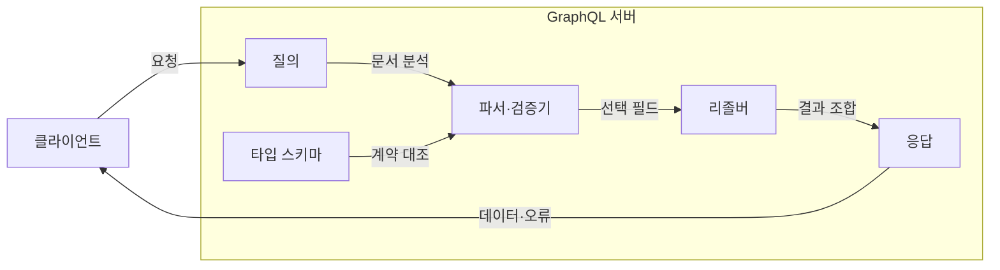
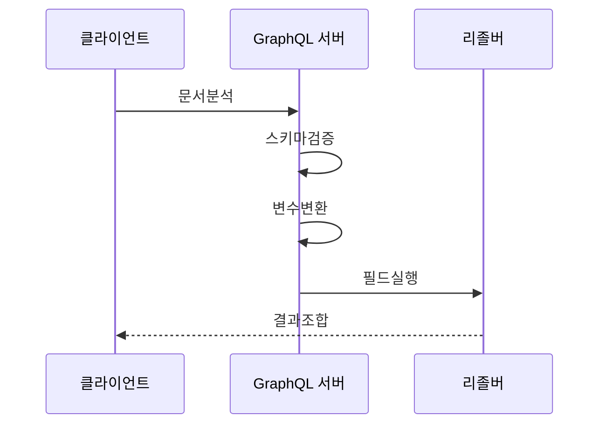

---
sidebar:
  order: 172
  label: "172. GraphQL (GraphQL)"
  badge:
    text: "미출제 · 50%"
    variant: note
title: "GraphQL (GraphQL)"
date: "2026-07-25T00:30:00+09:00"
tags:
  - "notes-software"
weight: 172
extra:
  question_no: "172"
  source_status: "미출제"
  source_history: ""
  priority: 50
  priority_note: "스키마·질의 비용·필드 권한이 독립 비교축임"
---

## 미리 알고가기

- **그래프큐엘(GraphQL)**: 클라이언트가 필요한 결과 필드를 지정하면 서버가 스키마에 맞춰 데이터를 조합하는 질의 언어임
- **응용 프로그램 인터페이스(Application Programming Interface, API)**: 응용 프로그램이 정해진 규칙으로 기능과 데이터를 주고받는 연결 규약이며 본문에서는 GraphQL과 REST의 서비스 접점을 뜻함
- **하이퍼텍스트 전송 프로토콜(Hypertext Transfer Protocol, HTTP)**: 웹에서 요청과 응답을 전달하는 통신 규약이며 GraphQL과 REST가 메시지를 교환하는 전송 기반임
- **표현 상태 전송(Representational State Transfer, REST)**: 자원을 주소로 식별하고 정해진 표현으로 상태를 교환하는 아키텍처 방식이며 GraphQL의 비교 대상임
- **타입 스키마(Type Schema)**: 허용할 데이터 타입·필드·인자와 진입점을 정의해 질의 검증과 실행의 계약이 되는 구조임
- **작업(Operation)**: GraphQL에서 실행할 요청 단위이며 조회(Query), 변경(Mutation), 구독(Subscription)으로 나뉨
- **조회(Query)**: 서버 상태를 바꾸지 않고 필요한 필드를 읽는 작업임
- **변경(Mutation)**: 서버 데이터를 생성·수정·삭제하는 작업임
- **구독(Subscription)**: 서버의 사건 발생 결과를 지속해서 전달받는 작업임
- **리졸버(Resolver)**: 스키마의 특정 필드에 대응해 실제 데이터를 가져오거나 계산하는 구현 함수임
- **파서(Parser)·검증기(Validator)**: 파서는 질의 문서를 구문 트리로 바꾸고 검증기는 그 트리가 스키마 계약에 맞는지 검사함
- **응답(Response)**: 실행 결과 데이터와 필드별 오류를 함께 담아 클라이언트에 반환하는 메시지임
- **널 가능성**: 필드 결과가 값 없음인 `null`을 허용하는지 나타내는 타입 조건임

## Ⅰ. 개요

- 정의/개념: 타입 스키마에 맞춰 결과를 조합하는 API임
- **배경/필요성**: 과다·과소 조회로 선택형 질의 스키마 필요

### 쉽게 이해하기 (학습용)
- 허용된 재료 중 필요한 필드만 선택해 단일 요청

## Ⅱ. 특징

- 스키마가 타입과 인자 및 널 가능성을 정의한다.
- 질의의 선택 집합으로 반환 필드를 지정한다.
- 스키마 검증으로 잘못된 요청 타입을 거부한다.
- 리졸버 배치·캐시로 중복 조회를 줄인다.
- 질의 깊이·목록 크기로 실행 비용을 제한한다.
- 필드를 추가하고 기존 필드를 순차적으로 폐기한다.

### 쉽게 이해하기 (학습용)
- 주문 내역이 맞는지, 너무 많은 양인지 검사함

## Ⅲ. 아키텍처 및 구성요소

| 설계 요소 | 설명 |
|:---|:---|
| 타입 스키마 | 타입과 필드 및 진입 타입을 정의함 |
| 질의 | 실행 작업과 반환할 필드 구조를 기술함 |
| 파서·검증기 | 구문 트리 생성 후 스키마에 대조함 |
| 리졸버 | 선택 필드의 데이터를 조회·조합함 |
| 응답 | 결과 데이터와 필드별 오류를 전달함 |

> 요약: 스키마를 기준으로 질의를 검증하고 결과를 조합함

### 쉽게 이해하기 (학습용)
- 설계도를 바탕으로 사용자의 주문을 검증하고 조립함

## Ⅳ. 원리 및 절차 흐름도

| 절차 | 설명 |
|:---|:---|
| 문서분석 | 요청 문서를 구문 트리로 변환함 |
| 스키마검증 | 필드와 변수 타입을 체계에 대조함 |
| 변수변환 | 입력 값을 선언 타입에 맞게 변환함 |
| 필드실행 | 리졸버를 호출하고 널 오류를 전파함 |
| 결과조합 | 데이터와 부분 오류를 동일 형태로 묶음 |

> 요약: 질의 문법과 권한을 검증 후 데이터를 반환함

### 쉽게 이해하기 (학습용)
- 올바른 문법인지 대조 후 각 담당 함수를 호출함

## Ⅴ. 종류 및 비교

| 판단 기준 | GraphQL API | REST API |
|:---|:---|:---|
| 핵심 특징 | 선택 필드를 클라이언트가 지정 | 자원 표현을 서버가 고정 |
| 적용 기준 | 화면별 필드·연관 조회가 다를 때 | 자원별 응답·웹 캐시가 중요할 때 |
| 주요 위험 | 질의 폭증·필드 권한 누락 | 호출 증가·과다 응답 |

> 요약: REST는 자원 단위, GraphQL은 필드를 선택함

### 쉽게 이해하기 (학습용)
- GraphQL은 필요한 반찬만 주문하고 REST는 정해진 한 상을 받음

## Ⅵ. 실무 사례

1. 상품 상세 화면의 반복 호출을 한 질의로 결합함

### 쉽게 이해하기 (학습용)
- 상품 화면은 필요한 연관 필드만 한 번에 요청함

## Ⅶ. 결론

- 연관 조회가 많고 질의 비용을 제한할 수 있을 때 도입함

### 쉽게 이해하기 (학습용)
- 필요한 필드를 선택하되 서버가 질의량을 제한
