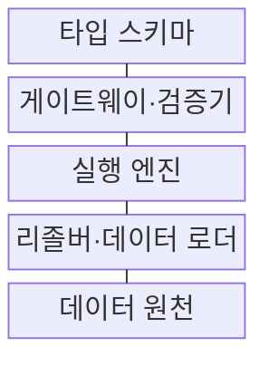
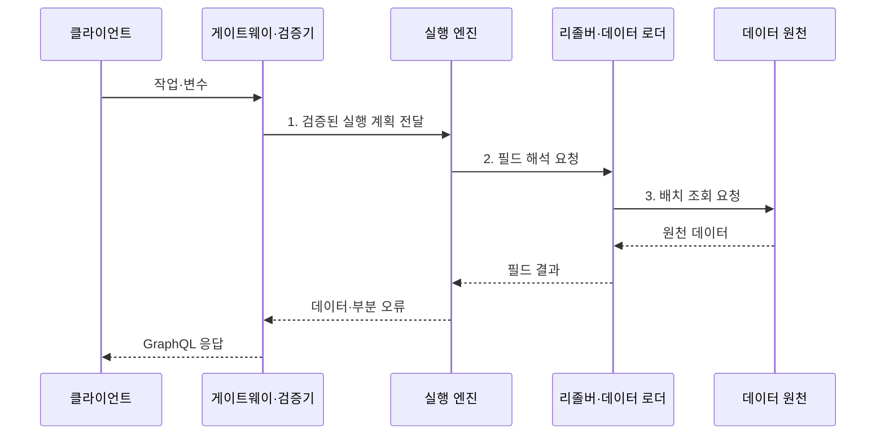

---
sidebar:
  order: 172
  label: "172. GraphQL (GraphQL)"
  badge:
    text: "미출 · 50%"
    variant: note
title: "GraphQL (GraphQL)"
date: "2026-08-02T12:00:00+09:00"
tags:
  - "notes-software"
weight: 172
extra:
  question_no: "172"
  source_status: "미출"
  source_history: ""
  priority: 50
  priority_note: "스키마·질의 비용·필드 권한의 비교 가치"
---

## Ⅰ. 개요

핵심 용어

- **API 질의 언어·실행 명세**: GraphQL은 타입 스키마로 계약을 정의하고 선택한 필드를 실행하는 API 질의 언어이자 실행 명세다.

- 정의/개념: **GraphQL**은 타입 스키마에 따라 클라이언트가 필요한 필드를 선언하고 서버가 리졸버로 결과를 구성하는 API 질의 언어·실행 명세
- 배경/필요성: 고정 자원 응답으로는 화면별 조합에 **과다 응답·반복 호출 발생**

### 쉽게 이해하기 (학습용)

- 정해진 메뉴에서 화면에 필요한 항목과 하위 항목만 골라 한 요청으로 받되 서버는 주문 가능한 깊이와 양을 제한한다.

## Ⅱ. 특징

핵심 용어

- **타입 스키마**: 타입 스키마는 객체, 필드, 인자, 반환 타입과 널 가능성을 정의하는 GraphQL의 강한 계약이다.

- **타입 스키마** 기반 강한 API 계약
- **선택 집합·계층 리졸버** 기반 응답 조합
- **부분 오류·점진 폐기** 기반 스키마 진화

### 쉽게 이해하기 (학습용)

- 스키마가 주문 가능한 필드와 타입을 정하고 클라이언트가 응답 모양을 고르면 리졸버가 여러 데이터 원천의 결과를 조립한다.

## Ⅲ. 구조 및 구성요소

핵심 용어

- **리졸버·데이터 로더**: 리졸버는 필드 값을 처리하고 데이터 로더는 같은 실행 주기의 조회 키를 모아 일괄 조회한다.

| 구성요소 | 책임 |
|:---|:---|
| 타입 스키마 | 타입·필드·**인자·널 계약 정의** |
| 게이트웨이·검증기 | 인증·구문·**질의 비용 검증** |
| 실행 엔진 | 선택 집합·**널·오류 전파** |
| 리졸버·데이터 로더 | 필드 권한·**배치 조회·캐시** |
| 데이터 원천 | 데이터베이스·REST·**업무 서비스 처리** |

### 쉽게 이해하기 (학습용)

- 스키마가 메뉴, 검증기가 주문 제한, 실행 엔진이 조리 순서, 리졸버가 각 주방의 결과를 가져오는 담당자 역할을 한다.

## Ⅳ. 흐름도

핵심 용어

- **3. 배치 조회 요청**: 데이터 로더는 같은 실행 주기의 키를 묶어 원천 데이터에 배치 조회를 요청해 N+1 문제를 완화한다.

**동작 원리**

1. **검증된 실행 계획 전달**: 타입·깊이·비용 조건을 통과한 선택 집합 구성
2. **필드 해석 요청**: 필드 권한과 하위 선택 순서 결정
3. **배치 조회 요청**: 같은 실행 주기의 키를 묶어 N+1 완화

### 쉽게 이해하기 (학습용)

- 상품 목록과 각 판매자를 요청하면 데이터 로더가 판매자 키를 한 번에 모아 조회해 상품 수만큼 같은 저장소를 호출하는 문제를 줄인다.

## Ⅴ. 종류 및 비교

핵심 용어

- **GraphQL**: GraphQL은 화면마다 필요한 연관 필드를 선택해 한 요청으로 조합하는 API 방식이다.

| API 방식 | GraphQL | REST |
|:---|:---|:---|
| 적용 기준 | 화면별 **연관 필드 조합** | 안정적 **자원 표현·웹 캐시** |
| 핵심 특징 | 스키마·**클라이언트 필드 선택** | URI·HTTP **균일 인터페이스** |
| 한계 | 복잡도·N+1·**필드 권한** | 과다 응답·**다중 자원 호출** |

### 쉽게 이해하기 (학습용)

- 화면마다 연관 데이터 모양이 크게 다르면 GraphQL이 호출을 줄이고 자원 단위 캐시와 단순 공개 연계가 중요하면 REST가 운영하기 쉽다.

## Ⅵ. 실무 고려사항 및 대책

핵심 용어

- **N+1 조회**: N+1 조회는 상위 목록을 읽은 뒤 각 항목의 하위 데이터를 개별 조회해 원천 호출이 급증하는 문제다.

| 문제 | 대책 | 효과 |
|:---|:---|:---|
| 깊은 질의의 **처리량 폭증** | 영속 질의 허용 목록·**가중 복잡도 제한** | 연산·조회 **과부하 방지** |
| 필드별 반복의 **N+1 조회** | 요청 범위 **데이터 로더 적용** | 원천 **호출 수 감소** |
| 객체 조회 뒤 **민감 필드 노출** | 리졸버의 **객체·필드 권한 확인** | **수평 권한 우회 차단** |
| 운영 내성의 **스키마 노출** | 내성 권한·**운영 환경 제한** | **스키마 구조 노출** 축소 |
| 부분 오류의 **실패 누락** | 오류 경로·코드·**재시도 표준화** | **필드 실패 식별** |
| 사용 중 필드의 **제거 장애** | 사용량 추적·**폐기 공지·단계 제거** | **클라이언트 호환** 유지 |

### 쉽게 이해하기 (학습용)

- 사용자가 상품 객체를 볼 권한이 있어도 원가 필드를 볼 권한은 별도일 수 있으므로 리졸버마다 필드 수준 권한을 확인해야 한다.

## Ⅶ. 결론

핵심 용어

- **조합·비용·필드 권한**: GraphQL과 REST는 응답 조합 필요성, 질의 처리 비용, 필드 수준 권한 관리 능력을 기준으로 선택한다.

- **조합·비용·필드 권한**으로 GraphQL·REST 결정

### 쉽게 이해하기 (학습용)

- 선택형 응답의 호출 절감이 크고 스키마·비용·권한을 지속 관리할 수 있을 때 GraphQL을 적용해야 한다.
