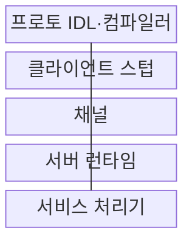
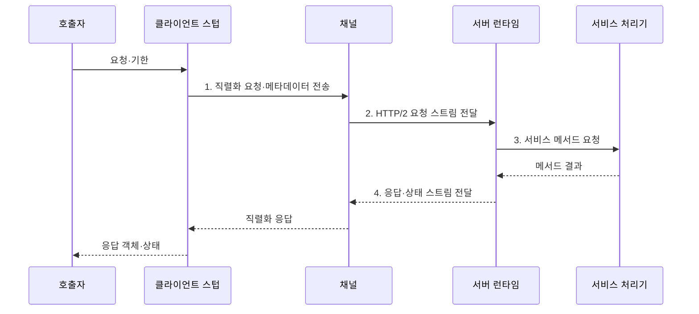

---
sidebar:
  order: 173
  label: "173. gRPC (gRPC)"
  badge:
    text: "미출 · 70%"
    variant: note
title: "gRPC (gRPC)"
date: "2026-07-31T00:16:28+09:00"
tags:
  - "notes-software"
weight: 173
extra:
  question_no: "173"
  source_status: "미출"
  source_history: ""
  priority: 70
  priority_note: "내부 원격 호출과 스트리밍 설계 가치"
---

## 미리 알고가기

- **gRPC**: 인터페이스 계약과 코드 생성으로 원격 프로시저 호출을 구현하는 프레임워크
- **원격 프로시저 호출(Remote Procedure Call, RPC)**: 다른 프로세스의 함수를 로컬 함수처럼 호출하도록 추상화한 통신 방식
- **인터페이스 정의 언어(Interface Definition Language, IDL)**: 서비스 메서드와 요청·응답 타입을 언어 중립적으로 선언하는 계약
- **프로토콜 버퍼(Protocol Buffers, Protobuf)**: 필드 번호와 타입으로 데이터를 정의하고 이진 직렬화하는 메시지 형식
- **스텁(Stub)**: IDL에서 생성되어 호출을 직렬화·전송하고 응답을 복원하는 클라이언트 코드
- **채널(Channel)**: 대상 서버와의 연결·이름 해석·부하 분산·HTTP/2 스트림을 관리하는 경로
- **메타데이터(Metadata)**: 인증·추적 등 호출에 함께 전달하는 키·값 정보
- **기한(Deadline)**: 호출자가 결과를 기다리는 최대 종료 시각
- **취소 전파(Cancellation Propagation)**: 호출 취소나 기한 만료를 하위 호출에 전달하는 처리
- **스트리밍(Streaming)**: 하나의 RPC에서 요청이나 응답 메시지를 연속 교환하는 방식
- **후방 호환성(Backward Compatibility)**: 새 메시지 정의가 이전 코드와 통신하도록 기존 필드 번호와 의미를 보존하는 성질
- **프로토 정의 파일(.proto)**: gRPC 서비스·메서드·메시지를 Protobuf 문법으로 선언하는 파일
- **IDL 컴파일러(IDL Compiler)**: 프로토 정의 파일을 읽어 언어별 스텁과 서버 인터페이스를 생성하는 도구
- **서버 런타임(Server Runtime)**: 요청 역직렬화와 기한·취소·상태 처리를 담당하는 실행 계층
- **서비스 처리기(Service Handler)**: 생성된 서버 인터페이스에 실제 업무 로직을 구현하는 구성요소
- **HTTP/2**: 하나의 연결에서 여러 양방향 스트림을 다중화하는 HTTP 전송 규약
- **REST API**: 자원 식별과 HTTP 균일 인터페이스를 사용하는 서비스 접점
- **자바스크립트 객체 표기법(JavaScript Object Notation, JSON)**: 이름·값 쌍과 배열로 데이터를 표현하는 텍스트 형식
- **통합 자원 식별자(Uniform Resource Identifier, URI)**: REST 인터페이스에서 자원을 식별하는 주소
- **멱등성(Idempotency)**: 같은 요청을 여러 번 처리해도 최종 상태가 한 번 처리한 것과 같은 성질
- **예약 필드 번호(reserved)**: 삭제한 Protobuf 필드 번호의 재사용을 금지하는 선언

## Ⅰ. 개요

- 정의/개념: IDL·코드 생성 기반 **고성능 원격 호출 프레임워크**
- 배경/필요성: 언어별 수작업 계약으로는 **직렬화·오류·호출 규칙 일관성 확보 곤란**

### 쉽게 이해하기 (학습용)

- 공통 `.proto` 설계도에서 각 언어의 송신·수신 코드를 만들어 다른 서버의 함수를 타입이 정해진 로컬 함수처럼 호출한다.

## Ⅱ. 특징

- **Protobuf IDL·Stub** 기반 계약 우선 개발
- **HTTP/2 다중화** 기반 단항·스트리밍 호출
- **기한·취소·상태 코드** 기반 호출 수명주기

### 쉽게 이해하기 (학습용)

- 한 연결에서 여러 통화를 동시에 처리하되 호출자가 기다릴 시간을 넘기면 하위 서비스까지 취소를 전달해 불필요한 작업을 멈춘다.

## Ⅲ. 구조 및 구성요소

| 구성요소 | 책임 |
|:---|:---|
| 프로토 IDL·컴파일러 | 메서드·메시지·**언어별 코드 생성** |
| 클라이언트 스텁 | 요청 직렬화·**원격 호출 추상화** |
| 채널 | 대상·연결·**HTTP/2 스트림 관리** |
| 서버 런타임 | 역직렬화·**기한·취소·상태 처리** |
| 서비스 처리기 | 생성 인터페이스·**업무 로직 구현** |

### 쉽게 이해하기 (학습용)

- IDL이 통화 규격, Stub이 송수화기, Channel이 회선, Runtime이 교환기, Handler가 실제 업무 담당자 역할을 한다.

## Ⅳ. 흐름도

**동작 원리**

1. **직렬화 요청·메타데이터 전송**: Protobuf·인증·추적 정보 구성
2. **HTTP/2 요청 스트림 전달**: 연결을 다중화해 대상 서버로 전송
3. **서비스 메서드 요청**: 역직렬화 후 기한·취소 조건 적용
4. **응답·상태 스트림 전달**: 응답 객체 또는 표준 오류 복원

### 쉽게 이해하기 (학습용)

- 호출 객체는 Stub에서 이진 메시지가 되고 서버 Handler의 결과는 다시 객체로 복원되며 기한이 지나면 같은 취소 문맥이 전체 경로에 전달된다.

## Ⅴ. 종류 및 비교

| 서비스 연계 방식 | gRPC | REST API |
|:---|:---|:---|
| 적용 기준 | 내부 저지연·**스트리밍 호출** | 공개 웹·**자원 연계** |
| 핵심 특징 | Protobuf·**코드 생성·HTTP/2** | JSON·URI·**HTTP 의미** |
| 한계 | 브라우저·프록시·**디버깅 제약** | 메시지 크기·**계약 편차** |

### 쉽게 이해하기 (학습용)

- 내부 서비스의 타입 계약과 연속 메시지가 중요하면 gRPC를, 브라우저와 외부 소비자의 접근성과 웹 캐시가 중요하면 REST를 선택한다.

## Ⅵ. 실무 고려사항 및 대책

| 고려사항 | 대책 | 효과 |
|:---|:---|:---|
| 무기한 호출의 **연결 고갈** | 모든 호출에 **업무별 기한 설정** | 지연 **작업 회수** |
| 상위 종료 뒤 **하위 작업 지속** | 취소 문맥의 **하위 RPC 전파** | 불필요한 **처리 중단** |
| 재시도의 **중복 업무·폭주** | 멱등 구분·**재시도 간격·횟수 제한** | **장애 증폭 방지** |
| 필드 번호 재사용의 **오해석** | 삭제 번호 **reserved 처리** | **스키마 후방 호환** |
| 장기 연결의 **서버 편중** | 연결 수명·**부하 분산 정책 조정** | **요청 분산** 개선 |

### 쉽게 이해하기 (학습용)

- 모델 추론 호출에 짧은 기한을 두고 취소를 하위 처리까지 전파하면 느린 요청이 연결과 연산 장치를 계속 차지하지 않는다.

## Ⅶ. 결론

- **지연·스트리밍·브라우저**로 gRPC·REST 결정

### 쉽게 이해하기 (학습용)

- 타입 계약과 스트리밍이 필요한 내부 통신은 gRPC로 구성하되 모든 호출에 기한·취소·호환성 정책을 함께 적용해야 한다.
