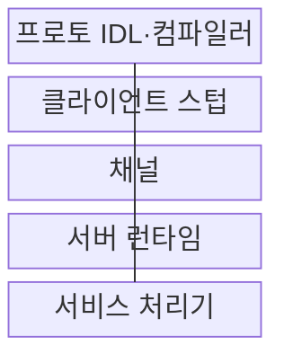
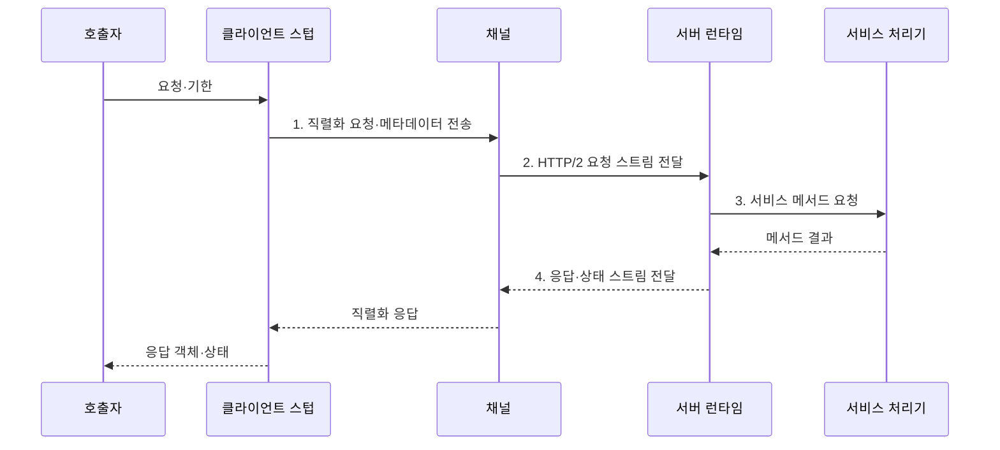

---
sidebar:
  order: 173
  label: "173. gRPC (gRPC)"
  badge:
    text: "미출 · 70%"
    variant: note
title: "gRPC (gRPC)"
date: "2026-08-02T12:00:00+09:00"
tags:
  - "notes-software"
weight: 173
extra:
  question_no: "173"
  source_status: "미출"
  source_history: ""
  priority: 70
  priority_note: "내부 원격 호출과 스트리밍 설계 가치"
---

## Ⅰ. 개요

핵심 용어

- **고성능 원격 호출 프레임워크**: gRPC는 IDL 계약과 코드 생성을 바탕으로 타입이 명확한 고성능 원격 호출을 구현하는 프레임워크다.

- 정의/개념: IDL·코드 생성 기반 **고성능 원격 호출 프레임워크**
- 배경/필요성: 언어별 수작업 계약으로는 **직렬화·오류·호출 규칙 일관성 확보 곤란**

### 쉽게 이해하기 (학습용)

- 공통 `.proto` 설계도에서 각 언어의 송신·수신 코드를 만들어 다른 서버의 함수를 타입이 정해진 로컬 함수처럼 호출한다.

## Ⅱ. 특징

핵심 용어

- **기한·취소·상태 코드**: 기한은 대기 상한을 정하고 취소 전파는 불필요한 하위 작업을 멈추며 상태 코드는 호출 결과를 표준화한다.

- **Protobuf IDL·Stub** 기반 계약 우선 개발
- **HTTP/2 다중화** 기반 단항·스트리밍 호출
- **기한·취소·상태 코드** 기반 호출 수명주기

### 쉽게 이해하기 (학습용)

- 한 연결에서 여러 통화를 동시에 처리하되 호출자가 기다릴 시간을 넘기면 하위 서비스까지 취소를 전달해 불필요한 작업을 멈춘다.

## Ⅲ. 구조 및 구성요소

핵심 용어

- **서버 런타임**: 서버 런타임은 요청 역직렬화와 기한·취소·상태 처리를 담당해 서비스 처리기로 연결한다.

| 구성요소 | 책임 |
|:---|:---|
| 프로토 IDL·컴파일러 | 메서드·메시지·**언어별 코드 생성** |
| 클라이언트 스텁 | 요청 직렬화·**원격 호출 추상화** |
| 채널 | 대상·연결·**HTTP/2 스트림 관리** |
| 서버 런타임 | 역직렬화·**기한·취소·상태 처리** |
| 서비스 처리기 | 생성 인터페이스·**업무 로직 구현** |

### 쉽게 이해하기 (학습용)

- IDL이 통화 규격, Stub이 송수화기, Channel이 회선, Runtime이 교환기, Handler가 실제 업무 담당자 역할을 한다.

## Ⅳ. 흐름도

핵심 용어

- **2. HTTP/2 요청 스트림 전달**: 채널은 하나의 연결을 다중화해 직렬화된 요청을 HTTP/2 스트림으로 대상 서버에 전달한다.

**동작 원리**

1. **직렬화 요청·메타데이터 전송**: Protobuf·인증·추적 정보 구성
2. **HTTP/2 요청 스트림 전달**: 연결을 다중화해 대상 서버로 전송
3. **서비스 메서드 요청**: 역직렬화 후 기한·취소 조건 적용
4. **응답·상태 스트림 전달**: 응답 객체 또는 표준 오류 복원

### 쉽게 이해하기 (학습용)

- 호출 객체는 Stub에서 이진 메시지가 되고 서버 Handler의 결과는 다시 객체로 복원되며 기한이 지나면 같은 취소 문맥이 전체 경로에 전달된다.

## Ⅴ. 종류 및 비교

핵심 용어

- **gRPC**: gRPC는 타입 계약, 낮은 지연, 연속 스트리밍이 중요한 내부 서비스 통신에 적합하다.

| 서비스 연계 방식 | gRPC | REST API |
|:---|:---|:---|
| 적용 기준 | 내부 저지연·**스트리밍 호출** | 공개 웹·**자원 연계** |
| 핵심 특징 | Protobuf·**코드 생성·HTTP/2** | JSON·URI·**HTTP 의미** |
| 한계 | 브라우저·프록시·**디버깅 제약** | 메시지 크기·**계약 편차** |

### 쉽게 이해하기 (학습용)

- 내부 서비스의 타입 계약과 연속 메시지가 중요하면 gRPC를, 브라우저와 외부 소비자의 접근성과 웹 캐시가 중요하면 REST를 선택한다.

## Ⅵ. 실무 고려사항 및 대책

핵심 용어

- **연결 고갈**: 연결 고갈은 기한 없는 느린 호출이 연결과 서버 자원을 계속 점유해 새 요청 처리를 막는 문제다.

| 문제 | 대책 | 효과 |
|:---|:---|:---|
| 무기한 호출의 **연결 고갈** | 모든 호출에 **업무별 기한 설정** | 지연 **작업 회수** |
| 상위 종료 뒤 **하위 작업 지속** | 취소 문맥의 **하위 RPC 전파** | 불필요한 **처리 중단** |
| 재시도의 **중복 업무·폭주** | 멱등 구분·**재시도 간격·횟수 제한** | **장애 증폭 방지** |
| 필드 번호 재사용의 **오해석** | 삭제 번호 **reserved 처리** | **스키마 후방 호환** |
| 장기 연결의 **서버 편중** | 연결 수명·**부하 분산 정책 조정** | **요청 분산** 개선 |

### 쉽게 이해하기 (학습용)

- 모델 추론 호출에 짧은 기한을 두고 취소를 하위 처리까지 전파하면 느린 요청이 연결과 연산 장치를 계속 차지하지 않는다.

## Ⅶ. 결론

핵심 용어

- **지연·스트리밍·브라우저**: gRPC와 REST는 지연 목표, 스트리밍 필요성, 브라우저와 외부 소비자의 접근성을 기준으로 선택한다.

- **지연·스트리밍·브라우저**로 gRPC·REST 결정

### 쉽게 이해하기 (학습용)

- 타입 계약과 스트리밍이 필요한 내부 통신은 gRPC로 구성하되 모든 호출에 기한·취소·호환성 정책을 함께 적용해야 한다.
