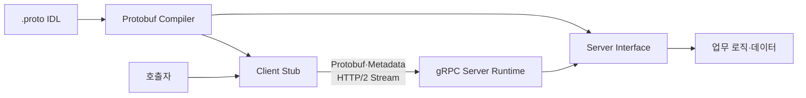
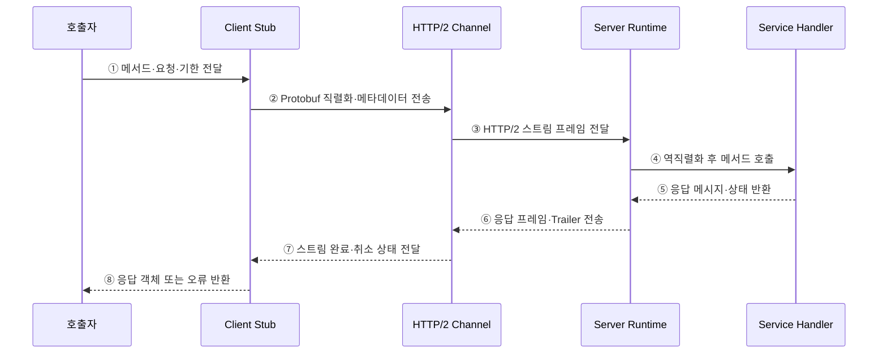

---
sidebar:
  order: 173
  label: "173. gRPC (gRPC)"
  badge:
    text: "미출제 · 70%"
    variant: note
title: "gRPC (gRPC)"
date: "2026-07-25T00:30:00+09:00"
tags:
  - "notes-software"
weight: 173
extra:
  question_no: "173"
  source_status: "미출제"
  source_history: ""
  priority: 70
  priority_note: "내부 원격 호출과 스트리밍 설계 가치가 높음"
---

## 미리 알고가기

- **지알피시(gRPC)**: 인터페이스 계약과 코드 생성으로 원격 프로시저 호출을 구현하는 고성능 프레임워크
- **원격 프로시저 호출(Remote Procedure Call, RPC·알피시)**: 다른 프로세스의 함수를 로컬 함수처럼 호출하도록 추상화한 통신 방식
- **인터페이스 정의 언어(Interface Definition Language, IDL·아이디엘)**: 서비스 메서드와 요청·응답 메시지 타입을 언어 중립적으로 선언하는 계약
- **프로토콜 버퍼(Protocol Buffers, Protobuf·프로토버프)**: 필드 번호와 타입으로 구조화 데이터를 정의하고 이진 직렬화하는 기본 메시지 형식
- **스텁(Stub)**: IDL에서 생성되어 메서드 호출을 직렬화·전송하고 응답을 복원하는 클라이언트 코드
- **채널(Channel)**: 대상 서버와의 연결·이름 해석·부하 분산·HTTP/2 스트림을 관리하는 논리 통신 경로
- **메타데이터(Metadata)**: 인증·추적 등 호출에 함께 전달하는 키·값 정보
- **기한(Deadline)**: 호출자가 결과를 기다리는 최대 종료 시각
- **취소 전파(Cancellation Propagation)**: 호출 취소나 기한 만료를 하위 호출에 전달해 불필요한 작업을 중단하는 처리
- **스트리밍(Streaming)**: 하나의 RPC에서 요청이나 응답 메시지를 연속해서 교환하는 방식
- **후방 호환성(Backward Compatibility)**: 새 메시지 정의가 이전 코드와 통신할 수 있도록 기존 필드 번호와 의미를 보존하는 성질

## Ⅰ. 개요

- gRPC는 IDL로 원격 메서드와 메시지 타입을 정의하고 **언어별 통신 코드를 자동 생성**한다.
- Protobuf와 HTTP/2 기반의 단항·스트리밍 호출로 서비스 간 저지연 통신을 지원한다.
- 언어마다 다른 직렬화·오류·호출 코드를 반복 구현할 때 생기는 계약 편차를 줄인다.

### 쉽게 이해하기 (학습용)
- 공통 통신 설계도에서 송신·수신 코드를 만들어 다른 서버의 함수를 호출함

## Ⅱ. 특징

- **계약 우선**: `.proto` 파일이 서비스·메서드·메시지·필드 번호를 정의한다.
- **코드 생성**: 컴파일러가 언어별 메시지 클래스·클라이언트 Stub·서버 인터페이스를 만든다.
- **다중 호출 유형**: 단항·서버 스트리밍·클라이언트 스트리밍·양방향 스트리밍을 지원한다.
- **연결 효율**: HTTP/2가 한 연결에서 여러 RPC 스트림을 다중화한다.
- **호출 제어**: 메타데이터·기한·취소·상태 코드로 분산 호출의 수명주기를 관리한다.
- **스키마 진화**: 기존 필드 번호를 재사용하지 않고 새 필드를 추가해 호환성을 유지한다.

### 쉽게 이해하기 (학습용)
- 타입이 정해진 전용 통화로 한 번의 응답이나 연속 메시지를 주고받음

## Ⅲ. 아키텍처 및 구성요소

**도표안 A — 구조도**

**도표안 B — sequenceDiagram**

| 구성요소 | 역할 |
|:---|:---|
| `.proto` IDL | 서비스·RPC 메서드·메시지·필드 번호 정의 |
| Protobuf Compiler | 언어별 메시지 클래스·Stub·서버 인터페이스 생성 |
| Client Stub | 로컬 호출을 직렬화하고 원격 응답을 객체로 복원 |
| Channel | 대상 선택·연결·HTTP/2 스트림·부하 분산 관리 |
| Server Runtime | 요청 역직렬화·메타데이터·기한·취소·상태 처리 |
| Service Handler | 생성된 인터페이스를 구현해 업무 로직 실행 |

**동작 원리**

- ① 호출자가 생성된 Stub에 메서드·요청 객체·기한을 전달한다.
- ② Stub이 요청을 Protobuf로 직렬화하고 인증·추적 메타데이터와 함께 Channel에 보낸다.
- ③ Channel이 HTTP/2 스트림을 열고 메시지를 프레임으로 서버 Runtime에 전달한다.
- ④ 서버 Runtime이 메시지를 역직렬화하고 해당 Service Handler를 호출한다.
- ⑤ Handler가 업무를 처리해 응답 메시지와 gRPC 상태를 반환한다.
- ⑥ 서버 Runtime이 응답과 최종 상태 Trailer를 HTTP/2 프레임으로 보낸다.
- ⑦ Channel이 스트림 완료·기한 만료·취소 상태를 Stub에 전달한다.
- ⑧ Stub이 응답을 객체로 복원하거나 상태 오류를 호출자에게 반환한다.

### 쉽게 이해하기 (학습용)
- Stub이 객체를 전송 메시지로 바꾸고 서버 결과를 다시 객체나 오류로 돌려줌

## Ⅳ. 종류 및 비교

| 호출 유형 | 요청 흐름 | 응답 흐름 | 적용 |
|:---|:---|:---|:---|
| 단항(Unary) | 1개 | 1개 | 조회·명령·모델 추론 |
| 서버 스트리밍 | 1개 | 여러 개 | 검색 결과·상태 피드 |
| 클라이언트 스트리밍 | 여러 개 | 1개 | 센서·파일 조각 업로드 |
| 양방향 스트리밍 | 여러 개 | 여러 개 | 채팅·실시간 제어 |

| 비교 항목 | gRPC | REST API |
|:---|:---|:---|
| 설계 중심 | 원격 메서드·타입 계약 | 자원·균일 HTTP 인터페이스 |
| 계약 | `.proto`와 코드 생성 | OpenAPI 등 별도 명세 |
| 기본 메시지 | Protobuf 이진 형식 | JSON 등 다양한 표현 |
| 스트리밍 | 네 가지 RPC 유형 | 별도 HTTP 스트리밍·SSE·WebSocket 설계 |
| 강점 | 내부 저지연 통신·다언어 Stub | 공개 웹 호환·가시성·HTTP 캐시 |
| 한계 | 브라우저·중간 프록시·텍스트 디버깅 제약 | 메시지 크기·계약 구현 편차 |

### 쉽게 이해하기 (학습용)
- gRPC는 내부 전용 통화에, REST는 공개 웹 자원 창구에 강함

## Ⅴ. 실무 고려사항 및 대책

| 고려사항 | 위험 | 대책 |
|:---|:---|:---|
| 기한 | 무기한 대기로 자원 고갈 | 모든 호출에 업무별 기한 설정 |
| 취소 | 상위 요청 종료 후 하위 작업 지속 | 취소 문맥을 하위 RPC와 업무 로직에 전파 |
| 재시도 | 비멱등 호출 중복·재시도 폭주 | 멱등성 구분·횟수·백오프·재시도 예산 설정 |
| 스키마 변경 | 필드 번호 재사용으로 오해석 | 번호·의미 보존, 삭제 필드는 `reserved` 처리 |
| 메시지 크기 | 대형 메시지로 메모리·지연 증가 | 스트리밍·청크·크기 제한 적용 |
| 부하 분산 | 장기 연결로 특정 서버 편중 | 클라이언트·프록시 정책과 연결 수명 조정 |
| 보안 | 메타데이터 위조·평문 노출 | TLS·상호 TLS·토큰 검증·필드 권한 적용 |
| 관측성 | 이진 메시지로 장애 분석 어려움 | 인터셉터로 Trace·상태·지연·메서드 지표 수집 |
| 브라우저 | 네이티브 gRPC 호출 제약 | gRPC-Web와 호환 프록시 또는 REST Gateway 검토 |

### 쉽게 이해하기 (학습용)
- 사례: 모델 추론 RPC는 짧은 기한과 단항 호출을 사용해 느린 요청이 자원을 계속 잡지 않게 함

## Ⅵ. 결론

- gRPC의 핵심은 **IDL 기반 타입 계약·코드 생성·효율적인 단항 및 스트리밍 호출**이다.
- 성능만 보고 선택하지 말고 기한·취소·재시도·스키마 호환성·프록시·브라우저 조건을 함께 검토해야 한다.
- 내부 서비스 간 저지연 통신과 스트리밍 요구가 크고 계약을 중앙 관리할 수 있을 때 효과적이다.

### 쉽게 이해하기 (학습용)
- 공통 계약으로 빠르게 호출하되 시간 제한과 취소를 끝까지 전달함
