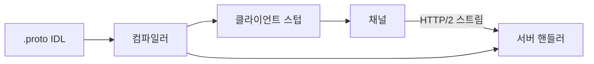
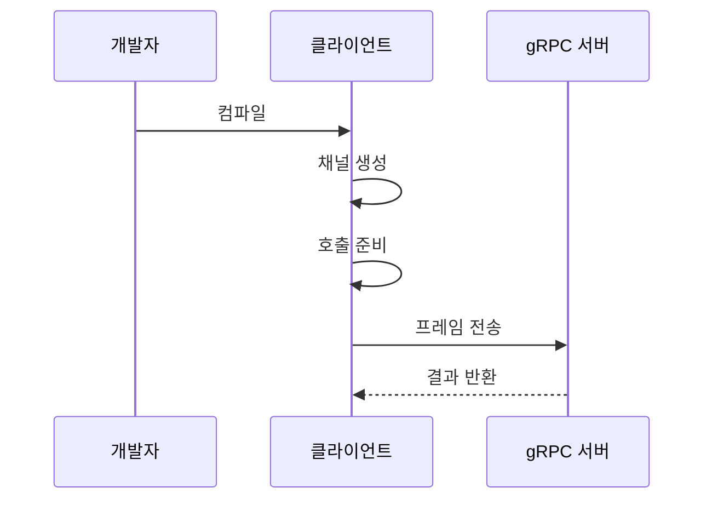

---
sidebar:
  order: 173
  label: "173. gRPC (gRPC)"
  badge:
    text: "미출제 · 70%"
    variant: note
title: "gRPC (gRPC)"
date: "2026-07-25T00:30:00+09:00"
tags:
  - "notes-software"
weight: 173
extra:
  question_no: "173"
  source_status: "미출제"
  source_history: ""
  priority: 70
  priority_note: "내부 원격 호출과 스트리밍 설계 가치가 높음"
---

## 미리 알고가기

- **지알피시(gRPC)**: 원격 프로시저 호출을 타입 계약과 코드 생성으로 구현하는 프레임워크이며 이름의 `g`는 현재 특정 단어의 공식 약어로 풀지 않음
- **원격 프로시저 호출(Remote Procedure Call, RPC)**: RPC는 ‘알피시’로 읽고 영문 머리글자를 딴 약어이며, 다른 컴퓨터의 함수를 로컬 함수처럼 호출하는 통신 방식임
- **인터페이스 정의 언어(Interface Definition Language, IDL)**: IDL은 ‘아이디엘’로 읽고 영문 머리글자를 딴 약어이며, 서비스 메서드와 메시지 타입을 선언하는 코드 생성 계약임
- **스텁(Stub)**: IDL에서 자동 생성돼 원격 메서드 호출을 네트워크 요청으로 바꾸는 클라이언트 코드임
- **채널(Channel)**: 클라이언트가 서버와 통신하는 논리 연결이며 HTTP/2 연결과 스트림을 관리함
- **호출 유형**: 단일 요청·응답인 단항 호출과 서버·클라이언트·양방향 스트리밍으로 나뉘는 메시지 교환 방식임
- **프로토콜 버퍼(Protocol Buffers)**: `.proto`는 ‘닷 프로토’로 읽고 프로토콜 계약 파일임을 확장자로 표시하며, 구조화 데이터를 이진 형식으로 직렬화함
- **하이퍼텍스트 전송 프로토콜 버전 2(Hypertext Transfer Protocol Version 2, HTTP/2)**: HTTP/2는 ‘에이치티티피 투’로 읽고 슬래시 뒤 숫자로 규격 버전을 구분하며, gRPC 스트림을 다중화해 운반함
- **HTTP/2 다중화**: 한 연결에서 여러 메시지 스트림을 동시에 전송하는 기능임
- **메타데이터·기한**: 메타데이터는 부가 정보이고 기한은 호출 종료 제한 시각임
- **직렬화·역직렬화**: 객체를 전송 형식으로 바꾸고 다시 객체로 복원하는 과정임
- **프록시**: 클라이언트와 서버 사이에서 요청을 중계하는 구성요소임
- **응용 프로그램 인터페이스(Application Programming Interface, API)**: API는 ‘에이피아이’로 읽고 영문 머리글자를 딴 약어이며, 응용 프로그램이 기능과 데이터를 주고받는 계약임
- **표현 상태 전송(Representational State Transfer, REST)**: REST는 ‘레스트’로 읽고 영문 머리글자를 딴 약어이며, 주소로 식별한 자원의 상태 표현을 교환함
- **통합 자원 식별자(Uniform Resource Identifier, URI)**: URI는 ‘유알아이’로 읽고 영문 머리글자를 딴 약어이며, REST 요청 대상을 문자열로 식별함

## Ⅰ. 개요

- 정의/개념: 계약 기반 원격 메서드 호출
- **배경/필요성**: 다언어 구현 편차로 타입 계약·코드 생성이 필요함

### 쉽게 이해하기 (학습용)
- 설계도에서 통화 코드를 뽑아 원격 통신 연결을 처리함

## Ⅱ. 특징

- IDL에서 클라이언트 스텁·서버 인터페이스를 생성한다.
- 단항 및 스트리밍 호출 유형으로 양방향 메시지 흐름을 제어한다.
- HTTP/2 스트림 다중화로 이진 메시지를 병렬 전달한다.
- 기한 만료는 연관 작업에 취소를 전파해 낭비를 막는다.
- 프로토콜 버퍼 필드 번호 유지로 호환성 보존한다.
- 인프라에 맞춰 재시도·부하분산 정책을 구성한다.

### 쉽게 이해하기 (학습용)
- 원격 통화 마감 시간과 취소 이유를 분산 환경에서 분명히 관리함

## Ⅲ. 아키텍처 및 구성요소

| 설계 요소 | 설명 |
|:---|:---|
| `.proto` IDL | 서비스와 원격 프로시저 및 필드 번호를 정의함 |
| 컴파일러 | 언어별 데이터 모델 클래스와 스텁 인터페이스를 생성함 |
| 클라이언트 스텁 | 로컬 메서드 호출을 원격 요청으로 변환함 |
| 채널(Channel) | 서버와의 물리적 연결과 HTTP/2 스트림 다중화를 제어함 |
| 서버 핸들러 | 요청을 역직렬화하고 실제 메서드를 실행함 |

> 요약: 인터페이스 계약을 공유하고 스트림 채널이 메시지를 전달함

### 쉽게 이해하기 (학습용)
- 공통 설계도로 발신과 수신 창구를 만들어 메시지를 전달함

## Ⅳ. 원리 및 절차 흐름도

| 절차 | 설명 |
|:---|:---|
| 컴파일 | 설계도에서 스텁과 인터페이스를 자동 생성함 |
| 채널 생성 | 대상 주소와 보안 설정으로 서버 연결을 준비함 |
| 호출 준비 | 스텁이 기한과 메타데이터로 원격 요청을 구성함 |
| 프레임 전송 | 메시지를 프레임으로 쪼개 전송 흐름을 제어함 |
| 결과 반환 | 서버가 응답 메시지와 호출 종료 상태를 반환함 |

> 요약: 원격 호출을 전달하고 최종 결과를 메시지와 상태 코드로 끝냄

### 쉽게 이해하기 (학습용)
- 호출 전송 후 서버의 응답 메시지와 실패 이유를 최종 상태로 끝냄

## Ⅴ. 종류 및 비교

| 판단 기준 | gRPC | REST API |
|:---|:---|:---|
| 핵심 특징 | IDL 기반 단항·스트리밍 호출 | URI 기반 자원 요청·응답 |
| 적용 기준 | 내부 RPC·양방향 스트리밍 | 공개 웹 API·브라우저 호환 |
| 주요 위험 | 프록시 호환·필드 번호 재사용 | 텍스트 오버헤드·계약 편차 |

> 요약: REST는 자원을 제공하고 gRPC는 원격 메서드를 제공함

### 쉽게 이해하기 (학습용)
- REST는 웹 공개 창구이고 gRPC는 내부 서버의 전용 통화기임

## Ⅵ. 실무 사례

1. 모델 추론 서버는 단항 호출로 입력·결과 교환

### 쉽게 이해하기 (학습용)
- 모델 추론은 질문 하나에 결과 하나를 돌려받음

## Ⅶ. 결론

- 내부 RPC와 양방향 스트리밍이 필요할 때 적용함

### 쉽게 이해하기 (학습용)
- 공통 계약으로 코드를 만들고 호출 기한도 정해야 함
