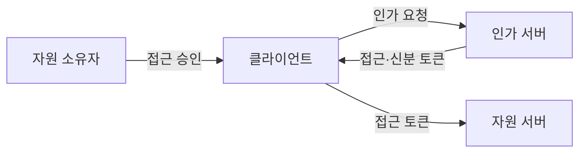
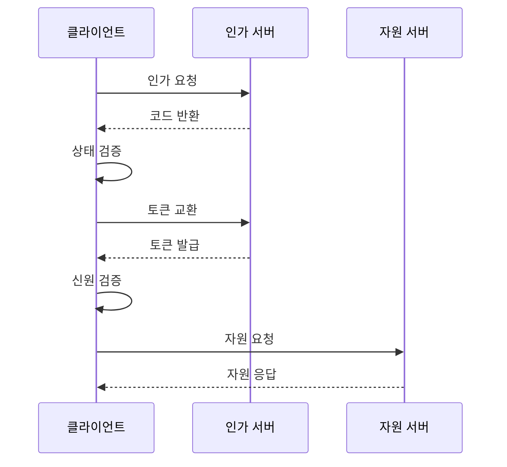

---
sidebar:
  order: 174
  label: "174. OAuth 2.0·OIDC (OAuth 2.0 OIDC)"
  badge:
    text: "기출 · 70%"
    variant: note
title: "OAuth 2.0·OIDC (OAuth 2.0 OIDC)"
date: "2026-07-27T23:59:59+09:00"
tags:
  - "notes-software"
weight: 174
extra:
  question_no: "174"
  source_status: "기출"
  source_history: "123회"
  priority: 70
  priority_note: "권한 위임과 신원 확인의 구분이 보안 기본축임"
---

## 미리 알고가기

- **오어스 2.0 권한 부여 프레임워크(OAuth 2.0 Authorization Framework, OAuth 2.0)**: OAuth는 ‘오어스’로 읽고 Open Authorization을 줄인 명칭이며, 2.0은 규격 버전으로 암호 공유 없이 자원 접근 권한을 위임
- **오픈아이디 연결(OpenID Connect, OIDC)**: OIDC는 ‘오아이디씨’로 읽고 영문 명칭의 핵심 글자를 딴 약어이며, OAuth 2.0에 신원 확인 정보를 더해 로그인 결과를 전달
- **코드 교환용 증명 키(Proof Key for Code Exchange, PKCE)**: PKCE는 ‘픽시’로 읽고 영문 머리글자를 딴 약어이며, 변환값과 원값을 대조해 탈취된 인가 코드의 재사용을 방지
- **응용 프로그래밍 인터페이스(Application Programming Interface, API)**: ‘에이피아이’로 읽고 영문 첫 글자를 딴 약어이며, OAuth 접근 토큰으로 보호하는 자원 호출 접점
- **자원 소유자(Resource Owner)·클라이언트(Client)**: 자원 소유자는 접근을 승인하는 사용자이고 클라이언트는 그 승인을 받아 자원 접근을 요청하는 응용 프로그램임
- **인가 서버·자원 서버**: 인가 서버는 토큰을 발급하고 자원 서버는 토큰을 검증함
- **접근 토큰·ID 토큰(ID Token)**: 접근 토큰은 자원 접근 권한을 담고, ‘아이디 토큰’으로 읽는 ID 토큰은 Identity의 관용 약칭을 쓴 표기로 사용자 인증 결과를 전달
- **인가 코드·상태 난수**: 인가 코드는 토큰으로 한 번 교환하는 임시 값이고 상태 난수는 요청과 응답을 묶어 위조 요청을 판별하는 값임
- **범위·토큰 회전**: 범위는 허용 권한이고 회전은 기존 토큰을 새 토큰으로 교체하는 방식임
- **토큰 분리**: 접근 토큰은 자원 권한에, ID 토큰은 클라이언트의 신원 확인에 사용하므로 혼용하지 않는 원칙
- **암시적 흐름(Implicit Flow)**: 브라우저에 토큰을 직접 반환하는 과거 방식이며 현재 보안 권고에서는 인가 코드와 PKCE 조합을 우선함

## Ⅰ. 개요

- 정의/개념: **OAuth 권한 위임·OIDC 신원 확인**
- 기존 한계: 암호 직접 공유는 **탈취·권한 과다·회수 곤란**

### 쉽게 이해하기 (학습용)
- OAuth는 임시 출입증을 OIDC는 신분 확인서를 줌

## Ⅱ. 특징

- **OAuth 접근 토큰**으로 제한된 자원 권한 위임
- **OIDC ID 토큰**으로 인증 결과·사용자 신원 전달
- **인가 코드·PKCE·상태 난수**로 탈취·위조 방지

### 쉽게 이해하기 (학습용)
- 신분 토큰과 권한 출입 토큰을 구분하여 따로 검사함

## Ⅲ. 아키텍처 및 구성요소

| 설계 요소 | 설명 |
|:---|:---|
| 자원 소유자 | 보호 자원의 **접근 권한 승인** |
| 클라이언트 | 인가 코드·**토큰·자원 요청** |
| 인가 서버 | 사용자 인증·동의 후 **토큰 발급** |
| 자원 서버 | 접근 토큰의 **범위·유효성 검증** |

> 요약: 인가 서버 토큰을 자원 서버에 전달함

### 쉽게 이해하기 (학습용)
- 임시 교환표를 바꿔 신분증과 출입증을 따로 전달함

## Ⅳ. 원리 및 절차 흐름도

| 절차 | 설명 |
|:---|:---|
| 인가 요청 | 사용자 **인증·권한 동의** 요청 |
| 코드 반환 | **인가 코드·상태 난수** 반환 |
| 상태 검증 | 저장한 **상태 난수와 응답** 대조 |
| 토큰 교환 | 코드·**PKCE 검증값**으로 토큰 요청 |
| 토큰 발급 | **접근 토큰·ID 토큰** 발급 |
| 신원 검증 | ID 토큰의 **발급자·대상·서명·만료** 검증 |
| 자원 요청 | 접근 토큰의 **범위 안 자원** 요청 |
| 자원 응답 | 범위·유효성 검증 후 **자원 제공** |

> 요약: 각 단계별 검증 오류와 권한 실패를 즉시 차단함

### 쉽게 이해하기 (학습용)
- 단계마다 짝표와 서명을 확인하여 비정상 탈취를 막음

## Ⅴ. 종류 및 비교

| 권한·신원 프로토콜 | OAuth 2.0 | OpenID Connect |
|:---|:---|:---|
| 적용 기준 | API의 **자원 접근 권한 위임** | 여러 시스템의 **통합 로그인** |
| 핵심 특징 | 접근 토큰·**범위 기반 인가** | ID 토큰·**인증 결과 전달** |
| 한계 | 토큰 탈취·**과도한 범위** | 발급자·대상·**서명 검증 누락** |

> 요약: OAuth는 권한 위임에 OIDC는 신원 확인에 씀

### 쉽게 이해하기 (학습용)
- OAuth는 기능 권한을 OIDC는 사용자의 신원을 보여줌

## Ⅵ. 실무 사례

1. 포털 로그인은 **OIDC ID 토큰**의 발급자 검증

### 쉽게 이해하기 (학습용)
- 포털은 신분 토큰의 발급자와 만료를 확인함

## Ⅶ. 결론

- 사용자 인증과 API 권한 위임을 안전하게 분리하기 위해 **토큰 목적·발급자·대상·만료·클라이언트 유형**을 검토하고, 로그인은 OIDC, 자원 접근 위임은 OAuth 2.0을 적용한다

### 쉽게 이해하기 (학습용)
- 신분 확인용 토큰과 자원 접근용 토큰을 구분함
