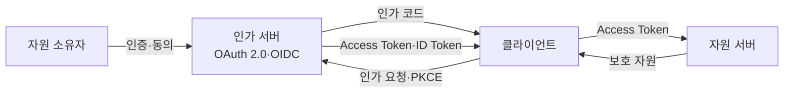
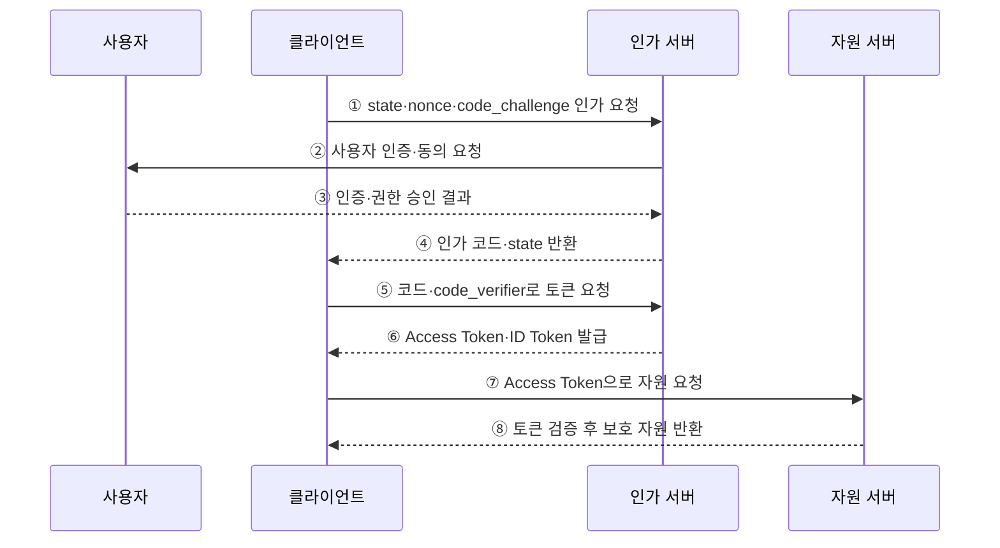

---
sidebar:
  order: 174
  label: "174. OAuth 2.0·OIDC (OAuth 2.0 OIDC)"
  badge:
    text: "기출 · 70%"
    variant: note
title: "OAuth 2.0·OIDC (OAuth 2.0 OIDC)"
date: "2026-07-27T23:59:59+09:00"
tags:
  - "notes-software"
weight: 174
extra:
  question_no: "174"
  source_status: "기출"
  source_history: "123회"
  priority: 70
  priority_note: "권한 위임과 신원 확인의 구분이 보안 기본축임"
---

## 미리 알고가기

- **오어스 2.0 권한 부여 프레임워크(OAuth 2.0 Authorization Framework, OAuth 2.0·오어스 이점영)**: 사용자의 비밀번호를 클라이언트에 주지 않고 제한된 자원 접근 권한을 위임하는 프레임워크
- **오픈아이디 커넥트(OpenID Connect, OIDC·오아이디씨)**: OAuth 2.0 위에 인증 계층을 더해 사용자의 로그인 결과와 신원 정보를 전달하는 프로토콜
- **자원 소유자(Resource Owner)**: 보호 자원의 접근 권한을 승인할 수 있는 사용자
- **클라이언트(Client)**: 자원 소유자의 승인을 받아 보호 자원에 접근하려는 응용
- **인가 서버(Authorization Server)**: 사용자를 인증하고 동의를 받아 인가 코드와 토큰을 발급하는 서버
- **자원 서버(Resource Server)**: 접근 토큰을 검증하고 범위 안의 보호 자원을 제공하는 API
- **접근 토큰(Access Token)**: 자원 서버에 제시하는 제한된 접근 권한 증표
- **ID 토큰(ID Token)**: OIDC에서 클라이언트가 사용자 인증 결과를 확인하는 서명된 토큰
- **인가 코드(Authorization Code)**: 브라우저 경로로 반환되어 백채널에서 토큰과 한 번 교환하는 임시 코드
- **코드 교환용 증명 키(Proof Key for Code Exchange, PKCE·픽시)**: `code_challenge`와 `code_verifier`를 대조해 탈취된 인가 코드의 사용을 막는 방식
- **상태값·Nonce(State·Nonce)**: `state`는 요청·응답 연결과 위조 요청 방지에, `nonce`는 ID 토큰 재사용 방지와 요청 연결에 사용하는 난수
- **범위(Scope)**: 클라이언트에 위임할 자원 접근 권한의 범위

## Ⅰ. 개요

- OAuth 2.0은 **자원 접근 권한 위임**, OIDC는 **사용자 인증과 신원 전달**을 담당한다.
- 사용자의 비밀번호를 여러 응용과 공유할 때 생기는 탈취·과다 권한·회수 곤란을 줄인다.
- 접근 토큰과 ID 토큰은 대상과 목적이 다르므로 서로 대신 사용하면 안 된다.

### 쉽게 이해하기 (학습용)
- OAuth는 API 출입증을, OIDC는 로그인 신분 확인서를 제공함

## Ⅱ. 특징

- **권한 분리**: 접근 토큰이 범위·대상·기간이 제한된 API 권한을 나타낸다.
- **신원 분리**: ID 토큰이 인가 서버가 수행한 사용자 인증 결과를 클라이언트에 전달한다.
- **암호 비공유**: 클라이언트는 사용자 비밀번호가 아니라 인가 코드와 토큰을 사용한다.
- **채널 분리**: 인가 코드는 브라우저를 거치고 토큰 교환은 인가 서버와 직접 수행한다.
- **탈취 방지**: PKCE·`state`·`nonce`·정확한 Redirect URI 검증으로 코드·응답 공격을 줄인다.
- **최소 권한**: 필요한 Scope·Audience·수명만 부여하고 토큰을 회전·폐기한다.

### 쉽게 이해하기 (학습용)
- 로그인 확인서와 API 출입증을 각 대상에게 필요한 만큼만 발급함

## Ⅲ. 아키텍처 및 구성요소

**도표안 A — 구조도**

**도표안 B — sequenceDiagram**

| 구성요소 | 역할 |
|:---|:---|
| 사용자·자원 소유자 | 인가 서버에서 인증하고 요청 권한 동의 |
| 클라이언트 | 인가 요청·코드 교환·ID 토큰 검증·자원 요청 |
| 인가 서버 | 사용자 인증·동의·코드·토큰 발급·키 공개 |
| 자원 서버 | 접근 토큰의 서명·발급자·대상·만료·범위 검증 |
| Access Token | 자원 서버에 제시하는 API 접근 권한 |
| ID Token | 클라이언트에 전달하는 사용자 인증 결과 |
| PKCE·state·nonce | 코드 탈취·요청 위조·토큰 재사용 방지 |

**동작 원리**

- ① 클라이언트가 `state`·`nonce`·PKCE 변환값과 Redirect URI를 담아 인가를 요청한다.
- ② 인가 서버가 사용자에게 인증과 요청 Scope의 동의를 요구한다.
- ③ 사용자가 인가 서버에서 신원을 증명하고 허용할 권한을 승인한다.
- ④ 인가 서버가 일회성 인가 코드와 `state`를 등록된 Redirect URI로 반환한다.
- ⑤ 클라이언트가 `state`를 대조하고 코드와 PKCE 원값으로 토큰을 요청한다.
- ⑥ 인가 서버가 PKCE를 검증해 접근 토큰을 발급하고, OIDC 요청이면 ID 토큰도 발급한다.
- ⑦ 클라이언트는 ID 토큰의 서명·발급자·대상·만료·`nonce`를 확인하고 접근 토큰으로 API를 호출한다.
- ⑧ 자원 서버는 접근 토큰의 유효성·대상·범위를 검증한 뒤 보호 자원을 반환한다.

### 쉽게 이해하기 (학습용)
- 일회용 교환표를 검증해 로그인 확인서와 API 출입증을 따로 받음

## Ⅳ. 종류 및 비교

| 비교 항목 | OAuth 2.0 | OpenID Connect |
|:---|:---|:---|
| 목적 | 자원 접근 권한 위임 | 사용자 인증·로그인 |
| 보호 대상 | 자원 서버의 API | 클라이언트의 사용자 세션 |
| 핵심 토큰 | Access Token | ID Token과 Access Token |
| 핵심 정보 | Scope·Audience·권한 | Subject·Issuer·Audience·인증 시각 |
| 토큰 소비자 | 자원 서버 | ID Token은 클라이언트 |
| 대표 적용 | 제3자 API 접근 | 통합 로그인·소셜 로그인 |
| 주요 위험 | 과도한 Scope·토큰 탈취 | ID Token 검증 누락·토큰 혼용 |

| 흐름 | 적용 | 핵심 통제 |
|:---|:---|:---|
| 인가 코드 + PKCE | 사용자 참여 웹·모바일·단일 페이지 응용 | 코드 탈취 방지·정확한 Redirect URI |
| 클라이언트 자격증명 | 사용자 없는 서버 간 호출 | 클라이언트 비밀·대상·최소 Scope |
| 장치 인가 | 입력이 제한된 TV·기기 | 사용자 코드 피싱·승인 상태 폴링 제한 |

### 쉽게 이해하기 (학습용)
- OAuth는 무엇을 할 수 있는지, OIDC는 누가 로그인했는지를 전달함

## Ⅴ. 실무 고려사항 및 대책

| 고려사항 | 위험 | 대책 |
|:---|:---|:---|
| 토큰 목적 | ID Token으로 API 호출·Access Token으로 로그인 | 발급 대상과 소비자를 분리해 검증 |
| Redirect URI | 공격자 주소로 코드 유출 | 사전 등록한 정확한 URI와 일치 검증 |
| 코드 탈취 | 브라우저·앱 간 코드 가로채기 | 인가 코드 흐름과 PKCE 적용 |
| 위조·재사용 | 요청 위조·이전 ID Token 재사용 | `state`·`nonce` 생성·저장·일회 검증 |
| Access Token | 저장소·로그·URL에서 토큰 유출 | 보안 저장소·짧은 수명·로그 마스킹·TLS |
| Refresh Token | 장기 권한 탈취·재사용 | 회전·재사용 탐지·폐기·기기 결합 |
| Scope·Audience | 과도한 권한과 다른 API에서 오용 | 최소 Scope·자원별 Audience 제한 |
| 서명 키 | 오래된 키·알 수 없는 알고리즘 수용 | 허용 알고리즘 고정·키 회전·Issuer별 키 검증 |

### 쉽게 이해하기 (학습용)
- 사례: 포털 로그인은 ID 토큰을 검증하고 API 호출에는 별도의 Access Token을 사용함

## Ⅵ. 결론

- OAuth 2.0과 OIDC의 핵심은 **권한 위임과 사용자 인증을 분리하고 토큰의 대상·목적을 지키는 것**이다.
- 인가 코드와 PKCE를 기본으로 삼고 `state`·`nonce`·Redirect URI·토큰 검증을 빠짐없이 적용해야 한다.
- 최소 권한·짧은 수명·회전·폐기·안전한 저장으로 토큰 탈취의 영향 범위를 줄여야 한다.

### 쉽게 이해하기 (학습용)
- 신분 확인서와 출입증을 구분하고 발급자·대상·만료를 각각 확인함
