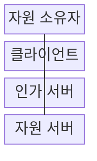
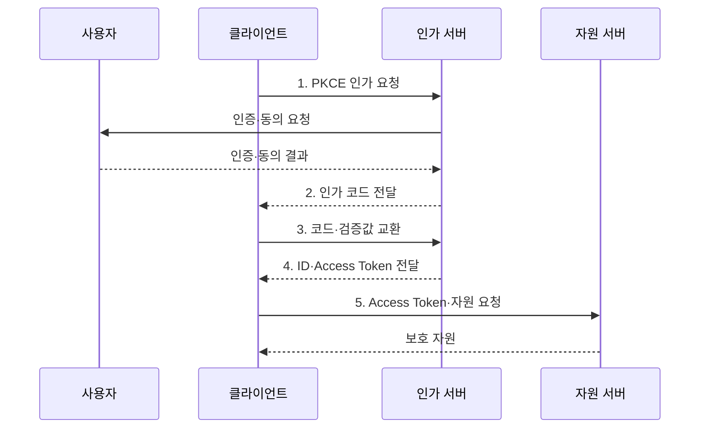

---
sidebar:
  order: 174
  label: "174. OAuth 2.0·OIDC (OAuth 2.0 OIDC)"
  badge:
    text: "기출 · 70%"
    variant: note
title: "OAuth 2.0·OIDC (OAuth 2.0 OIDC)"
date: "2026-07-31T00:18:31+09:00"
tags:
  - "notes-software"
weight: 174
extra:
  question_no: "174"
  source_status: "기출"
  source_history: "123회"
  priority: 70
  priority_note: "권한 위임과 신원 확인의 역할 구분 출제"
---

## 미리 알고가기

- **OAuth 2.0**: 사용자 비밀번호를 클라이언트에 주지 않고 제한된 자원 접근 권한을 위임하는 프레임워크
- **오픈아이디 커넥트(OpenID Connect, OIDC)**: OAuth 2.0 위에 인증 계층을 더해 로그인 결과와 신원 정보를 전달하는 프로토콜
- **자원 소유자(Resource Owner)**: 보호 자원의 접근 권한을 승인하는 사용자
- **클라이언트(Client)**: 자원 소유자의 승인을 받아 보호 자원에 접근하는 응용
- **인가 서버(Authorization Server)**: 사용자를 인증하고 동의를 받아 인가 코드와 토큰을 발급하는 서버
- **자원 서버(Resource Server)**: 접근 토큰을 검증하고 보호 자원을 제공하는 API
- **접근 토큰(Access Token)**: 자원 서버에 제시하는 제한된 접근 권한 증표
- **ID 토큰(ID Token)**: OIDC에서 클라이언트가 사용자 인증 결과를 확인하는 서명 토큰
- **인가 코드(Authorization Code)**: 브라우저로 반환되어 백채널에서 토큰과 한 번 교환하는 임시 코드
- **코드 교환용 증명 키(Proof Key for Code Exchange, PKCE)**: 변환값과 원값을 대조해 탈취된 인가 코드 사용을 막는 방식
- **state·nonce**: 요청 위조와 ID 토큰 재사용을 막고 요청·응답을 연결하는 난수
- **범위(Scope)**: 클라이언트에 위임할 자원 접근 권한의 범위
- **클레임(Claim)**: 토큰에 담긴 사용자·발급자·대상·인증 시점 등의 신원 속성
- **리디렉션 URI(Redirect URI)**: 인가 서버가 인가 코드와 상태값을 돌려보낼 사전 등록 주소
- **수신 대상(Audience)**: 토큰을 사용하도록 발급된 클라이언트나 자원 서버
- **갱신 토큰(Refresh Token)**: 접근 토큰이 만료됐을 때 새 접근 토큰을 요청하는 장기 자격 증표

> **키워드:** OAuth 2.0·OIDC (OAuth 2.0 OIDC)

## Ⅰ. 개요

- 정의/개념: OAuth **권한 위임**과 OIDC **사용자 인증** 체계
- 배경/필요성: 제3자와 비밀번호를 공유하면 **과도한 권한·자격 증명 노출**

### 쉽게 이해하기 (학습용)

- OAuth는 API 문을 열 수 있는 출입증을 주고 OIDC는 누가 로그인했는지 확인하는 신분 확인서를 별도로 제공한다.

## Ⅱ. 특징

- **Access Token·Scope** 기반 API 권한 위임
- **ID Token·신원 Claim** 기반 로그인 확인
- **인가 코드·PKCE·state·nonce** 기반 탈취 방지

### 쉽게 이해하기 (학습용)

- 브라우저를 지나는 일회용 인가 코드는 PKCE로 묶고 실제 API 출입증은 서버 간 채널에서 교환해 코드 탈취와 비밀번호 노출을 줄인다.

## Ⅲ. 구조 및 구성요소

| 구성요소 | 책임 |
|:---|:---|
| 자원 소유자 | 사용자 인증·**요청 권한 동의** |
| 클라이언트 | 인가 요청·**ID Token 검증** |
| 인가 서버 | 사용자 인증·**코드·토큰 발급** |
| 자원 서버 | Access Token·**대상·Scope 검증** |

### 쉽게 이해하기 (학습용)

- 사용자는 인가 서버에서만 비밀번호를 입력하고 클라이언트는 일회용 교환표로 신분 확인서와 API 출입증을 따로 받는다.

## Ⅳ. 흐름도

**동작 원리**

1. **PKCE 인가 요청**: state·nonce·변환값·URI 제공
2. **인가 코드 전달**: 등록 URI로 일회성 코드 반환
3. **코드·검증값 교환**: PKCE 원값과 변환값 대조
4. **ID·Access Token 전달**: 인증 결과와 위임 권한 분리 발급
5. **Access Token·자원 요청**: 서명·대상·Scope·만료 검사

### 쉽게 이해하기 (학습용)

- 클라이언트는 state와 PKCE를 확인한 뒤 ID 토큰으로 로그인만 만들고 별도 Access Token으로 API를 호출한다.

## Ⅴ. 종류 및 비교

| 권한·신원 방식 | OAuth 2.0 | OIDC |
|:---|:---|:---|
| 적용 기준 | 제3자 **API 권한 위임** | 통합·소셜 **사용자 로그인** |
| 핵심 특징 | Access Token·**Scope·대상** | ID Token·**신원 Claim** |
| 한계 | 과도한 Scope·**토큰 탈취** | ID Token **검증·용도 혼용** |

### 쉽게 이해하기 (학습용)

- OAuth는 사용자가 무엇을 허용했는지를 자원 서버에 전달하고 OIDC는 누가 인증됐는지를 클라이언트에 전달한다.

## Ⅵ. 실무 고려사항 및 대책

| 고려사항 | 대책 | 효과 |
|:---|:---|:---|
| ID·Access Token의 **용도 혼용** | 발급 대상·**소비자별 검증 분리** | **인증·인가 우회 방지** |
| 공격자 URI로 **코드 유출** | 등록 URI의 **정확 일치 검증** | **인가 코드 탈취 차단** |
| 위조 요청·**토큰 재사용** | state·nonce **일회 검증** | 요청 연결·**재사용 방지** |
| 과도한 **Scope·Audience** | 자원별 대상·**최소 권한 부여** | 토큰 **피해 범위 축소** |
| 장기 Refresh Token **탈취** | 회전·재사용 탐지·**즉시 폐기** | 지속 **권한 오용 차단** |

### 쉽게 이해하기 (학습용)

- 포털 로그인에는 ID 토큰의 발급자·대상·nonce를 확인하고 API는 자신의 대상과 Scope가 담긴 Access Token만 받아야 한다.

## Ⅶ. 결론

- 로그인은 **OIDC ID Token**, API 권한은 **OAuth Access Token** 검증

### 쉽게 이해하기 (학습용)

- ID 토큰은 로그인 확인에만, Access Token은 자원 접근에만 사용하고 인가 코드 흐름에는 PKCE·state·nonce 검증을 모두 적용해야 한다.
