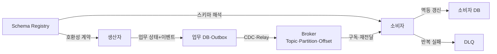
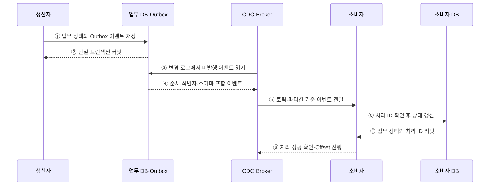

---
sidebar:
  order: 175
  label: "175. 이벤트 기반 아키텍처 (Event-Driven Architecture)"
  badge:
    text: "미출제 · 70%"
    variant: note
title: "이벤트 기반 아키텍처 (Event-Driven Architecture)"
date: "2026-07-25T00:30:00+09:00"
tags:
  - "notes-software"
weight: 175
extra:
  question_no: "175"
  source_status: "미출제"
  source_history: ""
  priority: 70
  priority_note: "비동기 결합·계약·재생이 분산 설계 핵심임"
---

## 미리 알고가기

- **이벤트 기반 아키텍처(Event-Driven Architecture, EDA·이디에이)**: 발생한 사건을 생산·발행·구독·처리하는 비동기 상호작용 중심 아키텍처
- **이벤트(Event)**: 주문 생성처럼 이미 발생한 상태 변화와 당시 문맥을 기록한 불변 메시지
- **생산자(Producer)**: 소비자를 직접 지정하지 않고 이벤트를 발행하는 주체
- **소비자(Consumer)**: 관심 있는 이벤트를 구독해 독립적으로 처리하는 주체
- **메시지 브로커(Message Broker)**: 토픽·큐·구독으로 이벤트를 저장·중계·분배하는 기반
- **최종 일관성(Eventual Consistency)**: 서비스별 상태가 즉시 같지 않아도 이벤트 처리 후 일관된 결과로 수렴하는 성질
- **멱등성(Idempotency)**: 같은 이벤트를 여러 번 처리해도 최종 상태가 한 번 처리한 것과 같은 성질
- **트랜잭셔널 아웃박스(Transactional Outbox)**: 업무 상태와 발행할 이벤트를 같은 데이터베이스 트랜잭션에 기록하는 패턴
- **변경 데이터 캡처(Change Data Capture, CDC·시디시)**: 데이터베이스 변경 로그에서 변경분을 읽어 다른 시스템으로 전달하는 기술
- **스키마 레지스트리(Schema Registry)**: 이벤트 스키마와 버전을 저장하고 생산자·소비자의 호환성을 검사하는 저장소
- **데드 레터 큐(Dead Letter Queue, DLQ·디엘큐)**: 반복 처리에 실패한 메시지를 격리해 조사·재처리하는 큐
- **이벤트 소싱(Event Sourcing)**: 현재 상태를 직접 덮어쓰지 않고 모든 상태 변경 이벤트를 순서대로 저장해 재생하는 패턴

## Ⅰ. 개요

- 이벤트 기반 아키텍처는 생산자가 발생 사실을 발행하고 소비자가 **시간·위치에 느슨하게 결합된 방식으로 처리**한다.
- 동기 호출 사슬의 장애 전파와 확장 결합을 줄이고 독립적인 처리·재생·확장을 지원한다.
- 비동기화의 대가로 순서·중복·지연·스키마·최종 일관성을 명시적으로 관리해야 한다.

### 쉽게 이해하기 (학습용)
- 사건을 게시판에 올리면 필요한 서비스가 각자 읽어 처리함

## Ⅱ. 특징

- **시간 결합 완화**: 생산자와 소비자가 동시에 실행되지 않아도 브로커가 이벤트를 보관한다.
- **위치 결합 완화**: 생산자는 소비자의 주소·개수·구현을 알지 않고 토픽에 발행한다.
- **독립 확장**: 소비자 그룹과 파티션으로 업무별 처리량을 따로 확장한다.
- **최종 일관성**: 서비스별 상태 갱신 시차를 허용하고 결과의 수렴을 보장한다.
- **재생 가능성**: 보존된 이벤트를 다시 읽어 상태 복구·신규 소비자 구축·재처리를 수행한다.
- **계약 진화**: 이벤트 이름·의미·스키마 호환성을 생산자와 소비자의 장기 계약으로 관리한다.

### 쉽게 이해하기 (학습용)
- 보내는 서비스와 받는 서비스가 서로 기다리지 않고 각자 속도로 처리함

## Ⅲ. 아키텍처 및 구성요소

**도표안 A — 구조도**

**도표안 B — sequenceDiagram**

| 구성요소 | 역할 |
|:---|:---|
| 생산자 | 업무 사건 생성과 이벤트 의미·식별자 정의 |
| Outbox | 업무 변경과 발행 이벤트의 원자적 기록 |
| CDC·Relay | Outbox 변경을 읽어 브로커에 발행 |
| Broker | 이벤트 보존·파티션·순서·구독·재전달 관리 |
| Schema Registry | 이벤트 구조·버전·호환성 정책 관리 |
| 소비자 | 중복·순서·업무 규칙을 확인해 독립 처리 |
| 소비자 DB | 처리 식별자와 업무 상태를 원자적으로 저장 |
| DLQ | 반복 실패 이벤트 격리·분석·재처리 |

**동작 원리**

- ① 생산자가 업무 상태 변경과 발행할 이벤트를 Outbox에 함께 기록한다.
- ② 데이터베이스가 두 기록을 하나의 트랜잭션으로 커밋해 이중 쓰기 불일치를 막는다.
- ③ CDC·Broker 계층이 변경 로그에서 아직 발행하지 않은 Outbox 이벤트를 읽는다.
- ④ 업무 DB가 이벤트 식별자·순서·스키마 버전을 포함한 변경 내용을 전달한다.
- ⑤ Broker가 토픽·파티션·소비자 그룹 규칙에 따라 이벤트를 전달한다.
- ⑥ 소비자는 처리 식별자로 중복을 확인하고 업무 상태 갱신을 요청한다.
- ⑦ 소비자 DB가 업무 상태와 처리 완료 식별자를 함께 커밋한다.
- ⑧ 소비자가 성공을 확인하면 Broker가 Offset을 진행하고, 실패하면 재전달하거나 DLQ로 격리한다.

### 쉽게 이해하기 (학습용)
- 업무와 발행 기록을 함께 저장하고 소비자는 같은 사건을 다시 받아도 한 번만 반영함

## Ⅳ. 종류 및 비교

| 구분 | 이벤트 알림 | 이벤트 운반 상태 전송 | 이벤트 소싱 |
|:---|:---|:---|:---|
| 내용 | 발생 사실과 식별자 | 소비에 필요한 변경 상태 | 모든 상태 변경 사건 |
| 원본 조회 | 소비자가 필요시 생산자 조회 | 대체로 불필요 | 이벤트 재생으로 상태 복원 |
| 결합 | 생산자 조회 계약에 결합 | 이벤트 스키마에 결합 | 이벤트 저장소·재생 규칙에 결합 |
| 장점 | 작은 메시지·단순 발행 | 소비자 독립성과 조회 감소 | 완전한 이력·시점 복원·감사 |
| 한계 | 추가 조회·생산자 장애 영향 | 메시지 크기·중복 데이터 | 재생 비용·스키마 진화·복잡성 |

| 분배 방식 | 큐 | 발행·구독 |
|:---|:---|:---|
| 소비 | 한 작업을 한 소비자가 처리 | 여러 구독자가 같은 사건 처리 |
| 목적 | 작업 분산 | 상태 변화 전파 |

### 쉽게 이해하기 (학습용)
- 알림은 사건만, 상태 전송은 복제할 값까지, 소싱은 전체 변경 이력을 보냄

## Ⅴ. 실무 고려사항 및 대책

| 고려사항 | 위험 | 대책 |
|:---|:---|:---|
| 이중 쓰기 | DB만 저장되거나 이벤트만 발행 | Transactional Outbox와 CDC 적용 |
| 중복 전달 | 재시도로 상태·결제 중복 반영 | 이벤트 ID와 소비자 처리 ID를 원자적 저장 |
| 순서 | 파티션 간 처리 순서 역전 | 업무 키 기반 파티션·버전·순서 검사 |
| 지연·적체 | 소비 지연으로 오래된 상태 사용 | Lag 경보·소비자 확장·유입 제한 |
| 스키마 변경 | 이전 소비자의 역직렬화 실패 | 추가 중심 호환 변경·Registry 검사 |
| 독성 메시지 | 반복 실패가 파티션 처리를 막음 | 제한 재시도·DLQ·원인 수정 후 재처리 |
| 재생 | 외부 부작용·알림·결제 재실행 | 재생 모드·멱등 처리·부작용 차단 |
| 관측성 | 비동기 경로의 원인 추적 곤란 | 상관 ID·Trace Context·생산·소비 지표 적용 |

### 쉽게 이해하기 (학습용)
- 사례: 주문 저장과 Outbox 기록을 함께 커밋해 주문만 생기고 이벤트가 사라지는 일을 막음

## Ⅵ. 결론

- 이벤트 기반 아키텍처의 핵심은 **생산자와 소비자를 느슨하게 결합하면서 사건의 전달·처리 결과를 신뢰할 수 있게 만드는 것**이다.
- Outbox·멱등성·순서·스키마·DLQ·재생 정책이 없으면 비동기화가 데이터 불일치로 바뀐다.
- 즉시 일관성이 필수인 업무 경계와 최종 일관성을 허용할 경계를 구분해 적용해야 한다.

### 쉽게 이해하기 (학습용)
- 늦거나 중복된 사건에도 최종 상태가 정확히 한 번 반영된 결과로 수렴해야 함
