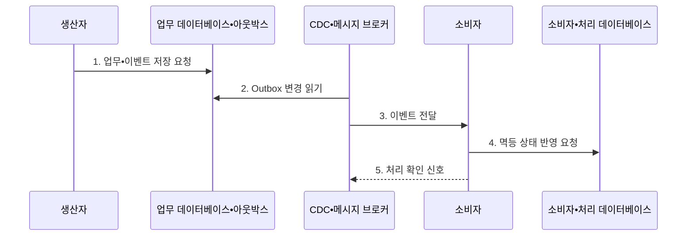

---
sidebar:
  order: 175
  label: "175. 이벤트 기반 아키텍처 (Event-Driven Architecture)"
  badge:
    text: "미출 • 70%"
    variant: note
title: "이벤트 기반 아키텍처 (Event-Driven Architecture)"
date: "2026-08-05T00:00:00+09:00"
tags:
  - "notes-software"
weight: 175
extra:
  question_no: "175"
  source_status: "미출"
  source_history: ""
  priority: 70
  priority_note: "비동기 결합•계약•재생의 분산 설계 가치"
---

## Ⅰ. 개요

<details>
<summary>핵심 용어</summary>

- **이벤트 기반 아키텍처(Event-Driven Architecture, EDA)**: 생산자가 소비자를 직접 호출하지 않고 상태 변화를 사건으로 발행하며 소비자가 독립적으로 구독•처리하는 비동기 느슨한 결합 구조이다.

</details>

- 정의/개념: **이벤트 기반 아키텍처** 는 생산자가 상태 변화를 이벤트로 발행하고 소비자가 독립적으로 구독•처리하는 비동기 느슨한 결합 아키텍처
- 배경/필요성: 연쇄 동기 호출로는 **장애 격리•서비스별 독립 확장 곤란**

#### 한줄 요약

- 주문 서비스가 수신자 주소를 모르고 주문 생성 사건을 게시하면 결제•재고•알림 서비스가 각자 속도로 읽어 처리한다.

## Ⅱ. 특징

<details>
<summary>핵심 용어</summary>

- **재전달**: 처리 실패 이벤트를 소비자에게 다시 보내는 기능이다.
- **재생**: 보존된 과거 이벤트를 지정 위치부터 다시 처리하는 기능이다.
- **최종 일관성**: 비동기 처리 뒤 서비스 상태가 같은 결과에 도달하는 성질이다.
- **브로커 보존**: 생산 시점과 소비 시점을 분리하도록 이벤트를 저장하는 기능이다.
- **구독**: 관심 이벤트를 지정한 소비자에게 전달하는 방식이다.
- **소비자 그룹**: 여러 소비자가 파티션 처리를 분담하는 단위이다.
- **파티션**: 업무 키별 순서를 유지하는 이벤트 스트림 조각이다.

</details>

- **브로커 보존•구독** 기반 시간•위치 결합 완화
- **소비자 그룹•파티션** 기반 독립 확장
- **재전달•재생•최종 일관성** 기반 비동기 운영

#### 한줄 요약

- 생산자와 소비자가 동시에 켜져 있지 않아도 브로커가 사건을 보관하지만 지연•중복•순서를 각 소비자가 명시적으로 다뤄야 한다.

## Ⅲ. 구조 및 구성요소

<details>
<summary>핵심 용어</summary>

- **변경 데이터 캡처(Change Data Capture, CDC)**: 데이터베이스 변경 로그를 읽어 아웃박스의 미발행 이벤트를 추출하는 방식이다.
- **메시지 브로커**: 이벤트를 보존해 토픽•파티션•그룹 기준으로 분배하는 구성요소이다.
- **업무 데이터베이스**: 서비스의 업무 상태를 저장하는 구성요소이다.
- **아웃박스(Outbox)**: 발행할 이벤트를 업무 상태와 한 트랜잭션에 기록하는 구성요소이다.
- **스키마 레지스트리(Schema Registry)**: 이벤트 스키마 판본과 생산자•소비자 간 호환성 규칙을 관리하는 구성요소이다.
- **데드 레터 큐(Dead Letter Queue, DLQ)**: 반복 실패 이벤트를 정상 흐름에서 격리하는 저장소이다.
- **재생 체계**: 원인을 교정한 격리 이벤트를 다시 처리하는 구성요소이다.

</details>

```text
                     [스키마 레지스트리]
                              |
[업무 데이터베이스•아웃박스] ----- [CDC•메시지 브로커] ----- [소비자•처리 데이터베이스]
                                                                  |
                                                           [DLQ•재생 체계]
```

선의 의미: CDC•메시지 브로커를 중심으로 생산 측 업무 데이터베이스•아웃박스, 계약을 관리하는 스키마 레지스트리와 소비 측 처리 데이터베이스가 결합되고, 소비 측 아래에는 실패 격리와 복구를 담당하는 DLQ•재생 체계가 놓이는 정적 구조를 뜻한다.

| 구성요소 | 책임 |
|:---|:---|
| 업무 데이터베이스•아웃박스 | 업무 상태•**이벤트 원자 기록** |
| CDC•메시지 브로커 | 변경 읽기•**이벤트 보존•분배** |
| 스키마 레지스트리 | 스키마 버전•**호환성 검사** |
| 소비자•처리 데이터베이스 | 중복 확인•**업무 상태 반영** |
| DLQ•재생 체계 | 반복 실패•**격리•재처리** |

#### 한줄 요약

- Outbox가 발송 대장을 업무와 함께 적고 브로커가 배달하며 소비자는 수령 번호를 저장해 같은 소포가 다시 와도 한 번만 반영한다.

## Ⅳ. 흐름도

<details>
<summary>핵심 용어</summary>

- **4. 멱등 상태 반영 요청**: 소비자는 처리 식별자와 업무 상태를 원자적으로 저장해 같은 이벤트가 재전달되어도 효과를 한 번만 반영한다.
- **1. 업무•이벤트 저장 요청**: 업무 상태와 아웃박스 이벤트를 단일 트랜잭션으로 기록해 이중 쓰기 불일치를 막는 단계이다.
- **2. 아웃박스 변경 읽기**: CDC로 아직 발행하지 않은 사건을 추출하는 단계이다.
- **3. 이벤트 전달**: 토픽•파티션•소비자 그룹 기준으로 사건을 대상 소비자에게 분배하는 단계이다.
- **5. 처리 확인 신호**: 성공한 소비 위치를 진행시키고 실패 이벤트는 재전달하도록 브로커에 결과를 알리는 단계이다.

</details>



**동작 원리**

1. **업무•이벤트 저장 요청**: 단일 트랜잭션 기반 이중 쓰기 방지
2. **Outbox 변경 읽기**: CDC 기반 미발행 사건 추출
3. **이벤트 전달**: 토픽•파티션•그룹 기준 분배
4. **멱등 상태 반영 요청**: 처리 식별자•업무 상태 원자 저장
5. **처리 확인 신호**: 성공 위치 진행•실패 재전달

#### 한줄 요약

- 주문과 발행 기록을 함께 저장하고 소비자가 처리 번호와 결과를 함께 커밋하면 전송이 반복돼도 결제는 한 번만 남는다.

## Ⅴ. 종류 및 비교

<details>
<summary>핵심 용어</summary>

- **이벤트 소싱**: 이벤트 소싱은 모든 상태 변경을 순서대로 저장해 현재 상태나 과거 시점 상태를 재생하는 방식이다.
- **이벤트 알림(Event Notification)**: 발생 사실과 식별자만 전달하고 소비자가 원본 상태를 다시 조회하는 방식이다.
- **상태 전송(Event-Carried State Transfer)**: 소비자가 독립 상태를 만들 수 있도록 사건과 필요한 데이터 값을 함께 전달하는 방식이다.

</details>

| 이벤트 방식 | 이벤트 알림 | 상태 전송 | 이벤트 소싱 |
|:---|:---|:---|:---|
| 적용 기준 | 작은 사건•**원본 재조회** | 소비자 **독립 상태 복제** | 완전 이력•**시점 복원** |
| 핵심 특징 | 사실•식별자 **최소 전달** | 처리 상태 **메시지 포함** | 모든 변경 **순서 저장** |
| 한계 | 생산자 조회 **의존 잔존** | 중복 데이터•**스키마 결합** | 재생•진화 **복잡성 증가** |

#### 한줄 요약

- 알림은 사건만 알려 주고 상태 전송은 처리할 값까지 담으며 이벤트 소싱은 처음부터 모든 변경을 다시 재생할 수 있게 남긴다.

## Ⅵ. 실무 고려사항 및 대책

<details>
<summary>핵심 용어</summary>

- **이중 쓰기 불일치**: 이중 쓰기 불일치는 업무 데이터 저장과 이벤트 발행 중 하나만 성공해 사건이 누락되거나 잘못 전달되는 문제다.
- **업무 키 파티션**: 같은 개체의 이벤트를 한 파티션에 배치하는 통제이다.
- **버전 검사**: 이전 버전보다 오래된 변경을 거부하는 통제이다.

</details>

| 문제 | 대책 | 효과 |
|:---|:---|:---|
| 데이터베이스•발행의 **이중 쓰기 불일치** | 아웃박스•**CDC 발행 적용** | **사건 누락 방지** |
| 재전달의 **중복 결제** | 이벤트•처리 식별자 **원자 저장** | 단일 **업무 효과 보존** |
| 파티션 간 **순서 역전** | 업무 키 파티션•**버전 검사** | **상태 역행 방지** |
| 스키마 변경의 **역직렬화 실패** | 추가 중심 변경•**스키마 레지스트리 검사** | 이전 **소비자 호환** |
| 반복 실패의 **파티션 정체** | 제한 재시도•**DLQ 격리•재처리** | 정상 **사건 처리 지속** |

#### 한줄 요약

- 실패 메시지를 끝없이 같은 파티션에서 재시도하지 말고 DLQ로 격리해 정상 주문을 계속 처리한 뒤 원인을 고쳐 재전송해야 한다.

## Ⅶ. 결론

<details>
<summary>핵심 용어</summary>

- **재생 요구**: 과거 사건에서 상태를 다시 만들 필요성이다.

</details>

- **일관성 시점•중복 위험•재생 요구** 로 동기 호출•이벤트 방식 결정

#### 한줄 요약

- 즉시 일관성이 필요한 업무는 동기 경계를 유지하고 최종 일관성을 허용하는 흐름은 Outbox•멱등성•스키마•DLQ를 갖춘 이벤트 방식으로 분리해야 한다.
