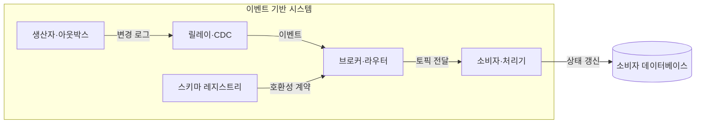
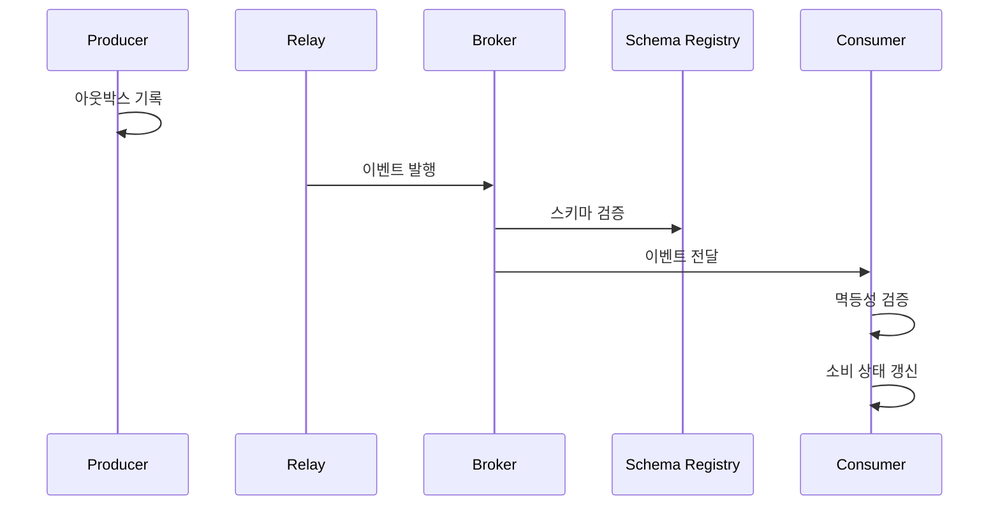

---
sidebar:
  order: 175
  label: "175. 이벤트 기반 아키텍처 (Event-Driven Architecture)"
  badge:
    text: "미출제 · 70%"
    variant: note
title: "이벤트 기반 아키텍처 (Event-Driven Architecture)"
date: "2026-07-25T00:30:00+09:00"
tags:
  - "notes-software"
weight: 175
extra:
  question_no: "175"
  source_status: "미출제"
  source_history: ""
  priority: 70
  priority_note: "비동기 결합·계약·재생이 분산 설계 핵심임"
---

## 미리 알고가기

- **이벤트 기반 아키텍처(Event-Driven Architecture, EDA)**: EDA는 ‘이디에이’로 읽고 영문 머리글자를 딴 약어이며, 이벤트 생산·발행·소비로 비동기 시스템을 구성
- **이벤트**: 시스템에서 이미 발생한 상태 변화와 문맥을 기록한 데이터임
- **생산자**: 소비자를 지정하지 않고 브로커에 이벤트를 발행하는 주체임
- **소비자**: 발행된 이벤트를 독립 구독하여 비동기로 처리하는 주체임
- **트랜잭셔널 아웃박스(Transactional Outbox)**: 업무 데이터 변경과 발행할 이벤트를 같은 데이터베이스 트랜잭션에 기록해 둘 중 하나만 저장되는 문제를 방지하는 패턴임
- **메시지 지향 미들웨어(Message-Oriented Middleware, MOM)**: MOM은 ‘엠오엠’으로 읽고 영문 머리글자를 딴 약어이며, 큐·토픽 기반 비동기 메시지 전달을 제공
- **엔터프라이즈 서비스 버스(Enterprise Service Bus, ESB)**: ESB는 ‘이에스비’로 읽고 영문 머리글자를 딴 약어이며, 라우팅·변환과 통합 흐름을 중앙 중개
- **변경 데이터 감지(Change Data Capture, CDC)**: CDC는 ‘시디시’로 읽고 영문 머리글자를 딴 약어이며, 데이터베이스 변경 로그에서 이벤트를 추출
- **데이터베이스(Database, DB)**: DB는 ‘디비’로 읽고 영문 단어를 줄인 표기이며, 생산자·소비자의 업무 상태와 아웃박스를 저장
- **브로커·토픽**: 브로커는 이벤트를 중계하고 토픽은 이벤트를 분류하는 논리 채널임
- **최종 일관성**: 서비스별 상태가 즉시 같지 않아도 이벤트 처리 후 같은 결과에 도달하는 성질임
- **멱등성**: 같은 이벤트를 여러 번 처리해도 최종 결과가 한 번 처리한 것과 같은 성질임
- **스키마 레지스트리**: 이벤트 구조와 버전을 저장하고 생산자·소비자의 호환성을 검사함
- **이벤트 알림(Event Notification)**: 상태가 바뀌었다는 사실과 식별자만 전달하고 소비자가 필요하면 원본을 다시 조회하는 방식임
- **이벤트 운반 상태 전송(Event-Carried State Transfer)**: 소비자가 독립적으로 상태를 갱신하도록 변경 데이터를 이벤트에 담아 전달하는 방식임
- **이벤트 소싱(Event Sourcing)**: 현재 상태를 직접 덮어쓰지 않고 모든 상태 변경 사건을 순서대로 저장한 뒤 재생해 상태를 복원하는 패턴임

## Ⅰ. 개요

- **정의/개념**: 생산자가 이벤트를 발행하고 비동기로 상태를 갱신함
- **배경/필요성**: 동기 호출은 서비스 결합을 높여 비동기 분리가 필요함

### 쉽게 이해하기 (학습용)
- 사건 발생을 통보하여 서비스 간 결합 없이 비동기로 처리함

## Ⅱ. 특징

- 생산자와 소비자는 서로의 주소나 시점을 몰라도 통신한다.
- 메시지 브로커가 이벤트를 중계하고 라우팅을 관리한다.
- 최종 일관성은 서비스별 상태의 수렴 지연을 허용한다.
- 처리 식별자와 멱등성으로 중복 수신의 상태 변경을 억제한다.
- 스키마 레지스트리를 통해 메시지 구조 호환성을 유지한다.

### 쉽게 이해하기 (학습용)
- 생산자와 소비자가 서로 몰라도 중복 없이 비동기로 처리함

## Ⅲ. 아키텍처 및 구성요소

| 설계 요소 | 설명 |
|:---|:---|
| 생산자·아웃박스 | 업무 변경과 이벤트를 한 트랜잭션에 기록 |
| 릴레이·CDC | 변경 로그에서 이벤트를 읽어 발행 |
| 브로커·라우터 | 토픽 규칙에 따라 소비자에 분배 |
| 스키마 레지스트리 | 이벤트 구조·버전 호환성을 검사 |
| 소비자·처리기 | 중복을 판별하고 업무 상태를 갱신 |

> 요약: 생산자·브로커·소비자가 비동기로 연결되어 상태를 갱신함

### 쉽게 이해하기 (학습용)
- 장부에 기록 후 중계기가 소비자에 전달해 갱신함

## Ⅳ. 원리 및 절차 흐름도

| 절차 | 설명 |
|:---|:---|
| 아웃박스 기록 | 상태 변경과 이벤트를 함께 기록 |
| 이벤트 발행 | CDC가 변경 로그에서 이벤트를 전송 |
| 스키마 검증 | 등록된 구조·버전과 호환성 대조 |
| 이벤트 전달 | 토픽을 구독한 소비자에 전달 |
| 멱등성 검증 | 처리 식별자로 중복 수신을 판별 |
| 소비 상태 갱신 | 소비자 업무 상태를 비동기 갱신 |

> 요약: 기록·발행·검증 후 멱등하게 비동기 상태를 갱신함

### 쉽게 이해하기 (학습용)
- 아웃박스에 저장 후 스키마와 중복을 확인하여 갱신함

## Ⅴ. 종류 및 비교

| 판단 기준 | 이벤트 알림 | 이벤트 운반 상태 전송 | 이벤트 소싱 |
|:---|:---|:---|:---|
| 핵심 특징 | 발생 사실만 전달하고 필요시 조회함 | 변경 데이터 전체를 포함해 전달함 | 모든 상태 변화 사건 자체를 순서대로 저장함 |
| 적용 기준 | 실시간 변경 통보 위주의 단순 알림 시스템임 | 생산자 장애 시에도 독립적 조회가 필요할 때임 | 금융·이력 추적 등 엄격한 감사 로그가 필요할 때임 |
| 주요 위험 | 추가 조회·생산자 결합 | 이벤트 크기·중복 데이터 | 재생 비용·스키마 진화 |

> 요약: 알림은 사실 통보, 전달은 데이터 복제, 소싱은 이력 보관임

### 쉽게 이해하기 (학습용)
- 알림은 통보, 전달은 복제, 소싱은 이력 저장함

## Ⅵ. 실무 사례

1. 주문 변경은 아웃박스와 CDC로 이벤트 유실 방지
2. 상품 검색 색인은 이벤트로 비동기 갱신함

### 쉽게 이해하기 (학습용)
- 주문은 DB 저장과 이벤트 기록을 함께 완료함
- 검색 색인은 지연돼도 마지막 상품 상태와 같아짐

## Ⅶ. 결론

- 재처리 가능한 업무에 멱등성과 지연 허용 범위를 정해 적용함

### 쉽게 이해하기 (학습용)
- 늦게 반영돼도 중복 없이 최종 상태가 같아야 함
