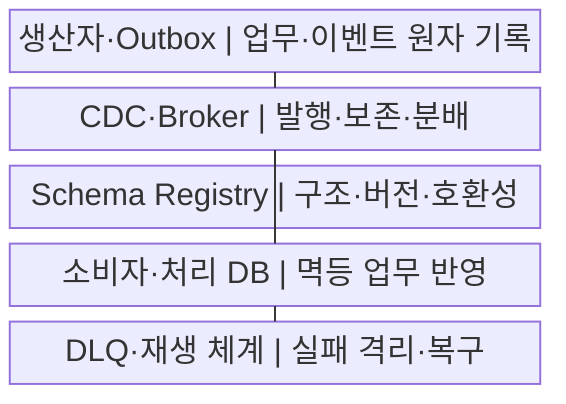
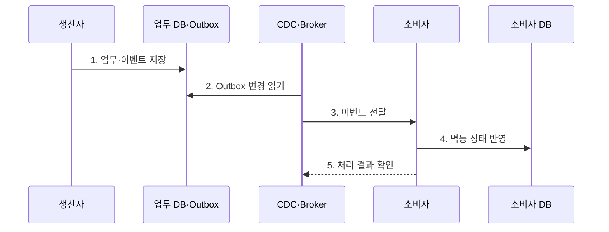

---
sidebar:
  order: 175
  label: "175. 이벤트 기반 아키텍처 (Event-Driven Architecture)"
  badge:
    text: "미출 · 70%"
    variant: note
title: "이벤트 기반 아키텍처 (Event-Driven Architecture)"
date: "2026-07-29T19:10:00+09:00"
tags:
  - "notes-software"
weight: 175
extra:
  question_no: "175"
  source_status: "미출"
  source_history: ""
  priority: 70
  priority_note: "비동기 결합·계약·재생의 분산 설계 가치"
---

## 미리 알고가기

- **이벤트 기반 아키텍처(Event-Driven Architecture, EDA)**: 발생 사건을 생산·발행·구독·처리하는 비동기 상호작용 중심 아키텍처
- **이벤트(Event)**: 주문 생성처럼 이미 발생한 상태 변화와 당시 문맥을 기록한 불변 메시지
- **생산자·소비자(Producer·Consumer)**: 이벤트를 발행하고 관심 이벤트를 구독해 처리하는 주체
- **메시지 브로커(Message Broker)**: 토픽·큐·구독으로 이벤트를 저장·중계·분배하는 기반
- **최종 일관성(Eventual Consistency)**: 서비스별 상태가 처리 후 일관된 결과로 수렴하는 성질
- **멱등성(Idempotency)**: 같은 이벤트를 여러 번 처리해도 최종 상태가 같은 성질
- **트랜잭셔널 아웃박스(Transactional Outbox)**: 업무 상태와 발행 이벤트를 같은 트랜잭션에 기록하는 패턴
- **변경 데이터 캡처(Change Data Capture, CDC)**: 데이터베이스 변경 로그에서 변경분을 읽어 전달하는 기술
- **스키마 레지스트리(Schema Registry)**: 이벤트 스키마와 버전을 저장하고 호환성을 검사하는 저장소
- **데드 레터 큐(Dead Letter Queue, DLQ)**: 반복 처리 실패 메시지를 격리해 조사·재처리하는 큐
- **이벤트 소싱(Event Sourcing)**: 모든 상태 변경 이벤트를 순서대로 저장해 현재 상태를 재생하는 패턴

## Ⅰ. 개요

- 정의/개념: 사건 발행·구독 기반 **비동기 느슨한 결합 아키텍처**
- 배경/필요성: 동기 호출의 **장애 전파·확장 결합 완화**

### 쉽게 이해하기 (학습용)

- 주문 서비스가 수신자 주소를 모르고 주문 생성 사건을 게시하면 결제·재고·알림 서비스가 각자 속도로 읽어 처리한다.

## Ⅱ. 특징

- **브로커 보존·구독** 기반 시간·위치 결합 완화
- **소비자 그룹·파티션** 기반 독립 확장
- **재전달·재생·스키마 진화** 기반 비동기 운영

### 쉽게 이해하기 (학습용)

- 생산자와 소비자가 동시에 켜져 있지 않아도 브로커가 사건을 보관하지만 지연·중복·순서를 각 소비자가 명시적으로 다뤄야 한다.

## Ⅲ. 구조 및 구성요소

| 구성요소 | 책임 |
|:---|:---|
| 생산자·Outbox | 업무 상태·**이벤트 원자 기록** |
| CDC·Broker | 변경 읽기·**이벤트 보존·분배** |
| Schema Registry | 스키마 버전·**호환성 검사** |
| 소비자·처리 DB | 중복 확인·**업무 상태 반영** |
| DLQ·재생 체계 | 반복 실패·**격리·재처리** |

### 쉽게 이해하기 (학습용)

- Outbox가 발송 대장을 업무와 함께 적고 브로커가 배달하며 소비자는 수령 번호를 저장해 같은 소포가 다시 와도 한 번만 반영한다.

## Ⅳ. 흐름도

**동작 원리**

1. **업무·이벤트 저장**: 단일 트랜잭션 기반 이중 쓰기 방지
2. **Outbox 변경 읽기**: CDC 기반 미발행 사건 추출
3. **이벤트 전달**: 토픽·파티션·그룹 기준 분배
4. **멱등 상태 반영**: 처리 ID·업무 상태 원자 저장
5. **처리 결과 확인**: 성공 위치 진행·실패 재전달

### 쉽게 이해하기 (학습용)

- 주문과 발행 기록을 함께 저장하고 소비자가 처리 번호와 결과를 함께 커밋하면 전송이 반복돼도 결제는 한 번만 남는다.

## Ⅴ. 종류 및 비교

| 이벤트 방식 | 이벤트 알림 | 상태 전송 | 이벤트 소싱 |
|:---|:---|:---|:---|
| 적용 기준 | 작은 사건·**원본 재조회** | 소비자 **독립 상태 복제** | 완전 이력·**시점 복원** |
| 핵심 특징 | 사실·식별자 **최소 전달** | 처리 상태 **메시지 포함** | 모든 변경 **순서 저장** |
| 한계 | 생산자 조회 **의존 잔존** | 중복 데이터·**스키마 결합** | 재생·진화 **복잡성 증가** |

### 쉽게 이해하기 (학습용)

- 알림은 사건만 알려 주고 상태 전송은 처리할 값까지 담으며 이벤트 소싱은 처음부터 모든 변경을 다시 재생할 수 있게 남긴다.

## Ⅵ. 실무 고려사항 및 대책

| 고려사항 | 대책 | 효과 |
|:---|:---|:---|
| DB·발행의 **이중 쓰기 불일치** | Outbox·**CDC 발행 적용** | 사건 누락 방지 |
| 재전달의 **중복 결제** | 이벤트·처리 ID **원자 저장** | 단일 업무 효과 보존 |
| 파티션 간 **순서 역전** | 업무 키 파티션·**버전 검사** | 상태 역행 방지 |
| 스키마 변경의 **역직렬화 실패** | 추가 중심 변경·**Registry 검사** | 이전 소비자 호환 |
| 반복 실패의 **파티션 정체** | 제한 재시도·**DLQ 격리·재처리** | 정상 사건 처리 지속 |

### 쉽게 이해하기 (학습용)

- 실패 메시지를 끝없이 같은 파티션에서 재시도하지 말고 DLQ로 격리해 정상 주문을 계속 처리한 뒤 원인을 고쳐 재전송해야 한다.

## Ⅶ. 결론

- **일관성 시점·중복 위험·재생 요구**로 동기 호출·이벤트 방식 결정

### 쉽게 이해하기 (학습용)

- 즉시 일관성이 필요한 업무는 동기 경계를 유지하고 최종 일관성을 허용하는 흐름은 Outbox·멱등성·스키마·DLQ를 갖춘 이벤트 방식으로 분리해야 한다.
