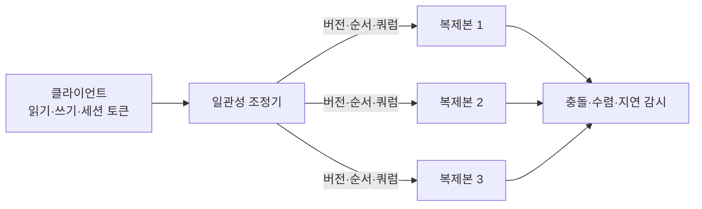
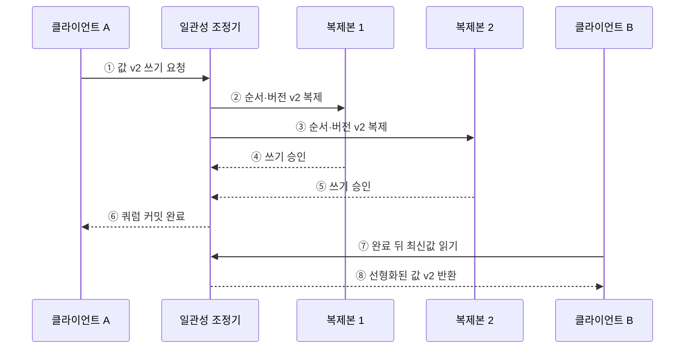

---
sidebar:
  order: 176
  label: "176. 분산 시스템 일관성 모델 (Distributed System Consistency)"
  badge:
    text: "미출제 · 70%"
    variant: note
title: "분산 시스템 일관성 모델 (Distributed System Consistency)"
date: "2026-07-25T00:30:00+09:00"
tags:
  - "notes-software"
weight: 176
extra:
  question_no: "176"
  source_status: "미출제"
  source_history: ""
  priority: 70
  priority_note: "관찰 순서와 복제 지연 선택이 독립 설계축임"
---

## 미리 알고가기

- **분산 일관성 모델(Distributed Consistency Model)**: 여러 복제본의 읽기·쓰기 결과가 사용자에게 보이는 순서와 시점을 정한 규약
- **연산 이력(History)**: 각 읽기·쓰기의 호출·응답 시점과 반환값을 기록한 실행 내역
- **선형화 가능성(Linearizability)**: 모든 연산이 호출과 응답 사이의 한 시점에 원자적으로 실행된 것처럼 보이고 실제 시간의 선후관계를 지키는 모델
- **순차 일관성(Sequential Consistency)**: 모든 연산이 하나의 전역 순서로 보이며 각 프로세스의 프로그램 순서를 지키지만 실제 시간 순서는 요구하지 않는 모델
- **인과 일관성(Causal Consistency)**: 원인과 결과 관계가 있는 연산의 순서를 모든 관찰자가 동일하게 보장하는 모델
- **최종 일관성(Eventual Consistency)**: 새 쓰기가 없으면 모든 복제본이 결국 같은 값으로 수렴하는 모델
- **논리 시계·벡터 시계(Logical Clock·Vector Clock)**: 물리 시각 대신 사건의 선후·인과·동시 관계를 나타내는 버전 정보
- **쿼럼(Quorum)**: 전체 복제본 중 읽기나 쓰기의 완료에 필요한 최소 응답 수
- **세션 보장(Session Guarantee)**: 자기 쓰기 읽기·단조 읽기처럼 한 사용자의 연속 요청에 제공하는 일관성
- **조건부 쓰기(Conditional Write)**: 현재 버전이 예상값과 같을 때만 변경해 오래된 읽기에 의한 덮어쓰기를 막는 연산
- **ACID 일관성**: 트랜잭션 전후에 업무 불변식을 지키는 속성으로, 복제본의 관찰 순서를 뜻하는 분산 일관성과 구분

## Ⅰ. 개요

- 분산 일관성 모델은 복제 지연과 동시 쓰기 상황에서 **어떤 연산 순서와 최신성을 보장할지** 정의한다.
- 강한 모델일수록 이해와 불변식 보호가 쉽지만 조정 지연과 장애 시 요청 거부가 늘 수 있다.
- 데이터별 정확성·지연·가용성 요구에 맞춰 필요한 최소 보장 수준을 선택한다.

### 쉽게 이해하기 (학습용)
- 여러 복사본을 읽을 때 어느 순서와 최신값까지 보장할지 정한 약속임

## Ⅱ. 특징

- **관찰 규약**: 저장 방식보다 클라이언트가 볼 수 있는 읽기·쓰기 결과를 정의한다.
- **순서 강도**: 실제 시간·프로그램 순서·인과 순서·수렴 중 보존 범위가 모델을 구분한다.
- **조정 비용**: 합의·리더·쿼럼 등 복제본 조정이 강한 최신성과 순서를 만든다.
- **장애 선택**: 네트워크 분할 시 강한 보장을 위해 지연·거부하거나 가용성을 위해 오래된 값을 허용한다.
- **세션 완화**: 전체 시스템은 약한 모델이어도 사용자별 최소 버전과 자기 쓰기 읽기를 보장할 수 있다.
- **업무별 적용**: 재고·잔액처럼 불변식이 강한 데이터와 피드·캐시처럼 수렴 가능한 데이터를 구분한다.

### 쉽게 이해하기 (학습용)
- 최신값을 확실히 맞출수록 복제본 확인 시간이 늘고 장애 때 응답하기 어려워짐

## Ⅲ. 아키텍처 및 구성요소

**도표안 A — 구조도**

**도표안 B — sequenceDiagram**

| 구성요소 | 역할 |
|:---|:---|
| 연산 이력 | 호출·응답 시점·프로세스 순서·반환값 기록 |
| 일관성 조정기 | 리더·합의·쿼럼·순서 정책으로 완료 시점 결정 |
| 버전 메타데이터 | 논리 시계·벡터·세션 토큰으로 선후와 최소 버전 표현 |
| 복제본 | 데이터를 저장하고 선택한 동기·비동기 방식으로 복제 |
| 읽기 정책 | 리더·쿼럼·근접 복제본·세션 최소 버전 선택 |
| 충돌 처리 | 동시 버전 탐지·병합·승자 선택·조건부 쓰기 |
| 검증 체계 | 이력 검사·복제 지연·오래된 읽기·충돌률 측정 |

**동작 원리**

- ① 클라이언트 A가 새 값 v2의 쓰기를 일관성 조정기에 요청한다.
- ② 조정기는 정해진 순서와 버전을 붙여 복제본 1에 기록을 요청한다.
- ③ 같은 순서와 버전의 기록을 복제본 2에도 요청한다.
- ④ 복제본 1이 v2를 안정적으로 기록하고 승인한다.
- ⑤ 복제본 2도 v2를 기록해 쓰기 쿼럼을 충족한다.
- ⑥ 조정기는 쓰기를 완료 처리한 뒤 클라이언트 A에 성공을 반환한다.
- ⑦ 이후 클라이언트 B가 최신값 읽기를 요청한다.
- ⑧ 선형화 모델에서는 완료된 v2보다 오래된 값이 아닌 v2를 반환한다.

### 쉽게 이해하기 (학습용)
- 쓰기 완료를 알리기 전에 필요한 복사본을 맞춰 이후 읽기가 이전 값을 보지 않게 함

## Ⅳ. 종류 및 비교

| 비교 항목 | 선형화 가능성 | 순차 일관성 | 인과 일관성 | 최종 일관성 |
|:---|:---|:---|:---|:---|
| 보장 순서 | 실제 시간과 일치하는 전역 순서 | 프로세스 순서를 지키는 전역 순서 | 인과관계가 있는 연산 순서 | 순서보다 최종 수렴 |
| 최신성 | 완료된 쓰기 이후 읽기에 강한 최신성 | 실제 시간과 다른 값 가능 | 인과 선행 값 보장 | 수렴 전 오래된 값 가능 |
| 조정 | 합의·리더·강한 쿼럼 | 전역 순서 조정 | 인과 문맥 전파 | 비동기 복제·충돌 병합 |
| 장점 | 단일 복사본처럼 이해 | 실시간 제약 없이 단일 순서 | 독립 연산 병렬성과 인과 보존 | 낮은 지연·높은 가용성 |
| 한계 | 조정 지연·분할 시 가용성 저하 | 실제 시간 최신성 오인 | 문맥 누락·메타데이터 비용 | 일시 불일치·충돌 처리 |
| 적용 | 재고 예약·리더 선출 | 복제 로그·순서형 처리 | 대화·협업·관계형 사건 | 피드·캐시·DNS형 복제 |

### 쉽게 이해하기 (학습용)
- 선형화는 실제 시간까지, 순차는 전체 줄만, 인과는 원인 순서만, 최종은 수렴만 보장함

## Ⅴ. 실무 고려사항 및 대책

| 고려사항 | 위험 | 대책 |
|:---|:---|:---|
| 업무 불변식 | 재고 음수·중복 예약·잔액 오류 | 강한 일관성·조건부 쓰기·원자 연산 적용 |
| 읽기 위치 | 근접 복제본에서 오래된 값 반환 | 리더 읽기·읽기 쿼럼·최소 버전 지정 |
| 세션 이동 | 사용자가 방금 쓴 값보다 이전 값 조회 | 세션 토큰·자기 쓰기 읽기 적용 |
| 네트워크 분할 | 무기한 대기 또는 상충 쓰기 | 시간 제한·거부 정책·충돌 해결 기준 명시 |
| 쿼럼 설정 | 지연 증가 또는 최신성 부족 | 복제 수·읽기·쓰기 쿼럼과 장애 목표 검증 |
| 시계 의존 | 물리 시각 오차로 잘못된 순서 | 논리 버전·합의 순서 사용 |
| 모델 오해 | 저장소 명칭만 믿고 보장 과대평가 | API별 공식 보장과 장애 조건을 이력 시험 |

### 쉽게 이해하기 (학습용)
- 사례: 재고 예약은 현재 버전과 수량이 맞을 때만 조건부로 차감해 초과 판매를 막음

## Ⅵ. 결론

- 분산 일관성의 핵심은 **업무가 요구하는 관찰 순서와 최신성을 명시하고 그 비용을 수용하는 것**이다.
- 모든 데이터에 가장 강한 모델을 적용하기보다 불변식·지연·가용성·충돌 비용에 맞춰 선택해야 한다.
- 세션 보장·조건부 쓰기·복제 지연 감시로 약한 모델의 사용자 혼란과 데이터 손상을 줄일 수 있다.

### 쉽게 이해하기 (학습용)
- 재고는 즉시 맞추고 피드는 잠시 달라도 수렴하게 설계함
