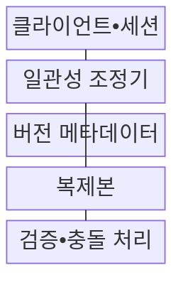
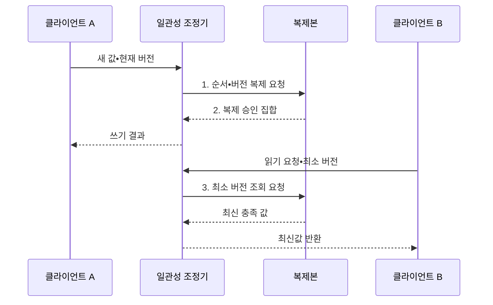

---
sidebar:
  order: 176
  label: "176. 분산 시스템 일관성 모델 (Distributed System Consistency)"
  badge:
    text: "미출 • 70%"
    variant: note
title: "분산 시스템 일관성 모델 (Distributed System Consistency)"
date: "2026-08-03T08:48:47+09:00"
tags:
  - "notes-software"
weight: 176
extra:
  question_no: "176"
  source_status: "미출"
  source_history: ""
  priority: 70
  priority_note: "관찰 순서와 복제 지연의 설계 가치"
---

## Ⅰ. 개요

핵심 용어

- **분산 시스템 일관성 모델(Distributed System Consistency Model)**: 여러 복제본의 읽기•쓰기가 클라이언트에게 보이는 순서와 최신성의 보장 수준을 정한 의미 규약이다.

- 정의/개념: **분산 일관성 모델** 은 여러 복제본에서 수행한 읽기•쓰기가 클라이언트에게 어떤 순서와 최신성으로 관찰되는지를 정한 의미 규약
- 배경/필요성: 네트워크 지연•분할로 **모든 복제본의 즉시 동일 상태 유지 불가**

#### 한줄 요약

- 여러 지점의 같은 장부를 읽을 때 어떤 순서와 얼마나 최신인 값을 반드시 보여 줄지 약속하는 모델이다.

## Ⅱ. 특징

핵심 용어

- **리더•합의•쿼럼**: 리더는 쓰기 순서를 조정하고 합의와 쿼럼은 복제본 사이에서 완료와 결정 조건을 확정한다.
- **실제 시간•프로그램•인과•수렴 순서**: 연산의 현실 선후, 프로세스 내부 순서, 원인 관계, 최종 동일 상태 중 보장할 범위를 구분하는 기준이다.
- **세션 토큰•조건부 쓰기**: 클라이언트가 이미 본 최소 버전을 전달하고 현재 버전이 일치할 때만 변경해 약한 일관성을 보완하는 수단이다.

- **실제 시간•프로그램•인과•수렴** 기반 강도 구분
- **리더•합의•쿼럼** 기반 복제본 조정
- **세션 토큰•조건부 쓰기** 기반 약한 보장 보완

#### 한줄 요약

- 모든 복사본의 최신값을 확인할수록 응답은 늦고 분할 때 거부될 수 있으므로 재고와 피드에 같은 강도를 적용하지 않는다.

## Ⅲ. 구조 및 구성요소

핵심 용어

- **일관성 조정기**: 일관성 조정기는 요구 모델에 따라 리더, 연산 순서, 읽기•쓰기 완료 쿼럼을 결정한다.
- **클라이언트•세션**: 요청과 이미 관찰한 최소 데이터 버전을 조정기에 전달하는 구성요소이다.
- **버전 메타데이터**: 변경 사건의 선후•인과•동시 관계를 표현하는 정보이다.
- **복제본**: 데이터를 저장하고 동기 또는 비동기 방식으로 변경을 복제하는 구성요소이다.
- **검증•충돌 처리**: 실행 이력을 검사하고 동시 변경을 탐지•병합하는 구성요소이다.

| 구성요소 | 책임 |
|:---|:---|
| 클라이언트•세션 | 요청•**최소 관찰 버전 전달** |
| 일관성 조정기 | 리더•순서•**완료 쿼럼 결정** |
| 버전 메타데이터 | 사건 선후•**인과•동시 표현** |
| 복제본 | 데이터 저장•**동기•비동기 복제** |
| 검증•충돌 처리 | 이력 검사•**충돌 탐지•병합** |

#### 한줄 요약

- 조정기가 필요한 복사본의 승인을 모아 완료를 알리고 버전 정보가 동시 변경을 구분해 충돌 처리 기준을 제공한다.

## Ⅳ. 흐름도

핵심 용어

- **2. 복제 승인 집합**: 필요한 복제본의 승인 집합이 요구 쿼럼을 충족하면 쓰기 완료를 확정한다.
- **1. 순서•버전 복제 요청**: 조정기가 쓰기 순서와 조건부 버전을 복제본에 기록하도록 요청하는 단계이다.
- **쿼럼(Quorum)**: 전체 복제본 중 연산 완료를 인정하기 위해 응답해야 하는 최소 개수이다.
- **3. 최소 버전 조회 요청**: 일관성 모델과 세션이 보장한 버전 이상을 가진 복제본에서 값을 읽도록 요청하는 단계이다.

**동작 원리**

1. **순서•버전 복제 요청**: 쓰기 순서와 조건부 버전을 복제본에 기록
2. **복제 승인 집합**: 요구 쿼럼 충족 시 쓰기 완료 확정
3. **최소 버전 조회 요청**: 모델과 세션이 보장한 최신성 적용

#### 한줄 요약

- 선형화 모델은 쓰기 성공을 받은 뒤 다른 사용자가 읽을 때 이전 값이 나오지 않도록 완료 전에 필요한 복제본을 맞춘다.

## Ⅴ. 종류 및 비교

핵심 용어

- **선형화**: 선형화는 연산이 한 시점에 실행된 것처럼 보이고 실제 시간의 선후와 전역 최신성을 보장하는 모델이다.
- **순차 일관성(Sequential Consistency)**: 모든 프로세스의 연산이 각자의 프로그램 순서를 지키는 하나의 전역 순서로 관찰되는 모델이다.
- **인과 일관성(Causal Consistency)**: 원인과 결과 관계가 있는 연산의 순서를 모든 관찰자가 동일하게 보는 모델이다.
- **최종 일관성(Eventual Consistency)**: 새 변경이 없으면 모든 복제본이 궁극적으로 같은 상태에 수렴하는 모델이다.

| 일관성 모델 | 선형화 | 순차 일관성 | 인과 일관성 | 최종 일관성 |
|:---|:---|:---|:---|:---|
| 적용 기준 | 재고•잔액의 **실시간 불변식** | 모든 연산의 **단일 전역 순서** | 대화•협업의 **원인 순서** | 피드•캐시의 **최종 수렴** |
| 핵심 특징 | 실제 시간•**전역 최신성** | 프로세스 순서•**전역 배열** | 인과 문맥•**관련 순서** | 비동기 복제•**충돌 병합** |
| 한계 | 조정 지연•**분할 시 거부** | 실시간 **최신성 미보장** | 문맥•메타데이터 **비용** | 오래된 읽기•**일시 충돌** |

#### 한줄 요약

- 선형화는 실제 시간까지, 순차 일관성은 모두가 보는 한 순서까지, 인과 일관성은 원인 순서까지 지키며 최종 일관성은 잠시 달라도 결국 같은 값으로 모인다.

## Ⅵ. 실무 고려사항 및 대책

핵심 용어

- **오래된 읽기**: 오래된 읽기는 복제 지연 때문에 사용자가 이미 완료된 쓰기보다 이전 버전의 값을 관찰하는 문제다.
- **조건부 차감**: 현재 버전과 잔여 수량 조건을 만족할 때만 재고를 감소시키는 원자적 쓰기이다.
- **자기 쓰기 읽기(Read-Your-Writes)**: 한 세션이 완료한 자신의 쓰기보다 오래된 값을 이후 읽기에서 보지 않게 하는 보장이다.
- **이력 시험(History Test)**: 실제 연산의 호출•응답 기록이 주장한 일관성 모델을 만족하는지 검증하는 시험이다.

| 문제 | 대책 | 효과 |
|:---|:---|:---|
| 동시 예약의 **재고 음수** | 강한 일관성•**조건부 차감** | **초과 판매 방지** |
| 근접 복제본의 **오래된 읽기** | 리더•쿼럼•**최소 버전 읽기** | **최신성 요구 충족** |
| 세션 이동의 **자기 쓰기 누락** | 세션 토큰•**자기 쓰기 읽기** | **사용자 혼란 방지** |
| 네트워크 분할의 **무기한 대기** | 시간 제한•**거부•충돌 정책** | **장애 행동 명확화** |
| 저장소 명칭의 **보장 오해** | 인터페이스별 장애 조건•**이력 시험** | 실제 **보장 수준 확인** |

#### 한줄 요약

- 재고는 현재 버전과 수량이 맞을 때만 차감하고 사용자가 방금 쓴 프로필은 세션 토큰보다 오래된 복제본에서 읽지 않게 해야 한다.

## Ⅶ. 결론

핵심 용어

- **업무 불변식•지연 목표•분할 가용성**: 일관성 강도는 업무 불변식, 허용 지연, 네트워크 분할 중 필요한 가용성을 기준으로 정한다.

- **업무 불변식•지연 목표•분할 가용성** 으로 최소 일관성 강도 결정

#### 한줄 요약

- 재고•잔액은 강한 보장과 조건부 쓰기를 사용하고 피드•캐시는 세션 보장과 충돌 수렴으로 지연과 가용성을 확보해야 한다.
