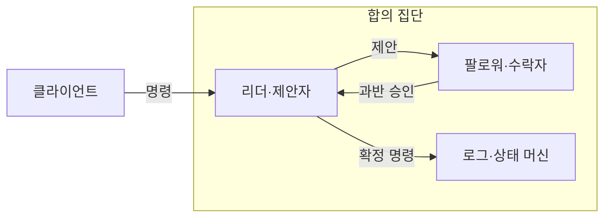

---
sidebar:
  order: 177
  label: "177. 분산 합의 — Raft·Paxos (Distributed Consensus Raft Paxos)"
  badge:
    text: "미출제 · 50%"
    variant: note
title: "분산 합의 — Raft·Paxos (Distributed Consensus Raft Paxos)"
date: "2026-07-25T00:30:00+09:00"
tags:
  - "notes-software"
weight: 177
extra:
  question_no: "177"
  source_status: "미출제"
  source_history: ""
  priority: 50
  priority_note: "과반수·리더 교체·로그 안전성이 독립 기반임"
---

## 미리 알고가기

- **분산 합의(Distributed Consensus)**: 일부 노드가 고장 나도 정상 노드들이 같은 값과 순서를 결정하는 절차임
- **다수 쿼럼(Majority Quorum)**: 두 과반 집합이 겹쳐 이전 결정을 보존하는 정족수임
- **래프트(Raft)**: 리더가 로그를 복제하고 과반 확인 뒤 커밋하는 합의 알고리즘임
- **팍소스(Paxos)**: 제안 번호와 2단계 투표로 하나의 값을 결정하는 합의 알고리즘임
- **멀티 팍소스(Multi-Paxos)**: 안정된 리더가 준비 단계를 재사용해 연속 값을 합의하는 방식임
- **합의 가용성**: 과반과 통신할 수 없으면 새 값의 커밋을 중단하는 성질임
- **임기·제안 번호**: 이전 리더나 제안을 구분해 오래된 결정을 거부하는 증가 번호임
- **커밋·상태 머신**: 커밋은 값을 확정하며 상태 머신은 확정 명령을 순서대로 실행함
- **슬롯·인덱스**: 합의한 명령이 들어갈 로그 위치를 식별하는 번호임
- **데이터베이스(Database, DB)**: DB는 ‘디비’로 읽고 영문 단어를 줄인 표기이며, 합의된 로그를 복제해 동일 상태를 유지하는 적용 대상임

## Ⅰ. 개요

- 정의/개념: 과반 쿼럼과 세대 번호 기반 분산 합의
- **배경/필요성**: 노드 장애가 결정을 갈라 동일 명령 순서 합의가 필요함

### 쉽게 이해하기 (학습용)
- 일부 단절 시에도 과반 확인으로 순서를 지킴

## Ⅱ. 특징

- 정상 노드는 같은 순서의 명령을 적용한다.
- 새 리더는 이전 확정 기록을 보존한다.
- 투표와 로그를 장애 후에도 남도록 저장한다.
- Raft는 이전 인덱스로 로그 충돌을 복구한다.
- Paxos는 가장 높은 번호의 승인값을 보존한다.
- 로그 압축과 명령 중복 제거를 적용한다.

### 쉽게 이해하기 (학습용)
- 높은 임기 리더가 과거의 기록을 이어받음

## Ⅲ. 아키텍처 및 구성요소

| 설계 요소 | 설명 |
|:---|:---|
| 리더·제안자 | 임기·인덱스를 정해 쿼럼에 명령 제안 |
| 팔로워·수락자 | 투표·승인값을 저장하고 제안에 응답 |
| 로그·상태 머신 | 명령을 적용하고 오래된 로그를 압축함 |

> 요약: 제안 명령을 과반 승인 후 상태 머신에 확정

### 쉽게 이해하기 (학습용)
- 명령과 세대 번호로 승인을 얻어 순차 적용함

## Ⅳ. 원리 및 절차 흐름도

- 증가 번호로 오래된 리더·제안을 거부
- 겹치는 과반으로 이전 승인값을 보존
- 확정 순서대로 상태 머신에 명령 적용

> 요약: 이전 상태를 보존하고 승인된 명령을 적용

### 쉽게 이해하기 (학습용)
- 옛 회의록을 확인하고 과반에 승인받아 실행함

## Ⅴ. 종류 및 비교

| 판단 기준 | Raft | Paxos |
|:---|:---|:---|
| 핵심 특징 | 리더가 후속 연속 로그 결정 | 제안자가 슬롯별 값 결정 |
| 적용 기준 | 로그 복제·운영 이해도 우선 | 일반 합의·다양한 리더 구조 |
| 주요 위험 | 리더 병목·선거 지연 | 구현 복잡도·진행성 입증 |

> 요약: Raft는 연속 로그, Paxos는 슬롯별로 결정

### 쉽게 이해하기 (학습용)
- Raft는 연속 맞춤, Paxos는 칸별 승인임

## Ⅵ. 실무 사례

1. 설정 저장소는 Raft 과반 승인 후 변경 확정

### 쉽게 이해하기 (학습용)
- 설정 저장소는 과반 단절 시 쓰기를 멈춤

## Ⅶ. 결론

- 노드 장애 중에도 동일한 결정과 로그 순서를 유지하기 위해 **과반수·리더 선출·로그 일치·네트워크 분할**을 검토하고, 쿼럼을 확보할 수 있는 제어 데이터에 합의 알고리즘을 적용한다

### 쉽게 이해하기 (학습용)
- 소수 노드만 남았을 때 잘못된 새 값을 쓰면 안 됨
