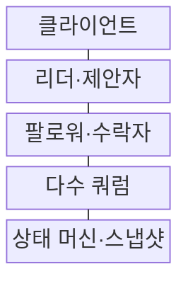
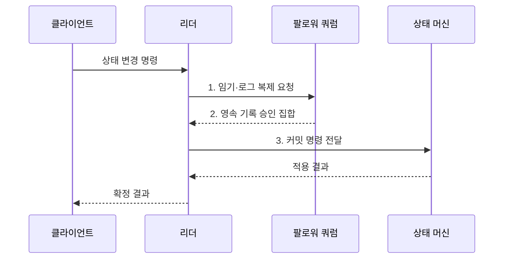

---
sidebar:
  order: 177
  label: "177. 분산 합의: Raft·Paxos (Distributed Consensus Raft Paxos)"
  badge:
    text: "미출 · 50%"
    variant: note
title: "분산 합의: Raft·Paxos (Distributed Consensus Raft Paxos)"
date: "2026-07-31T10:42:28+09:00"
tags:
  - "notes-software"
weight: 177
extra:
  question_no: "177"
  source_status: "미출"
  source_history: ""
  priority: 50
  priority_note: "과반수·리더 교체·로그 안전성의 기반 가치"
---

## 미리 알고가기

- **분산 합의(Distributed Consensus)**: 일부 노드·통신 실패에도 정상 노드들이 같은 값과 순서를 결정하는 절차
- **안전성·진행성(Safety·Liveness)**: 다른 값의 동시 확정을 막고 통신 가능 시 새 결정을 계속 내리는 성질
- **다수 쿼럼(Majority Quorum)**: 전체 노드 절반을 초과해 서로 다른 두 집합이 반드시 겹치는 정족수
- **Raft**: 리더 선출·로그 복제·안전성 규칙으로 복제 상태 머신을 구현하는 합의 알고리즘
- **Paxos·Multi-Paxos**: 제안 번호와 쿼럼으로 값 또는 연속 슬롯의 값을 선택하는 합의 알고리즘
- **임기·제안 번호(Term·Proposal Number)**: 오래된 리더·제안과 새 세대를 구분하는 증가 번호
- **로그 인덱스·슬롯(Log Index·Slot)**: 합의된 명령이 놓이는 순서 위치
- **커밋(Commit)**: 합의 규칙을 충족해 명령을 확정하고 상태 머신에 적용할 수 있는 상태
- **복제 상태 머신(Replicated State Machine)**: 정상 노드가 같은 명령을 같은 순서로 실행해 같은 상태를 유지하는 구조
- **스냅샷(Snapshot)**: 오래된 로그를 압축하기 위해 특정 시점의 상태와 적용 위치를 저장한 사본
- **리더·팔로워(Leader·Follower)**: Raft에서 로그를 제안·복제하는 대표 노드와 이를 검증·기록하는 노드
- **제안자·수락자(Proposer·Acceptor)**: Paxos에서 값과 번호를 제안하는 역할과 제안을 약속·승인하는 역할
- **준비·수락(Prepare·Accept)**: Paxos가 더 큰 제안 번호를 약속받고 값을 쿼럼에 승인받는 두 단계

## Ⅰ. 개요

- 정의/개념: 장애 중에도 **단일 값·명령 순서**를 정하는 절차
- 배경/필요성: 독립 노드 판단으로는 분할 중 **리더·설정의 단일 결정 보장 불가**

### 쉽게 이해하기 (학습용)

- 서버 일부가 끊겨도 과반 장부가 겹치는 성질을 이용해 같은 순서 위치에 두 개의 다른 명령이 확정되지 않게 한다.

## Ⅱ. 특징

- **교차 쿼럼** 기반 이전 결정 보존
- **임기·제안 번호** 기반 오래된 리더 차단
- **확정 로그·결정적 실행** 기반 상태 일치

### 쉽게 이해하기 (학습용)

- 새 대표는 과반에 남은 이전 기록을 이어받고 과반과 통신하지 못하는 대표는 새 결정을 확정하지 못한다.

## Ⅲ. 구조 및 구성요소

| 구성요소 | 책임 |
|:---|:---|
| 클라이언트 | 명령·**중복 요청 식별자 전달** |
| 리더·제안자 | 세대·순서·**값 제안·승인 수집** |
| 팔로워·수락자 | 투표·제안·**로그 영속 기록** |
| 다수 쿼럼 | 교차 승인·**이전 결정 보존** |
| 상태 머신·스냅샷 | 확정 명령·**결정적 실행·압축** |

### 쉽게 이해하기 (학습용)

- 리더가 안건을 내면 팔로워가 장부에 기록하고 과반 승인 뒤 상태 머신이 같은 순서로 실행하며 스냅샷이 오래된 장부를 압축한다.

## Ⅳ. 흐름도

**동작 원리**

1. **임기·로그 복제 요청**: 이전 로그 일치 검사 후 새 명령 기록
2. **영속 기록 승인 집합**: 디스크 기록을 마친 다수 쿼럼 확인
3. **커밋 명령 전달**: 확정된 명령을 동일 순서로 실행

### 쉽게 이해하기 (학습용)

- 세 노드 중 두 노드가 같은 명령을 기록해야 확정하므로 한 노드가 끊겨도 두 개의 서로 다른 과반 결정은 생기지 않는다.

## Ⅴ. 종류 및 비교

| 합의 방식 | Raft | Paxos·Multi-Paxos |
|:---|:---|:---|
| 적용 기준 | 로그 복제·**운영 이해성** | 일반 값 합의·**다양한 변형** |
| 핵심 특징 | 임기·리더·**로그 일치 검사** | 제안 번호·**Prepare·Accept** |
| 한계 | 선거 충돌·**리더 병목** | 역할·단계·**구현 복잡성** |

### 쉽게 이해하기 (학습용)

- Raft는 리더 선출과 로그 복제 절차를 분리해 설명하고 Paxos는 번호가 더 큰 제안이 과거 승인값을 이어받는 원리를 중심으로 한다.

## Ⅵ. 실무 고려사항 및 대책

| 고려사항 | 대책 | 효과 |
|:---|:---|:---|
| 동일 영역의 **쿼럼 동시 상실** | 홀수 노드·**독립 장애 영역 분산** | 합의 **가용성 확보** |
| 승인 뒤 **로그 유실** | 투표·로그 **내구성·손상 검사** | 합의 **안전성 보존** |
| 짧은 선거 시간의 **반복 선거** | 지연 분포 기반 **무작위 시간 설정** | **리더 안정화** |
| 비결정 명령의 **상태 분기** | 시간·난수 결과를 **로그에 기록** | 노드 **상태 일치** |
| 응답 유실의 **중복 명령** | 세션·요청 번호 **중복 제거** | 단일 **업무 효과** |

### 쉽게 이해하기 (학습용)

- 설정 저장소는 과반이 기록하지 못하면 새 설정을 거부하고 시간이나 난수 결과도 로그에 넣어 모든 노드가 같은 값을 실행하게 해야 한다.

## Ⅶ. 결론

- 단일 결정이 필요한 제어 상태만 **합의**, 쿼럼 상실 시 **쓰기 거부**

### 쉽게 이해하기 (학습용)

- 리더·설정처럼 하나의 정답이 필요한 제어 상태에만 합의를 사용하고 과반 상실 시 쓰기를 거부해 서로 다른 결정의 동시 확정을 막아야 한다.
