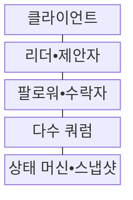
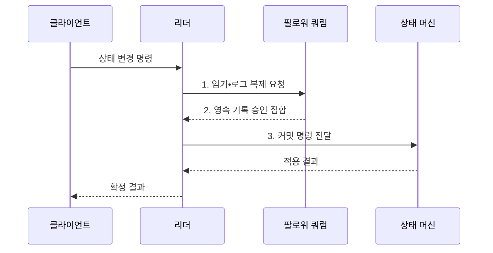

---
sidebar:
  order: 177
  label: "177. 분산 합의: Raft•Paxos (Distributed Consensus Raft Paxos)"
  badge:
    text: "미출 • 50%"
    variant: note
title: "분산 합의: Raft•Paxos (Distributed Consensus Raft Paxos)"
date: "2026-08-03T08:48:47+09:00"
tags:
  - "notes-software"
weight: 177
extra:
  question_no: "177"
  source_status: "미출"
  source_history: ""
  priority: 50
  priority_note: "과반수•리더 교체•로그 안전성의 기반 가치"
---

## Ⅰ. 개요

핵심 용어

- **분산 합의(Distributed Consensus)**: 일부 노드나 통신이 실패해도 정상 노드들이 하나의 값이나 명령 순서를 안전하게 결정하는 프로토콜 절차이다.

- 정의/개념: **분산 합의** 는 일부 노드와 네트워크에 장애가 있어도 정상 노드들이 하나의 값이나 명령 순서를 선택하도록 하는 프로토콜 절차
- 배경/필요성: 독립 노드 판단으로는 분할 중 **리더•설정의 단일 결정 보장 불가**

#### 한줄 요약

- 서버 일부가 끊겨도 과반 장부가 겹치는 성질을 이용해 같은 순서 위치에 두 개의 다른 명령이 확정되지 않게 한다.

## Ⅱ. 특징

핵심 용어

- **교차 쿼럼**: 교차 쿼럼은 서로 다른 두 다수 집합이 적어도 한 노드에서 겹쳐 이전 결정을 새 결정에 전달하게 한다.
- **임기•제안 번호**: 새 리더나 제안이 이전 세대보다 최신임을 식별해 오래된 주체의 결정을 차단하는 단조 증가 번호이다.
- **확정 로그•결정적 실행**: 합의한 명령을 동일 순서로 적용하고 같은 입력에서 모든 노드가 같은 결과를 내게 하는 방식이다.

- **교차 쿼럼** 기반 이전 결정 보존
- **임기•제안 번호** 기반 오래된 리더 차단
- **확정 로그•결정적 실행** 기반 상태 일치

#### 한줄 요약

- 새 대표는 과반에 남은 이전 기록을 이어받고 과반과 통신하지 못하는 대표는 새 결정을 확정하지 못한다.

## Ⅲ. 구조 및 구성요소

핵심 용어

- **다수 쿼럼**: 다수 쿼럼은 전체 노드 절반을 초과하는 승인 집합으로 서로 다른 값의 동시 확정을 막는다.
- **리더•제안자(Leader•Proposer)**: 세대와 순서를 부여한 값을 제안하고 승인 집합을 수집하는 역할이다.
- **팔로워•수락자(Follower•Acceptor)**: 투표•제안•로그를 영속 기록하고 제안에 응답하는 역할이다.
- **상태 머신•스냅샷(State Machine•Snapshot)**: 확정 명령을 결정적으로 실행하고 오래된 로그 상태를 압축하는 구성요소이다.

| 구성요소 | 책임 |
|:---|:---|
| 클라이언트 | 명령•**중복 요청 식별자 전달** |
| 리더•제안자 | 세대•순서•**값 제안•승인 수집** |
| 팔로워•수락자 | 투표•제안•**로그 영속 기록** |
| 다수 쿼럼 | 교차 승인•**이전 결정 보존** |
| 상태 머신•스냅샷 | 확정 명령•**결정적 실행•압축** |

#### 한줄 요약

- 리더가 안건을 내면 팔로워가 장부에 기록하고 과반 승인 뒤 상태 머신이 같은 순서로 실행하며 스냅샷이 오래된 장부를 압축한다.

## Ⅳ. 흐름도

핵심 용어

- **3. 커밋 명령 전달**: 다수 쿼럼이 영속 기록한 명령을 커밋해 상태 머신이 모든 정상 노드에서 같은 순서로 실행하게 한다.
- **1. 임기•로그 복제 요청**: 이전 로그의 일치 여부를 검사하고 새 명령을 현재 임기와 함께 기록하도록 요청하는 단계이다.
- **2. 영속 기록 승인 집합**: 명령을 안정 저장소에 기록한 팔로워의 응답이 다수 쿼럼을 충족한 결과이다.

**동작 원리**

1. **임기•로그 복제 요청**: 이전 로그 일치 검사 후 새 명령 기록
2. **영속 기록 승인 집합**: 디스크 기록을 마친 다수 쿼럼 확인
3. **커밋 명령 전달**: 확정된 명령을 동일 순서로 실행

#### 한줄 요약

- 세 노드 중 두 노드가 같은 명령을 기록해야 확정하므로 한 노드가 끊겨도 두 개의 서로 다른 과반 결정은 생기지 않는다.

## Ⅴ. 종류 및 비교

핵심 용어

- **Raft**: Raft는 리더 선출, 로그 복제, 안전성 규칙으로 복제 상태 머신을 구현하는 합의 알고리즘이다.
- **래프트(Raft)**: 리더 선출•로그 복제•안전성 규칙을 명시적으로 분리해 복제 상태 머신을 구현하는 합의 알고리즘이다.
- **팩소스•멀티팩소스(Paxos•Multi-Paxos)**: 제안 번호와 준비•수락 단계로 이전 승인값을 보존하며 하나 또는 연속된 값을 합의하는 알고리즘이다.

| 합의 방식 | Raft | Paxos•Multi-Paxos |
|:---|:---|:---|
| 적용 기준 | 로그 복제•**운영 이해성** | 일반 값 합의•**다양한 변형** |
| 핵심 특징 | 임기•리더•**로그 일치 검사** | 제안 번호•**Prepare•Accept** |
| 한계 | 선거 충돌•**리더 병목** | 역할•단계•**구현 복잡성** |

#### 한줄 요약

- Raft는 리더 선출과 로그 복제 절차를 분리해 설명하고 Paxos는 번호가 더 큰 제안이 과거 승인값을 이어받는 원리를 중심으로 한다.

## Ⅵ. 실무 고려사항 및 대책

핵심 용어

- **쿼럼 동시 상실**: 쿼럼 동시 상실은 같은 장애 영역의 노드들이 함께 실패해 과반 승인을 만들 수 없고 합의 진행이 멈추는 문제다.
- **내구성•손상 검사**: 승인한 투표와 로그를 안정 저장소에 기록하고 재시작 시 무결성을 검증하는 안전성 통제이다.
- **무작위 선거 시간**: 후보별 선거 제한 시간을 다르게 선택해 반복적인 동시 선거를 줄이는 설정이다.
- **세션•요청 번호 중복 제거**: 재시도 명령을 같은 클라이언트 요청으로 식별해 업무 효과를 한 번만 적용하는 방식이다.

| 문제 | 대책 | 효과 |
|:---|:---|:---|
| 동일 영역의 **쿼럼 동시 상실** | 홀수 노드•**독립 장애 영역 분산** | 합의 **가용성 확보** |
| 승인 뒤 **로그 유실** | 투표•로그 **내구성•손상 검사** | 합의 **안전성 보존** |
| 짧은 선거 시간의 **반복 선거** | 지연 분포 기반 **무작위 시간 설정** | **리더 안정화** |
| 비결정 명령의 **상태 분기** | 시간•난수 결과를 **로그에 기록** | 노드 **상태 일치** |
| 응답 유실의 **중복 명령** | 세션•요청 번호 **중복 제거** | 단일 **업무 효과** |

#### 한줄 요약

- 설정 저장소는 과반이 기록하지 못하면 새 설정을 거부하고 시간이나 난수 결과도 로그에 넣어 모든 노드가 같은 값을 실행하게 해야 한다.

## Ⅶ. 결론

핵심 용어

- **쓰기 거부**: 단일 결정이 필요한 제어 상태는 합의로 보호하고 과반 쿼럼을 잃으면 서로 다른 결정을 막기 위해 쓰기를 거부해야 한다.

- 단일 결정이 필요한 제어 상태만 **합의**, 쿼럼 상실 시 **쓰기 거부**

#### 한줄 요약

- 리더•설정처럼 하나의 정답이 필요한 제어 상태에만 합의를 사용하고 과반 상실 시 쓰기를 거부해 서로 다른 결정의 동시 확정을 막아야 한다.
