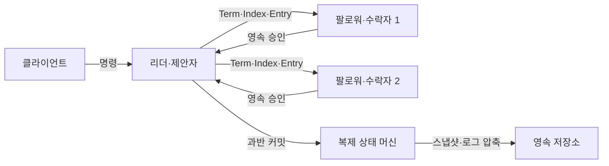
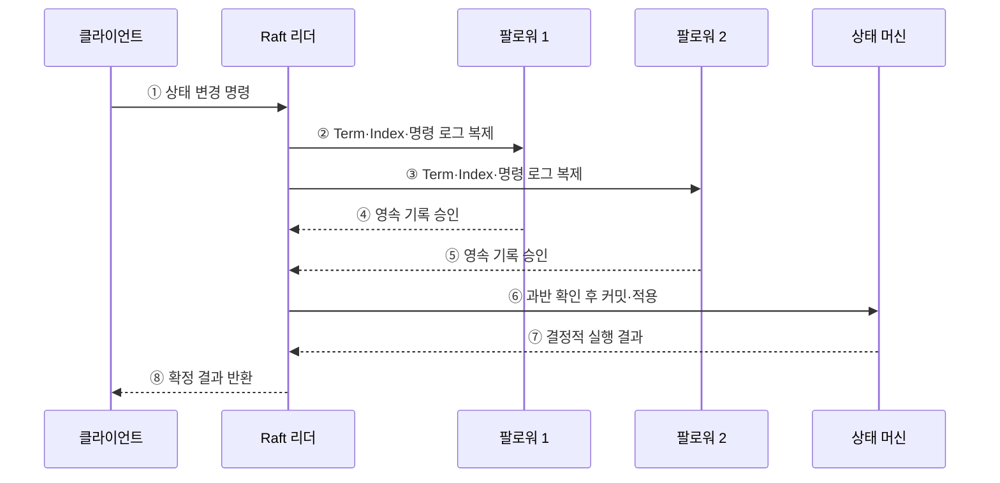

---
sidebar:
  order: 177
  label: "177. 분산 합의 — Raft·Paxos (Distributed Consensus Raft Paxos)"
  badge:
    text: "미출제 · 50%"
    variant: note
title: "분산 합의 — Raft·Paxos (Distributed Consensus Raft Paxos)"
date: "2026-07-25T00:30:00+09:00"
tags:
  - "notes-software"
weight: 177
extra:
  question_no: "177"
  source_status: "미출제"
  source_history: ""
  priority: 50
  priority_note: "과반수·리더 교체·로그 안전성이 독립 기반임"
---

## 미리 알고가기

- **분산 합의(Distributed Consensus)**: 일부 노드·통신이 실패해도 정상 노드들이 같은 값과 순서를 결정하는 절차
- **안전성(Safety)**: 서로 다른 정상 노드가 같은 위치에 다른 값을 확정하지 않는 성질
- **진행성(Liveness)**: 필요한 노드와 통신이 가능할 때 새로운 결정을 계속 내릴 수 있는 성질
- **다수 쿼럼(Majority Quorum)**: 전체 노드의 절반을 초과한 집합으로, 서로 다른 두 다수 집합이 최소 한 노드에서 겹치는 정족수
- **래프트(Raft)**: 리더 선출·로그 복제·안전성 규칙으로 복제 상태 머신을 구현하는 합의 알고리즘
- **팍소스(Paxos)**: 고유한 제안 번호와 Prepare·Accept 단계의 쿼럼으로 하나의 값을 선택하는 합의 알고리즘
- **멀티 팍소스(Multi-Paxos)**: 안정된 리더가 Prepare 결과를 재사용해 연속된 여러 슬롯의 값을 효율적으로 합의하는 방식
- **임기(Term)·제안 번호(Proposal Number)**: 오래된 리더·제안과 새로운 세대를 구분하는 단조 증가 번호
- **로그 인덱스(Log Index)·슬롯(Slot)**: 합의된 명령이 놓이는 순서 위치
- **커밋(Commit)**: 합의 규칙을 충족해 명령을 확정하고 상태 머신에 적용할 수 있게 된 상태
- **복제 상태 머신(Replicated State Machine)**: 모든 정상 노드가 같은 명령을 같은 순서로 실행해 같은 상태를 유지하는 구조
- **스냅샷(Snapshot)**: 오래된 로그를 압축하기 위해 특정 시점의 상태와 적용 위치를 저장한 사본

## Ⅰ. 개요

- 분산 합의는 장애와 메시지 지연 중에도 **하나의 값과 명령 순서를 안전하게 결정**한다.
- Raft와 Paxos는 서로 겹치는 쿼럼과 세대 번호로 과거의 결정을 새 리더·제안이 덮지 못하게 한다.
- 모든 데이터 복제에 필요한 기술이 아니라, 리더·설정·메타데이터처럼 단일 결정이 필요한 제어 상태에 사용한다.

### 쉽게 이해하기 (학습용)
- 서버 일부가 끊겨도 과반의 겹치는 기록으로 하나의 결정만 확정함

## Ⅱ. 특징

- **쿼럼 교차**: 두 과반 집합의 공통 노드가 이전 승인·로그 정보를 다음 결정에 전달한다.
- **세대 구분**: 임기·제안 번호가 오래된 리더와 지연 메시지를 식별한다.
- **영속 기록**: 투표·승인값·로그를 장애 후에도 남겨 같은 위치의 다른 값 확정을 막는다.
- **리더 최적화**: 안정된 리더가 클라이언트 명령의 순서를 정하고 반복 합의 비용을 줄인다.
- **상태 머신 적용**: 확정된 로그만 모든 노드가 같은 순서로 실행한다.
- **가용성 제한**: 다수 쿼럼과 통신하지 못하는 쪽은 새 결정을 확정하지 않는다.

### 쉽게 이해하기 (학습용)
- 새 대표는 과반에 남은 이전 결정부터 이어받아 다음 명령을 정함

## Ⅲ. 아키텍처 및 구성요소

**도표안 A — 구조도**

**도표안 B — sequenceDiagram**

| 구성요소 | 역할 |
|:---|:---|
| 클라이언트 | 상태 변경 명령과 중복 식별자 전달 |
| 리더·제안자 | 세대·로그 위치·값 제안과 쿼럼 수집 |
| 팔로워·수락자 | 투표·제안·로그를 영속 저장하고 응답 |
| 다수 쿼럼 | 교차하는 승인 집합으로 이전 결정 보존 |
| 로그·슬롯 | 명령의 전역 적용 순서 기록 |
| 상태 머신 | 커밋된 명령을 결정적으로 순서 실행 |
| 스냅샷 | 적용 완료 상태를 저장해 로그 크기와 복구 시간 단축 |

**동작 원리**

- ① 클라이언트가 현재 리더에게 상태 변경 명령을 보낸다.
- ② 리더가 자신의 Term과 다음 Index를 붙여 팔로워 1에 로그 복제를 요청한다.
- ③ 같은 로그 Entry를 팔로워 2에도 복제한다.
- ④ 팔로워 1이 이전 로그 일치를 확인하고 Entry를 영속 기록한 뒤 승인한다.
- ⑤ 팔로워 2도 같은 Entry를 기록하고 승인해 다수 쿼럼을 충족한다.
- ⑥ 리더가 Entry를 커밋하고 상태 머신에 순서대로 적용한다.
- ⑦ 상태 머신이 결정적으로 명령을 실행해 결과를 반환한다.
- ⑧ 리더가 합의·적용이 끝난 결과를 클라이언트에 반환하고 커밋 위치를 팔로워에 전파한다.

### 쉽게 이해하기 (학습용)
- 대표 서버가 같은 명령을 과반 장부에 기록한 뒤 확정·실행함

## Ⅳ. 종류 및 비교

| 비교 항목 | Raft | Paxos·Multi-Paxos |
|:---|:---|:---|
| 설명 단위 | 리더 선출·로그 복제·안전성 | 제안자·수락자·학습자와 제안 단계 |
| 기본 결정 | 연속 로그 Entry | Paxos는 한 값, Multi-Paxos는 연속 슬롯 |
| 세대 정보 | Term | Proposal·Ballot Number |
| 과거 보존 | 최신 로그를 가진 후보 선출과 로그 일치 검사 | Prepare 쿼럼의 최고 승인값 재제안 |
| 정상 경로 | 리더가 AppendEntries로 복제 | 안정된 리더가 Accept 단계 반복 |
| 강점 | 구현 구조와 운영 상태를 명시적으로 분리 | 일반적인 값 합의 원리와 다양한 변형 |
| 주의점 | 선거 충돌·리더 병목·로그 불일치 복구 | 역할·단계·Multi-Paxos 구현 복잡성 |

| 노드 수 | 장애 허용 수 | 결정에 필요한 최소 다수 |
|---:|---:|---:|
| 3 | 1 | 2 |
| 5 | 2 | 3 |
| 7 | 3 | 4 |

### 쉽게 이해하기 (학습용)
- Raft는 로그 복제 절차를 나눠 설명하고 Paxos는 번호가 있는 제안의 안전성을 중심으로 설명함

## Ⅴ. 실무 고려사항 및 대책

| 고려사항 | 위험 | 대책 |
|:---|:---|:---|
| 노드 배치 | 같은 장애 영역에서 쿼럼 동시 상실 | 홀수 노드를 독립 장애 영역에 분산 |
| 영속성 | 승인 뒤 디스크 유실로 안전성 훼손 | 투표·로그의 내구성 보장과 손상 검사 |
| 선거 시간 | 너무 짧아 선거 반복, 너무 길어 복구 지연 | 네트워크 지연 분포 기반 무작위 Timeout |
| 느린 팔로워 | 로그 보관 증가·복구 지연 | 스냅샷·증분 전송·Lag 감시 |
| 상태 머신 | 비결정적 시간·난수로 노드 상태 분기 | 결정값을 로그에 기록하고 결정적 실행 |
| 중복 명령 | 응답 유실 후 재시도로 두 번 적용 | 클라이언트 세션·요청 번호로 중복 제거 |
| 읽기 안전성 | 오래된 리더가 잘못된 최신값 반환 | 리더 권한 확인·Read Index·Lease 조건 검증 |
| 쿼럼 상실 | 소수 파티션에서 쓰기 중단 | 읽기·쓰기 정책과 복구 절차를 사전 정의 |

### 쉽게 이해하기 (학습용)
- 사례: 설정 저장소는 과반이 기록하지 못하면 새 설정을 확정하지 않아 서로 다른 기준의 실행을 막음

## Ⅵ. 결론

- 분산 합의의 핵심은 **교차하는 쿼럼과 세대 번호로 하나의 결정과 순서를 보존**하는 것이다.
- Raft와 Paxos는 표현과 정상 경로가 다르지만 이전 결정을 새 제안이 이어받는 안전성 원리는 같다.
- 합의는 조정 비용과 쿼럼 상실 시 가용성 저하가 있으므로 단일 결정이 필요한 제어 상태에 제한적으로 적용해야 한다.

### 쉽게 이해하기 (학습용)
- 과반 기록이 없으면 새 값을 확정하지 않아 두 개의 정답이 생기지 않게 함
