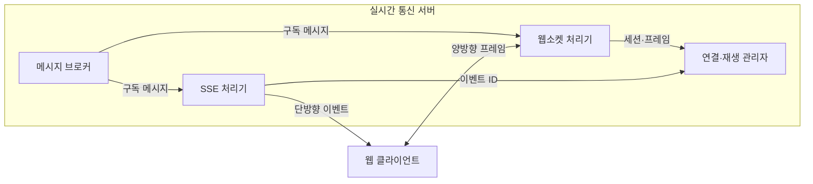

---
sidebar:
  order: 178
  label: "178. 웹 소켓·Server-Sent Events (WebSocket SSE)"
  badge:
    text: "미출제 · 50%"
    variant: note
title: "웹 소켓·Server-Sent Events (WebSocket SSE)"
date: "2026-07-25T00:30:00+09:00"
tags:
  - "notes-software"
weight: 178
extra:
  question_no: "178"
  source_status: "미출제"
  source_history: ""
  priority: 50
  priority_note: "양방향·단방향과 재접속 복구 비교가 명확함"
---

## 미리 알고가기

- **웹소켓(WebSocket)**: 하나의 연결에서 클라이언트와 서버가 언제든 데이터를 보내는 전이중 통신 프로토콜임
- **서버 전송 이벤트(Server-Sent Events, SSE)**: SSE는 ‘에스에스이’로 읽고 영문 머리글자를 딴 약어이며, HTTP 응답 연결에서 서버가 텍스트 이벤트를 계속 보내는 단방향 방식임
- **하이퍼텍스트 전송 프로토콜(Hypertext Transfer Protocol, HTTP)**: HTTP는 ‘에이치티티피’로 읽고 영문 머리글자를 딴 약어이며, 웹소켓 연결 협상과 SSE 이벤트 스트림을 운반함
- **하트비트(Heartbeat)**: 주기적 핑·퐁 신호로 연결 단절을 확인하는 유지 메시지임
- **이벤트 식별자(Event Identifier, Event ID)**: ID는 ‘아이디’로 읽고 Identifier를 줄인 표기이며, 재연결 뒤 마지막 수신 위치부터 이벤트를 받는 기준임
- **핸드셰이크·프레임**: 핸드셰이크는 연결을 합의하고 프레임은 전송 데이터 단위임
- **메시지 브로커**: 여러 서버 사이에서 메시지를 구독자에게 중계하는 구성요소임

## Ⅰ. 개요

- 정의/개념: 웹소켓은 양방향, SSE는 서버 단방향 통신
- **배경/필요성**: 반복 요청 부하를 줄여 실시간 연결 유지가 필요함

### 쉽게 이해하기 (학습용)
- 웹소켓은 전화기, SSE는 단방향 방송임

## Ⅱ. 특징

- 프로토콜 업그레이드 후 프레임을 교환한다.
- 양방향 데이터는 WebSocket 전이중 연결로 교환한다.
- SSE는 이벤트 단위의 단방향 스트림을 구성한다.
- 마지막 ID부터 누락 이벤트를 다시 전송한다.
- 메시지 ID로 유실과 중복 여부를 판정한다.
- 타임아웃 정책에 따라 재접속한다.

### 쉽게 이해하기 (학습용)
- 끊긴 동안 놓친 내용을 복구할 기준이 필요함

## Ⅲ. 아키텍처 및 구성요소

| 설계 요소 | 설명 |
|:---|:---|
| 웹소켓 처리기 | 연결 업그레이드 후 프레임 송수신 |
| SSE 처리기 | HTTP 응답으로 이벤트를 연속 전송 |
| 연결·재생 관리자 | 세션 상태와 마지막 이벤트 ID 관리 |
| 메시지 브로커 | 노드 간 구독 메시지를 중계 |

> 요약: 브로커 메시지를 양방향·단방향으로 전달

### 쉽게 이해하기 (학습용)
- 통신선을 찾고 끊긴 구간의 복구를 맡음

## Ⅳ. 원리 및 절차 흐름도

- 웹소켓은 HTTP 업그레이드 후 양방향 프레임 교환
- SSE는 HTTP 응답을 열어 서버 이벤트를 연속 전송
- SSE 재접속은 마지막 이벤트 ID 이후부터 재생

> 요약: 장기 연결 유지 및 유실 부분을 복구함

### 쉽게 이해하기 (학습용)
- 형식대로 전송 후 끊기면 마지막 이후를 받음

## Ⅴ. 종류 및 비교

| 판단 기준 | WebSocket | SSE |
|:---|:---|:---|
| 핵심 특징 | 양방향 데이터 프레임 교환 | 서버 단방향 전송 |
| 적용 기준 | 채팅, 양방향 제어 | 진행 상태, 로그 통지 |
| 주요 위험 | 연결 상태·프록시·유실 복구 | 단방향 제약·연결 수 한도 |

> 요약: 양방향 제어는 웹소켓, 단방향 통지는 SSE를 적용함

### 쉽게 이해하기 (학습용)
- 양방향은 웹소켓, 단방향은 SSE를 씀

## Ⅵ. 실무 사례

1. 공동 편집은 웹소켓으로 변경 내용을 양방향 전파

### 쉽게 이해하기 (학습용)
- 공동 편집자는 같은 연결로 수정 내용을 서로 주고받음

## Ⅶ. 결론

- 양방향 제어는 WebSocket, 알림은 SSE를 선택함

### 쉽게 이해하기 (학습용)
- 서로 보내면 WebSocket, 서버만 보내면 SSE임
