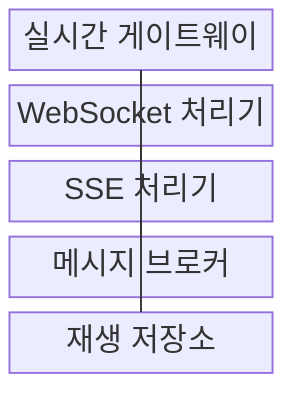
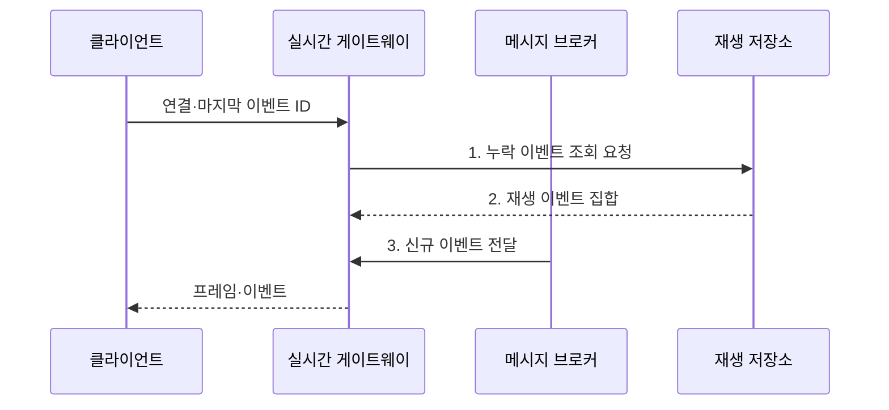

---
sidebar:
  order: 178
  label: "178. 웹 소켓·Server-Sent Events (WebSocket SSE)"
  badge:
    text: "미출 · 50%"
    variant: note
title: "웹 소켓·Server-Sent Events (WebSocket SSE)"
date: "2026-07-31T00:27:03+09:00"
tags:
  - "notes-software"
weight: 178
extra:
  question_no: "178"
  source_status: "미출"
  source_history: ""
  priority: 50
  priority_note: "양방향·단방향과 재접속 복구 비교"
---

## 미리 알고가기

- **웹소켓(WebSocket)**: 하나의 지속 연결에서 클라이언트와 서버가 독립적으로 메시지를 보내는 전이중 프로토콜
- **서버 전송 이벤트(Server-Sent Events, SSE)**: 서버가 HTTP 응답 연결로 UTF-8 텍스트 이벤트를 계속 보내는 단방향 방식
- **핸드셰이크(Handshake)**: WebSocket 프로토콜 전환과 매개변수를 합의하는 초기 요청·응답
- **프레임(Frame)**: WebSocket에서 텍스트·이진·제어 데이터를 전달하는 단위
- **이벤트 스트림(Event Stream)**: SSE의 event·data·id·retry 필드를 연속 전달하는 응답
- **이벤트 식별자(Event ID)**: SSE 재연결 시 마지막 수신 위치 이후를 요청하는 기준
- **하트비트(Heartbeat)**: 유휴 연결 생존을 확인하는 주기 신호
- **역압(Backpressure)**: 수신 처리 속도에 맞춰 생산·전송 속도를 제한하는 제어
- **메시지 브로커(Message Broker)**: 여러 실시간 서버가 같은 사건을 구독자에게 전달하도록 중계하는 구성
- **실시간 게이트웨이(Realtime Gateway)**: 실시간 연결의 인증·라우팅·종료를 담당하는 진입 구성요소
- **재생 저장소(Replay Store)**: 순번별 이벤트를 보존해 재접속 구간의 누락분을 제공하는 저장소
- **지수 백오프(Exponential Backoff)**: 재시도 간격을 지수적으로 늘려 동시 재접속 부하를 분산하는 방식

## Ⅰ. 개요

- 정의/개념: 지속 연결의 WebSocket **전이중**·SSE **단방향 실시간 통신 방식**
- 배경/필요성: 반복 조회로는 **요청 부하·상태 갱신 지연 지속**

### 쉽게 이해하기 (학습용)

- WebSocket은 서로 말하는 전화이고 SSE는 서버가 번호를 붙여 계속 보내는 방송이라 통신 방향부터 다르다.

## Ⅱ. 특징

- **지속 연결·즉시 전송** 기반 갱신 지연 축소
- **프레임·이벤트 스트림** 기반 메시지 교환
- **하트비트·재연결·역압** 기반 연결 운영

### 쉽게 이해하기 (학습용)

- 연결을 오래 유지하면 새 요청을 반복하지 않아도 되지만 끊긴 위치와 느린 수신자의 버퍼를 별도로 관리해야 한다.

## Ⅲ. 구조 및 구성요소

| 구성요소 | 책임 |
|:---|:---|
| 실시간 게이트웨이 | 인증·**연결 종료·라우팅** |
| WebSocket 처리기 | 핸드셰이크·프레임·**양방향 세션** |
| SSE 처리기 | 이벤트 형식·**ID·재시도 처리** |
| 메시지 브로커 | 서버·구독자 **메시지 중계** |
| 재생 저장소 | 순번별 보존·**누락 이벤트 재생** |

### 쉽게 이해하기 (학습용)

- Gateway가 연결을 받고 Handler가 통신 방식을 처리하며 Broker는 다른 서버의 사건을 전달하고 Replay Store는 끊긴 동안의 방송을 보관한다.

## Ⅳ. 흐름도

**동작 원리**

1. **누락 이벤트 조회 요청**: 마지막 확인 이후 보존 사건 검색
2. **재생 이벤트 집합**: 순번 기반 유실 구간 복구
3. **신규 이벤트 전달**: 브로커 구독 사건을 연결별로 배분

### 쉽게 이해하기 (학습용)

- 클라이언트가 마지막 방송 번호를 보내면 서버는 누락분을 먼저 재생하고 이후 새 사건을 같은 연결로 이어 보낸다.

## Ⅴ. 종류 및 비교

| 실시간 방식 | WebSocket | SSE |
|:---|:---|:---|
| 적용 기준 | 채팅·제어의 **양방향 교환** | 알림·진행률의 **서버 전송** |
| 핵심 특징 | 텍스트·이진 **전이중 프레임** | HTTP·텍스트·**자동 재연결** |
| 한계 | 세션·순서·**양방향 역압** | 단방향·텍스트·**연결 제한** |

### 쉽게 이해하기 (학습용)

- 공동 편집처럼 양쪽이 자주 보내면 WebSocket을, 진행률처럼 서버가 보내기만 하면 SSE를 우선 선택한다.

## Ⅵ. 실무 고려사항 및 대책

| 고려사항 | 대책 | 효과 |
|:---|:---|:---|
| 장기 연결의 **권한 만료** | 주기 재인가·**권한 변경 시 종료** | **권한 회수** 반영 |
| 중간 장비의 **유휴 종료** | 하트비트·**시간 제한 정렬** | **연결 생존 확인** |
| 재접속 사이 **메시지 유실** | ID·보존 기간·**재생 적용** | **누락 구간 복구** |
| 느린 수신자의 **버퍼 고갈** | 큐 상한·병합·**연결 종료 정책** | 서버 **메모리 보호** |
| 배포 뒤 **재접속 폭주** | 연결 배출·**지수 백오프·분산** | 순간 **부하 완화** |

### 쉽게 이해하기 (학습용)

- 서버 배포 전에 기존 연결을 천천히 비우고 재접속 시간을 분산해야 수천 개 클라이언트가 동시에 새 서버를 압박하지 않는다.

## Ⅶ. 결론

- **통신 방향·형식·재접속**으로 WebSocket·SSE 결정

### 쉽게 이해하기 (학습용)

- 양방향·이진 교환은 WebSocket으로, 서버 텍스트 알림은 SSE로 구성하고 둘 다 ID·하트비트·역압 정책을 마련해야 한다.
