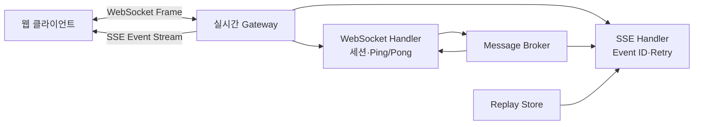
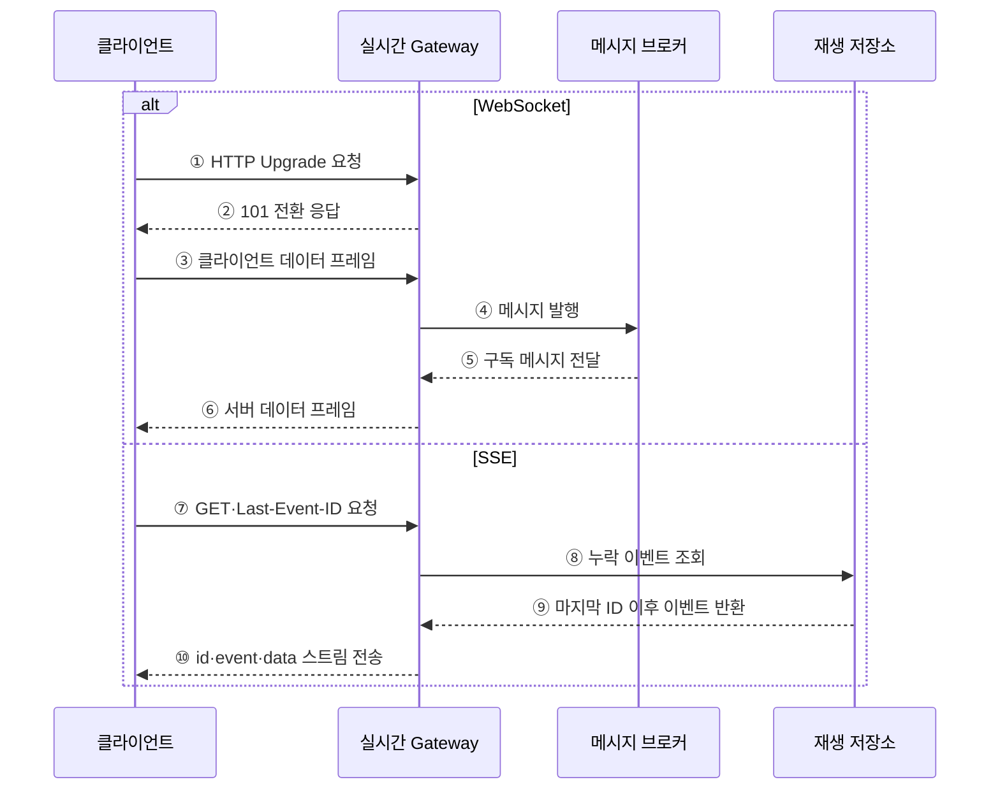

---
sidebar:
  order: 178
  label: "178. 웹 소켓·Server-Sent Events (WebSocket SSE)"
  badge:
    text: "미출제 · 50%"
    variant: note
title: "웹 소켓·Server-Sent Events (WebSocket SSE)"
date: "2026-07-25T00:30:00+09:00"
tags:
  - "notes-software"
weight: 178
extra:
  question_no: "178"
  source_status: "미출제"
  source_history: ""
  priority: 50
  priority_note: "양방향·단방향과 재접속 복구 비교가 명확함"
---

## 미리 알고가기

- **웹소켓(WebSocket)**: 하나의 지속 연결에서 클라이언트와 서버가 서로 독립적으로 메시지를 보내는 전이중 통신 프로토콜
- **서버 전송 이벤트(Server-Sent Events, SSE·에스에스이)**: 서버가 HTTP 응답 연결로 UTF-8 텍스트 이벤트를 계속 보내는 단방향 스트리밍 방식
- **핸드셰이크(Handshake)**: 클라이언트와 서버가 WebSocket 프로토콜 전환과 매개변수를 합의하는 초기 요청·응답
- **프레임(Frame)**: WebSocket 연결에서 텍스트·이진·제어 데이터를 전달하는 단위
- **이벤트 스트림(Event Stream)**: SSE의 `text/event-stream` 형식으로 `event`·`data`·`id`·`retry` 필드를 연속 전달하는 응답
- **이벤트 식별자(Event ID)**: SSE 재연결 시 마지막으로 받은 위치 이후의 이벤트를 요청하는 기준
- **하트비트(Heartbeat)**: 유휴 연결의 생존을 확인하고 중간 장비의 Timeout을 피하기 위한 주기 신호
- **역압(Backpressure)**: 수신자가 처리할 수 있는 속도보다 메시지가 빨리 들어올 때 생산·전송 속도를 제한하는 제어
- **메시지 브로커(Message Broker)**: 여러 실시간 서버가 같은 사건을 구독자에게 전달하도록 중계하는 구성

## Ⅰ. 개요

- WebSocket은 **클라이언트·서버 양방향**, SSE는 **서버→클라이언트 단방향** 실시간 통신을 제공한다.
- 반복 Polling의 요청·응답 부하와 갱신 지연을 줄이고 사건 발생 즉시 데이터를 전달한다.
- 연결 방향뿐 아니라 메시지 형식·재연결·유실 복구·프록시 조건으로 방식을 선택해야 한다.

### 쉽게 이해하기 (학습용)
- WebSocket은 서로 말하는 전화, SSE는 서버가 보내는 연속 방송임

## Ⅱ. 특징

- **WebSocket 전이중성**: 연결 이후 양쪽이 텍스트·이진 프레임을 언제든 전송한다.
- **WebSocket 저오버헤드**: 반복 HTTP 헤더 없이 작은 프레임으로 빈번한 메시지를 교환한다.
- **SSE 단순성**: 일반 HTTP 응답과 텍스트 이벤트 형식을 사용해 서버 알림을 전달한다.
- **SSE 자동 재연결**: 브라우저가 연결을 다시 열고 마지막 Event ID를 전달할 수 있다.
- **장기 연결 상태**: 두 방식 모두 연결 수·유휴 Timeout·하트비트·느린 소비자를 관리해야 한다.
- **수평 확장**: 브로커·구독 레지스트리·재생 저장소로 여러 서버의 연결과 메시지를 연계한다.

### 쉽게 이해하기 (학습용)
- 연결을 오래 유지하되 끊긴 위치와 느린 수신자를 따로 관리함

## Ⅲ. 아키텍처 및 구성요소

**도표안 A — 구조도**

**도표안 B — sequenceDiagram**

| 구성요소 | 역할 |
|:---|:---|
| 실시간 Gateway | 인증·연결 종료·라우팅·호출 제한 |
| WebSocket Handler | Upgrade·프레임·Ping/Pong·세션·종료 처리 |
| SSE Handler | 이벤트 형식·ID·재시도 시간·연결 유지 처리 |
| 메시지 브로커 | 여러 서버와 구독자 사이의 실시간 메시지 중계 |
| 재생 저장소 | Event ID 또는 순번별 보존·누락 이벤트 재전송 |
| 연결 레지스트리 | 사용자·구독·서버 연결 위치와 만료 상태 관리 |

**동작 원리**

- ① WebSocket 클라이언트가 HTTP 기반 프로토콜 전환을 요청한다.
- ② Gateway가 인증·정책을 확인하고 전환을 수락해 지속 연결을 연다.
- ③ 클라이언트가 열린 연결로 텍스트나 이진 데이터 프레임을 보낸다.
- ④ Gateway가 메시지를 대상 채널의 Broker에 발행한다.
- ⑤ Broker가 다른 사용자·서버가 구독한 메시지를 Gateway에 전달한다.
- ⑥ Gateway가 같은 연결로 서버 데이터 프레임을 클라이언트에 보낸다.
- ⑦ SSE 클라이언트는 연결 시 마지막 수신 Event ID를 함께 보낸다.
- ⑧ Gateway가 해당 ID 이후의 누락 이벤트를 재생 저장소에 조회한다.
- ⑨ 재생 저장소가 보존 기간 안의 누락 이벤트를 순서대로 반환한다.
- ⑩ Gateway가 각 이벤트의 ID·종류·데이터를 열린 HTTP 응답으로 계속 전송한다.

### 쉽게 이해하기 (학습용)
- WebSocket은 같은 선로로 왕복하고 SSE는 마지막 방송 번호 뒤부터 다시 받음

## Ⅳ. 종류 및 비교

| 비교 항목 | WebSocket | SSE |
|:---|:---|:---|
| 통신 방향 | 전이중 양방향 | 서버→클라이언트 단방향 |
| 연결 시작 | HTTP Handshake 후 프로토콜 전환 | 일반 HTTP GET 응답 유지 |
| 메시지 | 텍스트·이진·제어 프레임 | UTF-8 텍스트 이벤트 |
| 재연결 | 응용이 재시도·복구 구현 | 브라우저 자동 재연결·Last-Event-ID |
| 캐시·프록시 | 전환·장기 연결 지원 확인 | HTTP 기반이나 버퍼링·Timeout 확인 |
| 적합 | 채팅·게임·공동 편집·양방향 제어 | 알림·진행률·시세·로그 스트림 |
| 주요 부담 | 세션·유실·순서·양방향 역압 | 단방향·텍스트·브라우저 연결 제약 |

| 대안 | 특징 | 적용 |
|:---|:---|:---|
| 짧은 Polling | 주기적으로 새 요청 | 갱신 빈도가 낮고 단순한 환경 |
| 긴 Polling | 사건 발생까지 응답 대기 후 재요청 | 지속 연결 지원이 제한된 환경 |

### 쉽게 이해하기 (학습용)
- 서로 자주 보내면 WebSocket, 서버 알림만 받으면 SSE가 단순함

## Ⅴ. 실무 고려사항 및 대책

| 고려사항 | 위험 | 대책 |
|:---|:---|:---|
| 인증 수명 | 장기 연결 중 권한 변경·토큰 만료 누락 | 연결 시 검증·주기 재인가·권한 변경 시 종료 |
| 연결 생존 | 프록시·방화벽의 유휴 Timeout | Ping/Pong·SSE 주석 하트비트·Timeout 정렬 |
| 유실 복구 | 재접속 사이 메시지 손실 | 메시지 ID·보존 기간·재생 API 적용 |
| 중복·순서 | 재전송과 다중 서버로 중복·역전 | 단조 순번·중복 제거·채널별 순서 정책 |
| 느린 소비자 | 송신 버퍼와 서버 메모리 고갈 | 큐 상한·병합·샘플링·연결 종료 정책 |
| 수평 확장 | 다른 서버 연결 사용자에게 전달 실패 | Broker·공유 구독 레지스트리 적용 |
| 배포·장애 | 연결 일괄 종료·재접속 폭주 | 연결 Drain·지수 Backoff·Jitter 적용 |
| 관측성 | 연결은 살아 있어도 전달 지연 누락 | 연결 수·큐 크기·전송 지연·재연결률 측정 |

### 쉽게 이해하기 (학습용)
- 사례: 공동 편집은 WebSocket 순번으로 변경을 왕복하고 끊기면 마지막 확인 순번부터 복구함

## Ⅵ. 결론

- WebSocket과 SSE 선택의 핵심은 **양방향 상호작용과 서버 단방향 알림 중 필요한 통신 방향**이다.
- 장기 연결은 프로토콜 선택보다 인증 갱신·하트비트·재연결·유실 복구·역압 설계가 안정성을 좌우한다.
- 양방향·이진·빈번한 교환은 WebSocket, 단순한 서버 이벤트 스트림은 SSE를 우선 검토한다.

### 쉽게 이해하기 (학습용)
- 서로 보내면 WebSocket, 서버만 보내면 SSE를 쓰고 둘 다 끊긴 뒤 복구를 설계함
