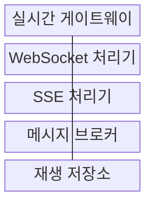

---
sidebar:
  order: 178
  label: "178. 웹 소켓•Server-Sent Events (WebSocket SSE)"
  badge:
    text: "미출 • 50%"
    variant: note
title: "웹 소켓•Server-Sent Events (WebSocket SSE)"
date: "2026-08-03T09:14:20+09:00"
tags:
  - "notes-software"
weight: 178
extra:
  question_no: "178"
  source_status: "미출"
  source_history: ""
  priority: 50
  priority_note: "양방향•단방향과 재접속 복구 비교"
---

## Ⅰ. 개요

핵심 용어

- **전이중**: WebSocket의 전이중 통신은 하나의 지속 연결에서 클라이언트와 서버가 서로 독립적으로 메시지를 보내게 한다.
- **웹소켓(WebSocket)**: 하나의 지속 연결에서 클라이언트와 서버가 독립적으로 텍스트•이진 메시지를 주고받는 전이중 통신 프로토콜이다.
- **서버 전송 이벤트(Server-Sent Events, SSE)**: 하이퍼텍스트 전송 프로토콜 연결에서 서버가 클라이언트로 텍스트 이벤트를 연속 전송하는 단방향 방식이다.

- 정의/개념: **WebSocket과 SSE** 는 지속 연결을 이용하되 WebSocket은 클라이언트•서버 전이중 메시지, SSE는 서버의 단방향 이벤트 스트림을 제공하는 실시간 통신 방식
- 배경/필요성: 반복 조회 주기가 짧으면 **요청 부하 증가**, 길면 **상태 갱신 지연**

#### 한줄 요약

- WebSocket은 서로 말하는 전화이고 SSE는 서버가 번호를 붙여 계속 보내는 방송이라 통신 방향부터 다르다.

## Ⅱ. 특징

핵심 용어

- **하트비트•재연결•역압**: 장기 연결은 하트비트로 생존을 확인하고 재연결로 복구하며 역압으로 느린 수신자의 부하를 제어한다.
- **프레임•이벤트 스트림**: 웹소켓의 메시지 단위와 서버 전송 이벤트의 식별자•데이터•재시도 필드로 구성한 연속 메시지 형식이다.
- **역압(Backpressure)**: 소비자의 처리 속도보다 생산이 빠를 때 큐•전송률•연결을 제한해 자원 고갈을 막는 제어이다.

- **지속 연결•즉시 전송** 기반 갱신 지연 축소
- **프레임•이벤트 스트림** 기반 메시지 교환
- **하트비트•재연결•역압** 기반 연결 운영

#### 한줄 요약

- 연결을 오래 유지하면 새 요청을 반복하지 않아도 되지만 끊긴 위치와 느린 수신자의 버퍼를 별도로 관리해야 한다.

## Ⅲ. 구조 및 구성요소

핵심 용어

- **재생 저장소**: 재생 저장소는 이벤트를 순번별로 보존해 재접속한 클라이언트에 누락 구간을 제공한다.
- **실시간 게이트웨이(Realtime Gateway)**: 연결 인증•종료•라우팅을 통합 관리하는 진입 구성요소이다.
- **웹소켓 처리기(WebSocket Handler)**: 핸드셰이크•프레임•양방향 세션을 관리하는 구성요소이다.
- **서버 전송 이벤트 처리기(Server-Sent Events Handler, SSE Handler)**: 이벤트 형식•식별자•재시도 지시를 처리하는 구성요소이다.
- **메시지 브로커(Message Broker)**: 여러 서버와 구독자 사이에서 실시간 메시지를 중계하는 구성요소이다.

| 구성요소 | 책임 |
|:---|:---|
| 실시간 게이트웨이 | 인증•**연결 종료•라우팅** |
| WebSocket 처리기 | 핸드셰이크•프레임•**양방향 세션** |
| SSE 처리기 | 이벤트 형식•**ID•재시도 처리** |
| 메시지 브로커 | 서버•구독자 **메시지 중계** |
| 재생 저장소 | 순번별 보존•**누락 이벤트 재생** |

#### 한줄 요약

- Gateway가 연결을 받고 Handler가 통신 방식을 처리하며 Broker는 다른 서버의 사건을 전달하고 Replay Store는 끊긴 동안의 방송을 보관한다.

## Ⅳ. 흐름도

핵심 용어

- **2. 재생 이벤트 집합**: 마지막 이벤트 ID 이후의 보존 사건을 순번대로 반환해 연결이 끊긴 동안의 유실 구간을 복구한다.
- **1. 누락 이벤트 조회 요청**: 클라이언트의 마지막 이벤트 식별자 이후에 저장된 사건을 검색하는 단계이다.
- **3. 신규 이벤트 전달**: 브로커가 새 사건을 연결별 구독자에게 배분하는 단계이다.

**동작 원리**

1. **누락 이벤트 조회 요청**: 마지막 확인 이후 보존 사건 검색
2. **재생 이벤트 집합**: 순번 기반 유실 구간 복구
3. **신규 이벤트 전달**: 브로커 구독 사건을 연결별로 배분

#### 한줄 요약

- 클라이언트가 마지막 방송 번호를 보내면 서버는 누락분을 먼저 재생하고 이후 새 사건을 같은 연결로 이어 보낸다.

## Ⅴ. 종류 및 비교

핵심 용어

- **웹소켓(WebSocket)**: 채팅이나 공동 제어처럼 클라이언트와 서버가 자주 데이터를 주고받는 양방향 통신에 적합하다.
- **서버 전송 이벤트(Server-Sent Events, SSE)**: 알림•진행률처럼 서버가 텍스트 사건을 연속 전송하는 단방향 통신에 적합하다.

| 실시간 방식 | WebSocket | SSE |
|:---|:---|:---|
| 적용 기준 | 채팅•제어의 **양방향 교환** | 알림•진행률의 **서버 전송** |
| 핵심 특징 | 텍스트•이진 **전이중 프레임** | HTTP•텍스트•**자동 재연결** |
| 한계 | 세션•순서•**양방향 역압** | 단방향•텍스트•**연결 제한** |

#### 한줄 요약

- 공동 편집처럼 양쪽이 자주 보내면 WebSocket을, 진행률처럼 서버가 보내기만 하면 SSE를 우선 선택한다.

## Ⅵ. 실무 고려사항 및 대책

핵심 용어

- **버퍼 고갈**: 버퍼 고갈은 느린 수신자에게 보낼 메시지가 계속 쌓여 실시간 서버의 메모리가 소진되는 문제다.
- **지수 백오프•분산(Exponential Backoff•Jitter)**: 재접속 대기 시간을 점차 늘리고 무작위 편차를 더해 동시 접속 폭주를 줄이는 방식이다.
- **연결 배출(Connection Draining)**: 배포•종료 전에 새 연결을 막고 기존 연결이 자연스럽게 끝나도록 기다리는 절차이다.

| 문제 | 대책 | 효과 |
|:---|:---|:---|
| 장기 연결의 **권한 만료** | 주기 재인가•**권한 변경 시 종료** | **권한 회수** 반영 |
| 중간 장비의 **유휴 종료** | 하트비트•**시간 제한 정렬** | **연결 생존 확인** |
| 재접속 사이 **메시지 유실** | ID•보존 기간•**재생 적용** | **누락 구간 복구** |
| 느린 수신자의 **버퍼 고갈** | 큐 상한•병합•**연결 종료 정책** | 서버 **메모리 보호** |
| 배포 뒤 **재접속 폭주** | 연결 배출•**지수 백오프•분산** | 순간 **부하 완화** |

#### 한줄 요약

- 서버 배포 전에 기존 연결을 천천히 비우고 재접속 시간을 분산해야 수천 개 클라이언트가 동시에 새 서버를 압박하지 않는다.

## Ⅶ. 결론

핵심 용어

- **통신 방향•형식•재접속**: WebSocket과 SSE는 통신 방향, 메시지 형식, 연결 종료 후 재접속 요구를 기준으로 선택한다.

- **통신 방향•형식•재접속** 으로 WebSocket•SSE 결정

#### 한줄 요약

- 양방향•이진 교환은 WebSocket으로, 서버 텍스트 알림은 SSE로 구성하고 둘 다 ID•하트비트•역압 정책을 마련해야 한다.
