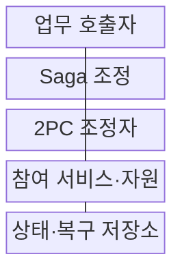
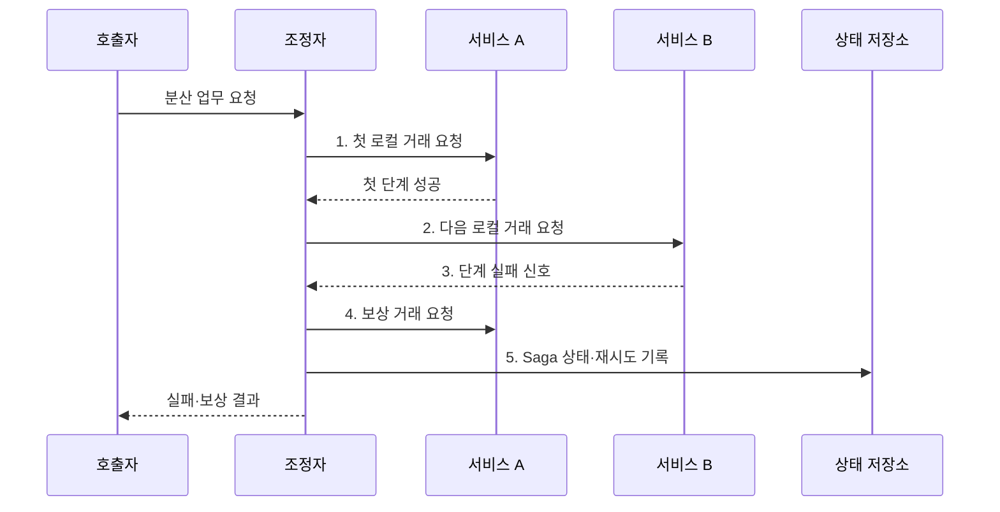

---
sidebar:
  order: 179
  label: "179. 마이크로서비스 사가 패턴 vs 2PC (Saga vs 2PC)"
  badge:
    text: "미출 · 70%"
    variant: note
title: "마이크로서비스 사가 패턴 vs 2PC (Saga vs 2PC)"
date: "2026-07-31T00:29:18+09:00"
tags:
  - "notes-software"
weight: 179
extra:
  question_no: "179"
  source_status: "미출"
  source_history: ""
  priority: 70
  priority_note: "보상 거래와 원자 확정의 비교 가치"
---

## 미리 알고가기

- **사가(Saga)**: 여러 로컬 트랜잭션을 연결하고 실패 시 완료 단계의 업무 효과를 보상하는 패턴
- **2단계 커밋(Two-Phase Commit, 2PC)**: 모든 참여자의 준비 투표 뒤 전역 커밋이나 롤백을 결정하는 프로토콜
- **로컬 트랜잭션(Local Transaction)**: 한 서비스가 소유한 저장소 안에서 원자적으로 처리하는 작업
- **보상 트랜잭션(Compensating Transaction)**: 이미 커밋된 업무 효과를 반대 업무로 상쇄하는 새 트랜잭션
- **코레오그래피·오케스트레이션**: 이벤트 흐름 또는 중앙 조정자로 사가 단계·보상을 관리하는 방식
- **준비 상태(Prepared State)**: 참여자가 변경과 잠금을 유지하며 최종 결정을 기다리는 상태
- **미결 상태(In-doubt State)**: 조정자 장애로 준비 참여자가 최종 결정을 알 수 없는 상태
- **분산 트랜잭션 규격(X/Open XA)**: 트랜잭션 관리자와 참여 자원의 2PC 인터페이스 규격
- **최종 일관성(Eventual Consistency)**: 후속 단계·보상 완료 후 업무적으로 일관된 상태에 도달하는 성질
- **피벗 트랜잭션(Pivot Transaction)**: 실행 뒤 전체 취소가 어려워 사가의 진행 방향을 결정하는 단계
- **멱등성(Idempotency)**: 같은 단계나 보상을 여러 번 처리해도 최종 업무 상태가 같은 성질
- **데드 레터 큐(Dead Letter Queue, DLQ)**: 반복 실패한 메시지를 격리해 조사·재처리하는 큐

> **키워드:** 마이크로서비스 사가 패턴 vs 2PC (Saga vs 2PC)

## Ⅰ. 개요

- 정의/개념: Saga **보상 수렴**과 2PC **전역 원자 커밋의 비교 기준**
- 배경/필요성: 단일 데이터베이스 거래로는 **독립 서비스의 원자 처리 보장 불가**

### 쉽게 이해하기 (학습용)

- Saga는 끝난 일을 반대 업무로 상쇄하고 2PC는 모든 참여자가 준비될 때까지 잠근 뒤 함께 확정한다.

## Ⅱ. 특징

- **로컬 커밋·보상** 기반 Saga 최종 일관성
- **준비·결정** 기반 2PC 원자성
- **코레오그래피·오케스트레이션** 기반 Saga 조정

### 쉽게 이해하기 (학습용)

- Saga는 긴 분산 잠금을 없애는 대신 중간 상태와 보상 책임이 생기고 2PC는 원자성을 얻는 대신 준비 상태의 자원 대기가 생긴다.

## Ⅲ. 구조 및 구성요소

| 구성요소 | 책임 |
|:---|:---|
| 업무 호출자 | 분산 업무·**중복 요청 식별자 전달** |
| Saga 조정 | 로컬 단계·**보상·재시도 관리** |
| 2PC 조정자 | Prepare 투표·**전역 결정 관리** |
| 참여 서비스·자원 | 로컬 커밋·**준비 잠금 유지** |
| 상태·복구 저장소 | 사가 단계·**2PC 결정 영속화** |

### 쉽게 이해하기 (학습용)

- 호출자는 한 업무를 요청하고 조정자는 Saga라면 단계와 보상을, 2PC라면 준비 투표와 최종 결정을 기록한다.

## Ⅳ. 흐름도

**동작 원리**

1. **첫 로컬 거래 요청**: 서비스 A의 업무 상태 커밋
2. **다음 로컬 거래 요청**: 서비스 B에 후속 처리 위임
3. **단계 실패 신호**: 실패 위치와 보상 범위 확정
4. **보상 거래 요청**: 완료 단계의 업무 효과를 멱등 상쇄
5. **Saga 상태·재시도 기록**: 단계·보상 결과를 영속화

### 쉽게 이해하기 (학습용)

- 주문과 재고 예약 뒤 결제가 실패하면 이미 끝난 재고 예약을 반대 거래로 해제하고 주문을 취소 상태로 수렴시킨다.

## Ⅴ. 종류 및 비교

| 분산 거래 방식 | Saga | 2PC |
|:---|:---|:---|
| 적용 기준 | 장기 업무·**보상 가능 단계** | 짧은 거래·**강한 원자성** |
| 핵심 특징 | 로컬 커밋·**최종 일관성** | 준비 잠금·**전역 결정** |
| 한계 | 중간 상태·**보상 실패** | 장기 잠금·**미결 상태** |

### 쉽게 이해하기 (학습용)

- 독립 서비스의 장기 주문 흐름은 Saga를, 같은 관리 범위의 지원 자원에서 모두 함께 확정해야 하는 짧은 거래는 2PC를 검토한다.

## Ⅵ. 실무 고려사항 및 대책

| 고려사항 | 대책 | 효과 |
|:---|:---|:---|
| 배송·송금의 **완전 취소 불가** | 피벗 전 예약·**이후 보정 업무** | **불가역 피해 축소** |
| 부분 완료의 **중간 상태 노출** | 상태 명시·**격리·보류 자원** | 잘못된 **후속 처리 방지** |
| 재시도의 **단계 중복 실행** | Saga·단계 식별자 **멱등 저장** | 단일 **업무 효과** |
| 보상 실패의 **장기 불일치** | 영속 재시도·**DLQ·수동 조정** | **업무 상태 수렴** |
| 2PC 준비의 **장기 잠금** | 짧은 **XA 거래·시간 제한** | **처리량 저하 완화** |

### 쉽게 이해하기 (학습용)

- 외부 송금처럼 되돌릴 수 없는 단계는 피벗 뒤에 두고 이후 실패는 취소가 아니라 별도 환불 업무로 보정해야 한다.

## Ⅶ. 결론

- **보상 가능성·원자성 요구·거래 시간**으로 Saga·2PC 결정

### 쉽게 이해하기 (학습용)

- 보상 가능한 장기 서비스 흐름은 Saga로, 모든 자원이 지원하고 짧은 원자 확정이 필요한 거래만 2PC로 제한해야 한다.
