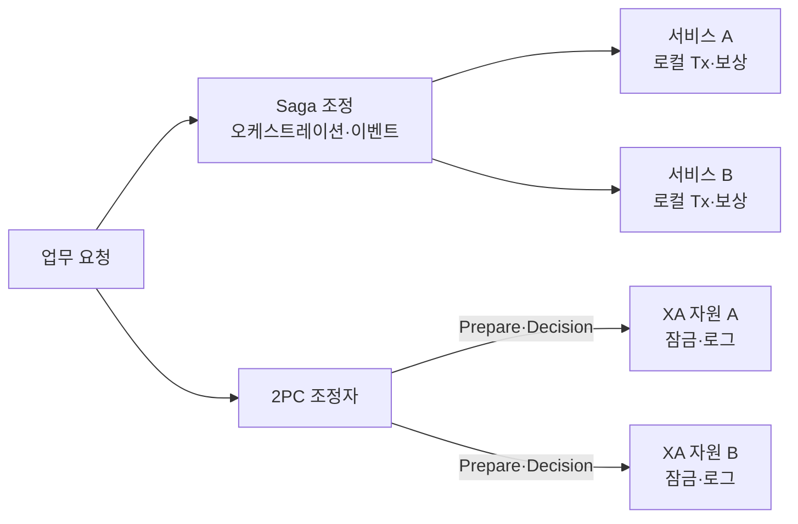
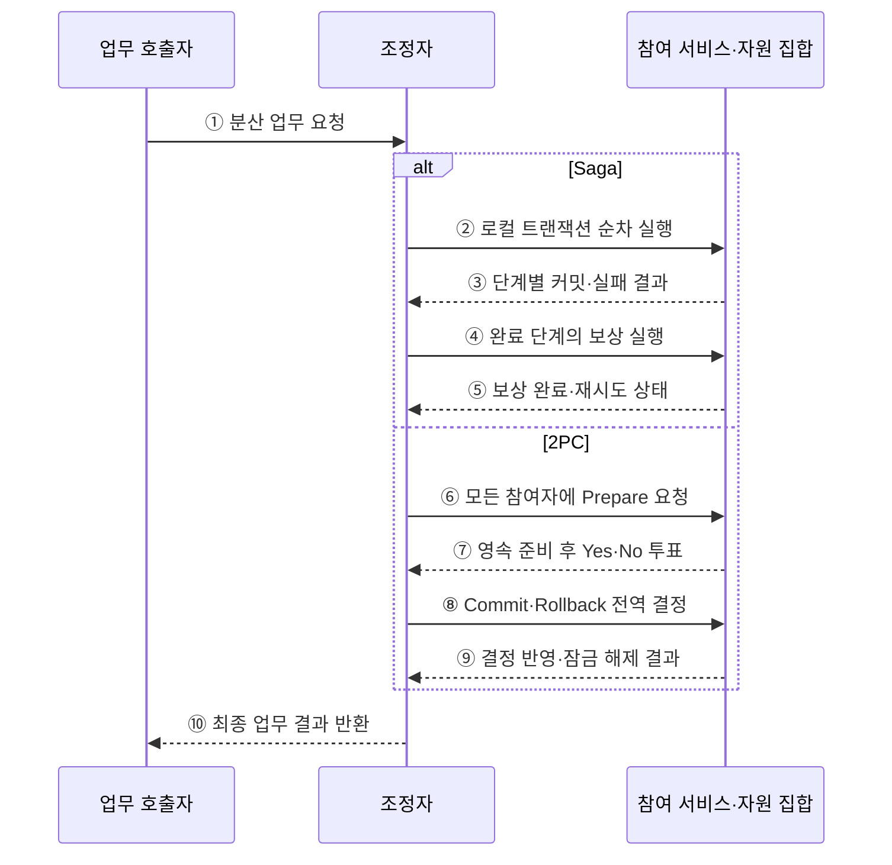

---
sidebar:
  order: 179
  label: "179. 마이크로서비스 사가 패턴 vs 2PC (Saga vs 2PC)"
  badge:
    text: "미출제 · 70%"
    variant: note
title: "마이크로서비스 사가 패턴 vs 2PC (Saga vs 2PC)"
date: "2026-07-25T00:30:00+09:00"
tags:
  - "notes-software"
weight: 179
extra:
  question_no: "179"
  source_status: "미출제"
  source_history: ""
  priority: 70
  priority_note: "보상 거래와 원자 확정의 비교 가치가 높음"
---

## 미리 알고가기

- **사가(Saga)**: 여러 서비스의 로컬 트랜잭션을 연결하고 실패 시 완료 단계의 업무 효과를 보상해 일관성을 회복하는 패턴
- **2단계 커밋(Two-Phase Commit, 2PC·투피시)**: 조정자가 모든 참여자의 준비 투표를 받은 뒤 전역 커밋이나 롤백을 결정하는 원자적 커밋 프로토콜
- **로컬 트랜잭션(Local Transaction)**: 한 서비스가 소유한 데이터 저장소 안에서만 원자적으로 처리하는 작업
- **보상 트랜잭션(Compensating Transaction)**: 이미 커밋된 업무 효과를 반대 업무로 상쇄하는 새 트랜잭션
- **코레오그래피(Choreography)**: 중앙 조정자 없이 각 서비스가 이벤트를 받아 다음 단계와 보상을 수행하는 사가 방식
- **오케스트레이션(Orchestration)**: 중앙 조정자가 참여 서비스에 명령을 보내고 사가 상태·순서·보상을 관리하는 방식
- **준비 상태(Prepared State)**: 2PC 참여자가 변경과 잠금을 유지한 채 조정자의 최종 결정을 기다리는 상태
- **미결 상태(In-doubt State)**: 준비를 마친 참여자가 조정자 장애 등으로 최종 결정을 알 수 없는 상태
- **분산 트랜잭션 규격(X/Open XA, XA·엑스에이)**: 트랜잭션 관리자와 데이터베이스·메시징 자원의 2PC 참여 인터페이스를 정의한 규격
- **최종 일관성(Eventual Consistency)**: 중간 상태가 달라도 후속 단계·보상 완료 후 업무적으로 일관된 상태에 도달하는 성질
- **피벗 트랜잭션(Pivot Transaction)**: 사가에서 실행 뒤 전체 취소가 어렵거나 불가능해 진행 방향을 결정하는 단계

## Ⅰ. 개요

- Saga와 2PC는 여러 저장소의 업무 일관성을 각각 **보상 수렴과 전역 원자 커밋**으로 해결한다.
- Saga는 각 단계가 독립 커밋되어 중간 상태를 허용하고, 2PC는 참여 자원을 준비 상태로 묶어 함께 확정한다.
- 서비스 자율성·잠금 시간·가용성·보상 가능성·원자성 요구로 선택해야 한다.

### 쉽게 이해하기 (학습용)
- Saga는 끝난 일을 반대 업무로 상쇄하고 2PC는 모두 준비될 때까지 함께 기다렸다 확정함

## Ⅱ. 특징

- **Saga 로컬 자율성**: 서비스가 자기 데이터만 커밋해 장기 분산 잠금을 피한다.
- **Saga 보상 수렴**: 실패하면 완료 단계의 효과를 역순 또는 업무 규칙에 맞게 상쇄한다.
- **Saga 중간 노출**: 단계 사이의 부분 완료 상태를 다른 요청이 볼 수 있다.
- **2PC 원자성**: 모든 참여자가 준비해야 전역 커밋하고 하나라도 실패하면 전역 롤백한다.
- **2PC 자원 고정**: 준비부터 최종 결정까지 잠금·연결·로그를 유지한다.
- **복구 상태 관리**: 두 방식 모두 중복 요청·Timeout·재시도·조정자 장애를 견디는 영속 상태가 필요하다.

### 쉽게 이해하기 (학습용)
- Saga는 잠금을 줄이는 대신 보상 책임이 생기고 2PC는 원자성을 얻는 대신 대기 비용이 생김

## Ⅲ. 아키텍처 및 구성요소

**도표안 A — 구조도**

**도표안 B — sequenceDiagram**

| 구성요소 | Saga | 2PC |
|:---|:---|:---|
| 조정 | 오케스트레이터 또는 이벤트 흐름 | 트랜잭션 조정자 |
| 참여 단위 | 서비스별 로컬 트랜잭션 | XA 등 원자 커밋 참여 자원 |
| 실패 회복 | 보상·재시도·수동 조정 | 전역 롤백·복구 로그 |
| 상태 저장 | 사가 ID·단계·보상 상태 | 트랜잭션 ID·Prepare·Decision 로그 |
| 일관성 | 중간 상태를 허용한 업무 수렴 | 전역 커밋의 원자성 |
| 자원 점유 | 단계별 짧은 로컬 잠금 | 준비부터 결정까지 잠금 유지 |

**동작 원리**

- ① 호출자가 여러 서비스·자원에 걸친 업무를 조정자에게 요청한다.
- ② Saga는 참여 서비스의 로컬 트랜잭션을 정해진 순서나 이벤트 흐름으로 실행한다.
- ③ 각 서비스는 독립 커밋한 결과나 실패를 조정 흐름에 반환한다.
- ④ 실패 시 이미 완료된 단계의 업무 효과를 보상 트랜잭션으로 상쇄한다.
- ⑤ 보상이 실패하면 멱등하게 재시도하고 장기 실패는 수동 조정 상태로 전환한다.
- ⑥ 2PC는 모든 참여 자원에 변경 준비와 영속 기록을 요청한다.
- ⑦ 참여자는 커밋 가능한 상태와 잠금을 유지한 뒤 Yes 또는 No를 투표한다.
- ⑧ 조정자는 전원이 Yes이면 Commit, 하나라도 No이면 Rollback을 영속 결정해 통지한다.
- ⑨ 참여자는 전역 결정을 반영하고 잠금을 해제한 뒤 결과를 반환한다.
- ⑩ 조정자는 보상 수렴 또는 전역 결정이 확인된 최종 업무 결과를 호출자에게 반환한다.

### 쉽게 이해하기 (학습용)
- Saga는 단계별 커밋 뒤 실패분을 보상하고 2PC는 전원이 준비된 뒤 한 번에 결정함

## Ⅳ. 종류 및 비교

| 비교 항목 | Saga | 2PC |
|:---|:---|:---|
| 일관성 | 최종·업무 일관성 | 원자 커밋 |
| 커밋 범위 | 서비스별 로컬 커밋 | 모든 참여 자원의 전역 결정 |
| 중간 상태 | 외부에 보일 수 있음 | 결정 전 변경 노출 억제 |
| 실패 처리 | 완료 단계 보상 | 준비 전 실패는 롤백, 준비 후 결정 복구 |
| 자원 잠금 | 로컬 단계 동안 | Prepare부터 Decision까지 |
| 가용성 | 참여 서비스별 비동기 재시도 가능 | 조정자·쿼럼·참여자 장애 시 대기 가능 |
| 결합 | 업무 이벤트·보상 계약 | XA·트랜잭션 관리자 계약 |
| 적용 | 장기 업무·독립 마이크로서비스 | 짧은 거래·동일 관리권의 지원 자원 |
| 주요 위험 | 보상 실패·중간 상태·복잡한 상태 머신 | 장기 잠금·미결 상태·확장성 저하 |

| Saga 방식 | 장점 | 주의점 |
|:---|:---|:---|
| 코레오그래피 | 중앙 조정 결합 감소 | 흐름 추적·순환 이벤트·변경 영향 |
| 오케스트레이션 | 순서·Timeout·보상 가시성 | 조정자 집중·업무 결합 |

### 쉽게 이해하기 (학습용)
- 오래 걸리고 독립적인 서비스는 Saga, 짧고 원자적인 지원 자원은 2PC를 검토함

## Ⅴ. 실무 고려사항 및 대책

| 고려사항 | 위험 | 대책 |
|:---|:---|:---|
| 보상 가능성 | 배송·외부 송금처럼 완전 취소 불가 | 피벗 전 예약·확인, 이후 별도 보정 업무 |
| 중간 상태 | 부분 완료를 다른 요청이 오해 | 상태 명시·격리 규칙·보류 자원 적용 |
| 중복 실행 | 재시도로 결제·재고가 두 번 반영 | Saga ID·단계 ID·멱등성 키 저장 |
| 보상 실패 | 업무가 장기간 불일치 | 영속 재시도·DLQ·운영자 조정 절차 |
| 2PC 잠금 | 느린 참여자로 처리량 급락 | 짧은 트랜잭션·Timeout·참여 범위 제한 |
| 미결 상태 | 조정자 장애로 결정 미수신 | 결정 로그 복제·복구 조회·운영 경보 |
| 관측성 | 단계별 지연·실패·보상 추적 곤란 | 상관 ID·상태 전이 로그·단계별 지표 |
| 선택 오용 | 편의로 Saga·2PC를 전역 적용 | 업무 불변식과 실패 모드별 경계 분석 |

### 쉽게 이해하기 (학습용)
- 사례: 주문 뒤 결제가 실패하면 재고 예약을 보상하고 주문을 취소 상태로 수렴시킴

## Ⅵ. 결론

- Saga와 2PC 선택의 핵심은 **보상 가능한 최종 일관성과 잠금 기반 원자 커밋 중 업무가 요구하는 보장**이다.
- 독립 서비스의 장기 업무는 Saga가 적합하지만 중간 상태와 보상 실패를 설계해야 한다.
- 짧고 강한 원자성이 필요하며 모든 자원이 프로토콜을 지원하면 2PC를 검토하되 잠금과 미결 위험을 제한해야 한다.

### 쉽게 이해하기 (학습용)
- 되돌림 업무가 가능하면 Saga, 모두 함께 확정해야 하고 짧게 끝나면 2PC를 검토함
