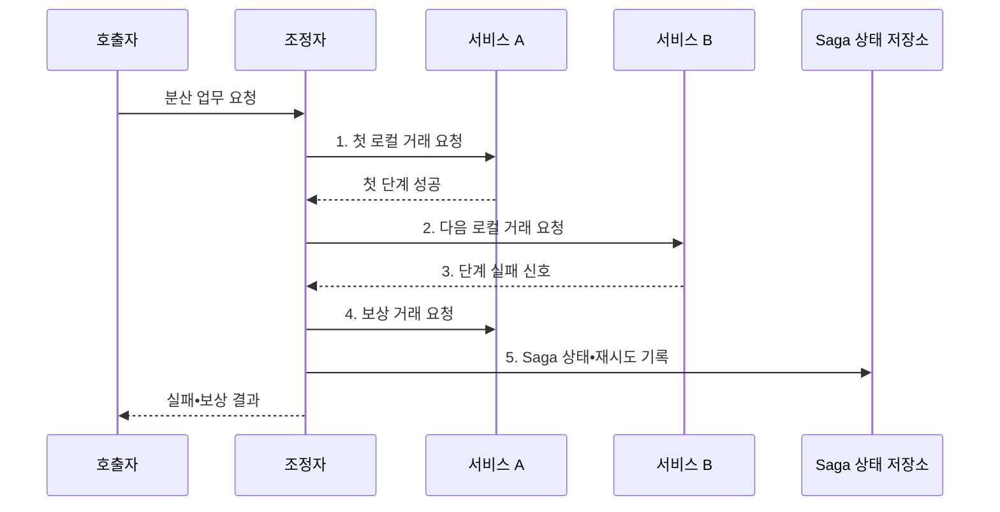

---
sidebar:
  order: 179
  label: "179. 마이크로서비스 사가 패턴 vs 2PC (Saga vs 2PC)"
  badge:
    text: "미출 • 70%"
    variant: note
title: "마이크로서비스 사가 패턴 vs 2PC (Saga vs 2PC)"
date: "2026-08-05T00:00:00+09:00"
tags:
  - "notes-software"
weight: 179
extra:
  question_no: "179"
  source_status: "미출"
  source_history: ""
  priority: 70
  priority_note: "보상 거래와 원자 확정의 비교 가치"
---

## Ⅰ. 개요

<details>
<summary>핵심 용어</summary>

- **사가 패턴(Saga Pattern)**: 장기 분산 업무를 여러 로컬 거래로 나누고 실패 시 완료 단계의 효과를 보상 거래로 상쇄하는 패턴이다.
- **2단계 커밋(Two-Phase Commit, 2PC)**: 모든 참여자의 준비 투표 후 하나의 전역 커밋•롤백 결정을 적용해 원자성을 보장하는 프로토콜이다.

</details>

- 정의/개념: **Saga와 2PC 비교** 는 로컬 거래와 보상으로 최종 수렴하는 Saga와 참여자 준비•커밋으로 전역 원자성을 보장하는 2PC의 분산 거래 방식 선택 기준
- 배경/필요성: 단일 데이터베이스 거래로는 **독립 서비스의 원자 처리 보장 불가**

#### 한줄 요약

- Saga는 끝난 일을 반대 업무로 상쇄하고 2PC는 모든 참여자가 준비될 때까지 잠근 뒤 함께 확정한다.

## Ⅱ. 특징

<details>
<summary>핵심 용어</summary>

- **코레오그래피**: 이벤트 흐름으로 Saga 단계와 보상을 연결하는 방식이다.
- **오케스트레이션**: 중앙 조정자로 Saga 단계와 보상을 관리하는 방식이다.
- **로컬 커밋**: 서비스별 거래를 독립적으로 확정하는 처리이다.
- **보상 거래**: 완료된 로컬 거래의 업무 효과를 상쇄하는 처리이다.
- **준비 단계**: 참여자가 커밋 가능 상태와 잠금을 확보하는 단계이다.
- **결정 단계**: 조정자가 전역 커밋 또는 롤백을 전달하는 단계이다.

</details>

- **로컬 커밋•보상** 기반 Saga 최종 일관성
- **준비•결정** 기반 2PC 원자성
- **코레오그래피•오케스트레이션** 기반 Saga 조정

#### 한줄 요약

- Saga는 긴 분산 잠금을 없애는 대신 중간 상태와 보상 책임이 생기고 2PC는 원자성을 얻는 대신 준비 상태의 자원 대기가 생긴다.

## Ⅲ. 구조 및 구성요소

<details>
<summary>핵심 용어</summary>

- **상태 저장소**: Saga의 단계와 보상 결과를 영속화한다.
- **복구 저장소**: 2PC의 전역 결정과 미완료 참여자를 영속화한다.
- **사가 조정(Saga Coordination)**: 로컬 단계•보상•재시도 순서를 이벤트 또는 중앙 조정자로 관리하는 구성요소이다.
- **2PC 조정자**: 준비 투표를 모으고 전역 결정을 영속화•전달하는 구성요소이다.
- **참여 서비스**: Saga에서 로컬 거래를 커밋하는 구성요소이다.
- **참여 자원**: 2PC에서 준비 잠금을 유지하는 구성요소이다.

</details>

```text
                          [업무 호출자]
                           /         \
                    [Saga 조정]   [2PC 조정자]
                           \         /
                     [참여 서비스•자원]
                              |
                     [상태•복구 저장소]
```

선의 의미: 업무 호출자 아래에는 Saga 조정과 2PC 조정자가 대안적 조정 계층으로 놓이고, 두 조정 방식은 참여 서비스•자원을 공유하며 상태•복구 저장소에 각각의 조정 상태와 결정을 보존하는 정적 구조를 뜻한다.

| 구성요소 | 책임 |
|:---|:---|
| 업무 호출자 | 분산 업무•**중복 요청 식별자 전달** |
| Saga 조정 | 로컬 단계•**보상•재시도 관리** |
| 2PC 조정자 | Prepare 투표•**전역 결정 관리** |
| 참여 서비스•자원 | 로컬 커밋•**준비 잠금 유지** |
| 상태•복구 저장소 | 사가 단계•**2PC 결정 영속화** |

#### 한줄 요약

- 호출자는 한 업무를 요청하고 조정자는 Saga라면 단계와 보상을, 2PC라면 준비 투표와 최종 결정을 기록한다.

## Ⅳ. 흐름도

<details>
<summary>핵심 용어</summary>

- **4. 보상 거래 요청**: 후속 단계가 실패하면 이미 완료된 로컬 거래의 업무 효과를 멱등한 보상 거래로 상쇄한다.
- **1. 첫 로컬 거래 요청**: 첫 참여 서비스의 업무 상태를 독립 거래로 커밋하는 단계이다.
- **2. 다음 로컬 거래 요청**: 선행 성공 후 다음 참여 서비스에 후속 처리를 위임하는 단계이다.
- **3. 단계 실패 신호**: 실패 위치와 역순으로 보상할 완료 단계의 범위를 확정하는 정보이다.
- **5. 사가 상태•재시도 기록**: 단계•보상 결과와 다음 실행 시점을 영속화하는 단계이다.

</details>



**동작 원리**

1. **첫 로컬 거래 요청**: 서비스 A의 업무 상태 커밋
2. **다음 로컬 거래 요청**: 서비스 B에 후속 처리 위임
3. **단계 실패 신호**: 실패 위치와 보상 범위 확정
4. **보상 거래 요청**: 완료 단계의 업무 효과를 멱등 상쇄
5. **Saga 상태•재시도 기록**: 단계•보상 결과를 영속화

#### 한줄 요약

- 주문과 재고 예약 뒤 결제가 실패하면 이미 끝난 재고 예약을 반대 거래로 해제하고 주문을 취소 상태로 수렴시킨다.

## Ⅴ. 종류 및 비교

<details>
<summary>핵심 용어</summary>

- **분산 거래 선택 축**: 보상 가능성과 전역 원자성 요구의 비교 기준이다.

</details>

| 분산 거래 방식 | Saga | 2PC |
|:---|:---|:---|
| 적용 기준 | 장기 업무•**보상 가능 단계** | 짧은 거래•**강한 원자성** |
| 핵심 특징 | 로컬 커밋•**최종 일관성** | 준비 잠금•**전역 결정** |
| 한계 | 중간 상태•**보상 실패** | 장기 잠금•**미결 상태** |

#### 한줄 요약

- 독립 서비스의 장기 주문 흐름은 Saga를, 같은 관리 범위의 지원 자원에서 모두 함께 확정해야 하는 짧은 거래는 2PC를 검토한다.

## Ⅵ. 실무 고려사항 및 대책

<details>
<summary>핵심 용어</summary>

- **장기 불일치**: 장기 불일치는 보상 거래가 반복 실패해 부분 완료 상태가 오래 유지되는 문제다.
- **피벗(Pivot)**: 사가에서 이 단계 이후에는 전체 취소 대신 반드시 완료 방향으로 보정해야 하는 불가역 경계이다.
- **데드 레터 큐(Dead Letter Queue, DLQ)**: 반복 실패한 보상 메시지를 정상 처리 흐름에서 격리하는 저장 경로이다.
- **XA 트랜잭션(X/Open XA Transaction, XA Transaction)**: 자원 관리자와 거래 관리자가 2PC로 조정하는 표준 분산 거래이다.

</details>

| 문제 | 대책 | 효과 |
|:---|:---|:---|
| 배송•송금의 **완전 취소 불가** | 피벗 전 예약•**이후 보정 업무** | **불가역 피해 축소** |
| 부분 완료의 **중간 상태 노출** | 상태 명시•**격리•보류 자원** | 잘못된 **후속 처리 방지** |
| 재시도의 **단계 중복 실행** | Saga•단계 식별자 **멱등 저장** | 단일 **업무 효과** |
| 보상 실패의 **장기 불일치** | 영속 재시도•**DLQ•수동 조정** | **업무 상태 수렴** |
| 2PC 준비의 **장기 잠금** | 짧은 **XA 거래•시간 제한** | **처리량 저하 완화** |

#### 한줄 요약

- 외부 송금처럼 되돌릴 수 없는 단계는 피벗 뒤에 두고 이후 실패는 취소가 아니라 별도 환불 업무로 보정해야 한다.

## Ⅶ. 결론

<details>
<summary>핵심 용어</summary>

- **거래 시간**: 분산 거래가 시작부터 종료까지 유지되는 시간이다.

</details>

- **보상 가능성•원자성 요구•거래 시간** 으로 Saga•2PC 결정

#### 한줄 요약

- 보상 가능한 장기 서비스 흐름은 Saga로, 모든 자원이 지원하고 짧은 원자 확정이 필요한 거래만 2PC로 제한해야 한다.
