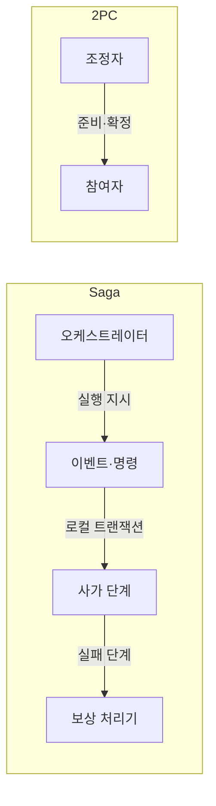
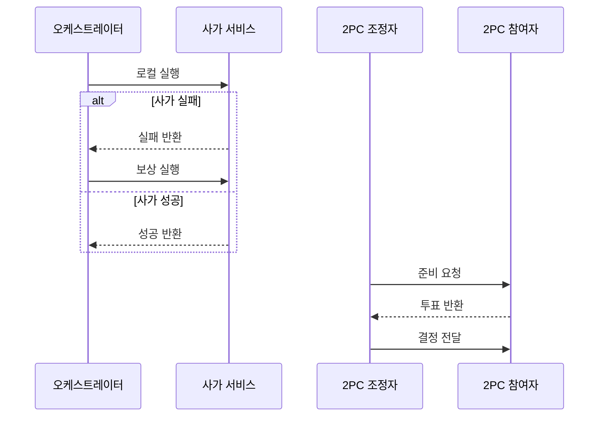

---
sidebar:
  order: 179
  label: "179. 마이크로서비스 사가 패턴 vs 2PC (Saga vs 2PC)"
  badge:
    text: "미출제 · 70%"
    variant: note
title: "마이크로서비스 사가 패턴 vs 2PC (Saga vs 2PC)"
date: "2026-07-25T00:30:00+09:00"
tags:
  - "notes-software"
weight: 179
extra:
  question_no: "179"
  source_status: "미출제"
  source_history: ""
  priority: 70
  priority_note: "보상 거래와 원자 확정의 비교 가치가 높음"
---

## 미리 알고가기

- **사가(Saga)**: 여러 로컬 트랜잭션을 연결하고 실패 시 완료 단계를 보상해 업무 일관성을 회복하는 방식임
- **2단계 커밋(Two-Phase Commit, 2PC)**: 2PC는 ‘투피시’로 읽고 두 단계를 숫자 2와 머리글자로 줄인 표기이며, 준비 투표 뒤 모든 참여자의 커밋·롤백을 함께 결정
- **코레오그래피(Choreography)**: 중앙 조정자 없이 각 서비스가 이벤트를 구독해 다음 단계를 실행하는 방식임
- **오케스트레이션(Orchestration)**: 중앙 조정자가 참여 서비스에 명령을 보내고 진행 상태를 관리하는 방식임
- **보상 트랜잭션(Compensation)**: 이미 커밋된 변경의 업무 효과를 반대 동작으로 상쇄하는 트랜잭션임
- **로컬 트랜잭션**: 한 서비스가 소유한 데이터베이스 안에서만 원자적으로 처리하는 작업임
- **최종 일관성**: 중간에는 상태가 달라도 후속 처리 뒤 업무상 같은 결과에 도달하는 성질임
- **멱등성·재시도**: 멱등성은 반복 결과가 같고 재시도는 실패 작업을 다시 실행하는 방식임
- **자원 잠금·미결 상태(In-doubt State)**: 자원 잠금은 다른 변경을 제한하고 미결 상태는 참여자가 최종 결정을 받지 못해 잠금을 풀 수 없는 상태임
- **분산 트랜잭션 자원(X/Open XA, XA)**: XA는 ‘엑스에이’로 읽고 X/Open이 정한 규격 식별자이며, 2PC 준비·확정에 참여하는 데이터베이스·메시징 자원을 연결

## Ⅰ. 개요

- **정의/개념**: 사가는 보상, 2PC는 동기 확정 기법
- **배경/필요성**: 독립 저장소는 단일 원자 거래가 안 돼 복구 조정이 필요함

### 쉽게 이해하기 (학습용)
- 사가는 단계별 역순 취소, 2PC는 전역 동시 확정임

## Ⅱ. 특징

- 사가는 중간 상태를 허용하고 최종 일관성을 지원한다.
- 보상 트랜잭션은 멱등하게 재시도할 수 있어야 한다.
- 코레오그래피는 이벤트, 오케스트레이션은 중앙 제어 방식이다.
- 2PC는 준비 단계의 자원 잠금으로 원자성을 확보한다.
- 2PC 조정자 장애 시 미결 상태가 지속될 수 있다.

### 쉽게 이해하기 (학습용)
- 사가는 보상으로 수렴하고 2PC는 자원을 잠근 채 결정을 기다린다.

## Ⅲ. 아키텍처 및 구성요소

| 설계 요소 | 설명 |
|:---|:---|
| 오케스트레이터 | 사가 진행 상태와 실행 순서를 관리 |
| 이벤트·명령 | 단계 사이 상태·실행 요청을 전달 |
| 사가 단계 | 독립 서비스에 로컬 트랜잭션 반영 |
| 보상 처리기 | 실패 시 완료된 업무 효과를 상쇄 |
| 조정자 | 2PC 준비 결과를 모아 확정·롤백 결정 |
| 참여자 | 자원을 잠그고 결정에 따라 반영·롤백 |

> 요약: 사가는 독립 저장소·보상, 2PC는 조정자·잠금 구조

### 쉽게 이해하기 (학습용)
- 사가는 독립 장부와 취소부, 2PC는 중앙 관리자와 락 구조임

## Ⅳ. 원리 및 절차 흐름도

| 절차 | 설명 |
|:---|:---|
| 로컬 실행 | 서비스 소유 데이터만 원자 변경 |
| 실패 반환 | 실패 단계와 보상 대상을 반환 |
| 보상 실행 | 완료된 업무 효과를 역순 상쇄 |
| 성공 반환 | 다음 로컬 트랜잭션을 진행 |
| 준비 요청 | 참여자에게 자원 잠금·준비 요청 |
| 투표 반환 | 준비 성공·실패를 조정자에 응답 |
| 결정 전달 | 전원 결과로 확정·롤백을 통지 |

> 요약: 사가는 보상 수행, 2PC는 전역 롤백 처리함

### 쉽게 이해하기 (학습용)
- 정상 수행 시 확정하고 실패 시 보상이나 롤백을 실행함

## Ⅴ. 종류 및 비교

| 판단 기준 | Saga | 2PC |
|:---|:---|:---|
| 핵심 특징 | 개별 트랜잭션 체인 연결 | 중앙 조정자 일괄 제어 |
| 적용 기준 | 이종 서비스 간 분산 환경 | 단일 도메인 내 단기 원자 갱신 |
| 주요 위험 | 보상 실패·중간 상태 노출 | 조정자 장애·장기 잠금 |

> 요약: 사가는 보상 수렴, 2PC는 락 기반 일괄 확정임

### 쉽게 이해하기 (학습용)
- 장기 잠금을 피하면 사가, 원자 확정은 2PC를 선택한다.

## Ⅵ. 실무 사례

1. 주문·결제 연동은 사가로 실패 단계를 보상함
2. 내부 XA 자원은 2PC로 함께 커밋함

### 쉽게 이해하기 (학습용)
- 주문 실패 시 결제 취소로 업무 상태를 되돌림
- 짧은 내부 거래는 모든 자원의 성공을 함께 확정함

## Ⅶ. 결론

- 독립 서비스는 Saga, 짧은 XA 거래는 2PC를 선택함

### 쉽게 이해하기 (학습용)
- 오래 잠글 수 없으면 보상하고 즉시 같아야 하면 함께 확정함
