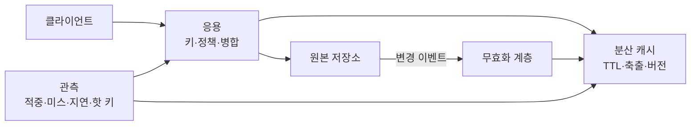
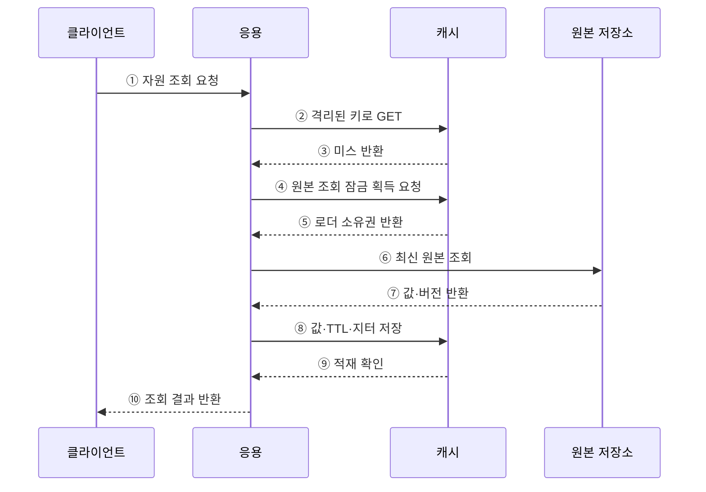

---
sidebar:
  order: 180
  label: "180. 캐싱 전략 — Cache-Aside·Write-Through (Caching Strategy)"
  badge:
    text: "미출제 · 70%"
    variant: note
title: "캐싱 전략 — Cache-Aside·Write-Through (Caching Strategy)"
date: "2026-07-25T00:30:00+09:00"
tags:
  - "notes-software"
weight: 180
extra:
  question_no: "180"
  source_status: "미출제"
  source_history: ""
  priority: 70
  priority_note: "무효화·동시 미스·원본 보호가 독립 설계축임"
---

## 미리 알고가기

- **캐시(Cache)**: 자주 읽는 원본 데이터의 사본을 가까이 저장해 지연과 원본 부하를 줄이는 계층
- **유효기간(Time to Live, TTL·티티엘)**: 캐시 항목이 유효한 최대 시간
- **캐시 어사이드(Cache-Aside)**: 응용이 캐시를 먼저 조회하고 미스일 때 원본을 읽어 캐시에 적재하는 전략
- **리드 스루(Read-Through)**: 캐시 계층이 미스 시 등록된 로더로 원본을 읽어 적재하는 전략
- **라이트 스루(Write-Through)**: 쓰기를 캐시와 원본에 동기 반영한 뒤 성공을 반환하는 전략
- **라이트 비하인드(Write-Behind)**: 캐시에 먼저 반영하고 변경 큐를 통해 원본에 비동기 기록하는 전략
- **무효화(Invalidation)**: 원본 변경 시 낡은 캐시를 삭제하거나 새 버전으로 교체하는 처리
- **캐시 스탬피드(Cache Stampede)**: 인기 키의 만료·미스로 많은 요청이 동시에 원본에 몰리는 현상
- **요청 병합(Request Coalescing)**: 같은 키의 동시 미스 중 한 요청만 원본을 읽고 나머지는 결과를 공유하는 기법
- **부정 캐싱(Negative Caching)**: 존재하지 않음이나 오류 결과를 짧게 저장해 반복 원본 조회를 줄이는 기법
- **축출(Eviction)**: 용량 한도·사용 빈도·최근 사용 시점에 따라 캐시 항목을 제거하는 처리
- **핫 키(Hot Key)**: 소수 키에 요청이 집중되어 특정 캐시 노드와 네트워크에 병목을 만드는 키

## Ⅰ. 개요

- 캐싱 전략은 **누가 읽어 채우고 쓰며 언제 만료·무효화할지** 정하는 정책이다.
- 반복 조회를 가까운 사본으로 처리해 응답 지연과 원본 저장소 부하를 줄인다.
- 성능 향상과 함께 오래된 값·동시 미스·키 충돌·장애 시 원본 폭주를 통제해야 한다.

### 쉽게 이해하기 (학습용)
- 가까운 사본을 누가 채우고 언제 버릴지 정한 규칙임

## Ⅱ. 특징

- **지역성 활용**: 자주 반복되는 읽기와 계산 결과를 가까운 계층에서 재사용한다.
- **수명 관리**: TTL·지터·버전·변경 이벤트로 신선도와 갱신 부하를 조절한다.
- **원본 보호**: 요청 병합·부정 캐싱·호출 제한으로 미스 폭주를 억제한다.
- **용량 관리**: 항목 크기·빈도·최근 사용 기준으로 제한된 메모리를 배분한다.
- **격리된 키**: 테넌트·자원 ID·질의·스키마 버전을 키에 포함해 충돌과 정보 노출을 막는다.
- **효과 측정**: 적중률뿐 아니라 원본 회피율·응답 지연·오래된 값·축출·핫 키를 함께 관측한다.

### 쉽게 이해하기 (학습용)
- 사본의 수명과 동시 조회를 관리해 빠르면서 원본을 보호함

## Ⅲ. 아키텍처 및 구성요소

**도표안 A — 구조도**

**도표안 B — sequenceDiagram**

| 구성요소 | 역할 |
|:---|:---|
| 캐시 키·네임스페이스 | 테넌트·자원·질의·버전으로 항목 식별·격리 |
| 캐시 저장소 | 값·버전·TTL 저장과 용량 기반 축출 |
| 로더·라이터 | 원본 읽기와 동기·비동기 쓰기 정책 수행 |
| 요청 병합 | 같은 키의 동시 미스를 한 원본 조회로 통합 |
| 무효화 계층 | 원본 변경 이벤트로 삭제·갱신·버전 증가 |
| 원본 보호 | Timeout·호출 제한·Circuit Breaker·부정 캐싱 |
| 관측 체계 | 적중·미스·지연·축출·오류·핫 키 측정 |

**동작 원리**

- ① 클라이언트가 응용에 자원 조회를 요청한다.
- ② 응용이 테넌트·자원·질의·버전을 포함한 키로 캐시를 조회한다.
- ③ 캐시에 유효한 항목이 없으면 미스를 반환한다.
- ④ 응용이 같은 키의 동시 원본 조회를 하나로 합치기 위해 제한 시간 잠금을 요청한다.
- ⑤ 캐시가 한 요청에 로더 소유권을 주고 나머지는 결과를 기다리거나 제한적으로 우회시킨다.
- ⑥ 로더가 된 응용 요청만 원본 저장소에서 최신값을 조회한다.
- ⑦ 원본 저장소가 값과 정합성 확인용 버전을 반환한다.
- ⑧ 응용이 값·버전과 지터를 더한 TTL을 캐시에 저장한다.
- ⑨ 캐시 적재를 확인하고 조회 잠금을 안전하게 해제한다.
- ⑩ 응용이 원본 또는 캐시에서 얻은 결과를 클라이언트에 반환한다.

### 쉽게 이해하기 (학습용)
- 같은 사본이 없을 때 대표 요청 하나만 원본을 읽고 나머지가 그 결과를 함께 씀

## Ⅳ. 종류 및 비교

| 비교 항목 | Cache-Aside | Read-Through | Write-Through | Write-Behind |
|:---|:---|:---|:---|:---|
| 읽기 주체 | 응용이 캐시·원본 선택 | 캐시가 원본 로더 호출 | 구현에 따라 Aside·Through | 주로 캐시에서 읽음 |
| 쓰기 시점 | 원본 쓰기 후 삭제·갱신 | 별도 쓰기 정책 필요 | 캐시와 원본 동기 반영 | 캐시 후 원본 비동기 반영 |
| 장점 | 단순·유연·필요 데이터만 저장 | 응용의 로딩 로직 통일 | 쓰기 완료 뒤 원본 반영 보장 | 낮은 쓰기 지연·일괄 처리 |
| 한계 | 무효화 누락·미스 폭주 | 로더 장애·제공자 결합 | 쓰기 지연·원본 장애 전파 | 유실·순서 역전·복구 복잡성 |
| 적용 | 일반 조회 중심 서비스 | 공통 캐시 플랫폼 | 읽기 직후 최신값이 중요한 업무 | 지연 반영 가능한 고빈도 집계 |

| 무효화 방식 | 장점 | 주의점 |
|:---|:---|:---|
| TTL 만료 | 단순하고 장애에 강함 | 만료 전 오래된 값 |
| 쓰기 후 삭제 | 다음 읽기에서 최신값 적재 | DB 커밋과 삭제 사이 경쟁 |
| 변경 이벤트 | 빠른 다중 캐시 갱신 | 이벤트 유실·순서·재처리 |
| 버전 키 | 이전 값과 충돌 없이 전환 | 오래된 키 정리와 버전 배포 |

### 쉽게 이해하기 (학습용)
- Aside는 응용이 채우고 Through는 캐시가 채우며 Behind는 원본 반영을 나중에 함

## Ⅴ. 실무 고려사항 및 대책

| 고려사항 | 위험 | 대책 |
|:---|:---|:---|
| 키 설계 | 테넌트 혼합·질의 충돌·스키마 불일치 | 테넌트·자원·조건·버전을 명시 |
| TTL | 동시 만료와 오래된 값 | 업무 신선도 기반 TTL·무작위 지터 |
| 스탬피드 | 인기 키 미스로 원본 장애 | 요청 병합·사전 갱신·Stale-While-Revalidate |
| 캐시 관통 | 존재하지 않는 키 반복 조회 | 짧은 부정 캐싱·Bloom Filter·호출 제한 |
| 핫 키 | 특정 노드 CPU·네트워크 집중 | 로컬 캐시·복제·키 분할·요청 병합 |
| 무효화 경쟁 | 이전 조회가 새 값을 낡은 값으로 덮음 | 버전 비교·조건부 저장·삭제 순서 검증 |
| 캐시 장애 | 모든 요청이 원본으로 우회해 연쇄 장애 | 원본 호출 제한·Circuit Breaker·점진 복구 |
| 개인정보 | 캐시 사본의 과다 보존·접근 | 암호화·짧은 TTL·권한·삭제 전파 |
| 지표 해석 | 높은 적중률인데 원본 부하 지속 | 바이트·비용 가중 적중률과 원본 회피율 측정 |

### 쉽게 이해하기 (학습용)
- 사례: 인기 상품 키의 TTL에 지터를 주고 첫 미스만 원본을 읽게 해 동시 폭주를 막음

## Ⅵ. 결론

- 캐싱 전략의 핵심은 **읽기·쓰기 주체와 사본의 만료·무효화·복구 책임을 명확히 하는 것**이다.
- 적중률만 높이는 것이 아니라 신선도·원본 보호·장애 우회·테넌트 격리를 함께 설계해야 한다.
- 조회 중심은 Cache-Aside를 우선 검토하고, 즉시 원본 반영이 필요하면 Write-Through, 지연 반영을 허용하면 Write-Behind를 제한적으로 적용한다.

### 쉽게 이해하기 (학습용)
- 누가 사본을 채우고 언제 원본과 맞출지 먼저 정해야 빠르고 안전함
