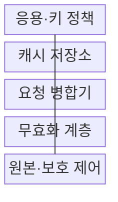
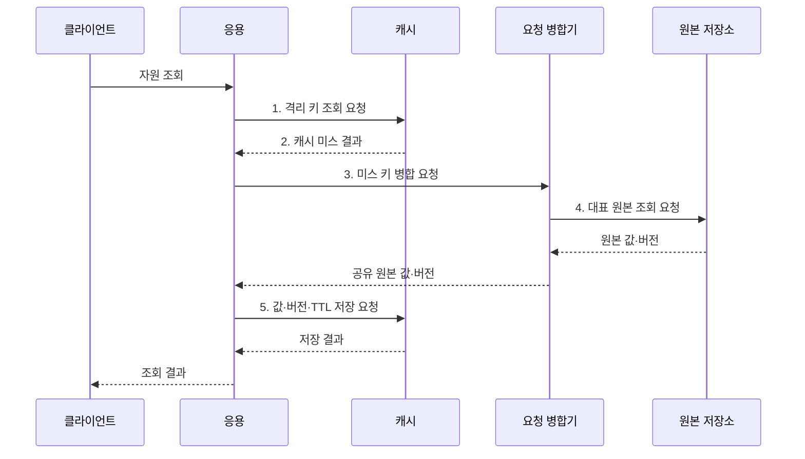

---
sidebar:
  order: 180
  label: "180. 캐싱 전략: Cache-Aside·Write-Through (Caching Strategy)"
  badge:
    text: "미출 · 70%"
    variant: note
title: "캐싱 전략: Cache-Aside·Write-Through (Caching Strategy)"
date: "2026-08-02T12:00:00+09:00"
tags:
  - "notes-software"
weight: 180
extra:
  question_no: "180"
  source_status: "미출"
  source_history: ""
  priority: 70
  priority_note: "무효화·동시 미스·원본 보호의 설계 가치"
---

## Ⅰ. 개요

핵심 용어

- **성능·신선도 설계 전략**: 캐싱 전략은 원본 사본의 읽기, 쓰기, 만료, 무효화 방식을 정해 응답 성능과 데이터 신선도를 조절한다.

- 정의/개념: 원본 사본의 읽기·쓰기·만료·무효화를 정하는 **성능·신선도 설계 전략**
- 배경/필요성: 원본 직접 조회만으로는 **반복 입출력·응답 지연 증가**

### 쉽게 이해하기 (학습용)

- 가까운 사본을 누가 채우고 언제 버리며 원본 변경 뒤 어떻게 맞출지 정해야 빠른 조회가 오래된 답으로 바뀌지 않는다.

## Ⅱ. 특징

핵심 용어

- **요청 병합·부정 캐싱**: 요청 병합은 같은 키의 동시 미스를 합치고 부정 캐싱은 존재하지 않는 결과의 반복 조회를 줄여 원본을 보호한다.

- **지역성·재사용** 기반 조회 지연 축소
- **TTL·버전·변경 사건** 기반 신선도 관리
- **요청 병합·부정 캐싱** 기반 원본 보호

### 쉽게 이해하기 (학습용)

- 인기 상품 사본이 동시에 만료돼도 대표 요청 하나만 원본을 읽고 나머지가 결과를 공유하면 데이터베이스 폭주를 막을 수 있다.

## Ⅲ. 구조 및 구성요소

핵심 용어

- **무효화 계층**: 무효화 계층은 원본 변경 사건을 받아 낡은 캐시를 삭제하거나 새 버전으로 갱신한다.

| 구성요소 | 책임 |
|:---|:---|
| 응용·키 정책 | 키 격리·**읽기·쓰기 방식 결정** |
| 캐시 저장소 | 값·버전·**TTL·축출 관리** |
| 요청 병합기 | 동시 미스·**단일 원본 조회** |
| 무효화 계층 | 변경 사건·**삭제·갱신 전파** |
| 원본·보호 제어 | 기준 데이터·**호출 상한 적용** |

### 쉽게 이해하기 (학습용)

- 응용이 사본 주소와 정책을 정하고 캐시는 보관하며 무효화 계층이 원본 변경을 알리고 요청 병합이 몰리는 손님을 한 줄로 세운다.

## Ⅳ. 흐름도

핵심 용어

- **5. 값·버전·TTL 저장 요청**: 원본 조회 결과에 버전과 TTL 지터를 적용해 캐시에 저장하고 오래된 결과의 역전을 막는다.

**동작 원리**

1. **격리 키 조회 요청**: 테넌트·자원·질의·버전 조합 검색
2. **캐시 미스 결과**: 유효한 사본의 부재 확인
3. **미스 키 병합 요청**: 같은 키의 동시 조회를 한 작업으로 통합
4. **대표 원본 조회 요청**: 병합된 요청을 대신해 최신값 조회
5. **값·버전·TTL 저장 요청**: TTL 지터와 버전 조건을 적용해 적재

### 쉽게 이해하기 (학습용)

- 사본이 없을 때 첫 요청만 원본을 읽고 값과 버전을 저장하면 뒤따른 요청은 같은 결과를 받아 원본 호출을 반복하지 않는다.

## Ⅴ. 종류 및 비교

핵심 용어

- **Cache-Aside**: Cache-Aside는 애플리케이션이 캐시를 먼저 읽고 미스가 발생하면 원본을 조회해 적재하는 전략이다.

| 캐싱 전략 | Cache-Aside | Write-Through | Write-Behind |
|:---|:---|:---|:---|
| 적용 기준 | 일반 **조회 중심 서비스** | 쓰기 직후 **원본 최신성** | 지연 허용 **고빈도 쓰기** |
| 핵심 특징 | 응용의 **미스 적재·무효화** | 캐시·원본 **동기 반영** | 캐시 후 **비동기 원본 반영** |
| 한계 | 무효화 누락·**미스 폭주** | 쓰기 지연·**원본 장애 전파** | 유실·순서·**복구 복잡성** |

### 쉽게 이해하기 (학습용)

- 조회 중심은 응용이 필요한 값만 채우고 즉시 원본 반영이 필요하면 동기 쓰기, 지연 반영을 허용하면 비동기 쓰기를 제한적으로 사용한다.

## Ⅵ. 실무 고려사항 및 대책

핵심 용어

- **동시 만료**: 동시 만료는 인기 키들이 같은 시점에 만료되어 많은 요청이 한꺼번에 원본으로 몰리는 문제다.

| 문제 | 대책 | 효과 |
|:---|:---|:---|
| 테넌트·질의의 **키 충돌** | 테넌트·조건·**키 정책 버전 포함** | **정보 혼합 방지** |
| 핫 키의 **동시 만료** | TTL 지터·**요청 병합·사전 갱신** | **원본 폭주 방지** |
| 존재하지 않는 **키 반복 조회** | 짧은 부정 캐싱·**호출 제한** | **캐시 관통 완화** |
| 이전 조회의 **새 값 덮어쓰기** | 버전 비교·**조건부 저장** | 오래된 **값 역전 방지** |
| 캐시 장애의 **원본 연쇄 부하** | 원본 호출 상한·**차단기 적용** | 저장소 **장애 확산 억제** |

### 쉽게 이해하기 (학습용)

- 캐시 전체 장애 때 모든 요청이 캐시를 건너뛰어 원본으로 향하지 않도록 호출 상한과 차단기로 원본의 연쇄 장애를 막아야 한다.

## Ⅶ. 결론

핵심 용어

- **Write-Through**: 조회 중심은 Cache-Aside를 사용하고 쓰기 직후 원본 일치가 필요하면 Write-Through를 선택한다.

- 조회 중심은 **Cache-Aside**, 즉시 원본 일치는 **Write-Through** 선택

### 쉽게 이해하기 (학습용)

- 조회 중심은 Cache-Aside로 시작하고 TTL·요청 병합·버전 무효화를 함께 설계해 속도와 원본 보호를 동시에 확보해야 한다.
