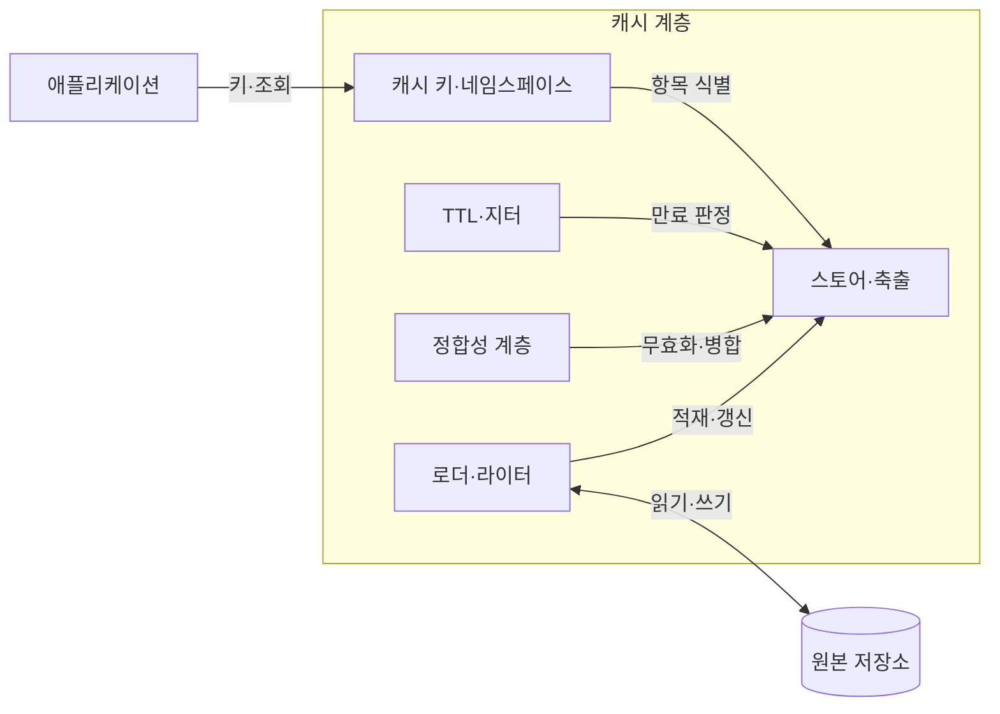
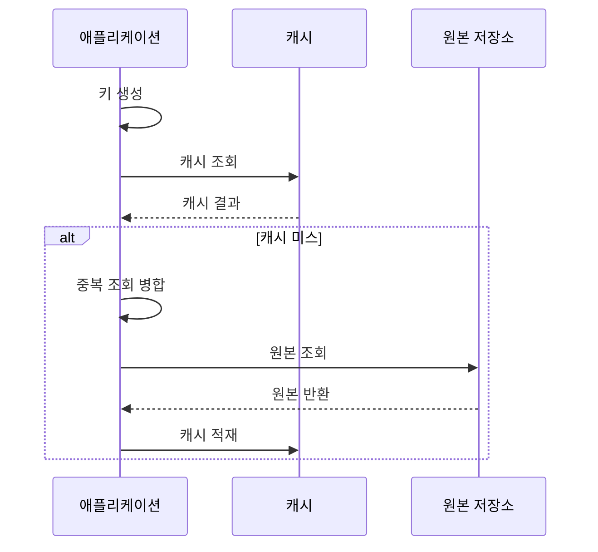

---
sidebar:
  order: 180
  label: "180. 캐싱 전략 — Cache-Aside·Write-Through (Caching Strategy)"
  badge:
    text: "미출제 · 70%"
    variant: note
title: "캐싱 전략 — Cache-Aside·Write-Through (Caching Strategy)"
date: "2026-07-25T00:30:00+09:00"
tags:
  - "notes-software"
weight: 180
extra:
  question_no: "180"
  source_status: "미출제"
  source_history: ""
  priority: 70
  priority_note: "무효화·동시 미스·원본 보호가 독립 설계축임"
---

## 미리 알고가기

- **캐시(Cache)**: 자주 읽는 원본 데이터 사본을 가까이 저장해 응답 시간을 줄이는 저장 계층임
- **유효기간(Time to Live, TTL)**: TTL은 ‘티티엘’로 읽고 영문 머리글자를 딴 약어이며, 캐시 사본의 만료 시점과 원본 재조회 여부를 결정
- **캐시 어사이드(Cache-Aside)**: 캐시 미스 때 애플리케이션이 원본을 읽고 사본을 채우는 전략임
- **리드 스루(Read-Through)**: 캐시 제공자가 미스 때 원본을 읽어 사본을 채우는 전략임
- **라이트 스루(Write-Through)**: 쓰기를 캐시와 원본에 동기 반영한 뒤 성공을 반환하는 전략임
- **라이트 비하인드(Write-Behind)**: 캐시에 먼저 쓴 뒤 대기열의 변경을 원본에 비동기 반영하는 전략임
- **캐시 미스·적중**: 미스는 값이 없는 상태이고 적중은 유효한 값을 찾은 상태임
- **네임스페이스·테넌트**: 네임스페이스는 키 구분 영역이고 테넌트는 서비스를 공유하는 고객 단위임
- **축출·지터**: 축출은 항목 삭제이고 지터는 만료 시각을 무작위로 분산하는 값임
- **캐시 스탬피드**: 같은 키가 동시에 만료되어 다수 요청이 원본으로 몰리는 현상임
- **무효화**: 원본 변경 시 낡은 캐시를 삭제하거나 사용할 수 없게 하는 처리임
- **캐시 적중률(Cache Hit Ratio)**: 전체 조회 중 유효한 캐시 값을 반환한 비율이며, 캐시 효과와 원본 요청 감소를 관측하는 지표임

## Ⅰ. 개요

- 정의/개념: 만료 시 데이터 조회와 갱신 주체를 정하는 정책
- **배경/필요성**: 반복 원본 조회가 지연·부하를 높여 캐시 정책이 필요함

### 쉽게 이해하기 (학습용)
- 가까운 서랍의 데이터를 갱신하고 채우는 규칙임

## Ⅱ. 특징

- 키에 식별자를 포함해 고객별 데이터를 격리한다.
- TTL을 분산하고 같은 키의 동시 조회를 병합한다.
- 값이 없는 결과도 짧은 시간 동안 저장한다.
- 변경 이벤트와 버전 비교로 낡은 값을 무효화한다.
- 용량 한도에 따라 항목을 축출하고 적중률을 관측한다.
- 장애 시 원본 요청량을 제한해 폭주를 억제한다.

### 쉽게 이해하기 (학습용)
- 섞이지 않게 키를 나누고 원본 폭주를 차단함

## Ⅲ. 아키텍처 및 구성요소

| 설계 요소 | 설명 |
|:---|:---|
| 캐시 키·네임스페이스 | 식별자와 질의로 항목을 구분함 |
| 스토어·축출 | 값을 저장하고 용량 기준으로 삭제함 |
| 로더·라이터 | 원본을 읽고 동기·비동기로 씀 |
| TTL·지터 | 만료 시점을 분산하고 동시 조회를 줄임 |
| 정합성 계층 | 무효화와 병합으로 낡은 값을 차단함 |

> 요약: 키와 로더가 읽기와 쓰기 순서를 연결함

### 쉽게 이해하기 (학습용)
- 키와 만료로 수명을 정하고 정합성을 유지함

## Ⅳ. 원리 및 절차 흐름도

| 절차 | 설명 |
|:---|:---|
| 키 생성 | 고객·질의 식별자로 캐시 키 생성 |
| 캐시 조회 | 키와 유효기간으로 항목 조회 |
| 캐시 결과 | 적중 값이나 미스 상태 반환 |
| 중복 조회 병합 | 같은 키의 원본 조회를 하나로 병합 |
| 원본 조회 | 저장소에서 최신 데이터 조회 |
| 원본 반환 | 조회 결과를 애플리케이션에 반환 |
| 캐시 적재 | 원본 결과와 유효기간 저장 |

> 요약: 캐시 미스의 원본 조회를 병합해 적재

### 쉽게 이해하기 (학습용)
- 같은 키의 요청을 묶어 원본을 한 번만 읽음

## Ⅴ. 종류 및 비교

| 판단 기준 | Cache-Aside | Read-Through | Write-Through | Write-Behind |
|:---|:---|:---|:---|:---|
| 핵심 특징 | 앱이 미스 조회와 무효화 수행 | 제공자가 직접 미스 적재 | 캐시·원본 동기 갱신 | 대기열 거쳐 비동기 갱신 |
| 적용 기준 | 조회 위주 개별 제어 | 공통 로더 추상화 | 즉시 최신 데이터 필요 | 지연/일괄 반영 허용 |
| 주요 위험 | 무효화 누락·스탬피드 | 로더 장애·제공자 종속 | 쓰기 지연·원본 장애 전파 | 유실·순서 역전·복구 복잡도 |

> 요약: Aside는 응용, Through는 캐시가 처리함

### 쉽게 이해하기 (학습용)
- 읽기 주체와 쓰기 지연 허용 여부로 전략을 나눔

## Ⅵ. 실무 사례

1. 상품 조회는 TTL 지터로 동시 원본 조회 분산

### 쉽게 이해하기 (학습용)
- 상품 조회는 지터로 동시 원본 조회를 줄임

## Ⅶ. 결론

- 원본 부하와 응답시간을 줄이면서 데이터 신선도를 유지하기 위해 **조회·쓰기 비율·허용 불일치·TTL·무효화 실패**를 검토하고, 조회 중심은 Cache-Aside, 즉시 반영은 Write-Through를 적용한다

### 쉽게 이해하기 (학습용)
- 누가 채울지와 원본 반영을 기다릴지 먼저 정함
