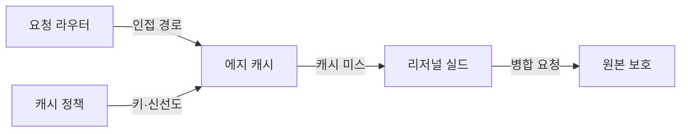
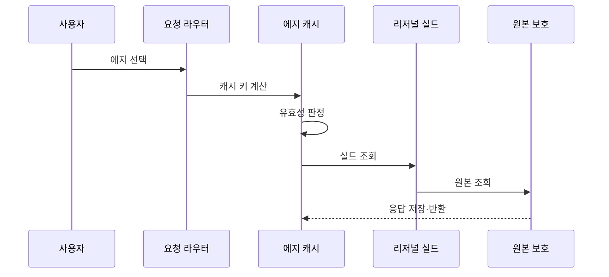

---
sidebar:
  order: 181
  label: "181. CDN 콘텐츠 전송 네트워크 (CDN Content Delivery Network)"
  badge:
    text: "기출 · 50%"
    variant: note
title: "CDN 콘텐츠 전송 네트워크 (CDN Content Delivery Network)"
date: "2026-07-25T00:30:00+09:00"
tags:
  - "notes-software"
weight: 181
extra:
  question_no: "181"
  source_status: "기출"
  source_history: "122회"
  priority: 50
  priority_note: "콘텐츠 근접 배치와 캐시 경로는 기존 출제임"
---

## 미리 알고가기

- **콘텐츠 전송 네트워크(Content Delivery Network, CDN)**: CDN은 ‘시디엔’으로 읽고 영문 머리글자를 딴 약어이며, 사용자 인접 에지에서 콘텐츠를 전달하는 분산 계층임
- **에지·원본**: 에지는 사용자 인접 전달 지점이고 원본은 정본 콘텐츠 저장소임
- **캐시 키(Cache Key)**: 주소·메서드·헤더로 캐시 사본을 구분하는 식별자임
- **신선도(Freshness)**: 캐시 응답을 원본 확인 없이 재사용할 수 있는 기간임
- **유효기간(Time to Live, TTL)**: TTL은 ‘티티엘’로 읽고 영문 머리글자를 딴 약어이며, 캐시 사본을 재검증 없이 사용할 시간과 원본 재조회 시점을 결정함
- **엔터티 태그(Entity Tag, ETag)**: ETag는 ‘이태그’로 읽고 Entity의 E와 Tag를 결합한 표기이며, 캐시 사본과 원본의 변경 여부를 비교함
- **Pull·Push**: 최초 요청 시 인출하는 방식과 배포 전에 적재하는 방식임
- **리저널 실드(Regional Shield)**: 여러 에지의 미스를 모아 원본 요청을 줄이는 중간 캐시임
- **캐시 미스**: 캐시에 요청한 사본이 없거나 만료되어 원본 계층을 조회하는 상태임
- **해시 캐시 키**: 콘텐츠 내용의 해시값을 이름에 포함해 버전별 사본을 구분하는 키임
- **서명 요청**: 허가된 CDN만 원본에 접근하도록 인증 정보를 포함한 요청임

## Ⅰ. 개요

- **정의/개념**: 인접 에지에서 콘텐츠를 전달하는 분산 계층
- **배경/필요성**: 원본 집중·장거리 지연으로 에지 캐시가 필요함

### 쉽게 이해하기 (학습용)

- 자주 찾는 콘텐츠를 가까이 두어 원본 요청을 줄임

## Ⅱ. 특징

- 사용자 위치와 네트워크 상태로 에지를 선택한다.
- 신선도 만료 시 ETag로 원본 변경을 재검증한다.
- 리저널 실드가 여러 에지의 미스를 병합한다.

### 쉽게 이해하기 (학습용)

- 여러 에지의 미스를 실드가 하나로 모아 조회함

## Ⅲ. 아키텍처 및 구성요소

| 설계 요소 | 설명 |
|:---|:---|
| 요청 라우터 | 인접 에지 서버에 연결함 |
| 에지 캐시 | 재사용 가능한 자원 사본을 저장함 |
| 캐시 정책 | 키·신선도·재검증 조건을 정함 |
| 리저널 실드 | 에지 미스를 병합해 원본을 조회함 |
| 원본 보호 | 서명된 요청만 원본에 전달함 |

> 요약: 에지와 실드가 캐시 미스를 병합함

### 쉽게 이해하기 (학습용)

- 에지와 실드에 사본이 없을 때만 원본을 조회함

## Ⅳ. 원리 및 절차 흐름도

| 절차 | 설명 |
|:---|:---|
| 에지 선택 | 위치·지연 정책으로 인접 에지에 연결함 |
| 캐시 키 계산 | 주소·메서드·헤더로 사본을 식별함 |
| 유효성 판정 | 신선도·ETag로 재사용 여부를 정함 |
| 실드 조회 | 에지 미스를 실드에서 병합함 |
| 원본 조회 | 실드 미스만 원본에 전달함 |
| 응답 저장·반환 | 응답을 캐시하고 사용자에게 전달함 |

> 요약: 유효 캐시는 재사용하고 미스만 원본을 조회함

### 쉽게 이해하기 (학습용)

- 사본이 없거나 바뀐 경우에만 원본을 조회함

## Ⅴ. 종류 및 비교

| 판단 기준 | Pull CDN | Push CDN |
|:---|:---|:---|
| 핵심 특징 | 최초 요청 때 원본에서 인출 | 배포 전에 에지로 사전 적재 |
| 적용 기준 | 수요 변동이 큰 일반 웹 자산 | 대용량·정기 배포 자산 |
| 주요 위험 | 콜드 미스 시 원본 부하 집중 | 배포 불일치·저장 공간 낭비 |

> 요약: 변동 수요는 Pull, 예정 배포는 Push임

### 쉽게 이해하기 (학습용)

- 요청 때 가져오면 Pull, 미리 채우면 Push임

## Ⅵ. 실무 사례

1. 웹 정적 자산은 해시 키로 장기 보관함
2. 정기 배포 파일은 에지에 미리 적재함

### 쉽게 이해하기 (학습용)

- 정적 자산은 내용별 해시 키로 이전 사본과 분리함
- 정기 파일은 요청 전에 각 에지에 미리 올림

## Ⅶ. 결론

- 변동 수요는 Pull, 예정 배포는 Push를 적용함

### 쉽게 이해하기 (학습용)

- 수요가 불규칙하면 요청 때 가져오고 배포가 예정되면 미리 채움
