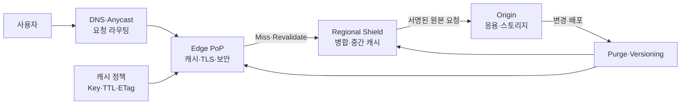
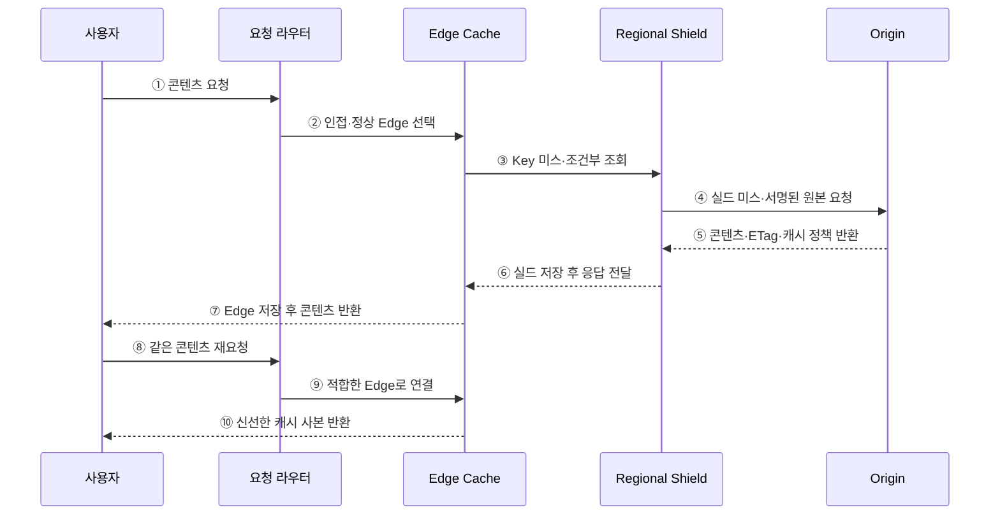

---
sidebar:
  order: 181
  label: "181. CDN 콘텐츠 전송 네트워크 (CDN Content Delivery Network)"
  badge:
    text: "기출 · 50%"
    variant: note
title: "CDN 콘텐츠 전송 네트워크 (CDN Content Delivery Network)"
date: "2026-07-27T23:59:59+09:00"
tags:
  - "notes-software"
weight: 181
extra:
  question_no: "181"
  source_status: "기출"
  source_history: "122회"
  priority: 50
  priority_note: "콘텐츠 근접 배치와 캐시 경로는 기존 출제임"
---

## 미리 알고가기

- **콘텐츠 전송 네트워크(Content Delivery Network, CDN·시디엔)**: 사용자와 가까운 분산 에지에서 콘텐츠를 전달해 지연과 원본 부하를 줄이는 계층
- **에지 접속점(Point of Presence, PoP·팝)**: 사용자 요청을 받아 캐시·보안·전송을 수행하는 지역 거점
- **원본(Origin)**: 콘텐츠의 정본을 생성하거나 저장하는 서버·스토리지
- **캐시 키(Cache Key)**: URL·메서드·선택 헤더·쿠키·질의값으로 캐시 사본을 구분하는 식별자
- **신선도(Freshness)**: 캐시가 원본 확인 없이 사본을 재사용할 수 있는 상태
- **유효기간(Time to Live, TTL·티티엘)**: 캐시 사본을 신선한 것으로 보는 최대 시간
- **엔티티 태그(Entity Tag, ETag·이태그)**: 원본 표현의 버전을 식별해 `If-None-Match` 조건부 재검증에 사용하는 값
- **리저널 실드(Regional Shield)**: 여러 에지의 미스를 모아 원본 요청과 동시 폭주를 줄이는 중간 캐시
- **캐시 퍼지(Cache Purge)**: 배포·삭제 시 에지의 특정 캐시 사본을 명시적으로 무효화하는 작업
- **서명 URL·쿠키(Signed URL·Cookie)**: 만료·경로·사용자 조건을 서명해 제한된 콘텐츠 접근을 허용하는 수단
- **애니캐스트(Anycast)**: 여러 거점이 같은 주소를 광고해 네트워크가 가까운 경로로 사용자를 전달하는 라우팅 방식

## Ⅰ. 개요

- CDN은 사용자와 가까운 에지에 콘텐츠 사본을 두어 **전송 지연·원본 트래픽·장거리 대역폭**을 줄인다.
- 라우팅·다단 캐시·원본 보호·보안 정책을 결합해 대규모 요청과 지역 장애를 분산한다.
- 캐시 가능성·신선도·키·무효화가 잘못되면 오래된 콘텐츠나 사용자 간 데이터 노출이 발생한다.

### 쉽게 이해하기 (학습용)
- 원본 창고의 물건을 지역 배송소에 복사해 가까운 곳에서 바로 전달함

## Ⅱ. 특징

- **근접 전달**: DNS·Anycast·망 지연 정보를 이용해 적합한 에지로 요청을 보낸다.
- **다단 캐시**: 브라우저·에지·리저널 실드가 반복 요청을 단계별로 흡수한다.
- **신선도 제어**: Cache-Control·TTL·ETag·Last-Modified로 재사용과 재검증을 결정한다.
- **원본 보호**: 실드·요청 병합·호출 제한·서명 인증으로 원본 폭주와 우회 접근을 줄인다.
- **전송 최적화**: 압축·HTTP/2·HTTP/3·이미지 변환·구간 전송을 에지에서 적용한다.
- **보안 확장**: TLS 종료·웹 방화벽·DDoS 완화·Bot 제어를 사용자 인접 지점에서 수행한다.

### 쉽게 이해하기 (학습용)
- 가까운 에지가 반복 요청을 받고 없을 때만 실드를 거쳐 원본을 조회함

## Ⅲ. 아키텍처 및 구성요소

**도표안 A — 구조도**

**도표안 B — sequenceDiagram**

| 구성요소 | 역할 |
|:---|:---|
| 요청 라우터 | 위치·망 상태·거점 건강도로 Edge 선택 |
| Edge PoP | 캐시·TLS·압축·보안·전송 최적화 수행 |
| 캐시 정책 | Key·TTL·재검증·공유 가능성·Stale 허용 정의 |
| Regional Shield | Edge 미스 병합·중간 저장·원본 요청 감소 |
| Origin | 정본 콘텐츠 생성·저장과 조건부 응답 제공 |
| Purge·Versioning | 변경 콘텐츠 무효화와 버전별 주소 전환 |
| 관측 체계 | 적중률·원본 회피율·전송량·지연·오류 측정 |

**동작 원리**

- ① 사용자가 콘텐츠 URL을 요청한다.
- ② 요청 라우터가 네트워크 거리와 건강 상태를 기준으로 Edge를 선택한다.
- ③ Edge에 신선한 캐시가 없으면 Key와 ETag 조건을 포함해 Regional Shield를 조회한다.
- ④ Shield에도 유효한 사본이 없을 때만 인증된 요청을 Origin에 보낸다.
- ⑤ Origin이 콘텐츠와 ETag·Cache-Control 등 신선도 정책을 반환한다.
- ⑥ Shield가 사본을 저장하고 같은 미스 요청을 병합해 Edge로 전달한다.
- ⑦ Edge가 사본을 저장하고 콘텐츠를 사용자에게 반환한다.
- ⑧ 다른 사용자나 같은 사용자가 동일한 캐시 키로 다시 요청한다.
- ⑨ 요청 라우터가 다시 적합한 Edge로 연결한다.
- ⑩ Edge가 TTL 안의 신선한 사본을 Origin 조회 없이 반환한다.

### 쉽게 이해하기 (학습용)
- 첫 요청만 원본에서 가져오고 같은 요청은 가까운 에지 사본으로 바로 응답함

## Ⅳ. 종류 및 비교

| 비교 항목 | Pull CDN | Push CDN |
|:---|:---|:---|
| 적재 시점 | 최초 요청의 미스 시 원본에서 인출 | 배포 전에 CDN 저장소로 업로드 |
| 저장 범위 | 실제 요청이 발생한 콘텐츠 중심 | 사전에 선정한 콘텐츠 |
| 장점 | 수요 변화 대응·저장 낭비 감소 | 첫 요청 지연과 원본 미스 제거 |
| 한계 | 콜드 미스·동시 미스의 원본 부하 | 배포 동기화·저장 비용·불필요 적재 |
| 적용 | 일반 웹·변동 수요·대규모 자산군 | 대용량 영상·게임 패치·예정 배포 |

| 콘텐츠 | 캐시 전략 |
|:---|:---|
| 해시 정적 자산 | 매우 긴 TTL·불변 캐시·새 URL 배포 |
| 공개 API 응답 | 짧은 TTL·ETag·질의별 Key |
| 개인화 응답 | 비공개 캐시 또는 사용자·권한별 엄격한 Key |
| 실시간 영상 | 짧은 세그먼트·Origin Shield·사전 적재 병행 |

### 쉽게 이해하기 (학습용)
- 요청 때 채우면 Pull, 배포 전에 미리 채우면 Push임

## Ⅴ. 실무 고려사항 및 대책

| 고려사항 | 위험 | 대책 |
|:---|:---|:---|
| 캐시 키 | 사용자·언어·압축 형식 혼합 | 필요한 변형만 Key에 포함하고 표준화 |
| 개인정보 | 인증 응답을 공유 캐시해 타인에게 노출 | `private`·`no-store`·권한별 Key 적용 |
| TTL | 너무 길어 오래된 값, 너무 짧아 원본 폭주 | 변경성·위험도별 TTL과 재검증 적용 |
| 무효화 | 전 세계 퍼지 지연·누락 | 해시 버전 URL 우선, 긴급 Purge 병행 |
| 동시 미스 | 인기 콘텐츠 만료 시 Origin 폭주 | Shield·요청 병합·TTL Jitter·사전 갱신 |
| Origin 우회 | 공격자가 원본 주소로 직접 접근 | 비공개 Origin·CDN 서명·방화벽 허용 목록 |
| 장애 전파 | Origin 장애가 전체 미스로 확대 | Stale-If-Error·Circuit Breaker·다중 Origin |
| 관측 | 높은 적중률이 대용량 미스를 숨김 | 요청·바이트 적중률과 원본 회피율 함께 측정 |
| 비용 | 지역·이그레스·Purge 비용 증가 | 지역별 수요·계층별 적중·계약 단가 분석 |

### 쉽게 이해하기 (학습용)
- 사례: 정적 파일명에 내용 해시를 넣어 오래 캐시하고 변경 시 새 주소로 배포함

## Ⅵ. 결론

- CDN의 핵심은 **콘텐츠를 사용자 가까이 캐시하고 미스만 안전하게 원본으로 전달**하는 것이다.
- 성능은 에지 수보다 캐시 키·TTL·재검증·Shield·무효화 정책의 정확성에 좌우된다.
- 개인화 데이터 격리·Origin 보호·장애 시 Stale 응답·비용 지표를 함께 설계해야 한다.

### 쉽게 이해하기 (학습용)
- 가까운 사본을 안전하게 재사용하고 없을 때만 원본을 보호하며 조회함
