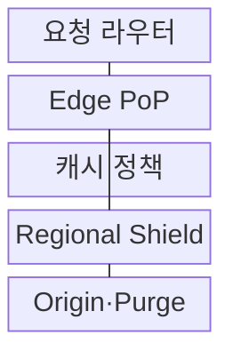
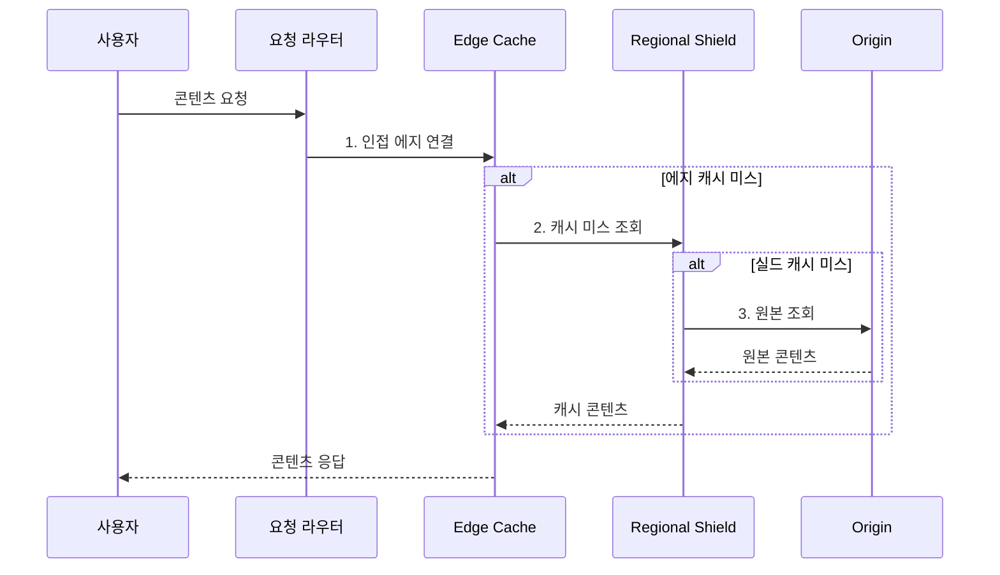

---
sidebar:
  order: 181
  label: "181. CDN 콘텐츠 전송 네트워크 (CDN Content Delivery Network)"
  badge:
    text: "기출 · 50%"
    variant: note
title: "CDN 콘텐츠 전송 네트워크 (CDN Content Delivery Network)"
date: "2026-08-02T12:00:00+09:00"
tags:
  - "notes-software"
weight: 181
extra:
  question_no: "181"
  source_status: "기출"
  source_history: "122회"
  priority: 50
  priority_note: "콘텐츠 근접 배치와 캐시 경로 출제"
---

## Ⅰ. 개요

핵심 용어

- **캐시·전송**: CDN은 사용자와 가까운 에지에서 콘텐츠 사본을 캐시하고 전송해 장거리 지연과 원본 부하를 줄인다.

- 정의/개념: **CDN**은 원본 콘텐츠의 사본을 사용자와 가까운 에지 거점에 캐시하고 요청을 적절한 거점으로 라우팅해 전송하는 분산 전달 계층
- 배경/필요성: 원본 직접 전송은 장거리 지연·**대역폭 비용** 증가

#### 한줄 요약

- 원본 창고의 자산을 지역 배송소에 복사해 첫 요청 뒤 같은 콘텐츠는 가까운 에지에서 바로 전달한다.

## Ⅱ. 특징

핵심 용어

- **에지·리저널 실드**: 에지는 사용자 요청에 응답하고 리저널 실드는 여러 에지의 캐시 미스를 모아 원본 요청을 줄인다.

- **DNS·Anycast** 기반 인접 에지 라우팅
- **에지·리저널 실드** 기반 다단 캐시
- **TTL·ETag·Purge** 기반 신선도 제어

#### 한줄 요약

- 에지에 사본이 없을 때도 실드가 여러 지역의 같은 미스를 하나로 모아 원본에 몰리는 요청을 줄인다.

## Ⅲ. 구조 및 구성요소

핵심 용어

- **Regional Shield**: Regional Shield는 에지와 원본 사이의 중간 캐시로 동시 미스를 병합하고 콘텐츠를 저장한다.

| 구성요소 | 책임 |
|:---|:---|
| 요청 라우터 | 위치·망 상태·**정상 에지 선택** |
| Edge PoP | 캐시·TLS·**보안·전송 최적화** |
| 캐시 정책 | Key·TTL·**재검증·Stale 정의** |
| Regional Shield | 에지 미스·**병합·중간 저장** |
| Origin·Purge | 정본 제공·**무효화·버전 전환** |

#### 한줄 요약

- 라우터가 가까운 배송소를 고르고 에지와 실드가 사본을 찾으며 둘 다 없을 때만 원본 창고를 조회한다.

## Ⅳ. 흐름도

핵심 용어

- **2. 캐시 미스 조회**: 에지는 캐시 키, TTL, ETag 조건으로 사본을 판정하고 미스이면 리저널 실드에 조회를 요청한다.

**동작 원리**

1. **인접 에지 연결**: 망 거리·거점 상태를 기준으로 접속점 선택
2. **캐시 미스 조회**: 캐시 키·TTL·ETag 조건 판정
3. **원본 조회**: 동시 미스를 병합해 정본 요청

#### 한줄 요약

- 첫 이미지 요청만 실드와 원본을 거치고 다음 요청은 TTL 안의 에지 사본으로 응답해 장거리 왕복을 없앤다.

## Ⅴ. 종류 및 비교

핵심 용어

- **Pull CDN**: Pull CDN은 첫 사용자 요청이 발생할 때 원본에서 콘텐츠를 가져와 에지에 적재한다.

| CDN 적재 방식 | Pull CDN | Push CDN |
|:---|:---|:---|
| 적용 기준 | 변동 수요·**대규모 자산군** | 예정 배포·**대용량 콘텐츠** |
| 핵심 특징 | 첫 요청 시 **원본 인출** | 배포 전 **사전 업로드** |
| 한계 | 콜드·동시 미스의 **원본 부하** | 저장 비용·**배포 동기화** |

#### 한줄 요약

- 수요를 모르는 웹 자산은 요청 때 채우고 게임 패치처럼 배포 시점과 대상이 정해진 콘텐츠는 에지에 미리 보낸다.

## Ⅵ. 실무 고려사항 및 대책

핵심 용어

- **동시 미스**: 동시 미스는 인기 콘텐츠가 만료되거나 없을 때 다수 에지가 동시에 원본을 조회해 부하를 폭증시키는 문제다.

| 문제 | 대책 | 효과 |
|:---|:---|:---|
| 사용자·언어의 **캐시 키 혼합** | 필요한 변형만 **키에 포함·표준화** | **사용자 데이터** 혼합 방지 |
| 인증 응답의 **공유 캐시 노출** | private·no-store·**권한별 키** | **개인정보 노출** 차단 |
| 긴 TTL의 **오래된 콘텐츠** | 해시 URL·**ETag·긴급 Purge** | **변경 사본** 전환 |
| 인기 자산의 **동시 미스** | Shield·요청 병합·**TTL 지터** | **원본 폭주** 방지 |
| 공격자의 **원본 직접 접근** | 원본 비공개·**CDN 요청만 허용** | **우회 공격** 차단 |

#### 한줄 요약

- 정적 파일명에 내용 해시를 넣으면 긴 TTL을 유지하면서 변경 시 새 주소로 즉시 전환하고 전 세계 퍼지 지연도 피할 수 있다.

## Ⅶ. 결론

핵심 용어

- **캐시 키·TTL**: 콘텐츠 변경성과 개인화 범위에 따라 캐시 키와 TTL을 정하고 원본 요청은 실드에서 병합해야 한다.

- 변경성·개인화에 따라 **캐시 키·TTL** 설정, 원본 부하는 실드로 완화

#### 한줄 요약

- 공개 정적 자산은 긴 TTL과 버전 URL로 캐시하고 개인화 응답은 공유 캐시를 막으며 미스는 Shield에서 병합해야 한다.
