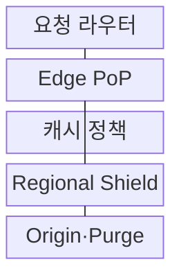
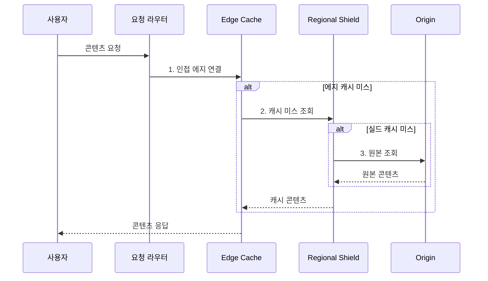

---
sidebar:
  order: 181
  label: "181. CDN 콘텐츠 전송 네트워크 (CDN Content Delivery Network)"
  badge:
    text: "기출 · 50%"
    variant: note
title: "CDN 콘텐츠 전송 네트워크 (CDN Content Delivery Network)"
date: "2026-07-31T10:47:42+09:00"
tags:
  - "notes-software"
weight: 181
extra:
  question_no: "181"
  source_status: "기출"
  source_history: "122회"
  priority: 50
  priority_note: "콘텐츠 근접 배치와 캐시 경로 출제"
---

## 미리 알고가기

- **콘텐츠 전송 네트워크(Content Delivery Network, CDN)**: 사용자와 가까운 분산 에지에서 콘텐츠를 전달하는 계층
- **에지 접속점(Point of Presence, PoP)**: 사용자 요청을 받아 캐시·보안·전송을 수행하는 지역 거점
- **원본(Origin)**: 콘텐츠 정본을 생성하거나 저장하는 서버·스토리지
- **캐시 키(Cache Key)**: URL·헤더·쿠키·질의값으로 캐시 사본을 구분하는 식별자
- **신선도(Freshness)·유효기간(TTL)**: 원본 확인 없이 사본을 재사용할 수 있는 상태와 최대 시간
- **엔티티 태그(Entity Tag, ETag)**: 원본 표현 버전을 식별해 조건부 재검증에 사용하는 값
- **리저널 실드(Regional Shield)**: 여러 에지의 미스를 모아 원본 요청을 줄이는 중간 캐시
- **캐시 퍼지(Cache Purge)**: 에지의 특정 캐시 사본을 명시적으로 무효화하는 작업
- **서명 URL·쿠키(Signed URL·Cookie)**: 만료·경로·사용자 조건을 서명해 콘텐츠 접근을 허용하는 수단
- **애니캐스트(Anycast)**: 여러 거점이 같은 주소를 광고해 가까운 경로로 사용자를 전달하는 라우팅 방식
- **도메인 네임 시스템(Domain Name System, DNS)**: 도메인 이름을 접속할 에지 주소로 변환하는 분산 이름 체계
- **전송 계층 보안(Transport Layer Security, TLS)**: 통신 상대를 인증하고 전송 데이터를 암호화하는 프로토콜
- **오래된 사본(Stale)**: 유효기간이 지나 원본 재검증이나 정책 기반 재사용이 필요한 캐시 사본
- **비공개·저장 금지(Private·No-store)**: 공유 캐시 재사용을 제한하거나 응답 저장 자체를 금지하는 캐시 지시어
- **TTL 지터(TTL Jitter)**: 캐시 만료 시점을 분산해 동시 원본 요청을 줄이는 무작위 시간 편차
- **풀·푸시 CDN(Pull·Push CDN)**: 첫 요청 때 원본에서 가져오는 방식과 배포 전에 에지로 보내는 적재 방식

> **키워드:** CDN 콘텐츠 전송 네트워크 (CDN Content Delivery Network)

## Ⅰ. 개요

- 정의/개념: 사용자 인접 에지에서 사본을 **캐시·전송**하는 분산 계층
- 배경/필요성: 원본 직접 전송은 장거리 지연·**대역폭 비용** 증가

### 쉽게 이해하기 (학습용)

- 원본 창고의 자산을 지역 배송소에 복사해 첫 요청 뒤 같은 콘텐츠는 가까운 에지에서 바로 전달한다.

## Ⅱ. 특징

- **DNS·Anycast** 기반 인접 에지 라우팅
- **에지·리저널 실드** 기반 다단 캐시
- **TTL·ETag·Purge** 기반 신선도 제어

### 쉽게 이해하기 (학습용)

- 에지에 사본이 없을 때도 실드가 여러 지역의 같은 미스를 하나로 모아 원본에 몰리는 요청을 줄인다.

## Ⅲ. 구조 및 구성요소

| 구성요소 | 책임 |
|:---|:---|
| 요청 라우터 | 위치·망 상태·**정상 에지 선택** |
| Edge PoP | 캐시·TLS·**보안·전송 최적화** |
| 캐시 정책 | Key·TTL·**재검증·Stale 정의** |
| Regional Shield | 에지 미스·**병합·중간 저장** |
| Origin·Purge | 정본 제공·**무효화·버전 전환** |

### 쉽게 이해하기 (학습용)

- 라우터가 가까운 배송소를 고르고 에지와 실드가 사본을 찾으며 둘 다 없을 때만 원본 창고를 조회한다.

## Ⅳ. 흐름도

**동작 원리**

1. **인접 에지 연결**: 망 거리·거점 상태를 기준으로 접속점 선택
2. **캐시 미스 조회**: 캐시 키·TTL·ETag 조건 판정
3. **원본 조회**: 동시 미스를 병합해 정본 요청

### 쉽게 이해하기 (학습용)

- 첫 이미지 요청만 실드와 원본을 거치고 다음 요청은 TTL 안의 에지 사본으로 응답해 장거리 왕복을 없앤다.

## Ⅴ. 종류 및 비교

| CDN 적재 방식 | Pull CDN | Push CDN |
|:---|:---|:---|
| 적용 기준 | 변동 수요·**대규모 자산군** | 예정 배포·**대용량 콘텐츠** |
| 핵심 특징 | 첫 요청 시 **원본 인출** | 배포 전 **사전 업로드** |
| 한계 | 콜드·동시 미스의 **원본 부하** | 저장 비용·**배포 동기화** |

### 쉽게 이해하기 (학습용)

- 수요를 모르는 웹 자산은 요청 때 채우고 게임 패치처럼 배포 시점과 대상이 정해진 콘텐츠는 에지에 미리 보낸다.

## Ⅵ. 실무 고려사항 및 대책

| 고려사항 | 대책 | 효과 |
|:---|:---|:---|
| 사용자·언어의 **캐시 키 혼합** | 필요한 변형만 **키에 포함·표준화** | **사용자 데이터** 혼합 방지 |
| 인증 응답의 **공유 캐시 노출** | private·no-store·**권한별 키** | **개인정보 노출** 차단 |
| 긴 TTL의 **오래된 콘텐츠** | 해시 URL·**ETag·긴급 Purge** | **변경 사본** 전환 |
| 인기 자산의 **동시 미스** | Shield·요청 병합·**TTL 지터** | **원본 폭주** 방지 |
| 공격자의 **원본 직접 접근** | 원본 비공개·**CDN 요청만 허용** | **우회 공격** 차단 |

### 쉽게 이해하기 (학습용)

- 정적 파일명에 내용 해시를 넣으면 긴 TTL을 유지하면서 변경 시 새 주소로 즉시 전환하고 전 세계 퍼지 지연도 피할 수 있다.

## Ⅶ. 결론

- 변경성·개인화에 따라 **캐시 키·TTL** 설정, 원본 부하는 실드로 완화

### 쉽게 이해하기 (학습용)

- 공개 정적 자산은 긴 TTL과 버전 URL로 캐시하고 개인화 응답은 공유 캐시를 막으며 미스는 Shield에서 병합해야 한다.
